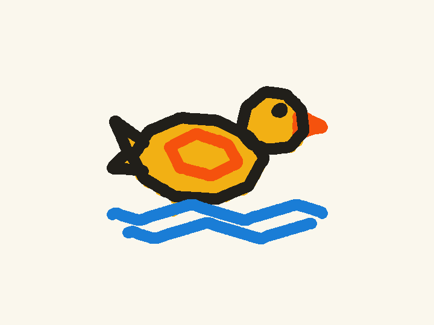

# Microduck on MacOS with M Chip GPU 

We build this open source Microduck Traning Studio which based on [microduck-lab](https://github.com/jonathanhawkins/microduck-lab) [Microduck](https://pollen-robotics.com/microduck) and [microduck_rl](https://github.com/pollen-robotics/microduck_rl).

Please give all the credit to the baseline project.


This project also use RL PPO algorithem native supported by  [rlx](https://github.com/noahfarr/rlx).

## Eight Studio scenarios

Studio now includes **Dance, Swing, Running, Stilts, Backflip, Basketball,
Suspended bridge, and Swimming-duck drawing**. The original seven have compact previews below, sourced from
their actual saved Studio render videos. Basketball has verified local
sustained balance, **not verified steering**; the bridge preview is a failed
crossing diagnostic, **not a successful or mastered crossing**. Drawing adds a
simulated fifteenth mouth actuator, physical pencil contacts, and a complete
teacher → BC/DAgger → PPO experiment. **Eight scenarios does not mean eight
accepted learned policies.**

- [Basketball balance results and videos](docs/basketball-showcase/RESULTS.md)
- [Suspended bridge design and curriculum](docs/bridge-showcase/README.md)
- [Pencil drawing: complete Chinese / English workflow](docs/drawing-case/README.md)
- [Drawing training results, teacher evidence, and limitations](docs/drawing-case/RESULTS.md)
- [Successful color-brush upgrade: Chinese / English pipeline](docs/drawing-case/brush/README.md)

The original seven looping previews are four-second, 6 fps excerpts from saved MuJoCo simulation
rollouts. These are local simulation evidence, not physical-robot deployment or
robustness guarantees.

| Dance imitation | Swing | Running |
|---|---|---|
|  |  |  |

| Stilt walking | Backflip: assisted launch → PPO landing → stand handoff |
|---|---|
|  |  |

| Basketball: balance only, rolling unmastered | Bridge: failed crossing diagnostic |
|---|---|
|  |  |

**Backflip is a spotter-assisted launch followed by PPO landing and a
pretrained standing-policy handoff, not an unassisted whole-flip policy.**
**Basketball shows balance only; rolling and steering remain unmastered.**
**Bridge shows a failed crossing attempt retained for diagnosis, not success.**

| Eighth case: learned-policy diagnostic | Feasibility reference: Jacobian teacher, NOT PPO |
|---|---|
|  |  |

The two drawing GIFs show recorded rollouts at **4× playback speed**; they are
not real-time motion. Full-speed videos and source-bound results are in the drawing report.

Drawing uses the separate simulation-only `microduck-drawing-v1` **83-observation /
15-action** interface. Its pencil is preloaded; the extra mouth mechanism and
strong XML servos are prototype assumptions. This ONNX is **not compatible with
the stock robot**. The teacher's successful drawing is not evidence of PPO mastery.

### Eighth-case color-brush upgrade

The historical pencil PPO result above remains failed. A separate
`microduck-brush-v2` 93-observation/15-action upgrade subsequently passed all
40 required episodes across ten unique configurations through the actual
Studio API. Its matching BC policy also passed 40/40, so the supported claim is
that conservative PPO preserved the accepted BC behavior, not that PPO improved
it. The fixed stroke/color/dip plan remains authored; the learned feedback actor
executes motor actions and has no learned visual planning or missed-dip recovery.
This is still the drawing case, so the Studio total remains **eight**, not nine.



[Brush pipeline, acceptance evidence, and limitations](docs/drawing-case/brush/README.md) ·
[Final color-brush animation](docs/drawing-case/brush/media/brush.gif)

<details>
<summary>Saved-run and video provenance</summary>

- **Dance:** `dance/dance-e2e-20260907-low-noise/render/ep0.mp4`
- **Swing:** `swing/swing-e2e-20260907-v3/render/ep0.mp4`
- **Running:** `running/running-e2e-20260907-v4/render/ep0.mp4`
- **Stilt walking:** `stilts/stilts-e2e-20260907-v3/render/ep0.mp4`
- **Backflip:** `backflip/backflip-e2e-20260908-v5/render/ep0.mp4`
- **Basketball:** `basketball/basketball-balance-01/render/rollout.mp4`
- **Bridge:** `bridge/bridge-studio-02/render/ep0.mp4`

Each path is relative to `rlx/runs/studio/`. The tracked GIF excerpts live in
`docs/seven-cases-verification/media/`; regenerate them from the saved videos
with `bash docs/seven-cases-verification/media/generate-gifs.sh`.

</details>

# Microduck Lab 🦆: RL experimentation on your Mac

Train reinforcement-learning policies for the
[Microduck](https://pollen-robotics.com/microduck), Pollen Robotics'
open-source ~25 cm bipedal robot, **on an ordinary Apple Silicon Mac with no
CUDA GPU**. Watch every policy walk, learn, and backflip live in your browser.


The official [microduck_rl](https://github.com/pollen-robotics/microduck_rl)
stack trains through MuJoCo Warp and needs a CUDA GPU. This project runs on the
laptop you already have. It's a prototyping loop for reward design, curricula,
and new tricks, built on the same MJCF robot model, the same 61-obs /
14-action deployment contract, and the same 50 Hz timing. A behavior you invent
here ports straight to the official stack for the final sim2real run, and the
ONNX you export for the original walking contract is drop-in compatible with
the official tooling. The eighth drawing case deliberately uses an incompatible,
versioned simulation interface and must not be deployed through that tooling.

**Not affiliated with Pollen Robotics.** Two of their repos are used as
side-by-side checkouts (see setup).

## What's in the box

- **`microduck_local/`**: CPU-MuJoCo + Stable Baselines 3 PPO harness
  - `train-walk` / `train-behavior`: velocity-command walking and a library of
    teachable tricks, with mjlab-distilled rewards, symmetry augmentation,
    obs normalization, and a penalty-sign guard
  - Two actuator models: fast linearized XML servos, or the honest
    BAM XL330 voltage model (numba-fused) for maneuvers that saturate servos
  - `export-walk`: ONNX export with the obs normalizer baked in
  - `eval-walk`: headless eval battery (falls, command tracking)
  - `render-rollout`: mp4 for humans, **plus a captioned frame contact sheet
    an AI assistant can read**, carrying per-frame heights, angles, and
    contacts ([example](docs/media/contact-sheet.png))
  - `bench-walk` / `bench-envs`: find the right worker count for *your* machine
  - `duck-lab`: the streaming backend that drives the browser viewer
- **`duck-viewer/`**: Next.js + react-three-fiber viewer
  - Many ducks side by side, live over WebSocket at 25 Hz; drag policy chips
    onto ducks to hot-swap brains mid-stride
  - **🎓 Teach panel**: ask for one of nine built-in tricks ("stand on one
    leg") — keyword-matched, no LLM in the loop — see its reward recipe in
    plain English, watch the trainee improve every ~15 s as live snapshots
    hot-load, then drag the reward sliders and fine-tune. Reward shaping with
    no Python in the loop.
  - Staged curricula for hard tricks (the backflip is 5 chained stages), with
    the viewer narrating the chain
  - **🎬 Animate panel**: a keyframe pose editor with a game-style control rig.
    Author a motion clip in the browser, then "train this" makes RL learn to
    physically execute it
  - **🎥 Capture panel**: 📷 for a full-res PNG, 🎥 to have the camera frame a
    duck and film it. The lab converts the take to an mp4 and a GIF you can
    paste straight into a PR
  - **⤓ ONNX download** on any run (the baked export, normalizer included), and
    **⚙ settings** to connect your own Hugging Face token (stored and
    validated today; the GPU-job launcher is not wired up yet)


## Quick start

### Train one scenario end to end

Each script runs independently, without the web server: input/runtime checks →
scenario initialization → PPO training → ONNX export and verification →
deterministic evaluation → MP4 and contact sheet.

```bash
./scripts/train-dance.sh
./scripts/train-swing.sh
./scripts/train-running.sh
./scripts/train-stilts.sh
./scripts/train-backflip.sh
```

These default to **Full** training. Add `--profile smoke` for a short pipeline
check or `--dry-run` to inspect commands without training. Smoke does not prove
the skill. Each run gets a fresh output directory; failed skill evaluations
still produce video evidence and exit unsuccessfully.

See [scenario pipeline inputs, options, stages, and outputs](scripts/scenarios/README.md).

### Restart the complete local Studio

After the initial dependency setup, run `./restart-lab.sh` from any directory.
It restarts the streaming lab on port 8788 and the UI plus Next.js API on port
63317. **RLX is an on-demand Python subprocess of `/api/rlx`, not a separate
daemon.** The restart preflights the API's exact Python environment, executes
an MLX operation, and resets/steps Dance, Swing, Running, and Stilt Walking with
the 61-observation/14-action contract before stopping existing services.

```bash
./restart-lab.sh                   # restart and require four saved accepted runs
./restart-lab.sh --check           # read-only service and saved-evidence check
./restart-lab.sh --readiness-only  # new workspace without trained evidence yet
./restart-lab.sh --stop-jobs       # deliberately discard active unsaved progress
node --test scripts/restart-lab.test.mjs
```

The default restart refuses active training/evaluation/rendering, foreign port
owners, and failed runtime preflight. It never reinstalls npm dependencies,
deletes the roster, or overwrites policy/evaluation/video artifacts. Shutdown is
scoped to workspace-owned service process trees, rather than global `pkill`.
Two simultaneous restarts are rejected. Logs, process IDs, runtime preflight,
and the JSON verification receipt are stored in ignored `.restart-lab/`.

Strict verification discovers an accepted run for each scenario and checks its
saved recipe, source-matched evaluation/video receipt, restored PPO reward/loss
segments, and MP4 response. A failure exits nonzero; a listening port alone is
not success. `--readiness-only` explicitly relaxes **saved-evidence** checks, not
runtime preflight. Neither mode launches full training or proves hardware skill.

The existing `rlx/.venv-microduck/bin/python` is reused by default, avoiding
dependency resolution on every restart or API job. Override it with
`MICRODUCK_STUDIO_PYTHON_DIRECT=/absolute/path/to/installed/venv/bin/python`.
The environment must already contain RLX, microduck-local, MLX, and the rendering
and export dependencies; preflight verifies it before shutdown. When that venv
is absent, the original `uv run --isolated` launcher remains the fallback.
Set `MICRODUCK_STUDIO_PYTHON` to a system Python 3.12 executable to explicitly
use that uv path (default `/usr/local/bin/python3.12`, then `PATH`).
Optional `PORT`, `LAB_PORT`, and
`MICRODUCK_RESTART_TIMEOUT` override 63317, 8788, and the 120-second startup wait.
The printed UI URL includes the correct `?lab=` override. If startup fails, inspect
`.restart-lab/viewer.log`, `.restart-lab/lab.log`, and `.restart-lab/rlx-preflight.log`.
Surviving services remain available for diagnosis. A stale `.restart-lab/lock`
after an uncatchable interruption must be inspected using its `pid` file before
manual removal.

### First-time setup

Prereqs: macOS on Apple Silicon (Linux works too), [uv](https://docs.astral.sh/uv/),
Node 20+, ~3 GB of disk for the checkouts and models.

```bash
git clone https://github.com/jonathanhawkins/microduck-lab && cd microduck-lab
git clone https://github.com/pollen-robotics/microduck        # shipped policies, docs
git clone https://github.com/pollen-robotics/microduck_rl     # MJCF models, official stack

cd microduck_local
uv sync
uv run --with pytest pytest tests/        # contract tests, should be all green

# train your first walking policy (a few minutes on an M-series Mac)
uv run train-walk --envs 32 --steps 3_000_000 --run-name first-gait
-----------------------------------------
| rollout/                |             |
|    ep_len_mean          | 340         |
|    ep_rew_mean          | 850         |
| time/                   |             |
|    fps                  | 16256       |
|    iterations           | 211         |
|    time_elapsed         | 106         |
|    total_timesteps      | 1728512     |
| train/                  |             |
|    approx_kl            | 0.027882561 |
|    clip_fraction        | 0.272       |
|    clip_range           | 0.2         |
|    entropy_loss         | -4.7        |
|    explained_variance   | 0.831       |
|    learning_rate        | 0.001       |
|    loss                 | 471         |
|    n_updates            | 1050        |
|    policy_gradient_loss | -0.0178     |
|    std                  | 0.339       |
|    value_loss           | 550         |
-----------------------------------------
uv run export-walk runs/first-gait
/microduck_local/runs/first-gait/policy.onnx 
uv run eval-walk runs/first-gait/policy.onnx

# fire up the lab + viewer
uv run duck-lab runs/first-gait ../microduck/policies/alpha_walking.onnx
cd ../duck-viewer && npm install && npm run dev   # open the printed URL
```

Then open the 🎓 teach panel and ask the duck to "stand on one leg".

## Performance (measured, Apple M-series)

Every number below is reproduced in
[microduck_local/README.md](microduck_local/README.md) with its methodology,
including the experiments that got **rejected**.

- **~16.5k env-steps/s** on the shipped 32-env recipe (about 1 min per 1M
  steps); ~27k steps/s peak in throughput configs
- **One compiled MuJoCo model shared across all workers** (fork +
  copy-on-write): 64 envs dropped from **41 GB to 1.5 GB** of memory
- Semaphore + shared-memory IPC instead of pipes/pickles per step
- numba-fused BAM actuator kernels, bitwise-identical to the numpy reference
- Optional MPS (Apple GPU) PPO updates, auto-enabled only where they measured
  faster
- Two throughput "wins" (overlapped updates, big-batch) raised steps/s 25-40%
  but **halved learning per step** in seed-matched A/Bs, so they ship as
  opt-in flags rather than defaults. Reward per wall-second is the metric that
  matters.

## Teach the duck your own trick

Tricks are plain-English reward recipes in
[`behaviors/`](microduck_local/src/microduck_local/behaviors). A `Behavior` is
a set of reward terms, chat keywords, and optionally a staged curriculum for
the harder maneuvers. Add one, lock it with a test, and it shows up in the
viewer's teach panel with live sliders. The full playbook is in
[microduck_local/AGENTS.md](microduck_local/AGENTS.md): contract invariants,
reward-design rules, and the verification discipline that keeps you from
fooling yourself.

The teach panel only offers tricks that exist in `behaviors/`: an unrecognized
request returns the catalog rather than improvising a recipe. Adding a tenth is
a Python change — see [Working with AI assistants](#working-with-ai-assistants)
if you'd rather have a coding agent draft it.

## Animate: keyframe a motion, then make it real

The 🎬 animate panel is a pose-and-timeline editor for authoring **reference
motion clips** in the browser, and the bridge from animation to RL.


- **Pose the duck directly** (click a body part, drag) or through the
  **🎮 control rig**, a set of animator-style macro handles (`squat`, `lean`,
  leg swings, `sway`, `stance`, `twist`, `toes`, `look`). Each control is a
  direction in joint space chosen so feet stay planted and the controls are
  mutually orthogonal: squatting never disturbs the lean slider, and a stride
  keyed over a crouch keeps the crouch. A ⇕ handle parks on the duck itself,
  and dragging it down is what drives the squat in the clip above.
- **Keyframe timeline** with auto-key, scrub/playback, and looping; the lab
  solves each pose server-side so the preview duck stays grounded. Clips save
  to [`microduck_local/clips/`](microduck_local/clips) as plain JSON
  (`run`, `sprint-cycle`, `backflip` ship as examples).
- **⚡ Train this**: the clip becomes the reward. DeepMimic-style motion
  imitation ("be in the reference pose for right now") turns an open-ended
  search like *discover a backflip* into a tracking problem the policy can
  solve, without touching the 61-obs deployment contract. See
  [`motion.py`](microduck_local/src/microduck_local/motion.py).

## Capture: screenshots, video and GIFs, from the browser

The capture panel sits at the top of the viewer and turns whatever the lab is
doing right now into files you can drop into a PR or an issue. No screen
recorder, no ffmpeg incantation.


- **📷 shot** (always available) downloads a full-resolution PNG of the current
  view, named after the selected duck, or `duck-lab` for a crowd shot. The
  selection ring is hidden for the capture render, and the whole
  render → read → download runs inside the click's own user gesture, because
  Chrome silently drops a page's second "automatic" download.
- **🎥 record** (appears once you click a duck) films that one duck for you:
  the camera glides to a ¾ front shot chosen from its heading, then holds it
  with a slow drift while MediaRecorder captures the WebGL canvas. Orbit and
  the camera keys pause for the take, and the footage comes out clean because
  the labels and panels are DOM, not canvas.
- **■ stop** uploads the take to the lab
  ([`POST /captures`](microduck_local/src/microduck_local/viz_server.py)),
  whose bundled ffmpeg writes a full-resolution h264 **mp4** and a 480 px
  palette **gif** into `microduck_local/captures/`, and the panel offers both
  as ⬇ downloads. Takes cap at 60 s.

One gotcha: frames are pushed per *rendered* frame (`captureStream(0)` +
`requestFrame()`), because automatic capture rides the browser's compositor and
records almost nothing in a throttled tab. Keep the tab visible while
recording. A take where the scene never rendered gets refused with a message
instead of saved as a 0.1 s "video".

## Working with AI assistants

This repo is set up for agentic coding tools:

- **`AGENTS.md`** (root and per-project): the workspace map and the training
  playbook, in the cross-tool convention used by Claude Code, Codex/ChatGPT,
  and most open-source agents. `CLAUDE.md` includes it for Claude Code.
- **`.claude/skills/`**: three skills, all of which read as plain
  documentation for any agent, humans included. `render-rollout` teaches an
  agent to *look at* what a policy actually does (render the rollout, read the
  contact sheet) before believing reward curves; `watch-training` does the
  same for the run that is training right now; `restart-servers` brings the
  lab and viewer back up.

## Take the brain with you: ⤓ ONNX and 🤗 Hugging Face

**⤓ Download the brain.** Hover a run in the 🧠 policies panel and a ⤓ appears
next to it; one click saves that run's `.onnx`. You always get `policy.onnx`,
the deployable export with the observation normalizer baked in, and never a raw
checkpoint. A checkpoint handed over without its normalizer is quietly a
different policy. While a run is still training the button falls back to its
newest `live.onnx` snapshot, so you can pull a brain mid-run. On a staged
trick, the chain's ⤓ gives you the **final** stage: every stage fine-tunes the
same network, so the last one is the whole trick.

**🤗 Connect Hugging Face (BYOK).** The ⚙ button in the duck-lab HUD opens
settings, where you paste your own Hugging Face access token. Create one with
write access at
[hf.co/settings/tokens](https://huggingface.co/settings/tokens).


Bring your own key: your account, your billing, and the token never goes
anywhere but huggingface.co. It gets validated with `whoami()` before anything
is written, so a bad paste is rejected rather than stored. It lands in
`microduck_local/hf-token.json`, mode `0600`, gitignored. The browser never
sees it again: `GET /settings/hf` returns only your username and a mask like
`hf_abcd…wxyz`. **disconnect** deletes the file.

That key is for the one step a laptop can't do, retraining a behavior you
prototyped here on real GPUs under your own account. Storing and validating the
token is what ships today. The HF Jobs launcher isn't wired up yet.

## Sim2real, honestly

This harness is for **prototyping**: minutes-long feedback loops on reward
design, observations, and curricula. It runs a subset of the official stack's
domain randomization, so don't ship its policies to a real robot. Once a
behavior works here, port the env design to an mjlab cfg in `microduck_rl` and
retrain on GPU (that repo's `AGENTS.md` is the sim2real recipe). Everything
here keeps the deployment contract so that port is mechanical.

## Tabletop arm classroom extension

The six-case MD-Arm-T1 extension is available in the same viewer at `/arm`.
Start its separate simulation backend from the workspace root with
`rlx/.venv-microduck/bin/python scripts/arm_lab.py --port 8812`.
It does not replace the existing duck-lab server or the original body policy.

- [Chinese implementation and reproduction guide](docs/robot-arm-design/IMPLEMENTATION.md)
- [Measured training/evaluation results and videos](docs/robot-arm-design/RESULTS.md)
- [Chinese classroom PDF](docs/robot-arm-design/CLASSROOM.zh-CN.pdf)
- [BOM, circuit and conceptual CAD boundaries](docs/robot-arm-design/HARDWARE.md)

These are actual tabletop MuJoCo experiments using authored IK/FSM plus bounded
PPO residuals, not end-to-end learned planning. Hardware execution is
unconditionally locked; fabrication, power protection and physical validation
remain separate work.

## License

Apache-2.0 (same as the upstream Microduck repos). Not affiliated with or
endorsed by Pollen Robotics; "Microduck" is their project.
