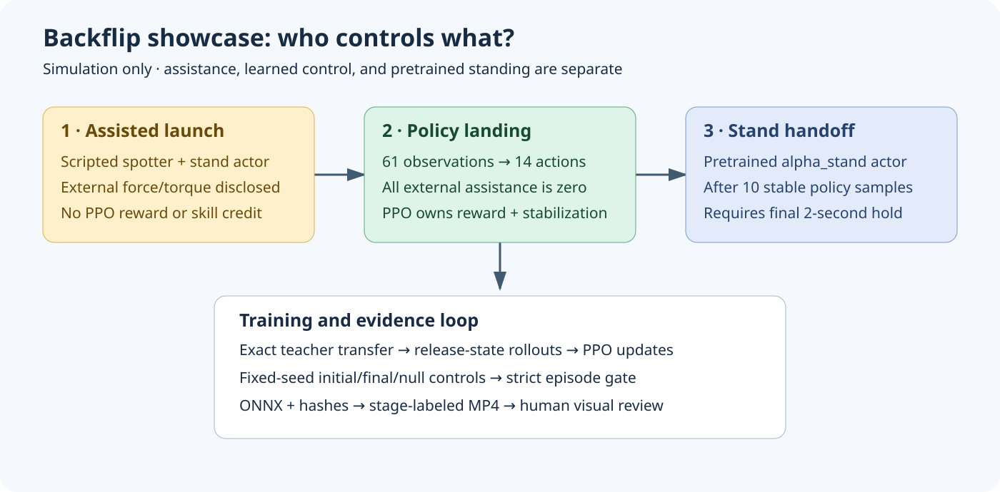
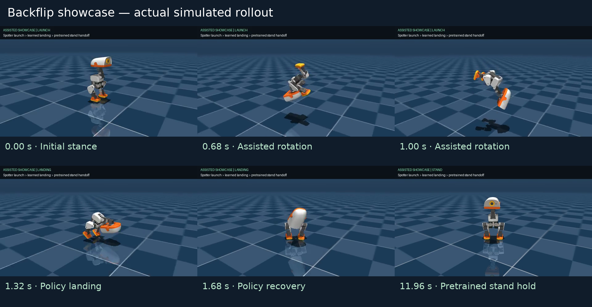
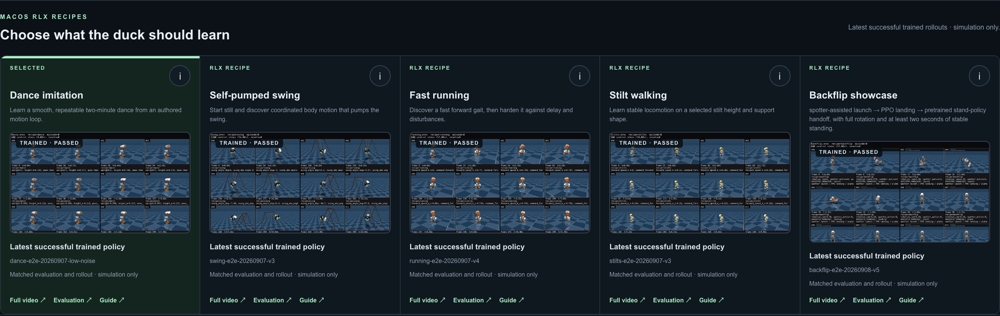
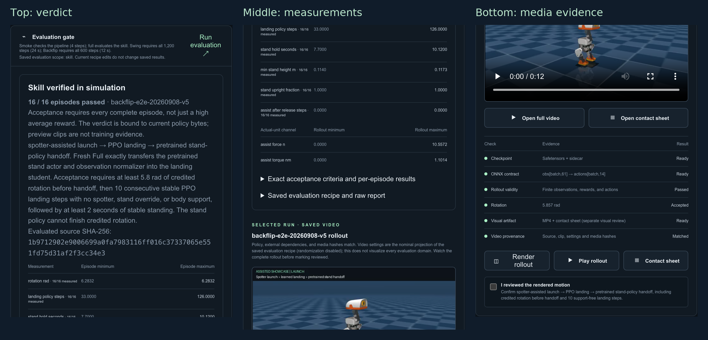

# Training Microduck: Backflip Showcase

**Author: George Hu**  
**Date: September 8, 2026**  
**Scope: local MuJoCo simulation, RLX PPO, and the five-scenario Studio**

> This is an assisted demonstration, not an autonomous backflip learned from
> scratch. A simulated spotter supplies lift and rotation. A pretrained actor
> initializes the landing policy; PPO updates that actor, but improvement must
> be established by paired evaluation, not assumed. A separate pretrained
> stand controller takes over only after the landing policy demonstrates stable
> support. Neither the launch nor the final stand hold is credited to PPO.



## 1. What changed

Backflip is the fifth selectable Studio scenario beside Dance, Swing, Running,
and Stilts. It uses the existing job queue, saved runs, training telemetry,
deterministic evaluation, MP4/contact-sheet renderer, source-bound verification,
and ONNX download. The other four environments and rewards are unchanged.

The new Python environment lives in `rlx/rlx/environments/backflip.py`.
The physical gate lives in `rlx/rlx/environments/backflip_evaluation.py`.
The initializer is in `rlx/rlx/models/backflip_bootstrap.py`.
The common CLI is `rlx/examples/ppo_microduck_studio.py`.

The scenario uses the same **61-observation / 14-action** interface. No extra
phase, world position, or privileged contact channels are given to the actor.
The composite controller knows its stage; the landing actor does not receive
that stage as an extra observation.

## 2. Why the first attempts were rejected

The first API smoke uncovered an actual macOS Objective-C initialization crash
when ONNX Runtime was first loaded in forked workers. Backflip now uses the
existing `dummy` vector backend, keeping simulation in the parent process.
This avoids unsafe Objective-C fork workarounds. Other scenarios retain their
existing backend choices.

The initial torque-only launch released around 4.6 radians with high angular
speed. Initial experiments were not accepted merely because training finished:

| Experiment | Fixed evaluation | Observed outcome |
|---|---|---|
| Behavior-cloned initializer, original gate | Seeds 101–104 | 3/4 showcase passes |
| First 100k PPO transitions | Same four seeds and original gate | 0/4 |
| BC + 2,000,896 PPO transitions | Strengthened gate, seeds 101–104 | 0/4 |
| Frozen-normalizer BC + 200,704 PPO transitions | Strengthened gate, seeds 101–104 | 0/4 |
| Exact teacher transfer, old launch | Strengthened gate, seeds 101–108 | 4/8 |
| Exact transfer + 200,704 low-rate PPO transitions, old launch | Same eight seeds | 4/8 |
| Revised assisted launch, unchanged teacher landing | Strengthened gate, seeds 101–108 | 8/8 |
| Revised assisted launch, zero-action landing | Same eight seeds | 0/8 |
| Revised launch, transfer + 2M PPO | Default seeds 7–22 | 14/16; rejected |
| Fresh revised-launch 401,408-step run | Default seeds 7–22 | 16/16 physical passes |
| Same fresh run, independent audit | Seeds 401–408 | 8/8 showcase and 8/8 landing-only passes; PPO refinement fails |

The first two rows used an earlier, weaker handoff check and are not directly
comparable with the strengthened gate. They are retained to explain the
debugging path, not to manufacture a learning curve across different tasks.

The lesson is important: a better-looking reward cannot fix an inconsistent
release state or a degraded initializer. We changed the explicitly assisted
launch physics and preserved the same landing reward. We also replaced
approximate cloning with exact teacher weight/normalizer transfer. The
cloning implementation remains available for reproducing the rejected study,
but it is not the default initializer.

## 3. The three-stage controller

### Assisted launch

Protocol `spotter-launch-landing-stand-v2` uses a 1.2-second cubic Hermite pitch
target from zero to 5.3 radians with a terminal target rate of 5 rad/s. A smooth
height target rises from 0.12 m to 0.32 m and lowers toward 0.22 m before release.
The spotter acts through MuJoCo generalized external forces, not by teleporting
the robot's position or orientation.

The pitch controller uses proportional gain 1.5, derivative gain 0.24, and a
1.3 Nm torque clamp. The vertical controller includes gravity compensation,
position gain 90, velocity damping 8.5, and a 15 N force clamp. Lateral velocity
damping is 3; roll/yaw angular damping is 0.1. These are **simulator assistance
parameters**, not actuator settings suitable for the physical robot.

Release requires rotation at least 5.3 radians and backward angular speed in
the range 3.5–6.5 rad/s. Failure to reach that window raises an error; the
controller does not silently convert a bad launch into success. The selected
probe produced releases near 5.38 radians, 5.1–5.3 rad/s, and 0.211–0.212 m.

Every external force and torque is cleared at release. The first landing action
replaces any queued teacher command in the action-delay buffer. The legacy
`assist_torque_norm` field is a generalized-force **zero-detection** channel;
`assist_force_n` and `assist_torque_nm` report forces and torques separately in
physical units.

### Learned landing

During training, reset simulates the same real assisted launch, then returns
the release observation to PPO. Assisted preparation steps are outside the PPO
transition budget and receive no PPO reward. Every collected training action
belongs to the landing actor. There is **no stand-policy override in training**.

During the showcase, the landing actor must reach at least 5.8 radians and
produce ten consecutive stable samples (0.2 seconds at 50 Hz):

- Both feet contact the floor; no non-foot body part supports the robot.
- Upright projection is at least 0.9.
- Trunk height is at least 0.105 m.
- Gyroscope norm is below square root of 2 rad/s.
- No external assistance is active.

### Stand handoff

Only after that pre-handoff evidence does `alpha_stand.onnx` take control.
The evaluator independently reconstructs the preceding stability streak and
rotation at handoff. The stand controller cannot finish the required rotation
on behalf of a failed landing actor. Acceptance also requires the final 100
consecutive samples, or two seconds, to remain stable.

All complete requested episodes must pass. An incomplete trace, missing or
nonfinite metric, one failed seed, post-release assistance, or an unsupported
handoff fails the skill gate. A pipeline smoke never becomes skill evidence.

## 4. Reward design: dense, bounded, and observable

The reward is active **only during the landing stage**. Both launch and
pretrained stand stages return zero for every reward component.

Let `g_z` be projected gravity, `e_j` the offset of joint `j` from the standard
pose, `omega` the measured angular velocity, `v_j` joint velocity, and `a_j`
the current action. Define:

```text
U = clip((1 - g_z) / 2, 0, 1)
P = mean_j[0.5 exp(-e_j² / 0.60²) + 0.5 exp(-e_j² / 0.15²)]
S = exp(-||omega||² / 2)

J = -mean_j[min(v_j² / 100, 1)]
D = -mean_j[min((a_j - previous_a_j)², 1)]
A = -mean_j[min(a_j² / 16, 1)]

r = 3 U + 2 U P + U P S + 0.05 J + 0.02 D + 0.01 A
```

| Term / UI weight | Why it exists | Observable input |
|---|---|---|
| `landing_upright`, 3 | Dense recovery direction even away from the target | Gravity, indices 3–5 |
| `landing_pose`, 2 | Broad 0.60-rad kernel guides recovery; narrow 0.15-rad kernel distinguishes precise poses | Joint offsets, indices 6–19 |
| `landing_settle`, 1 | Rewards low angular motion only together with upright posture and pose matching | Gyro, indices 0–2; gravity and joints |
| `landing_joint_speed_penalty`, 0.05 | Discourages unnecessary joint motion without an unbounded impact cost | Joint velocity, indices 20–33 |
| `landing_action_rate_penalty`, 0.02 | Discourages abrupt command changes | Previous action, indices 34–47, and chosen action |
| `landing_action_size_penalty`, 0.01 | Discourages large commands and actuator clipping | Chosen action |

Each positive component is in [0,1] before its weight, and each penalty is in
[-1,0]. Therefore the total reward is bounded by **-0.08 and 6**. Penalty weights
are nonnegative; there is no double-negation path that rewards violations.

The reward deliberately does not use hidden world position, yaw, phase, or a
jackpot for crossing a rotation threshold. It also does **not prove touchdown**:
an upright airborne pose can score well. Foot support, body contact, height,
and consecutive physical stability belong to the independent acceptance gate.
This separation is why reward curves alone cannot establish success.

## 5. PPO and initialization

The stand teacher has the same 512–256–128 actor architecture, ELU activations,
61 inputs, and 14 outputs. The initializer verifies the ONNX graph structure,
copies actor weights and its normalizer, and checks native/teacher actions on
9,600 release-rollout observations. A mismatch above `1e-4` fails initialization.
The normalizer is then frozen, so PPO cannot silently change the meaning of
the transferred inputs. This is transfer learning, not training from scratch.

PPO optimizes a clipped likelihood-ratio objective. For old/new policies and
advantage estimate `Adv_t`:

```text
ratio_t = pi_new(a_t | o_t) / pi_old(a_t | o_t)
surrogate_t = min(ratio_t * Adv_t,
                  clip(ratio_t, 1-epsilon, 1+epsilon) * Adv_t)
```

The optimizer minimizes the negative policy surrogate plus the configured
value loss and entropy term. Advantages use discounted rewards and generalized
advantage estimation. Clipping discourages excessive changes; it is not a
hard guarantee on the size of every update. Approximate KL, clipping fraction,
value loss, and actual deterministic outcomes must still be examined.

### Reproduction parameters

`recipe.json` is the machine-readable source for the final run.

| Parameter | Value | Purpose and trade-off |
|---|---:|---|
| PPO environment transitions | 401,408 | Rounded from 400k to a complete 2,048-transition batch; excludes assisted reset preparation |
| Environments | 16 | Diverse reset states in the existing serial vector adapter |
| Steps per environment / update | 128 | 2.56-second rollout segments for advantage estimates |
| Minibatches | 4 | 512 transitions per optimizer minibatch |
| Update epochs | 2 | Limits repeated optimization on the same rollout |
| Learning rate | 0.000003 | Conservative refinement of a transferred actor rather than large early changes |
| Initial action standard deviation | 0.03 | Low-noise exploration around a competent controller |
| Discount factor | 0.99 | Balances immediate landing control with future stability |
| GAE lambda | 0.95 | Existing bias/variance balance for advantages |
| PPO clipping coefficient | 0.2 | Limits the clipped surrogate ratio |
| Maximum gradient norm | 0.5 | Bounds aggregate optimizer gradient magnitude |
| Entropy coefficient | 0 | No extra incentive to inject landing noise |
| Value coefficient / value clipping | 1 / enabled | Critic contribution and clipped value-update objective |
| Advantage normalization | Enabled | Centers and scales minibatch advantages |
| Reward normalization | On | Stabilizes critic scale; raw reward is also retained separately |
| Observation normalization | Frozen transferred statistics | Preserves teacher input semantics |
| Seed | 7 | Reproduces training initialization and reset streams |
| Domain randomization, noise, delay, yaw | Off | First learn and verify a controlled simulation case |
| Episode horizon | 12 seconds | Preserved training/showcase horizon; evaluation measures every complete episode |
| Checkpoint interval | 100,000 nominal transitions | Actual saved steps round to complete rollouts |

Before PPO, the current initializer collects 16 teacher episodes of 600 landing
steps and calibrates discounted-return RMS from those **9,600 measured samples**.
It fits the critic for 10 epochs using Adam at `3e-4` and minibatches of at most
256 observations. The actor is untouched; parity is checked again after critic
fitting. Targets include a steady-state bootstrap tail rather than pretending
that a time-limit truncation is a physical terminal state. Both actor and
critic enter PPO with a fresh PPO optimizer. The calibrated reward scale is
then **fixed**, not updated each control step. These teacher calibration and
critic fitting steps are not included in the reported PPO transition budget.

Actor observation normalization uses the transferred standard deviation
exactly (`epsilon=0`, a very high finite observation clamp). This is distinct
from adapting statistics on new rollouts. ONNX export bakes those statistics
into the model so raw 61-dimensional observations remain its public interface.

## 6. End-to-end Studio walkthrough

1. Open the Studio started by `./restart-lab.sh` and select **Backflip showcase**.
2. Open recipe guidance to read which controller owns each stage and what each
   reward weight means. Start a uniquely named **Default Full** run.
3. Watch the entire training history. Raw completed-episode return and
   normalized collection reward have different scales and must not be confused.
   Inspect policy loss, value loss, approximate KL, and clipping fraction.
4. Run deterministic evaluation. Read **every episode**, including pre-handoff
   stability and rotation, rather than relying on a mean return.
5. Render the rollout. Play the stage-labeled MP4 and inspect the contact sheet.
   Confirm a real flight/rotation, unassisted policy landing, and stable handoff.
6. Review saved-run evidence. Evaluation/render records are bound to policy
   bytes and the stand dependency hash. Changing the source invalidates the
   evidence rather than silently reusing a previous success.
7. Download the landing ONNX if the evidence passes. It is only the middle
   controller stage. It is not a complete backflip controller or a hardware
   deployment authorization. The separate Duck Lab teaching panel is not the
   required second step of the RLX pipeline.

### Command-line reproduction

From the workspace root, choose a new run name to preserve previous evidence:

```bash
cd duck-viewer
node scripts/rlx-dance-api-e2e.mjs --execute \
  --experiment backflip --run backflip-reproduction-001 \
  --profile full --recipe-json ../docs/backflip-showcase/recipe.json \
  --report ../.restart-lab/backflip-reproduction-001.json
cd ..
rlx/.venv-microduck/bin/python rlx/scripts/audit_backflip.py \
  --run rlx/runs/studio/backflip/backflip-reproduction-001 \
  --output rlx/artifacts/backflip-reproduction-001 \
  --seeds 101,102,103,104,105,106,107,108
```

Run the same API driver with `--profile smoke` and a different run name for a
four-transition wiring check. A smoke pass does not substitute for Full
training, physical evaluation, or visual review.

## 7. Evidence and learning interpretation

### Latest reproduction: calibrated V5

The current recipe reproduces `backflip-e2e-20260908-v5`. Its API training,
including initialization, took **128.40 seconds** on this Mac. Evaluation took
4.10 seconds, rendering 8.29 seconds, and export 0.55 seconds. These are measured
local job durations, not a performance guarantee for another computer.

V5 passed **16/16** default showcase episodes and **8/8** independent showcase
episodes on seeds 801–808. Its exported policy and standalone landing actor
passed ONNX parity below `1e-6`. With the stand handoff removed, **7/8** seeds
met the final stable-hold check; seed 808 had only 45 stable samples in the
final 100. Its paired raw landing return was **2978.57 versus 3409.02** for the
initializer, a **12.63% regression**. Consequently, the extended learning audit
still reports **FAIL**. The successful three-stage showcase must not be
presented as successful PPO improvement or as a reliable standalone landing
controller outside its tested handoff contract.

The repaired normalization defect was real: the former cold RMS produced an
initial scale near 0.0324 that grew to about 120.42 in one rollout, inflating a
raw reward of 3.48 to a normalized reward of 107.44. V5 starts from a measured
discounted-return standard deviation of **147.2994** and keeps it fixed. The
first collection mean is a finite **0.03612**, without that artificial startup
spike. This fixes reward-scale contamination; it does **not** eliminate the
separately measured policy drift, and it did not satisfy the improvement gate.

<div class="landscape">



</div>

<div class="landscape">


</div>

<div class="landscape">


</div>

<div class="landscape">


</div>

<div class="landscape">


</div>

Detailed latest evidence lives in `rlx/artifacts/backflip-e2e-20260908-v5/`.
Its MP4 is `rlx/runs/studio/backflip/backflip-e2e-20260908-v5/render/ep0.mp4`.
The plots are 300 dpi and printed on landscape pages for readable labels.

### Predecessor V4: physical success without refinement

The reproduced run is `backflip-e2e-20260908-v4`. The real API completed train,
evaluation, rendering, and export. Its default evaluation passed **16/16**
episodes. A separate audit on seeds 401–408 passed **8/8** showcases and **8/8**
landing-only episodes without any stand-controller handoff. Zero actions failed
all eight episodes in both protocols.

**However, the PPO improvement requirement is not met.** The initializer was
already a competent landing actor. The final actor has a lower paired
landing-only raw return on every audited seed, despite retaining physical
success. The audit deliberately reports overall **FAIL**, with physical-success
gates true and the PPO-refinement gate false. Do not turn this into a claim that
PPO discovered a new backflip or improved the teacher.

| Controller, 600-step landing-only test | Stable final hold | Mean raw return | Final gyro norm |
|---|---:|---:|---:|
| Exact initializer | 8/8 | 3417.42 | 0.0100 |
| PPO actor after 401,408 transitions | 8/8 | 3025.96 | 0.0301 |
| Original stand teacher | 8/8 | 3417.42 | 0.0100 |
| Zero actions | 0/8 | 1942.86 | 0.0001 |

The final actor loses **391.46 raw return, or 11.45%**, relative to its
initializer. The zero actor's low gyro does not mean success: it lies at about
0.0316 m height with upright projection about 0.135. The physical gate rejects
that quiet failure.

An independent fixed-noise comparison on seeds 301–303 also regressed:
initializer 3443.88 versus the 401,408-step actor 3030.70 under identical
Gaussian action noise with standard deviation 0.03. This is not just a
deterministic-versus-stochastic evaluation mismatch. Most loss is in pose and
settling; upright reward remains near saturation. Targeted checks found no
reproduced PPO sign, GAE, buffer alignment, or MLX action-gradient bug. The
supported explanation is cumulative actor drift from a strong transferred
policy; critic/advantage error is a plausible contributing factor, not a proven
root cause.

The mean raw **showcase** return is not an appropriate learning comparison:
successful actors hand off and stop collecting reward, whereas unsuccessful
actors can keep collecting small rewards for the rest of the horizon. Use
paired **landing-only** returns and independent physical criteria instead.

The sheet prioritizes the first three seconds, so it shows the airborne
rotation rather than skipping it between widely spaced frames. It then shows
the six-second and final standing states. The full MP4 is retained at
`rlx/runs/studio/backflip/backflip-e2e-20260908-v4/render/ep0.mp4`.

These are the actual curves, including the decline. Reward normalization
changes scale early in training; the raw episode-return panel separately
reveals policy-quality regression. No data were fabricated or smoothed into a
success story.

The loss and reward figures are rendered at 300 dpi. The lifecycle diagram is
vector SVG. Per-step NPZ arrays, full JSON gate results, normalizer/model parity,
source hashes, and raw telemetry remain under
`rlx/artifacts/backflip-e2e-20260908-v4/`. The detailed machine verdict is
`audit.json`; its `ppo_refinement` section preserves each paired seed delta.

### Additional rejected learning ablation

A separate 401,408-transition trial started from random actor weights, without
teacher weight or action distillation. It used three-second landing rehearsals,
standard deviation 0.15, learning rate `1e-4`, and four update epochs. Mean raw
training episode return increased from about 477 to 589, but physical evaluation
passed **0/8** seeds (501–508): the actor learned a low crouch, with mean trunk
height about 0.054 m. This is evidence of reward optimization, not the requested
landing ability. It is not selected as the Studio demonstration.

An optional experimental CLI weight, `landing_teacher_action_penalty`, is off
by default. It penalizes deviation from the stand teacher's action on the same
observation using `-w * (1 - exp(-mean(action_error²) / 0.1²))`. This is bounded
in `[-w, 0]`, is applied only to the landing actor, and introduces explicit
teacher guidance rather than pretending to be unguided exploration. A
200,704-transition trial at weight 1 preserved all four tested physical
showcases but still lost **3.93%** paired raw return on seeds 601–604. It was
therefore not promoted to the default profile.

A teacher-guided random-actor trial with early fall termination ran 1,001,472
PPO transitions. It reached greater height than the unguided crouching actor,
but **0/8** seeds (701–708) met the full gate: non-foot body support persisted.
No failed ablation was relabeled as a successful skill or used for the preview.

A further 401,408-transition continuation reduced exploration to 0.05 and
terminated after ten consecutive non-foot-contact samples. It also failed
**0/8** showcase episodes (901–908). This was a rejected experiment, not a
relaxed gate or a promoted default.

### UI and regression verification

The live five-scenario catalog, saved V5 run, recipe guidance, source-bound
evaluation, and MP4 were tested at desktop 1600×1100 and mobile 390×844.
The browser check produced no page errors and no horizontal overflow. All
training-changing POST requests are blocked by that browser test; the separate
API driver is the real train/evaluate/render/export test.

The five cards share one desktop row and stack on mobile. The Backflip recipe
guidance explicitly records the V5 paired-return regression and failed extended
learning audit. The catalog badge and evaluation panel describe the physical
showcase gate, **not improvement attributable to PPO**.

<div class="landscape">



Five saved scenarios in the desktop catalog. The badge indicates matched
physical showcase evaluation and media, not improvement attributable to PPO.

</div>

<div class="landscape">



Read left to right: the actual evaluation panel, continued in overlapping
sections. Inspect episode measurements and controller ownership before
accepting the assisted demonstration. This gate does not establish PPO gain.

</div>

The full-resolution desktop and mobile screenshots and machine-readable browser
receipt are in `docs/backflip-showcase/ui/`. Recipe guidance includes all reward
terms, initialization, calibration, protocol thresholds, and the failed learning
comparison. Mobile checks use a 390-by-844 viewport.

The print capture uses a 2x pixel ratio and reduced motion. An earlier 2x run
timed out while waiting for the mobile evaluation screenshot to stabilize; its
failed receipt is preserved in `ui/rejected-high-resolution-capture/`. This was
a capture failure, not a failed physical evaluation. All browser assertions
remain enabled in the rerun.

Run the reusable browser check from `duck-viewer/`:

```bash
BACKFLIP_RUN=backflip-e2e-20260908-v5 node scripts/verify-backflip-studio.mjs
```

The read-only readiness check passes all five saved scenarios. Its scope is
saved artifacts and service readiness, **not new training of the previous four
scenarios**. Frontend tests pass 145/145; lint, typecheck, and production build
pass. The Mac-native RLX plus robot-contract suite passes 523 tests with two
skips. The separate GPU-stack tests cannot collect because optional `mjlab` is
not installed (19 collection errors); they are not reported as passing.

The inspected PolicyPanel/Lab files also contain concurrent external edits.
Those changes were preserved rather than overwritten by this Backflip task.

### Next learning gate

Do not promote a successor on reward curves alone. Require every physical
episode to pass, a positive paired landing-only return difference versus the
initializer, more improved seeds than regressed seeds, and the same test under
fixed action noise. Investigate explicit teacher-preservation regularization,
critic warm-up, and observation-derived leg-extension shaping before larger
training budgets. These are proposed experiments unless separately measured;
they are not claimed solutions.

## 8. Reproducibility limits and next experiments

- The spotter is a simulator controller supplying substantial external energy.
  No result establishes an unassisted launch or a safe real-robot backflip.
- Exact initialization starts with an existing ability. PPO benefit must be
  measured as refinement relative to that baseline, not inferred from an
  already-successful actor or a smoother graph.
- First vary one factor at a time: release rate, release height, action noise,
  or body mass. Keep the reward unchanged while testing robustness.
- Use new evaluation seeds after tuning. The launch-study seeds are not a
  pristine final test set once they influence configuration selection.
- Compare fixed transition budgets and wall-clock time. Count reset preparation
  separately: it consumes CPU even though PPO does not train on those steps.
- A hardware program requires a separate actuator/latency model, torque and
  contact safety review, upstream sim-to-real training, and physical safeguards.
  This local prototype does not supply those guarantees.

## References

- Schulman et al., *Proximal Policy Optimization Algorithms* (2017),
  arXiv:1707.06347, for the clipped policy surrogate.
- MuJoCo documentation, simulation pipeline and `mjData.qfrc_applied`, for
  explicit generalized external forces.
- Repository training playbook: `microduck_local/AGENTS.md`.
- Repository implementation and regression tests named in this report are
  the authoritative sources for the implemented controller and evidence gate.
