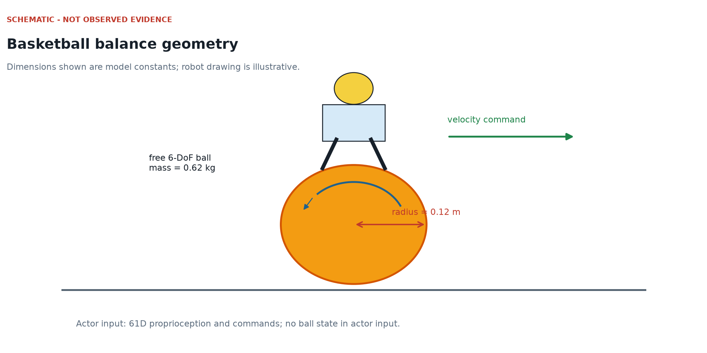
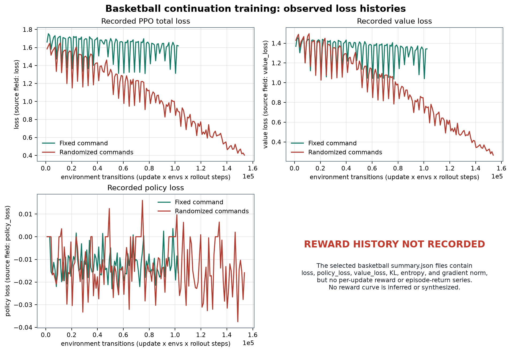
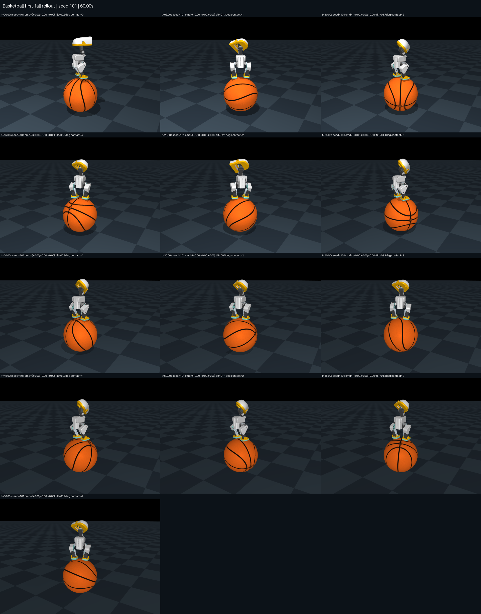
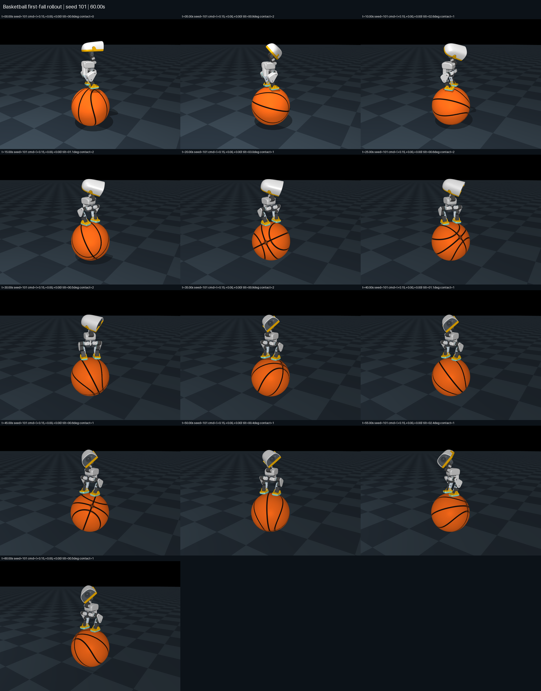

# 篮球：在自由滚动球体上的盲感知循环平衡

## 学习目标

学完本章后，你应当能够：

- 根据仓库中的数值重建篮球仿真场景；
- 解释共享的 61 维观测中每一个切片，以及全部 14 个动作；
- 说明为什么动作网络看不到球的显式状态，却仍然需要循环记忆；
- 跟踪隐藏状态和细胞状态在重置、采样、PPO 重放、ONNX 导出、评估与 Studio 播放中的生命周期；
- 使用代码中的公式和系数计算每一个本地奖励项；
- 解释六级物理辅助课程，并明确它不是“奖励课程”；
- 区分发布演员网络热启动、完整优化器续训和真正从零训练；
- 运行经过当前参数解析器核对的训练、评估、渲染与 Studio 适配器命令；
- 应用物理评估门槛，并诚实报告保留结果：**6/6 持续平衡，0/3 指令滚动**；
- 明确边界：转向尚未解决，横向和偏航转向尚未评估，不能据此证明过桥，也没有硬件结论。

## 证据与结论边界

本章只使用仓库代码和仓库内保留的产物。主要依据如下：

| 问题 | 仓库来源 |
|---|---|
| 共享观测、关节顺序、时序和默认姿态 | `microduck_local/src/microduck_local/contract.py` |
| 动作施加、关节速度单控制步延迟和观测拼装 | `microduck_local/src/microduck_local/walk_env.py` |
| 篮球场景、辅助力、终止、奖励和指标 | `rlx/rlx/environments/basketball.py` |
| LSTM 演员、本地评论家、源文件校验、ONNX 导出和一致性 | `rlx/rlx/models/basketball.py` |
| 本地循环 PPO 和直接命令行 | `rlx/examples/ppo_microduck_basketball.py` |
| 首次跌倒物理评估器 | `rlx/scripts/eval_basketball_local.py` |
| Studio 训练、评估、渲染和导入适配器 | `rlx/examples/ppo_microduck_balance.py` |
| Studio 循环策略加载器 | `microduck_local/src/microduck_local/studio_policies.py` |
| 面向人的结果摘要 | `docs/basketball-showcase/RESULTS.md` |
| 保留的直接评估证据 | `docs/basketball-showcase/evidence/evaluation.json` |
| 最新保留的 Studio 证据 | `rlx/runs/studio/basketball/basketball-balance-01/evaluation.json` |

这些保留产物生成于 2026 年 9 月 10 日。最新 Studio 报告使用种子 101、102、103，分别在零指令和 `0.15 m/s` 前进指令下评估 60 秒。六个试验全部维持了平衡，但三个带指令试验都没有通过受控滚动。适配器还明确写明：横向和偏航指令试验尚未实现。因此：

> 已演示的是在自由篮球上的无辅助持续平衡，不是受控滚动、通用转向、过桥、爬上篮球、倒地恢复或硬件验证。

`microduck-playground` 中的源篮球发布报告了规模大得多的上游评估，但那不是本地训练器的结果。本章严格区分源策略证据、本地证据和 Studio 证据。

**本章代码块标签**

- **源码节选：**用于学习的真实仓库代码片段。可能省略外围导入或类上下文，因此不是可独立执行的完整程序。
- **可执行命令：**在所需环境和资产齐备时，可从工作区根目录运行的 shell 命令。训练命令会创建新产物。
- **记录文本／数据：**仓库证据中的原样路径、序列或元数据值，不是命令。

## 1. 用数字搭建物理场景

### 1.1 单位

实现使用 MuJoCo 常见的公制量，变量名和指标名也直接标明了单位：

| 物理量 | 单位 | 例子 |
|---|---|---|
| 长度和位置 | 米，`m` | 球半径 `0.12 m` |
| 质量 | 千克，`kg` | 球质量 `0.62 kg` |
| 时间 | 秒，`s` | 控制间隔 `0.02 s` |
| 线速度 | 米每秒，`m/s` | 指令 `0.15 m/s` |
| 角度 | 内部使用弧度 | 关节偏移和偏航指令 |
| 角速度 | 弧度每秒，`rad/s` | 偏航和球旋转速度 |
| 报告中的倾角 | 度 | 评估要求小于 `50 deg` |
| 力 | 牛顿，`N` | 辅助弹簧力和阻尼力 |
| 力矩 | 牛顿米，`N m` | 辅助力矩 |

弧度等于弧长除以半径，`pi rad = 180 deg`。策略输出的 14 个动作是关节角偏移，单位为弧度，不是电机力矩。

### 1.2 求解器、地面、球和视觉网格

场景从带完整碰撞的 Microduck 模型出发，再加入地面和一个自由刚体：



**源码节选（不可独立执行）：**`rlx/rlx/environments/basketball.py`

```python
# rlx/rlx/environments/basketball.py
BALL_RADIUS = 0.12
BALL_MASS = 0.62

spec.option.timestep = C.PHYSICS_DT
spec.option.integrator = mujoco.mjtIntegrator.mjINT_IMPLICITFAST
spec.option.cone = mujoco.mjtCone.mjCONE_PYRAMIDAL
spec.option.iterations = 10
spec.option.ls_iterations = 20

spec.worldbody.add_geom(
    name="floor", type=mujoco.mjtGeom.mjGEOM_PLANE,
    size=[0, 0, 0.05], material="basketball_ground_mat",
    friction=[1, 0.005, 0.0001],
)

ball = spec.worldbody.add_body(
    name="basketball", pos=[0, 0, BALL_RADIUS + 0.001]
)
ball.add_freejoint(name="basketball_freejoint")
ball.add_geom(
    name="ball_sphere", type=mujoco.mjtGeom.mjGEOM_SPHERE,
    size=[BALL_RADIUS, 0, 0], mass=BALL_MASS,
    friction=[1.2, 0.01, 0.001], priority=1, condim=4,
)
```

球心初始高度是 `z = 0.121 m`，即半径 `0.12 m` 再加 1 毫米。物理球体几何负责质量和接触。另一个网格几何只负责篮球外观，其 `mass=0`、`contype=0`、`conaffinity=0`，不能暗中支撑机器人。纹理和网格来自 `microduck-playground/src/mjlab_microduck/robot/assets/basketball/`。

地面使用棋盘纹理和摩擦参数 `[1, 0.005, 0.0001]`。球使用 `[1.2, 0.01, 0.001]`、接触维度 4 和优先级 1。这些是仿真接触参数，不是某一种真实地板或篮球的实测认证。

自由关节给篮球七个构型量：三个位置坐标和四元数的四个分量；同时给出六个速度量：三个线速度和三个角速度。测试锁定完整模型为 `nq=28`、`nv=26`、`nu=14`。

### 1.3 时间步

物理步长为

$$
\Delta t_{\text{physics}}=0.005\text{ s}.
$$

每个策略动作保持四个物理步：

$$
\Delta t_{\text{control}}
=4(0.005)
=0.02\text{ s},
$$

因此策略频率为

$$
f_{\text{control}}=\frac{1}{0.02}=50\text{ Hz}.
$$

一次 60 秒评估恰好包含

$$
\frac{60}{0.02}=3000
$$

个控制步。

### 1.4 初始几何

球心位于 `0.121 m`。机器人根节点高度设为

$$
z_{\text{root}}
=2R+0.128
=2(0.12)+0.128
=0.368\text{ m}.
$$

因此根节点高出球心

$$
0.368-0.121=0.247\text{ m},
$$

高出球顶约

$$
0.368-(0.121+0.12)=0.127\text{ m}.
$$

重置测试把 `root_above_ball_m` 锁定为 `0.247`。

机器人从球顶附近的直立状态开始。根节点水平位置在 `+-0.01 m` 内采样，横滚和俯仰在 `+-2 deg` 内采样；启用随机偏航时，偏航在 `[-pi, pi]` 内采样；每个关节在默认姿态的 `+-0.05 rad` 内扰动。篮球从静止开始。本任务不训练爬上球或从地面恢复。

## 2. 精确的 61 维观测与 14 维动作契约

### 2.1 观测切片

演员网络始终接收一个 `float32[61]` 向量：

| Python 切片 | 索引 | 宽度 | 含义 |
|---|---:|---:|---|
| `0:3` | 0-2 | 3 | 躯干角速度 |
| `3:6` | 3-5 | 3 | 投影到躯干坐标系的重力 |
| `6:20` | 6-19 | 14 | 关节位置减去默认姿态 |
| `20:34` | 20-33 | 14 | 延迟一个控制步的关节速度 |
| `34:48` | 34-47 | 14 | 上一个演员原始动作 |
| `48:51` | 48-50 | 3 | 前进、横向和偏航速度指令 |
| `51:55` | 51-54 | 4 | 头部指令填充，强制为零 |
| `55:61` | 55-60 | 6 | 身体指令填充，强制为零 |

代码直接按切片拼装：

**源码节选（不可独立执行）：**`microduck_local/src/microduck_local/walk_env.py`

```python
# microduck_local/src/microduck_local/walk_env.py
obs = np.empty(C.OBS_DIM, np.float32)
obs[0:3] = gyro
obs[3:6] = gravity
obs[6:20] = joint_pos
obs[20:34] = joint_vel
obs[34:48] = self.last_action
obs[48:51] = self.twist_cmd
obs[51:55] = self.head_cmd
obs[55:61] = self.body_cmd
```

篮球环境把最后十个指令值设为零。训练器和测试都会拒绝 `51:61` 中的非零值。聚焦测试中，如果只移动篮球而不改变机器人本体感知，观测完全不变。因此演员网络对球的显式状态是“盲”的：61 个数里没有球位置、球速度、球旋转、球半径、接触标签或世界位置。

“盲”不等于毫无信息。移动球上的接触会改变躯干角速度、投影重力、关节状态和动作响应历史。LSTM 可以从时间序列中推断有用的隐藏动力学。

### 2.2 关节与动作顺序

14 个动作使用固定的舵机顺序：

| 动作索引 | 关节 | 默认姿态，rad |
|---:|---|---:|
| 0 | 左髋偏航 | 0.0000 |
| 1 | 左髋横滚 | -0.0873 |
| 2 | 左髋俯仰 | -0.4579 |
| 3 | 左膝 | -0.0049 |
| 4 | 左踝 | 0.4530 |
| 5 | 颈部俯仰 | 0.3491 |
| 6 | 头部俯仰 | 0.3491 |
| 7 | 头部偏航 | 0.0000 |
| 8 | 头部横滚 | 0.0000 |
| 9 | 右髋偏航 | 0.0000 |
| 10 | 右髋横滚 | 0.0873 |
| 11 | 右髋俯仰 | 0.4579 |
| 12 | 右膝 | 0.0049 |
| 13 | 右踝 | -0.4530 |

对演员原始输出 $\mathbf a_t\in\mathbb R^{14}$，实际位置目标为

$$
\mathbf q^{\text{target}}_t
=\mathbf q^{\text{default}}
+\operatorname{clip}(\mathbf a_t,-4,4).
$$

观测保存的是**原始**动作，不是裁剪后的动作。这样，下一个观测和动作变化惩罚都能看到网络真正请求了什么。使用 BAM 执行器时，位置目标驱动电压式舵机模型，并包含继承的 3-6 个物理步总线延迟。四个物理步构成一个控制步，所以该内部延迟短于两个控制周期。

## 3. 循环演员网络与状态生命周期

### 3.1 网络结构

本地演员网络为：

$$
61
\rightarrow \operatorname{LSTM}(256)
\rightarrow 512
\rightarrow 256
\rightarrow 128
\rightarrow 14,
$$

多层感知机使用 ELU 激活。对角高斯探索尺度包含 14 个可训练值，通常从 `initial_std=0.03` 开始。这里保存的是直接标准差参数，最低裁剪到 `1e-6`，不是对数标准差。

观测归一化计算

$$
\widehat{\mathbf o}
=\frac{\mathbf o-\boldsymbol\mu}
{\boldsymbol\sigma+0.01}.
$$

导入的源归一化器被冻结。其最后十个零填充槽的已存标准差为零，因此分母中的 `+0.01` 保证除法有限。导出的 ONNX 内含该归一化器。

本地评论家不同于源模型卡所描述的上游发布训练评论家。本地 `BasketballCritic` 只接收同样的 61 维归一化观测，是一个全新初始化的前馈网络 `61 -> 512 -> 256 -> 128 -> 1`，没有球状态输入。

### 3.2 单步推理

**源码节选（不可独立执行）：**`rlx/rlx/models/basketball.py`

```python
# rlx/rlx/models/basketball.py
def forward(self, observations, h_in, c_in):
    normalized = self.obs_normalizer(observations)
    recurrent, (h_out, c_out) = self.rnn.rnn(
        normalized.unsqueeze(0),
        (h_in, c_in),
    )
    actions = self.mlp(recurrent.squeeze(0))
    return actions, h_out, c_out
```

ONNX 接口是固定的：

- 输入：`obs [1,61]`、`h_in [1,1,256]`、`c_in [1,1,256]`；
- 输出：`actions [1,14]`、`h_out [1,1,256]`、`c_out [1,1,256]`；
- 数据类型：`float32`。

### 3.3 何时保留记忆，何时清零

在试验或回合开始时，隐藏状态 $\mathbf h$ 和细胞状态 $\mathbf c$ 都置零。每一个普通的 50 Hz 控制步都执行：

1. 把 `obs`、`h_in`、`c_in` 送入演员；
2. 施加 `actions`；
3. 把 `h_out`、`c_out` 作为下一次调用的输入。

普通指令变化不会清零记忆。试验重置、回合边界、策略启用或切换、恢复边界必须同时清零两个张量。

训练保存 `episode_starts[time, env]` 掩码。在采样和每次 PPO 重放中，代码都会在新回合位置把隐藏状态和细胞状态乘零：

**源码节选（不可独立执行）：**`rlx/rlx/models/basketball.py`

```python
# rlx/rlx/models/basketball.py
for step in range(observations.shape[0]):
    carry = (~episode_starts[step].bool()).to(observations.dtype)
    carry = carry.view(1, -1, 1)
    hidden = hidden * carry
    cell = cell * carry
    actions, hidden, cell = self(observations[step], hidden, cell)
    outputs.append(actions)
```

这一点很重要，因为循环 PPO 不能把保存的观测当成互不相关的行。每个训练轮次都从采样段的初始隐藏状态和细胞状态出发，使用相同的回合掩码重算完整时间序列。评估器也会在每个试验开始时调用一次 `policy.reset()`，然后持续携带状态，直到首次跌倒或到达精确时长。

导出器执行 40 步 PyTorch/ONNX 一致性测试，并在第 20 步清零状态。保留的固定指令演员最大动作绝对误差为 `1.43e-6`，混合指令演员为 `2.15e-6`。

## 4. 精确的本地奖励

### 4.1 符号

定义：

- $\mathbf v_{xy}$：躯干在身体坐标系中的前进和横向速度；
- $\mathbf c_{xy}$：前进和横向速度指令；
- $\boldsymbol\omega$：躯干陀螺仪值；
- $c_\omega$：偏航角速度指令；
- $\mathbf g$：投影到躯干坐标系的重力；
- $\mathbf d_{xy}$：躯干位置减球位置后的水平分量；
- $g_i$：第 $i$ 只脚相对 `BALL_RADIUS + 0.012` 的径向间隙；
- $h$：躯干高出球心的高度；
- $\mathbf v_b$：篮球水平速度；
- $\mathbf a_t-\mathbf a_{t-1}$：原始动作变化。

每个加权项都乘以 `CTRL_DT = 0.02`。总奖励为

$$
r_t=0.02\sum_k w_k f_k.
$$

### 4.2 实现中的公式和系数

| 奖励项 | 未加权公式 $f_k$ | 权重 $w_k$ |
|---|---|---:|
| 线速度跟踪 | $\exp(-\|\mathbf v_{xy}-\mathbf c_{xy}\|^2/0.1)$ | 1.0 |
| 偏航跟踪 | $\exp(-(\omega_z-c_\omega)^2/0.5)$ | 0.5 |
| 直立 | $\exp(-\|(g_x,g_y)\|^2/0.09)$ | 1.0 |
| 居中 | $\exp(-\|\mathbf d_{xy}\|^2/0.0016)$ | 2.0 |
| 双脚靠近球面 | $\frac12\sum_i\exp(-g_i^2/0.0004)$ | 1.0 |
| 高度 | $\exp(-(h-0.245)^2/0.0009)$ | 1.0 |
| 球速惩罚 | $-\min(\|\mathbf v_b\|^2,100)$ | 0.05 |
| 角速度惩罚 | $-\min(\omega_x^2+\omega_y^2,100)$ | 0.05 |
| 动作变化惩罚 | $-\min(\|\mathbf a_t-\mathbf a_{t-1}\|^2,100)$ | 0.2 |

源代码足够紧凑，可以直接对照：

**源码节选（不可独立执行）：**`rlx/rlx/environments/basketball.py`

```python
# rlx/rlx/environments/basketball.py
terms = {
    "linear_tracking": math.exp(
        -float(np.sum((self.body_lin_vel()[:2] - self.twist_cmd[:2]) ** 2)) / .1
    ),
    "yaw_tracking": math.exp(
        -float((self._gyro[2] - self.twist_cmd[2]) ** 2) / .5
    ),
    "upright": math.exp(-float(np.sum(gravity[:2] ** 2)) / .09),
    "centered": math.exp(-float(np.sum(relative[:2] ** 2)) / .0016),
    "feet_on_ball": float(np.mean(np.exp(-gaps ** 2 / .0004))),
    "height": math.exp(-float((relative[2] - BALL_RADIUS - .125) ** 2) / .0009),
    "ball_speed_penalty": -float(min(np.sum(ball_velocity ** 2), 100)),
    "angular_velocity_penalty": -float(min(np.sum(self._gyro[:2] ** 2), 100)),
    "action_rate_penalty": -float(
        min(np.sum((self.last_action - self.prev_action) ** 2), 100)
    ),
}
weighted = {
    key: value * REWARD_WEIGHTS[key] * CTRL_DT
    for key, value in terms.items()
}
```

奖励可以使用球、接触和几何等仿真特权状态，但这些量都不会进入演员观测。

### 4.3 奖励计算例题

假设某一步满足：

- 指令前进速度为 `0.15 m/s`，实测前进速度为 `0.01 m/s`；
- 横向误差为零；
- 根节点与球心水平偏移为 `0.02 m`；
- 高度接近重置值，`h=0.247 m`；
- 原始动作变化平方和为 `0.04`；
- 其他正奖励项都等于 1，其他惩罚为零。

线速度跟踪为

$$
f_{\text{lin}}
=\exp\left(-\frac{(0.01-0.15)^2}{0.1}\right)
=\exp(-0.196)
\approx0.8220.
$$

其加权贡献为

$$
0.8220(1.0)(0.02)\approx0.01644.
$$

居中奖励为

$$
f_{\text{center}}
=\exp\left(-\frac{0.02^2}{0.0016}\right)
=e^{-0.25}
\approx0.7788,
$$

因此贡献为

$$
0.7788(2.0)(0.02)\approx0.03115.
$$

高度奖励为

$$
f_{\text{height}}
=\exp\left(-\frac{(0.247-0.245)^2}{0.0009}\right)
\approx0.9956,
$$

贡献约为 `0.01991`。

动作变化惩罚为

$$
(-0.04)(0.2)(0.02)=-0.00016.
$$

如果所有正奖励都恰好为 1，所有惩罚都为零，则单步最大总奖励为

$$
0.02(1+0.5+1+2+1+1)=0.13.
$$

这是稠密塑形分数，不是成功判据。评估器有意忽略奖励总和。

## 5. 物理辅助课程

### 5.1 阶梯与转换规则

课程只有以下六级：

**记录文本／数据（不可执行）：**实现中的辅助阶梯。

```text
1.0 -> 0.5 -> 0.25 -> 0.1 -> 0.03 -> 0.0
```

一个回合结束后：

- 持续至少 `6 s`：向零辅助方向前进一级；
- 持续少于 `1.5 s`：向更强辅助方向退一级；
- 其他情况：保持当前级别。

转换在下一次重置时应用，而且只有前一个回合确实结束才会更新。奖励权重从不改变。

### 5.2 辅助力做什么

辅助函数首先清空全部外力。`hold=0` 时立即返回。非零时施加：

**源码节选（不可独立执行）：**`rlx/rlx/environments/basketball.py`

```python
# rlx/rlx/environments/basketball.py
ball_force = -400 * (ball_pos - self._ball_anchor) - 20 * ball_vel[:3]
ball_force[2] = -20 * ball_vel[2]
self.data.xfrc_applied[self.ball_body_id, :3] = self.hold * ball_force

self.data.xfrc_applied[self.ball_body_id, 3:] = (
    -self.hold * .2 * (ball_rotation @ ball_vel[3:])
)

duck_force = -40 * (
    self.data.xpos[self.trunk_body_id] - ball_pos
) - 4 * self.data.qvel[:3]
duck_force[2] = 0
self.data.xfrc_applied[self.trunk_body_id, :3] = self.hold * duck_force

self.data.xfrc_applied[self.trunk_body_id, 3:] = self.hold * (
    3 * np.cross(up, [0, 0, 1]) - .08 * angular_world
)
```

篮球获得指向锚点的水平弹簧阻尼支撑、没有竖直位置弹簧的竖直阻尼，以及旋转阻尼。躯干获得水平居中力，以及恢复直立和抑制角速度的力矩。

**辅助力例题。** 如果静止篮球沿正 x 方向偏移 `0.02 m`，未缩放的 x 力为

$$
-400(0.02)=-8\text{ N}.
$$

在 `hold=0.25` 时，实际 x 力为 `-2 N`；在 `hold=0` 时严格为零。

保留的课程冒烟运行了 7,168 个环境步，使用两个环境，完成 39 个回合，并实际发生了升级和降级。结束时各环境位于 `hold=0.25` 到 `hold=0.5`。它**没有**走完整个阶梯到零辅助，因此不能证明从零学会自由球平衡。

## 6. 训练：热启动、PPO 与从零训练边界

### 6.1 实际加载了什么

直接训练器默认使用：

**记录文本／数据（不可执行）：**默认源检查点路径。

```text
microduck-playground/artifacts/basketball/checkpoint.pt
```

它用固定 SHA256 校验发布的源检查点和相邻 ONNX，然后加载 `actor_state_dict`，冻结源观测归一化器，并用 `--initial-std` 覆盖演员探索标准差。

它**不会**恢复源评论家、Adam 优化器、GPU 课程计数器或精确的 mjlab 仿真状态。实际代码是：

**源码节选（不可独立执行）：**`rlx/examples/ppo_microduck_basketball.py`

```python
# rlx/examples/ppo_microduck_basketball.py
actor, source_metadata = load_source_actor(...)
critic = BasketballCritic(actor.obs_normalizer)
optimizer = torch.optim.Adam(parameters, lr=args.learning_rate)
```

保留摘要准确标记为：

**记录文本／数据（不可执行）：**保留运行的元数据。

```text
actor warm-start with fresh local critic and optimizer
full_upstream_resume: false
```

本地检查点也可以作为下一次演员热启动，但必须满足本地格式、冻结归一化契约、相邻 ONNX 和循环一致性要求。这仍然不是完整上游续训。

### 6.2 真正“从零”需要什么

本地命令行没有 `--scratch` 或随机演员选项。`train()` 总是调用 `load_source_actor()`。Studio 适配器也默认使用发布检查点或 `--init-from` 检查点。因此，仓库没有保留证据证明这套本地奖励、课程和 CPU PPO 能从随机演员发现篮球平衡。

成熟的 b11 演员是已演示平衡能力的来源，本地运行只是在它上面适配。辅助课程冒烟同样从该演员开始。真正的从零实验需要明确的随机初始化代码路径、声明过的初始化、冒烟测试和无辅助首次跌倒评估。本章不声称这些已经完成。

### 6.3 采样与 PPO 细节

若有 `N` 个环境、每段 `T` 步，则一次更新收集

$$
N\times T
$$

个转移。保留的固定指令运行使用 `N=8`、`T=128` 和 100 次更新：

$$
8\times128\times100=102{,}400
$$

个新的本地转移。

演员采样

$$
\mathbf a_t
=\boldsymbol\mu_t+\boldsymbol\epsilon_t\odot\boldsymbol\sigma,
\qquad
\boldsymbol\epsilon_t\sim\mathcal N(\mathbf0,\mathbf I).
$$

GAE 使用 `gamma=0.99`、`lambda=0.95`。真正终止不进行价值自举；时间上限截断会在单步 TD 差分中使用最终状态的评论家价值，但不会让多步轨迹跨越重置。优势会标准化。

PPO 使用一个完整循环序列小批次、五个训练轮次、裁剪系数 `0.2`、价值系数 `1.0`、熵系数 `0.01`、最大梯度范数 `1.0`、目标 KL `0.02`。每个轮次都会重算完整 LSTM 序列。KL 检查可以停止后续轮次，但已经执行的一次优化器更新仍可能让更新后 KL 超过目标。

固定指令运行使用学习率 `2e-6`、初始标准差 `0.03`、指令 `[0.15,0,0]`。混合指令运行是独立的 153,600 步热启动，使用学习率 `1e-5`、标准差 `0.08` 和直接训练器的随机采样器：25% 概率精确零指令，否则前进速度在 `[-0.15,0.15] m/s`、横向速度在 `[-0.1,0.1] m/s`、偏航速度在 `[-0.5,0.5] rad/s` 均匀采样。两次运行彼此独立，不是一条累计 256,000 步的训练链。



## 7. 经过参数解析器核对的命令行流程

以下命令均从工作区根目录运行，其选项拼写已经按当前解析器核对。训练命令会创建新产物，并可能耗费较长时间。

### 7.1 聚焦契约测试

**可执行命令（工作区根目录）：**

```bash
rlx/.venv-microduck/bin/python -m pytest \
  rlx/tests/test_basketball.py \
  rlx/tests/test_basketball_policy.py \
  rlx/tests/test_basketball_evaluation.py -q
```

### 7.2 直接五次更新冒烟

必须使用新的输出目录；训练器拒绝覆盖非空运行。

**可执行命令（工作区根目录）：**

```bash
bash scripts/train-basketball.sh \
  --output rlx/artifacts/basketball-book-smoke \
  --num-envs 4 \
  --updates 5 \
  --steps 32 \
  --learning-rate 2e-6 \
  --initial-std 0.03 \
  --hold 0 \
  --no-curriculum \
  --command 0.15 0 0
```

该命令请求 `4 x 32 x 5 = 640` 个新转移。它只检查流程接线，不是学习证据。

### 7.3 复现固定指令本地适配的规模

**可执行命令（工作区根目录）：**

```bash
bash scripts/train-basketball.sh \
  --output rlx/artifacts/basketball-book-fixed \
  --num-envs 8 \
  --updates 100 \
  --steps 128 \
  --learning-rate 2e-6 \
  --target-kl 0.02 \
  --save-interval 25 \
  --initial-std 0.03 \
  --hold 0 \
  --no-curriculum \
  --command 0.15 0 0
```

### 7.4 诚实的直接评估

重复使用 `--command` 是有意设计。

**可执行命令（工作区根目录）：**

```bash
rlx/.venv-microduck/bin/python rlx/scripts/eval_basketball_local.py \
  --policy rlx/artifacts/basketball-book-fixed/policy.onnx \
  --output rlx/artifacts/basketball-book-fixed-eval \
  --seconds 60 \
  --seeds 101 202 303 \
  --command 0 0 0 \
  --command 0.15 0 0 \
  --actuator bam \
  --render
```

聚合物理门槛失败时，评估器返回状态码 1，但仍会写出 `evaluation.json` 和失败媒体。指令滚动失败时，非零状态码是预期行为。

### 7.5 Studio 兼容训练

适配器会把请求步数向上取整到完整的 `num_envs x num_steps` 循环批次。下面的命令能够整除：

**可执行命令（工作区根目录）：**

```bash
rlx/.venv-microduck/bin/python rlx/examples/ppo_microduck_balance.py train \
  --recipe basketball \
  --output-dir rlx/runs/studio/basketball/basketball-book-fixed \
  --total-timesteps 102400 \
  --num-envs 8 \
  --num-steps 128 \
  --num-minibatches 1 \
  --learning-rate 2e-6 \
  --initial-std 0.03 \
  --target-kl 0.02 \
  --hold 0 \
  --no-curriculum
```

适配器固定使用指令 `[0.15,0,0]`、BAM 执行器、10 秒训练回合、冻结观测归一化、一个完整序列小批次，以及独立训练器规定的 PPO 常数。

### 7.6 Studio 评估和渲染

**可执行命令（工作区根目录）：**

```bash
rlx/.venv-microduck/bin/python rlx/examples/ppo_microduck_balance.py eval \
  --recipe basketball \
  --policy rlx/runs/studio/basketball/basketball-book-fixed/policy.onnx \
  --output-dir rlx/runs/studio/basketball/basketball-book-fixed \
  --num-envs 3 \
  --seed 101 \
  --max-episode-s 60 \
  --evaluation-mode skill
```

只要完整转向尚未评估，或滚动失败，适配器就返回状态码 2。它会对种子 101、102、103 分别评估零指令和 `0.15 m/s` 前进指令。

**可执行命令（工作区根目录）：**

```bash
rlx/.venv-microduck/bin/python rlx/examples/ppo_microduck_balance.py render \
  --recipe basketball \
  --policy rlx/runs/studio/basketball/basketball-book-fixed/policy.onnx \
  --output-dir rlx/runs/studio/basketball/basketball-book-fixed \
  --output rlx/runs/studio/basketball/basketball-book-fixed/render \
  --episodes 1 \
  --seed 101 \
  --render-seconds 60 \
  --width 1280 \
  --height 720
```

Studio 渲染器目前只录制带前进指令的情况。即使滚动失败，视频仍可作为持续平衡和漂移的有用证据。

## 8. 评估：平衡不等于滚动

### 8.1 首次跌倒计数

评估不会自动重置。试验在第一次终止时停止，或者运行到精确时长。完整试验要求：

- 样本数恰好等于要求值；
- 没有无效物理指标；
- 没有终止或截断；
- 自动重置次数为零。

环境会因根节点过低、根节点与球心水平偏移超过 `0.16 m`、倾角超过 `55 deg`、机器人接触地面、脚以外的机器人部位接触篮球，或物理状态出现非有限值而终止。评估接受条件对几何更严格：最大倾角必须小于 `50 deg`，最大根节点与球心偏移必须小于 `0.16 m`。

### 8.2 持续平衡

只有同时满足以下条件，试验才算持续平衡：

$$
\begin{aligned}
&\text{完成全部时长}\ \land\ \text{脚球接触比例}\ge0.5\\
&\land\ \text{无身体接触球}\ \land\ \text{无机器人接触地面}\\
&\land\ \text{辅助始终为零}\ \land\ \text{几何稳定}.
\end{aligned}
$$

平衡不要求篮球停在固定世界位置。策略可能在篮球漂移或转动时仍保持平衡。

### 8.3 受控滚动

对于非零平面指令，受控滚动还要求：

1. 沿初始指令方向有足够的有符号球位移；
2. 前进和横向身体速度误差足够小；
3. 偏航角速度误差足够小；
4. 积分球旋转量足够大。

若指令速度为 $s$、时长为 $T$、球半径为 $R=0.12$，则

$$
d_{\min}=\max(0.25,\;0.35sT),
$$

$$
e_{\text{linear,max}}=\max(0.04,\;0.6s),
$$

$$
e_{\text{yaw,max}}=0.5,
$$

$$
\theta_{\min}
=\frac{\max(0.25,\;0.35sT)}{R}(0.5).
$$

**60 秒门槛例题。** 当 `s=0.15 m/s` 时：

$$
sT=0.15(60)=9.0\text{ m},
$$

$$
d_{\min}=0.35(9.0)=3.15\text{ m},
$$

$$
e_{\text{linear,max}}=0.6(0.15)=0.09\text{ m/s},
$$

$$
\theta_{\min}=\frac{3.15}{0.12}(0.5)=13.125\text{ rad}.
$$

仅有总路程不够。当沿指令方向的有符号位移相对要求距离或总路程过小时，评估器会把明显运动标记为随机移动。

### 8.4 最新保留的 Studio 结果

最新保留的 Studio 评估使用 BAM、动作延迟和随机初始偏航；不开启推力、观测噪声、质量或摩擦域随机化；辅助为零；不自动重置。

| 情况 | 试验数 | 持续平衡 | 受控滚动 | 该情况结论 |
|---|---:|---:|---:|---|
| 指令 `[0,0,0]` | 3 | 3/3 | 不是该情况判据 | 通过 |
| 指令 `[0.15,0,0]` | 3 | 3/3 | 0/3 | 失败 |
| 全部试验 | 6 | **6/6** | **三个指令试验 0/3** | 完整任务失败 |

三个指令试验都同时因“沿指令方向位移不足”和“速度跟踪误差超限”失败。适配器报告：





**源码节选（不可独立执行）：**`rlx/examples/ppo_microduck_balance.py`

```python
# rlx/examples/ppo_microduck_balance.py
forward_rolling_passed = (
    bool(rolling_cases) and all(case["passed"] for case in rolling_cases)
)
rolling_passed = False
success = False
failures.append(
    "full steering is not assessed: lateral and yaw command trials are not implemented"
)
```

这种强制失败是有意的保守设计。即使未来前进滚动通过，也不能证明完整转向。目前证据连前进滚动也没有通过。

## 9. 阅读产物而不夸大结论

不同文件回答不同问题：

| 产物 | 能证明什么 |
|---|---|
| `summary.json` | 源哈希、设置、本地步数、演员变化、一致性和 PPO 诊断 |
| `checkpoint.pt` | 本地演员、新建本地评论家、优化器和运行元数据 |
| `policy.onnx` | 带冻结归一化器的确定性循环部署图 |
| `evaluation.json` | 每个物理试验、门槛、失败原因和聚合结论 |
| `rollout.mp4` | 一个已渲染种子和指令的可见运动 |
| `contact-sheet.png` | 按时间间隔抽样的整段视觉检查 |
| Studio `result.json` | 适配器级通过或失败以及来源信息 |

不能据此推断：

- 从篮球纹理旋转推断已学会转向；
- 从总路程推断沿指令方向直线运动；
- 从课程冒烟推断已经从零学习；
- 从演员热启动推断精确上游续训；
- 从 CPU MuJoCo 推断硬件安全；
- 从篮球平衡推断能够过桥。

对保留策略，正确的结论是：

> 它在保留的六个 60 秒 Studio 试验中全部维持了无辅助平衡；三个带前进指令的滚动试验全部失败；横向和偏航转向尚未评估；过桥和硬件行为不在这些证据范围内。

## 练习

1. 球半径为 `0.12 m`。球直径是多少？
2. 在 50 Hz 下，12 秒包含多少个控制步？
3. 偏航指令位于哪些观测索引？
4. 观测索引 55 是否包含球位置？
5. 第 4 号关节的原始动作为 `0.20 rad`，默认踝关节角为 `0.4530 rad`。忽略裁剪，目标角是多少？
6. 水平偏移为 `0.04 m` 时，居中奖励的未加权值是多少？
7. `hold=0.5` 时，静止篮球沿 x 偏移 `0.01 m`。施加给篮球的 x 辅助力是多少？
8. 某课程环境当前 `hold=0.25`，完成了 `6.4 s` 回合。下一回合的 hold 是多少？
9. 8 个环境、每段 128 步、25 次更新会收集多少个新转移？
10. 对 `0.15 m/s`、60 秒的情况，为什么 `1.30 m` 有符号位移即使机器人保持直立也会失败？
11. 某试验完成 60 秒，脚球接触比例 90%，辅助为零，没有禁止接触，最大倾角 `4 deg`，最大偏移 `0.02 m`。篮球在前进指令下横向移动 `4 m`。它是否通过持续平衡？是否通过受控滚动？
12. 为什么保留的 7,168 步课程冒烟不能证明从零学习？

## 参考答案

1. $2R=2(0.12)=0.24\text{ m}$。
2. $12/0.02=600$ 步。
3. 索引 50，即切片 `48:51` 的第三个值。
4. 不是。切片 `55:61` 是全零身体指令填充；演员没有显式球状态。
5. $0.4530+0.20=0.6530\text{ rad}$。
6. $\exp(-0.04^2/0.0016)=\exp(-1)\approx0.3679$。
7. 未缩放力为 $-400(0.01)=-4\text{ N}$，乘以一半辅助后为 `-2 N`。
8. 阶梯向零移动一级：`0.25 -> 0.1`。
9. $8\times128\times25=25{,}600$ 个转移。
10. 门槛要求至少 `3.15 m` 有符号位移，因此 `1.30 m` 不足。保持直立只能证明平衡，不能证明受控滚动。
11. 它通过持续平衡，因为这些条件满足平衡门槛；它不通过受控滚动，因为横向路程没有提供足够的有符号前进位移，而且通常也会导致速度跟踪失败。
12. 该冒烟从成熟发布演员开始，使用物理辅助，并在高于零的辅助级别结束。本地命令行没有初始化随机演员，也没有评估无辅助的从零策略。
