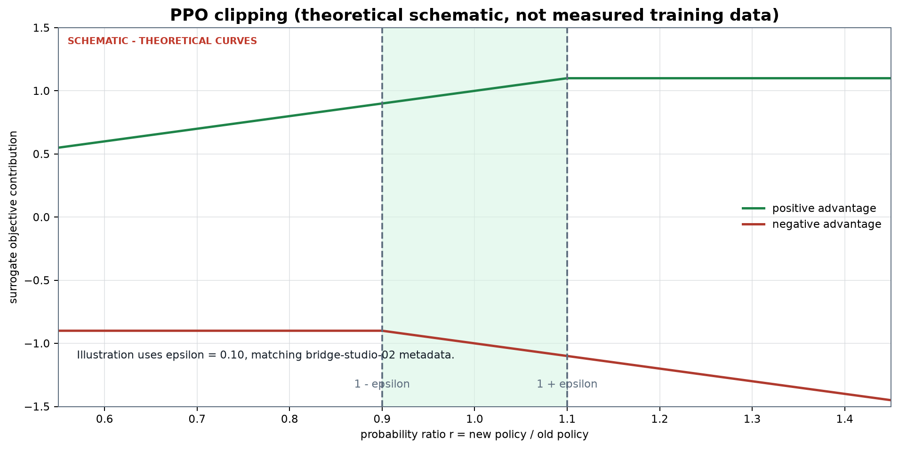
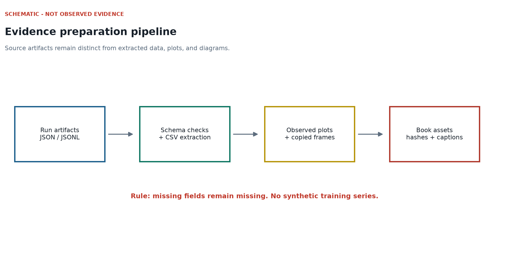
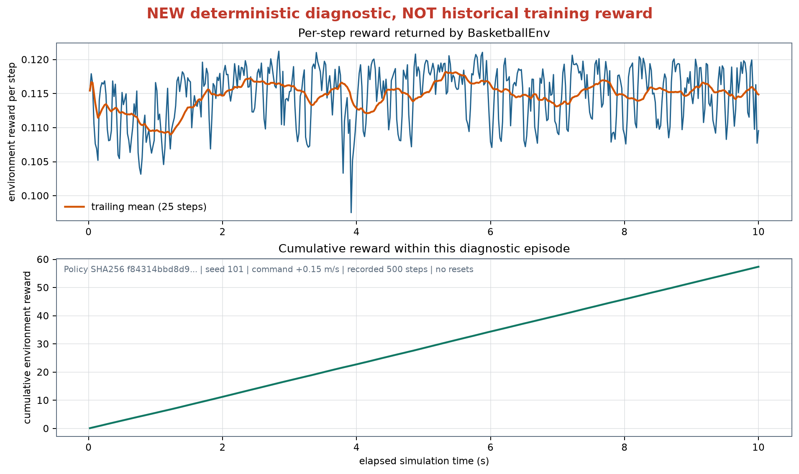
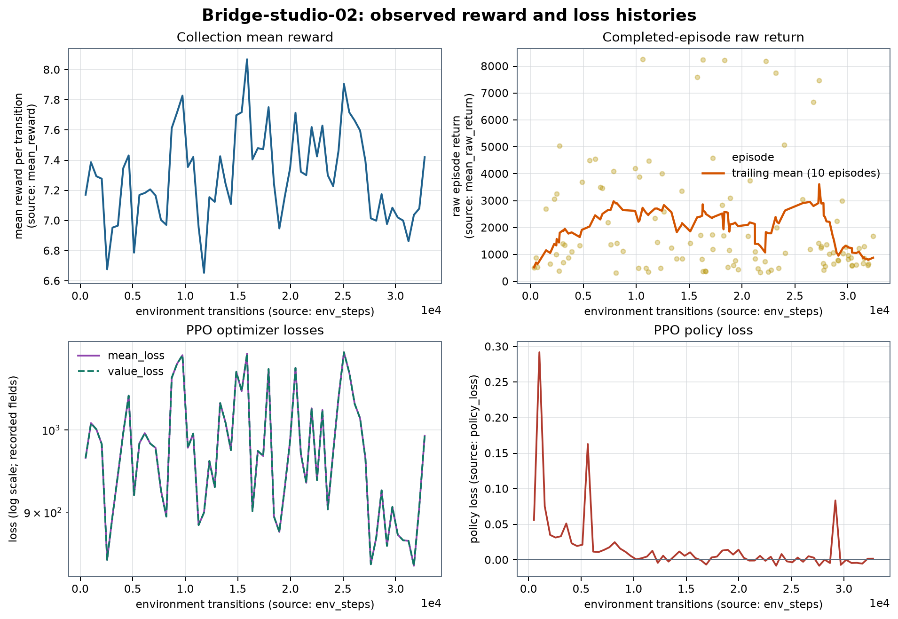
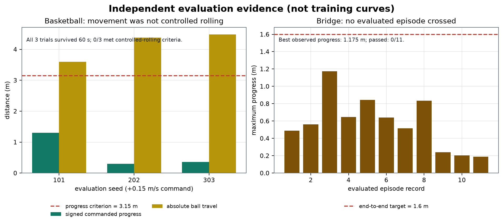
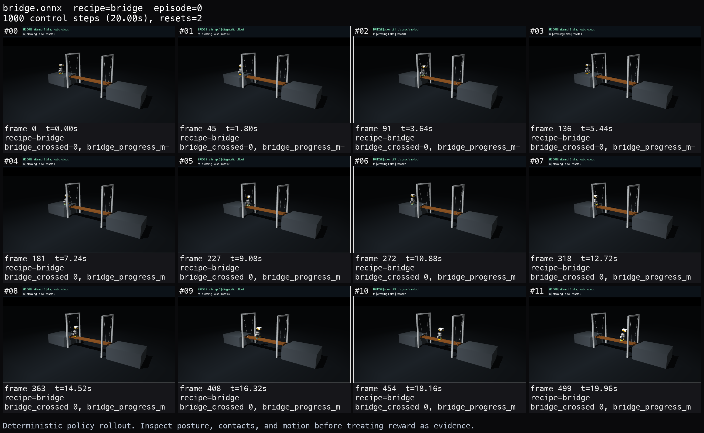
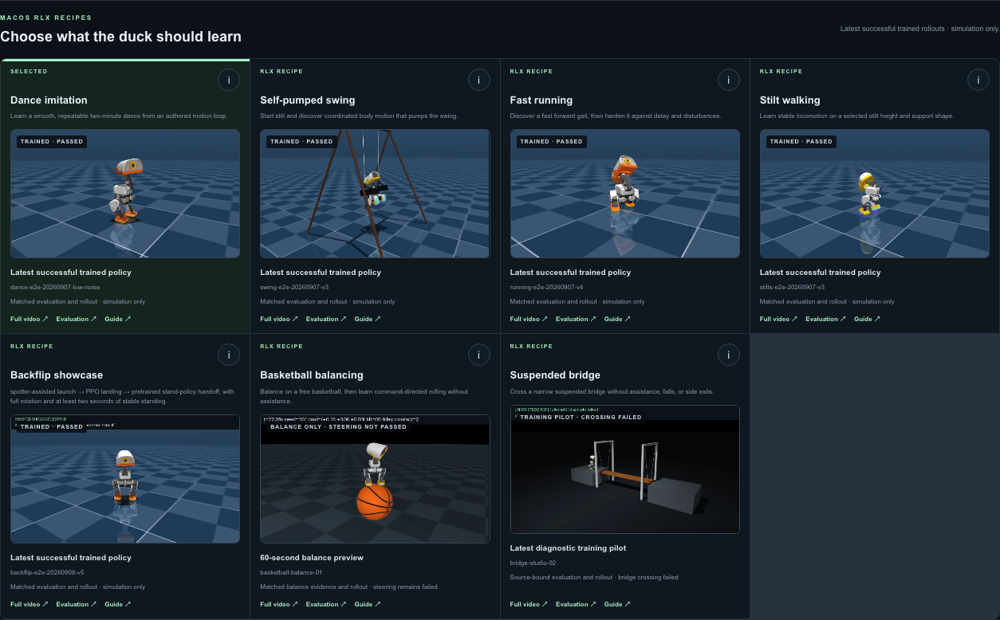
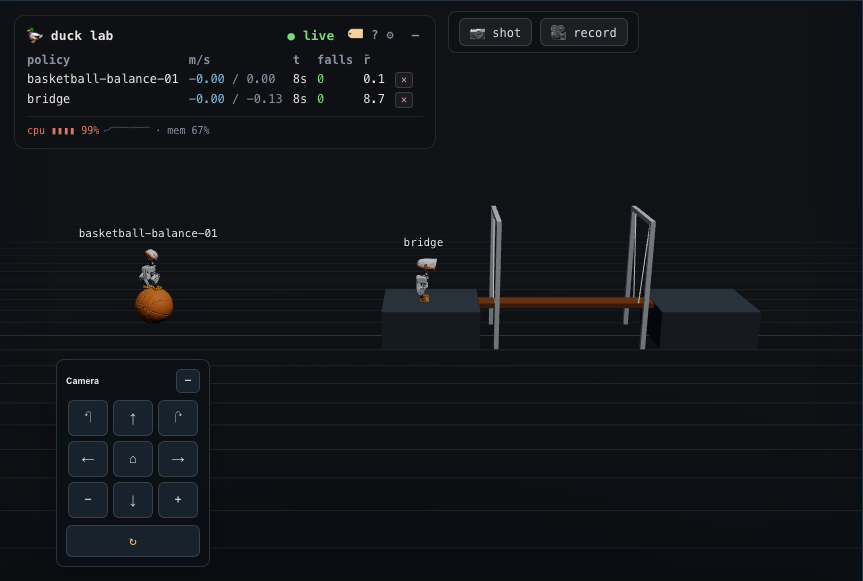

# Two balance laboratories: what this book actually reproduces

## A promise with a boundary

Imagine standing on a basketball. Moving your feet changes the ball's motion; the ball's motion changes the surface under your feet. Now imagine stepping onto a narrow plank suspended by four cables. Every footstep changes the support that the next footstep depends on. These are **coupled balance problems**, not simply walking animations placed on unusual scenery.

This book follows the working Microduck repository from physical assumptions to simulation, observations, actions, PPO updates, exported policies, evaluation, and the seven-case Duck Viewer. It assumes algebra, graphs, and elementary probability, not university mechanics or calculus. Each symbol is introduced before use. Code in the source appendix is actual implementation, not a fictional miniature presented as a complete trainer.

The evidence snapshot concerns local experiments recorded on **September 10, 2026**. The edition is **1.0, September 11, 2026**. A version number identifies a document snapshot; it does not mean that every skill is solved.

| Question | Evidence-backed answer |
|---|---|
| Can a duck balance on a free basketball? | Yes, the fixed-command local candidate survived all six recorded 60-second nominal trials. |
| Can it drive the ball reliably in the requested direction? | Not established: zero of three forward-command trials passed the rolling gate. |
| Does the suspended bridge exist as a working physical simulation? | Yes: a free plank, four physical cable tendons, platforms, and visible gantries. |
| Did the final bridge pilot complete an accepted crossing? | No. It has 32,768 new PPO transitions and zero accepted crossings. |
| Are both examples available in Duck Viewer? | Yes. Seven cases means five existing cases plus these two, not seven mastered skills. |
| Was either behavior verified on hardware? | No. All results here are simulation-only. |

The successful basketball behavior began from a **supplied trained recurrent actor**. The successful parts of this local experiment are source import, accurate actor transfer, further PPO training, export parity, sustained balance, and visible playback. This is not evidence that a randomly initialized local network learned ball balance in 102,400 steps. Likewise, a successful bridge training command means the pipeline ran; it does not mean the duck crossed.

“From scratch” therefore has two meanings. You can reconstruct the **software experiment** from source and required assets. You cannot reconstruct an undocumented upstream training history or replace a missing mature checkpoint with an assertion. This edition gives the reproducible local path in full and marks the original policy as an external prerequisite. The book's `source/` snapshot and ZIP are supporting source, not a redistribution of all third-party robot meshes, software dependencies, or policy weights.

## Choose a learning route

1. **First afternoon:** read the assumptions, inspect the scene diagrams, run preflight, run the pure-Python PPO arithmetic, and inspect real contact sheets. No training is necessary to learn the data flow.
2. **First experiment:** preserve the supplied artifacts, create a fresh run directory, execute a tiny smoke run, and inspect every output. A four-step smoke is an integration check only.
3. **Measured reproduction:** run the documented fixed-command basketball adaptation or the bridge pilot, export, evaluate deterministic policies with zero assistance, then inspect the complete rendered episode.
4. **Research extension:** change one physics or curriculum parameter, keep the evaluation fixed, run independent seeds, and document failures as carefully as successes.

Read the PPO chapter before tuning a learning rate. Read the evaluation chapter before deciding that a curve proves learning. Read the source appendix alongside the case chapters rather than starting with thousands of lines without context.

## A vocabulary we will keep consistent

| Term | Meaning in this book |
|---|---|
| State | All simulated physical variables, including information the policy cannot see. |
| Observation | The 61 numbers provided to the actor at one control step. |
| Action | Fourteen policy outputs interpreted by the robot control contract. |
| Policy / actor | A function producing an action distribution during training, and its mean during deterministic evaluation. |
| Critic / value | A learned estimate of future discounted reward, used for training. |
| Episode | One attempt between reset and termination/time limit. |
| Transition | One observation–action–reward–next-observation interaction in one environment. |
| Rollout | A block of transitions collected before updating the network. |
| Checkpoint | Training weights plus whatever metadata that checkpoint format actually stores. |
| ONNX export | Portable inference graph with the observation normalizer baked in. |
| Curriculum | A sequence of easier-to-harder physics, spawning, or judging conditions; not permission to change rewards silently. |
| Parity | Numerical agreement between two implementations on the same inputs and recurrent-state lifecycle. |
| Skill gate | A measurable acceptance condition, distinct from process exit or file creation. |

## Keep an experiment notebook

Record the source hashes, command, Python executable, package versions, actuator mode, seed, spawn distribution, assistance level, randomization settings, command distribution, step count, and evaluation horizon. Save the full JSON result, not only a screenshot of its green region.

An example notebook entry is:

```json
{
  "experiment": "my-independent-basketball-run",
  "initialization": "supplied actor; fresh critic and optimizer",
  "control_dt_s": 0.02,
  "actor_observations": 61,
  "actions": 14,
  "claim_to_test": "60-second free-ball balance",
  "claim_not_yet_supported": "commanded rolling and steering",
  "hardware_tested": false
}
```

This is a template, not an additional measured run. The actual run settings live beside the checkpoints. Filenames such as `final`, `full`, or `success` are not evidence by themselves.

## Where everything lives

All shell commands in this book start at the **workspace root**, unless a block explicitly changes directory. A path beginning `rlx/` is relative to that root. Book assets and source snapshots are relative to `docs/basketball-bridge-book/`.

```text
microduck-lab/
  microduck_local/       CPU MuJoCo harness, robot contract, lab server
  microduck_rl/          upstream robot/training reference checkout
  microduck/             upstream runtime and supplied walking policies
  microduck-playground/  supplied basketball experiment/assets/checkpoint
  rlx/                  local PPO, task environments, ONNX exports
  duck-viewer/           browser Studio and real scene playback
  scripts/              scenario command wrappers and API verification
  docs/basketball-bridge-book/
    chapters/en/        English chapter sources
    chapters/zh/        Chinese chapter sources
    assets/             measured plots, screenshots, schematic diagrams
    examples/           executable arithmetic and environment probes
    tools/              build, preflight, validation
    source/             exact selected implementation snapshot
```

The full workspace is the execution unit. Copying one environment file to an empty directory will not provide its robot contract, meshes, actuator code, or training framework.

# Mathematical and physical foundations

## Units before equations

Use metres for length, seconds for time, kilograms for mass, radians for angles, newtons for force, and newton-metres for torque. A value without a unit can look reasonable while being wrong by a factor of a thousand.

At a 50 Hz control rate the actor is consulted 50 times each second:

$$\Delta t = 1/50 = 0.02\ \mathrm{s}.$$

A 60-second basketball test contains 3,000 control steps. A 20-second bridge episode contains 1,000. These are control steps; the physics engine can perform multiple smaller integration steps inside each one. More environments increase data per rollout, not the duration of one simulated second.

Velocity is change of position divided by elapsed time. If the duck moves 0.03 m in 0.2 s, its average speed is 0.15 m/s. Acceleration is change of velocity divided by elapsed time. These finite differences are enough to understand the simulator's job before studying continuous derivatives.

Forces change momentum. In one dimension, a simple teaching update is

$$v_{t+1}=v_t+(F/m)\Delta t,\qquad x_{t+1}=x_t+v_{t+1}\Delta t.$$

This is an explanatory approximation, **not** a replacement for MuJoCo's integration, articulated-body dynamics, and contact solver. The actual simulator also resolves joints, contacts, friction and constraints. A torque is a turning effect: force times its perpendicular lever arm. A foot force displaced from the plank's centre can rotate it even when the duck remains upright.

## Why balance and motion interact

On a floor, the support under a planted foot is nearly fixed. On the ball, a foot tangential force can rotate the ball and move the support. If an ideal rigid sphere rolls without slip, distance and angle satisfy

$$d=r\theta.$$

With radius 0.12 m, a 90-degree rotation is $\theta=\pi/2$ radians, giving $d\approx0.1885$ m. At 0.15 m/s the ideal angular speed is $v/r=1.25$ rad/s. These are scale checks, not guarantees: slipping, contact deformation and turning break the simple straight-line relation.

For the suspended bridge, gravity pulls the combined masses down, while cables support and constrain the plank. A cable is not a rigid beam: its tension acts along its length. The implementation's tendon and limit settings approximate the desired cable behavior; their exact meaning is determined by the model, not by how the rendered cable looks. A gantry can be visible while having no collision role. The visual scene is evidence of appearance, not a complete description of the dynamics.

A material name such as “wood” or “rubber” does not automatically create correct physics. The simulator needs mass, dimensions, inertia, friction/contact parameters, joint and tendon definitions. The wooden appearance is a visual material. The 0.45 kg plank mass is a dynamic parameter. They must be documented separately.

## Coordinate frames: forward for whom?

The **world frame** belongs to the scene. The **body frame** turns with the duck. If the duck rotates 90 degrees, body-forward no longer points along world-x. Rewarding world-x velocity while issuing body-forward commands creates a misleading task.

For a planar heading angle $\psi$, a body-frame velocity can be expressed in world coordinates as

$$v_x^w=\cos\psi\,v_x^b-\sin\psi\,v_y^b,$$
$$v_y^w=\sin\psi\,v_x^b+\cos\psi\,v_y^b.$$

Superscripts $w$ and $b$ mean world and body, not exponentiation. With body velocity $(0.15,0)$ and heading 90 degrees, world velocity is approximately $(0,0.15)$. The basketball evaluator uses an initial-heading reference for directional progress; the bridge commander translates navigation information into ordinary body-frame commands. Neither fact makes world position an actor input.

## Feedback, memory, and partial observation

An **open-loop** script repeats preset joint targets regardless of what happens. A **feedback policy** chooses the next targets using current sensed information. If a foot slips, the next observation changes and the policy can respond.

The robot does not receive the entire simulator state. It gets angular velocity, projected gravity, commands, joint information, previous actions and reserved command slots. It does not directly receive ball centre or plank pose. This is partial observation. Two identical current observations may have different motion histories. The basketball actor therefore carries LSTM memory; the bridge actor is a transferred feedforward walking actor. A memory network is not clairvoyance: it can only summarize evidence that entered its observations.

During learning, random sampled actions help explore nearby behavior. During deterministic evaluation, the exported actor's mean is used. A stochastic policy that occasionally catches itself may export to a mean policy that falls. That is why training reward and exported-policy testing are different experiments.

## Arithmetic workshop

```python
import math

control_dt = 0.02
radius = 0.12
command_speed = 0.15
steps = round(60 / control_dt)
quarter_turn_distance = radius * math.pi / 2
ideal_angular_speed = command_speed / radius
print(steps, round(quarter_turn_distance, 4), ideal_angular_speed)
assert steps == 3000
assert abs(ideal_angular_speed - 1.25) < 1e-12
```

Expected output: `3000 0.1885 1.25`. This is a unit test of arithmetic, not a balance test.

**Exercise.** Four environments collect 128 steps before each update. How many transitions are collected? How much simulated time elapses in each lane? How many such updates make 32,768 transitions?

**Answer.** $4\times128=512$ transitions; each lane advances $128\times0.02=2.56$ seconds; $32768/512=64$ updates. Summing lane durations gives aggregate simulated experience, not one continuous 655.36-second bridge crossing.

**Exercise.** Why can a high average reward fail to prove a 60-second hold?

**Answer.** Short successful segments separated by falls/resets can have high average reward. A sustained hold requires one unbroken episode, first-fall accounting, valid foot support, and the entire requested duration.

# Set up a reproducible workshop

## Materials: simulation assets are not a hardware shopping list

The following is the **simulation bill of materials**. It identifies objects and files you need to reproduce the software experiment. It is not a certified mechanical design, purchasing recommendation, or construction specification for putting an expensive robot above a moving plank.

| Item | Quantity | Role and limitation |
|---|---:|---|
| Microduck full-collision robot MJCF and referenced meshes | One model per scene | Fourteen actuated joints; inspect the packaged XML, do not substitute an unrelated robot. |
| Free basketball | One | Radius 0.12 m, mass 0.62 kg; collision sphere and separate textured visual mesh. |
| Basketball OBJ and PNG | One each | Supplied playground assets; appearance is separate from sphere contact physics. |
| Suspended plank | One | Length 1.10 m, width 0.13 m, thickness 0.03 m, mass 0.45 kg. |
| Cable tendons | Four | Physical constraints/support, not only decorative lines. |
| Launch and destination platforms | Two | Static support and unambiguous start/end regions. |
| Visible gantries | Scene components | Show anchor placement; non-colliding visual structure. |
| Ground plane, lighting, camera | One scene setup | Ground contact is detected as failure, not hidden by the camera. |
| Supplied basketball actor and reference ONNX | One pair | Required mature initializer for the measured local experiment. |
| Supplied walking ONNX | One | Exact bridge actor/normalizer initializer. |

No physical timber grade, cable breaking load, fastening specification, battery limit, servo thermal envelope or safety factor was measured for this book. Do not infer those from simulated dimensions. Real tests would need engineered restraints, an exclusion zone, an emergency stop, torque/current limits, qualified supervision, and separate sim-to-real validation. The local harness is a prototype, not deployment approval.

## Computer and software assumptions

The recorded path uses an Apple-Silicon Mac. MuJoCo steps the physical scene on CPU; basketball PPO uses PyTorch CPU; bridge PPO uses MLX/Metal. “No CUDA required” does **not** mean “every part runs without a GPU runtime on every operating system.” This edition does not claim a clean Linux reproduction of the bridge learner.

Use Python 3.12, not whichever `python` happens to be first in your shell. Node/npm run the viewer. `uv` manages Python environments. Pandoc, XeLaTeX, `pdfinfo`, `pdftotext`, and `pdftoppm` build and inspect the book; they are not needed for training. Pillow and Matplotlib generate plots, not policy actions.

The measured Python package versions are recorded automatically in `environment.json`. This is a **recorded environment inventory**, not a tested universal resolver lock. Source changes outside a Git commit are bound by file SHA-256 values in `source-manifest.json`; a commit hash alone would miss the new uncommitted skill implementations.

## Acquire the workspace, not just the PDF

Obtain this workspace checkout from its maintainer, including its `rlx` checkout, upstream sibling repositories and the user-supplied playground references. Do not invent a public download URL for policy weights. Before installing anything, inspect the local prerequisites:

```bash
test -f microduck_local/src/microduck_local/contract.py
test -f rlx/rlx/mjlab_microduck/robot/microduck/robot_allcollisions.xml
test -f microduck/policies/alpha_walking.onnx
test -f microduck-playground/artifacts/basketball/checkpoint.pt
test -f microduck-playground/artifacts/basketball/policy.onnx
test -f microduck-playground/src/mjlab_microduck/robot/assets/basketball/basketball.obj
test -f microduck-playground/src/mjlab_microduck/robot/assets/basketball/basketball.png
command -v uv node npm
```

If a test fails, stop at that missing asset. Changing the actor architecture or replacing its normalizer with zeros does not repair a missing checkpoint. The bridge scene itself uses the packaged robot assets; basketball additionally requires the supplied playground OBJ/PNG. Walking baselines and other harness paths may require the upstream sibling model checkout.

For a new environment, the repo's documented setup route is:

```bash
cd rlx
uv sync --python 3.12
uv pip install --python .venv/bin/python -e ../microduck_local
.venv/bin/python examples/ppo_microduck_studio.py --help
cd ..
cd duck-viewer
npm ci
cd ..
```

These installation commands require network/package availability. The book's validation uses the existing recorded environment and does not claim to have recreated a fresh machine offline. Preserve lockfiles; compare package versions and test before changing a resolved dependency. Do not copy a virtual environment between computers.

The recorded executable is `rlx/.venv-microduck/bin/python`. The clean setup above creates `rlx/.venv/bin/python`. Substitute the latter consistently in the case chapters if that is your environment. The following variable makes the distinction explicit:

```bash
PYTHON="$PWD/rlx/.venv-microduck/bin/python"
test -x "$PYTHON"
"$PYTHON" docs/basketball-bridge-book/tools/preflight.py
"$PYTHON" docs/basketball-bridge-book/examples/ppo_arithmetic.py
```

Preflight checks required local assets and reports package versions without importing Metal. It does not prove that a subsequent Metal or graphics context can be opened. A restricted sandbox may permit file reads but reject Metal or CoreGraphics. That is a runtime permission problem, not proof of a broken actor.

## Separate preflight, smoke, training, and evaluation

| Stage | Smallest useful proof | What it cannot establish |
|---|---|---|
| Preflight | Assets exist, expected files and packages can be located. | Dynamics, graphics, or policy quality. |
| Contract test | Shapes, resets, curriculum and evaluator behavior are correct on fixtures/probes. | A trained skill is reliable. |
| Smoke training | A few transitions reach update, checkpoint and ONNX output. | Skill acquisition or convergence. |
| Pilot training | A bounded real experiment changes weights and records metrics. | Crossing/steering unless separately evaluated. |
| Deterministic evaluation | Exported policy meets or fails explicit conditions. | Robustness outside tested conditions. |
| Visual review | Contact, body posture and actual motion agree with metrics. | An unseen seed or hardware scenario. |

Run targeted contract tests before spending a long time training:

```bash
rlx/.venv-microduck/bin/python -m pytest -q \
  rlx/tests/test_basketball.py \
  rlx/tests/test_basketball_policy.py \
  rlx/tests/test_basketball_evaluation.py \
  rlx/tests/test_balance_adapter.py \
  rlx/tests/test_bridge.py \
  rlx/tests/test_bridge_evaluation.py \
  rlx/tests/test_bridge_bootstrap.py
```

These tests exercise the named implementation boundary. They do not assert that every unrelated test in the workspace passes. For this publication, current test results and book-only checks are saved separately under `verification/`.

## Before the first step: inspect the scene

Run the book's environment probe to compile both models, check the observation/action shape and sample four finite transitions. It applies zero action and records a construction check; it does not load a learned policy or prove balance:

```bash
rlx/.venv-microduck/bin/python \
  docs/basketball-bridge-book/examples/probe_scenes.py
```

Each environment owns mutable MuJoCo data. Shared immutable model resources can save memory, but recurrent hidden states and per-duck simulation states must never be shared. A viewer can display two ducks using the same ONNX session while each maintains independent LSTM memory.

## Preserve outputs before a new run

Use new output directories, such as `rlx/runs/book/basketball-YYYYMMDD-HHMMSS`, replacing the date token with a fresh run identifier. Check the destination does not already exist. Never train into the evidence directories printed in this book.

For each run, preserve at least:

- the executed command, software inventory, source hash and source-policy hash;
- checkpoint and associated metadata, final ONNX and parity result;
- full update/episode logs, not only a smoothed reward graph;
- evaluation JSON including failures, seeds, horizon and assistance settings;
- video, contact sheet and render metadata bound to the evaluated policy.

A checkpoint is not automatically a complete optimizer resume. In these two pathways, source actors are transferred but critics/optimizers are new. Re-running a command may reproduce the protocol without reproducing identical floating-point weights. Different numerical libraries, package versions, scheduling and simulator versions can change trajectories. The honest goal is a traceable experiment and matching acceptance criteria, not an unjustified promise of bitwise retraining.

## Troubleshooting without changing the question

| Symptom | First check | Do not do this |
|---|---|---|
| Missing ball appearance | OBJ/PNG paths and group-2 visual geoms. | Replace the physical sphere with decorative animation. |
| Model compiles but viewer is flat ground | Per-policy environment kwargs and lab scene extraction. | Claim bridge playback from the policy name alone. |
| Actor output diverges after export | Normalizer divisor, observation order, h/c reset and ONNX metadata. | Ignore parity because the duck looks plausible. |
| `No Metal device available` | Execute MLX in an authorized local runtime. | Change algorithms silently and call it the same experiment. |
| CoreGraphics rendering failure | Authorized graphics context and installed rendering backend. | Substitute a schematic as a measured rollout screenshot. |
| High reward, no crossing | Contact-valid full-horizon evaluation and rollout inspection. | Raise a reward coefficient before checking exploration. |
| JSON/stdout parsing mismatch | Prefer structured `training-metrics.jsonl` and result files. | Treat incomplete log parsing as a flat zero loss curve. |

**Exercise.** Why preserve both policy hashes and video evidence? **Answer:** a good-looking video can come from a different policy. Hash-bound metadata connects the claim, checkpoint, deterministic export, evaluation and visible trajectory.

# PPO: Learning Carefully from a Short Batch of Experience

Proximal Policy Optimization, usually shortened to **PPO**, is the learning algorithm used by the local RLX trainer. PPO does not directly teach a robot what basketball means. The environment supplies observations, actions, rewards, and episode boundaries. PPO uses those records to answer a narrower question:

> Given the actions the current policy just tried, which actions should become a little more likely, which should become a little less likely, and how large a change is safe enough to attempt?

This chapter develops that answer from high-school algebra, probability density, and averages. It then maps each idea to the repository's current implementation:

- `rlx/examples/ppo_microduck_basketball.py`: the recurrent PyTorch continuation trainer for the released basketball actor;
- `rlx/rlx/algorithms/ppo.py`: the generic feedforward MLX PPO implementation;
- `rlx/rlx/buffers/rollout_buffer.py`: the fixed-size rollout storage used by the MLX implementation.

The code is the authority for implementation details. PPO papers explain the general method, but this repository adds choices such as timeout-aware bootstrapping, a robust critic loss, numerical log-ratio clipping, and a basketball-specific KL stopping rule.

## The learning loop in plain language

Imagine coaching a player who must act every 20 milliseconds. At each tick:

1. The policy receives an observation, such as joint state, orientation, command, and recent motion information.
2. The actor produces a probability distribution over 14 continuous joint commands.
3. One action is sampled from that distribution.
4. The simulator advances and returns a reward plus boundary flags.
5. The critic predicts how much discounted future reward was expected from the old observation.

PPO saves a short block of these transitions. It then replays the saved actions through the updated policy and compares:

$$
\text{old log probability}
\quad\text{with}\quad
\text{new log probability}.
$$

If an action turned out better than the critic expected, PPO tries to increase its probability. If it turned out worse, PPO tries to decrease its probability. The word **proximal** means that the update is deliberately conservative: PPO limits how much benefit it can claim from moving the probability ratio too far in the helpful direction.

After several optimizer passes, the rollout is discarded. New data must be collected from the new policy. PPO is therefore **on-policy**: it does not keep an unlimited replay database containing actions from many old policies.

The two implementations in this repository organize that same idea differently:

| Path | Actor memory | Update organization | Main numerical framework |
|---|---|---|---|
| Generic `rlx/rlx/algorithms/ppo.py` | Feedforward | Flatten time and environments, shuffle, use minibatches | MLX |
| Basketball `ppo_microduck_basketball.py` | One-layer LSTM | Replay the entire time-by-environment sequence each epoch | PyTorch |

That difference is not cosmetic. A feedforward sample can be trained as an independent row. An LSTM action depends on the hidden state produced by earlier observations, so its history must be reconstructed in the correct order.

## Actor, critic, and the meaning of advantage

PPO trains two prediction systems.

The **actor** chooses actions. For continuous control, it produces a mean action $\mu(o)$ and a standard deviation $\sigma$. The basketball actor has 14 action dimensions. Its recurrent core first processes a 61-dimensional observation with an LSTM of hidden size 256, then an MLP maps the recurrent output through widths 512, 256, and 128 to 14 means.

The **critic** predicts a scalar value:

$$
V(o_t)\approx
\mathbb E[r_t+\gamma r_{t+1}+\gamma^2r_{t+2}+\cdots].
$$

The discount $\gamma$ makes distant rewards count less. With $\gamma=0.99$, a reward one step away is multiplied by $0.99$, two steps away by $0.99^2$, and so on.

The actor does not train directly from raw reward. It trains from an **advantage estimate**:

$$
\widehat A_t \approx
\text{outcome after action }a_t
-
\text{critic's expectation before }a_t.
$$

- $\widehat A_t>0$: the sampled action did better than the baseline; make it more likely.
- $\widehat A_t<0$: it did worse than the baseline; make it less likely.
- $\widehat A_t\approx0$: the sample provides little evidence for changing its probability.

“Positive advantage” does not mean “positive reward.” A reward of 2 can have negative advantage if the critic expected 5. A reward of $-1$ can have positive advantage if the critic expected $-4$. Advantage is a comparison with a baseline.

The basketball critic is feedforward even though the actor is recurrent. It reads the current normalized 61-vector and predicts one value. The actor and critic share the actor's frozen observation normalizer, but the basketball continuation creates a **fresh critic and fresh Adam optimizer**. It is an actor warm start, not a full optimizer-and-critic resume.

## Continuous actions use probability density

For one action coordinate, a Gaussian policy has density

$$
p(a\mid\mu,\sigma)
=
\frac{1}{\sigma\sqrt{2\pi}}
\exp\left(
-\frac{(a-\mu)^2}{2\sigma^2}
\right).
$$

The corresponding log density is

$$
\log p(a\mid\mu,\sigma)
=
-\frac12\left[
\frac{(a-\mu)^2}{\sigma^2}
+2\log\sigma
+\log(2\pi)
\right].
$$

For 14 independent Gaussian coordinates, the implementation sums 14 log densities:

$$
\log\pi(a\mid o)
=
\sum_{j=1}^{14}\log p(a_j\mid\mu_j(o),\sigma_j).
$$

This produces one joint log probability per transition.

### Density can exceed 1

Students often learn that a probability cannot exceed 1. That statement is true for the probability of an event, but a continuous Gaussian formula returns a **density**, not the probability of one exact point. A narrow density can be taller than 1 as long as the total area under the curve remains 1.

For $\mu=0$ and $\sigma=0.1$, the density at the mean is

$$
p(0)=\frac{1}{0.1\sqrt{2\pi}}\approx3.989.
$$

The probability of landing in an interval is the area over that interval. For a tiny interval of width $0.01$ near the mean, the probability is roughly density times width, about $3.989\times0.01=0.03989$, still below 1.

The log density can therefore be positive. That is legal. A positive continuous log density does not mean a probability greater than 1.

The following complete standard-library program reproduces the calculation:

```python
import math


def gaussian_log_density(x: float, mean: float, std: float) -> float:
    if std <= 0.0:
        raise ValueError("std must be positive")
    variance = std * std
    return -0.5 * (
        (x - mean) ** 2 / variance
        + 2.0 * math.log(std)
        + math.log(2.0 * math.pi)
    )


def main() -> None:
    log_density = gaussian_log_density(0.0, 0.0, 0.1)
    density = math.exp(log_density)
    approximate_interval_probability = density * 0.01

    print(f"log density: {log_density:.6f}")
    print(f"density: {density:.6f}")
    print(f"approximate probability in width 0.01: "
          f"{approximate_interval_probability:.6f}")

    assert density > 1.0
    assert 0.0 < approximate_interval_probability < 1.0


if __name__ == "__main__":
    main()
```

Expected output, up to final-digit rounding:

```text
log density: 1.383647
density: 3.989423
approximate probability in width 0.01: 0.039894
```

In `ppo_microduck_basketball.py`, `gaussian_log_prob()` implements the same expression with Torch tensors and sums over the action dimension. `gaussian_entropy()` also sums over dimensions.

## From log probabilities to the PPO ratio

The stored action was sampled under the old policy. PPO asks how its density changes under the new policy:

$$
r_t(\theta)
=
\frac{\pi_\theta(a_t\mid o_t)}
{\pi_{\theta_{\mathrm{old}}}(a_t\mid o_t)}.
$$

Direct division of tiny densities is numerically awkward, so code uses log probabilities:

$$
r_t(\theta)
=
\exp\left(
\log\pi_\theta(a_t\mid o_t)
-
\log\pi_{\theta_{\mathrm{old}}}(a_t\mid o_t)
\right).
$$

The ratio is always positive because an exponential is positive.

- $r=1$: the saved action has the same density.
- $r=1.2$: its density is 20% larger.
- $r=0.7$: its density is 30% smaller.

The ratio is not “the probability of the action.” It is a comparison of new and old densities for the same recorded action.

The generic MLX code clips the **log ratio** to `[-20, 20]` before exponentiating. This is a numerical overflow guard. It is separate from PPO's much narrower policy clip such as $[0.8,1.2]$. The basketball trainer currently exponentiates the unbounded log-ratio directly, then rejects non-finite KL values or losses.

## The clipped policy objective

PPO's sample-level surrogate is

$$
L_t^{\mathrm{clip}}
=
\min\left(
r_t\widehat A_t,\;
\operatorname{clip}(r_t,1-\epsilon,1+\epsilon)\widehat A_t
\right).
$$

The algorithm wants to maximize this quantity. The implementation minimizes its negative. The generic MLX source writes the negative form as a `maximum`; the basketball source writes the positive form with `minimum` and negates the mean. They are algebraically equivalent.

With $\epsilon=0.2$, the clipped interval is $[0.8,1.2]$.

### Positive advantage

Suppose $\widehat A=+2$. Increasing the ratio is helpful because it makes a good action more likely.

- At $r=1.1$, both terms equal $2.2$.
- At $r=1.3$, the ordinary product is $2.6$, but the clipped product is $1.2\times2=2.4$. PPO uses $2.4$.
- At $r=0.7$, the ordinary product is $1.4$ and the clipped product is $1.6$. PPO uses the smaller value, $1.4$.

The objective stops rewarding an overly large helpful increase, but it does not erase a harmful decrease.

### Negative advantage

Suppose $\widehat A=-2$. Decreasing the ratio is helpful because it makes a bad action less likely.

- At $r=0.7$, the ordinary product is $-1.4$, while the clipped product is $0.8\times(-2)=-1.6$. PPO uses the smaller value, $-1.6$.
- At $r=1.3$, the ordinary product is $-2.6$ and the clipped product is $-2.4$. PPO uses $-2.6$.

For negative advantage, the helpful direction is downward. The plateau appears below $0.8$, not above $1.2$.

This standalone program prints both cases:

```python
def clipped_surrogate(ratio: float, advantage: float, epsilon: float = 0.2) -> float:
    clipped_ratio = min(max(ratio, 1.0 - epsilon), 1.0 + epsilon)
    return min(ratio * advantage, clipped_ratio * advantage)


def main() -> None:
    for advantage in (2.0, -2.0):
        print(f"advantage = {advantage:+.1f}")
        for ratio in (0.7, 1.0, 1.3):
            value = clipped_surrogate(ratio, advantage)
            print(f"  ratio={ratio:.1f}, surrogate={value:+.1f}")

    assert clipped_surrogate(1.3, 2.0) == 2.4
    assert clipped_surrogate(0.7, -2.0) == -1.6


if __name__ == "__main__":
    main()
```

Clipping is not a guarantee that the new policy is better. It only changes the training objective for the sampled batch. The network can still change on observations absent from that batch, multiple parameters interact, the critic can be wrong, and the reward can fail to represent the intended basketball skill.



## Generalized Advantage Estimation

The one-step temporal-difference residual is

$$
\delta_t
=
r_t+\gamma b_t-V(o_t),
$$

where $b_t$ is the permitted bootstrap value after the transition. Generalized Advantage Estimation, or GAE, combines residuals backward:

$$
\widehat A_t
=
\delta_t+\gamma\lambda m_t\widehat A_{t+1}.
$$

Here:

- $\gamma$ discounts future return;
- $\lambda$ controls how strongly later residuals affect the current estimate;
- $m_t$ is a continuation mask that prevents a trace from crossing an episode reset.

With the repository defaults $\gamma=0.99$ and $\lambda=0.95$, the trace multiplier is

$$
\gamma\lambda=0.9405.
$$

A smaller $\lambda$ relies more on the critic's one-step predictions. A larger $\lambda$ carries more sampled future information backward, usually with more sampling variance. Neither value is universally best.

The critic target is

$$
\widehat R_t=\widehat A_t+V(o_t).
$$

The actor uses $\widehat A_t$; the critic fits $\widehat R_t$.

## Terminal and time-limit masks are different

Gymnasium separates two boundaries:

- **termination**: the modeled task truly ended, such as a failure condition;
- **truncation**: collection stopped for an external reason, commonly a time limit, although the underlying task could continue.

Both boundaries reset the environment. They do not receive the same value bootstrap.

For transition $t$, define:

$$
b_t=
\begin{cases}
0,&\text{if terminated},\\
V(o_{t+1}^{\mathrm{final}}),&\text{if truncated but not terminated},\\
V(o_{t+1}),&\text{if the episode continues}.
\end{cases}
$$

The GAE trace mask is zero for either termination or truncation:

$$
m_t=1-\mathbf 1[\text{terminated}\lor\text{truncated}].
$$

This gives two separate decisions:

1. **May the current residual bootstrap a value?** A pure timeout may; a true terminal may not.
2. **May advantage flow into the next stored transition?** Neither boundary may, because the next stored observation can belong to a reset episode.

The basketball implementation stores `bootstrap_values` for every transition. During collection, it evaluates the critic on the final pre-reset observation, then explicitly replaces the value with zero where `terminated` is true. Its `compute_gae()` uses:

- `~terminated` as the bootstrap mask;
- `~(terminated | truncated)` as the trace-continuation mask.

The generic MLX implementation reaches the same semantics differently. `_truncation_values()` selects only `truncated & ~terminated` environments and evaluates `info["terminal_observation"]`. The shared GAE helper uses the timeout value for a truncation, zero for termination, and the ordinary next value otherwise. It never bootstraps from an autoreset observation.

### Worked boundary example

Suppose:

$$
r_t=1,\quad V(o_t)=2,\quad
V(o_{t+1}^{\mathrm{final}})=5,\quad \gamma=0.99.
$$

If the transition is a true terminal:

$$
\delta_t=1+0-2=-1.
$$

If it is only a time limit:

$$
\delta_t=1+0.99(5)-2=3.95.
$$

If an autoreset observation has value 99, using it would give

$$
1+0.99(99)-2=97.01,
$$

which incorrectly assigns value from the next episode to the previous one.

The next program computes a three-step trace and proves that a reward in the reset episode cannot leak backward:

```python
from typing import Sequence


def gae(
    rewards: Sequence[float],
    values: Sequence[float],
    bootstraps: Sequence[float],
    terminated: Sequence[bool],
    truncated: Sequence[bool],
    gamma: float = 0.99,
    gae_lambda: float = 0.95,
) -> tuple[list[float], list[float]]:
    size = len(rewards)
    if not all(len(x) == size for x in (
        values, bootstraps, terminated, truncated
    )):
        raise ValueError("all inputs must have equal length")

    advantages = [0.0] * size
    trace = 0.0
    for step in range(size - 1, -1, -1):
        bootstrap_mask = 0.0 if terminated[step] else 1.0
        continuation_mask = (
            0.0 if terminated[step] or truncated[step] else 1.0
        )
        delta = (
            rewards[step]
            + gamma * bootstraps[step] * bootstrap_mask
            - values[step]
        )
        trace = delta + gamma * gae_lambda * continuation_mask * trace
        advantages[step] = trace

    returns = [a + v for a, v in zip(advantages, values)]
    return advantages, returns


def main() -> None:
    advantages, returns = gae(
        rewards=[0.5, 0.2, 0.0],
        values=[1.0, 1.2, 1.1],
        bootstraps=[1.2, 1.1, 0.9],
        terminated=[False, False, False],
        truncated=[False, False, True],
    )
    print([round(x, 6) for x in advantages])
    print([round(x, 6) for x in returns])

    changed_next_episode_reward = 1000.0
    assert changed_next_episode_reward > 0.0  # It is deliberately unused.
    assert round(advantages[-1], 6) == -0.209
    assert [round(x, 6) for x in advantages] == [
        0.586836, -0.107565, -0.209
    ]


if __name__ == "__main__":
    main()
```

The expected advantages are:

```text
[0.586836, -0.107565, -0.209]
```

The timeout transition bootstraps from 0.9, but its continuation mask is zero, so no later reset-episode advantage enters the trace.

## Advantage normalization

Raw advantages can have very different scales across tasks or batches. Both implementations normalize advantages:

$$
\widehat A'_t
=
\frac{\widehat A_t-\operatorname{mean}(\widehat A)}
{\operatorname{std}(\widehat A)+10^{-8}}.
$$

The basketball trainer normalizes once over the complete rollout before its epoch loop. The generic MLX trainer normalizes inside `_loss_and_metrics()` after selecting a minibatch, so each actual minibatch uses its own mean and standard deviation.

Normalization changes scale and can change a sample's sign relative to the selected group's mean. It does not change rewards, returns, or old log probabilities. It also does not mean that an advantage of `+2` in a teaching table will literally remain `+2` in training.

## The critic loss

The basketball continuation uses ordinary half squared error:

$$
L_V
=
\frac12\operatorname{mean}\left[
(V_{\mathrm{new}}-\widehat R)^2
\right].
$$

It does not clip the value update.

The generic MLX PPO uses a Huber-style error with threshold 10:

$$
h(e)=
\begin{cases}
\frac12e^2,&|e|\le10,\\
10|e|-50,&|e|>10.
\end{cases}
$$

When `clip_value_loss=True`, it also creates a clipped prediction:

$$
V_{\mathrm{clip}}
=
V_{\mathrm{old}}+
\operatorname{clip}(V_{\mathrm{new}}-V_{\mathrm{old}},-\epsilon,\epsilon),
$$

then uses the larger of the unclipped and clipped Huber errors. Choosing the larger prevents the clipped branch from making an excessively changed value prediction look artificially good.

This is an important implementation difference. “RLX PPO uses value clipping” is true for `rlx/rlx/algorithms/ppo.py`, but false for the basketball-specific `ppo_update()`.

## Entropy and why it can be negative

Entropy encourages exploration. For one Gaussian coordinate,

$$
H
=
\log\sigma+\frac12\log(2\pi e).
$$

For independent coordinates, the implementation sums this value.

This is **differential entropy**, not discrete Shannon entropy. Differential entropy may be negative. For example, with $\sigma=0.03$:

$$
H_{\text{one dimension}}\approx-2.087,
$$

so 14 equal dimensions have total entropy near $-29.2$.

Nothing is wrong with a negative value. It means the continuous density is concentrated in a narrow region. It does not mean negative probability.

Both loss functions subtract the entropy bonus:

$$
L_{\mathrm{total}}
=
L_{\mathrm{policy}}
+c_VL_V
-c_HH.
$$

If $H$ is negative, the term $-c_HH$ is positive. The optimizer still follows the exact differential-entropy objective; the sign should not be interpreted with discrete-entropy intuition.

The basketball actor stores a directly trained standard-deviation parameter and clamps it only to a minimum of `1e-6` when used. Loading a source actor then fills this parameter with the requested `initial_std`, whose command-line default is `0.03`. Thus the continuation deliberately resets exploration scale instead of retaining the source checkpoint's saved standard deviation.

## Total loss is not reward, and neither proves mastery

The basketball total loss is

$$
L
=
L_{\mathrm{policy}}
+1.0L_V
-0.01H
\quad\text{under its defaults}.
$$

The generic PPO defaults use value coefficient `0.5` and entropy coefficient `0.01`, although example programs can override them.

A falling training loss is not the same as a rising episode reward:

- policy loss measures a clipped probability objective on the latest batch;
- value loss measures critic prediction error;
- entropy measures distribution spread;
- reward comes from the environment;
- mastery is an external behavioral claim.

The total loss can rise while behavior improves because the critic is fitting larger return targets. It can fall while the robot learns a reward loophole. A high reward can still represent holding the ball incorrectly, exploiting assistance, or failing after the logged horizon. PPO only optimizes the reward and data it receives.

Therefore a basketball policy requires independent evaluation: complete episodes, physical task metrics, deterministic exported-policy tests, and rendered inspection. No scalar PPO metric alone establishes mastery.

## Recurrent sequence replay in basketball

The basketball actor is an LSTM. Its action mean at time $t$ depends on:

$$
\mu_t=f(o_t,h_{t-1},c_{t-1}).
$$

If training shuffled individual time steps, the hidden state would no longer match the one that generated the action. The basketball rollout therefore stores:

- observations with shape `[time, environments, 61]`;
- sampled actions and old log probabilities;
- old critic values, rewards, terminations, truncations, and bootstrap values;
- `episode_starts` for every time step;
- the initial LSTM hidden and cell states for the rollout.

During each PPO epoch, `actor.forward_sequence()` starts from the saved initial hidden state and walks forward in time. Before processing a step whose `episode_starts` flag is true, it multiplies the hidden and cell state by zero for that environment. This reconstructs the recurrent state while preventing memory from crossing resets.

The update uses the full sequence each epoch. There is no basketball minibatch loop in `ppo_update()`. With defaults of 32 steps and 4 environments, one rollout contains:

$$
32\times4=128\text{ transitions}.
$$

Five epochs present those same 128 transitions to the optimizer up to five times, unless KL stopping ends earlier. This is 128 new environment transitions, not 640 new transitions.

The critic is evaluated on a flattened `[time*environment, 61]` tensor because it is feedforward. Its outputs are reshaped back to `[time, environment]`.

## Feedforward minibatches in generic MLX PPO

`RolloutBuffer.reset()` allocates fixed arrays shaped `[num_steps, num_envs, ...]`. It stores:

| Field | Purpose |
|---|---|
| `observations` | input used to choose each action |
| `next_observations` | returned next input |
| `actions` | sampled action |
| `rewards` | scalar reward |
| `terminations`, `truncations` | separate boundary types |
| `values` | old critic predictions |
| `log_probs` | old-policy joint log probabilities |
| `advantages`, `returns` | allocated fields, although the current PPO path passes computed arrays directly to `update()` |

The generic update flattens the first two dimensions. For the library defaults:

$$
16\text{ steps}\times4096\text{ environments}
=65{,}536\text{ samples}.
$$

With 16 minibatches, each minibatch has 4,096 samples. Two epochs produce 32 optimizer steps per rollout.

The generic Microduck example does **not** use those large library defaults. `rlx/examples/ppo_microduck.py` defines 16 environments, 24 steps, 4 minibatches, and 5 epochs, then passes those values into `PPOConfig`. Its rollout has 384 transitions, each minibatch has 96, and one rollout produces 20 optimizer steps.

The MLX update creates a fresh random permutation each epoch. This is appropriate for its feedforward network because every saved observation contains the complete input expected by the network. `RolloutBuffer` stores no recurrent hidden state and no sequence-start mask; using it unchanged for an LSTM would lose necessary history.

## KL divergence: diagnostic in MLX, stopping rule in basketball

Both implementations calculate

$$
\widehat D_{\mathrm{KL}}
=
\operatorname{mean}\left[(r-1)-\log r\right].
$$

Because samples come from the old policy, this is a common sample approximation related to
$D_{\mathrm{KL}}(\pi_{\mathrm{old}}\|\pi_{\mathrm{new}})$. It should be nonnegative in expectation, although a finite sample and floating-point arithmetic can produce small irregularities.

The implementations use it differently.

### Generic MLX behavior

`rlx/rlx/algorithms/ppo.py`:

- clips log ratios to `[-20,20]` before exponentiation;
- reports `approximate_kl` when metrics are requested;
- reports `clip_fraction`;
- does **not** define `target_kl`;
- does **not** stop epochs or minibatches based on KL.

Its KL is a diagnostic, not a gate.

### Basketball behavior

`ppo_microduck_basketball.py`:

- defaults `target_kl` to `0.02`;
- computes KL before each epoch's optimizer step;
- can stop with `epochs_completed == 0` if saved old log probabilities are already inconsistent with the current actor;
- recomputes the full recurrent sequence after each optimizer step;
- computes post-update KL and stops further epochs when it exceeds the target;
- records `kl_early_stop`.

The pre-update guard matters for stale or mismatched rollout data. The post-update guard limits repeated reuse of the same short recurrent rollout. It is still not a mathematical guarantee that every state changed by less than a fixed amount.

## Exact defaults and overrides

Do not describe “the PPO defaults” without naming the layer.

### Generic `PPOConfig` defaults

| Setting | Value |
|---|---:|
| `num_envs` | 4096 |
| `num_steps` | 16 |
| `gamma` | 0.99 |
| `gae_lambda` | 0.95 |
| `num_minibatches` | 16 |
| `update_epochs` | 2 |
| `normalize_advantages` | true |
| `clip_coefficient` | 0.2 |
| `clip_value_loss` | true |
| `entropy_coefficient` | 0.01 |
| `value_coefficient` | 0.5 |
| `max_grad_norm` | 0.5 |

### Generic Microduck example overrides

`rlx/examples/ppo_microduck.py` replaces `num_envs`, `num_steps`, `num_minibatches`, and `update_epochs` with `16`, `24`, `4`, and `5`. It keeps gamma `0.99`, lambda `0.95`, clip `0.2`, and entropy coefficient `0.01`. Its optimizer learning-rate default is `1e-3`, which belongs to the example arguments rather than `PPOConfig`.

### Basketball trainer defaults

The basketball trainer does not instantiate `PPOConfig`. Its command line and function defaults produce:

| Setting | Value |
|---|---:|
| environments | 4 |
| rollout steps | 32 |
| updates | 5 |
| PPO epochs per rollout | 5 |
| gamma | 0.99 |
| GAE lambda | 0.95 |
| clip coefficient | 0.2 |
| value coefficient | 1.0 |
| entropy coefficient | 0.01 |
| gradient norm limit | 1.0 |
| Adam learning rate | `2e-5` |
| target KL | 0.02 |
| reset exploration standard deviation | 0.03 |

Its environment construction also overrides training conditions explicitly:

- episode limit: 10 seconds;
- actuator: `"bam"` by default;
- observation noise: off;
- domain randomization: off;
- pushes: off;
- curriculum: off;
- hold assistance: `0.0`;
- command: fixed `(0.08, 0.0, 0.0)` unless `--randomized-commands` is selected.

These choices describe the default local continuation experiment. They are not universal PPO recommendations and do not reproduce the complete upstream training recipe.

## One complete update, end to end

For the default basketball run:

1. Reset four environments with deterministic seed offsets.
2. Initialize LSTM hidden and cell tensors with shape `[1, 4, 256]`.
3. Collect 32 control steps, giving 128 transitions.
4. At every step, zero recurrent state for environments whose current observation starts a new episode.
5. Sample 14-dimensional Gaussian actions and save their joint old log probabilities.
6. Step each environment independently.
7. Evaluate final pre-reset observations for bootstrap values; force terminal bootstraps to zero.
8. Reset ended environments and mark the next observations as episode starts.
9. Run backward GAE with termination and truncation masks.
10. Normalize the 128 advantages together.
11. Replay the entire actor sequence from the saved initial LSTM state.
12. Check pre-update approximate KL.
13. Compute clipped policy loss, squared critic loss, and Gaussian entropy.
14. Backpropagate, clip the combined actor-and-critic gradient norm to 1.0, and step Adam.
15. Replay the sequence again, measure post-update KL, and decide whether another epoch is allowed.

The command-line defaults request five such rollout/update cycles:

$$
4\times32\times5=640
\text{ local environment transitions}.
$$

That small default is suitable as a short continuation or smoke-scale run, not evidence of basketball mastery.

## Common interpretation mistakes

**Mistake: “The Gaussian returned probability 3.9, which is impossible.”**  
Correction: it returned density. Probability is area over an interval.

**Mistake: “A positive log probability is invalid.”**  
Correction: continuous log density may be positive when the density exceeds 1.

**Mistake: “Clipping keeps every ratio between 0.8 and 1.2.”**  
Correction: the objective uses a clipped comparison. The actual ratio can lie outside the interval.

**Mistake: “A timeout gets zero future value because the environment reset.”**  
Correction: a pure time limit bootstraps from the final pre-reset observation, then stops the trace.

**Mistake: “Negative entropy means negative probability.”**  
Correction: continuous differential entropy can be negative.

**Mistake: “Lower total loss means higher reward.”**  
Correction: total loss mixes policy, critic, and entropy terms on one batch.

**Mistake: “High reward means the skill is mastered.”**  
Correction: reward is a designed training signal. Mastery requires independent physical criteria and inspection.

**Mistake: “The basketball updater uses MLX minibatches.”**  
Correction: it is a separate PyTorch recurrent updater that replays full sequences.

**Mistake: “Both PPO implementations stop at KL 0.02.”**  
Correction: only the basketball path has that target and early stopping. Generic MLX PPO reports KL without stopping.

## Exercises

1. A Gaussian has mean 0 and standard deviation 0.2. Compute its density at the mean. Can the answer exceed 1?
2. An action has old log density `-3.0` and new log density `-2.8`. Compute the PPO ratio.
3. With advantage `+3`, ratio `1.4`, and clip coefficient `0.2`, compute the unclipped product, clipped product, and selected surrogate.
4. Repeat Exercise 3 with advantage `-3`.
5. A transition has reward 2, current value 4, final-observation value 5, and gamma 0.9. Compute its TD residual for a true terminal and for a pure timeout.
6. Why must an LSTM rollout save its initial hidden state and episode-start masks?
7. Under generic `PPOConfig` defaults, how many optimizer steps occur per rollout?
8. Under basketball defaults, how many new transitions are collected in one rollout, and how many times can they be presented to the optimizer?
9. A training log shows total loss falling and reward rising. Give two reasons this still does not prove basketball mastery.
10. State the KL behavior difference between the generic MLX and basketball implementations in one sentence.

## Answers

1. At the mean, density is $1/(0.2\sqrt{2\pi})\approx1.995$. Yes. It is density, and its total area is still 1.
2. $r=\exp(-2.8-(-3.0))=\exp(0.2)\approx1.2214$.
3. Unclipped: $1.4\times3=4.2$. Clipped ratio: 1.2. Clipped product: 3.6. PPO selects the smaller surrogate, 3.6.
4. Unclipped: $1.4\times(-3)=-4.2$. Clipped product: $1.2\times(-3)=-3.6$. PPO selects $-4.2$ because it is smaller. Clipping does not protect movement in the harmful direction.
5. Terminal: $2-4=-2$. Timeout: $2+0.9(5)-4=2.5$.
6. The same observation can produce a different action mean under a different hidden state. Sequence replay must reconstruct the state that corresponds to the stored action, and reset masks must prevent memory from crossing episode boundaries.
7. `update_epochs × num_minibatches = 2 × 16 = 32` optimizer steps.
8. `4 × 32 = 128` new transitions. Up to five full-sequence optimizer presentations occur, unless KL early stopping ends the loop sooner.
9. The reward may omit important physical requirements or contain an exploitable shortcut; evaluation may cover only short or assisted episodes. In addition, loss and reward are not the same quantity.
10. Generic MLX PPO reports approximate KL as a metric but never stops on it, while basketball checks KL before and after each full-sequence epoch and stops further epochs when it exceeds the default target `0.02`.

## References

- John Schulman, Filip Wolski, Prafulla Dhariwal, Alec Radford, and Oleg Klimov. **Proximal Policy Optimization Algorithms**. arXiv:1707.06347, 2017. <https://arxiv.org/abs/1707.06347>
- John Schulman, Philipp Moritz, Sergey Levine, Michael Jordan, and Pieter Abbeel. **High-Dimensional Continuous Control Using Generalized Advantage Estimation**. arXiv:1506.02438, 2015. <https://arxiv.org/abs/1506.02438>

The paper metadata and abstracts were checked against locally retrieved arXiv pages. The repository implementation statements in this chapter were checked separately against the local source files named at the beginning.

# Basketball: Blind Recurrent Balance on a Free Ball

## Learning objectives

After this chapter, you should be able to:

- reconstruct the basketball scene from the numbers in the repository;
- explain every slice of the shared 61-value observation and all 14 actions;
- describe why the actor needs recurrent memory even though the ball is absent from its input;
- follow hidden and cell state through reset, rollout collection, PPO replay, ONNX export, evaluation, and Studio playback;
- calculate every local reward term from the implemented formulas and coefficients;
- explain the six-level physical-assistance curriculum without calling it a reward curriculum;
- distinguish a released-actor warm start from a full optimizer resume and from training truly from scratch;
- run the parser-verified training, evaluation, rendering, and Studio-adapter commands;
- apply the physical evaluation gate and report the retained result honestly: **6/6 sustained balance, 0/3 commanded rolling**;
- state the limits: steering is not solved, lateral and yaw steering are not assessed, bridge behavior is not established, and no hardware claim is made.

## Evidence and claim boundary

This chapter uses repository code and retained repository artifacts only. The main sources are:

| Question | Repository source |
|---|---|
| Shared observation, joint order, timing, and default pose | `microduck_local/src/microduck_local/contract.py` |
| Action application, one-step joint-velocity lag, and observation assembly | `microduck_local/src/microduck_local/walk_env.py` |
| Basketball scene, assistance, termination, rewards, and metrics | `rlx/rlx/environments/basketball.py` |
| LSTM actor, local critic, source verification, ONNX export, and parity | `rlx/rlx/models/basketball.py` |
| Local recurrent PPO and direct CLI | `rlx/examples/ppo_microduck_basketball.py` |
| First-fall physical evaluator | `rlx/scripts/eval_basketball_local.py` |
| Studio train/eval/render/import adapter | `rlx/examples/ppo_microduck_balance.py` |
| Studio recurrent-policy loader | `microduck_local/src/microduck_local/studio_policies.py` |
| Human-readable result summary | `docs/basketball-showcase/RESULTS.md` |
| Retained direct evidence | `docs/basketball-showcase/evidence/evaluation.json` |
| Latest retained Studio evidence | `rlx/runs/studio/basketball/basketball-balance-01/evaluation.json` |

The retained artifacts were produced on September 10, 2026. The latest Studio report evaluates seeds 101, 102, and 103 for 60 seconds under zero and `0.15 m/s` forward commands. All six trials sustained balance, but none of the three commanded trials passed controlled rolling. The adapter also states that lateral and yaw command trials are not implemented. Therefore:

> The demonstrated result is unassisted sustained balance on a free basketball. It is not controlled rolling, general steering, bridge traversal, climbing onto the ball, recovery from the floor, or hardware validation.

The source basketball release in `microduck-playground` reports a much larger upstream evaluation, but that published evaluation is not a result of this local trainer. This chapter keeps source evidence, local evidence, and Studio evidence separate.

**Block labels used in this chapter**

- **Source excerpt:** an actual repository excerpt shown for study. Surrounding imports or class context may be omitted, so it is not a standalone executable program.
- **Executable command:** a shell command runnable from the workspace root when the documented environment and assets are available. Training commands create new artifacts.
- **Recorded text/data:** a literal path, sequence, or metadata value from repository evidence. It is not a command.

## 1. Build the physical scene from numbers

### 1.1 Units

The implementation uses the usual MuJoCo metric quantities, made explicit by variable and metric names:

| Quantity | Unit | Example |
|---|---|---|
| length and position | metre, `m` | ball radius `0.12 m` |
| mass | kilogram, `kg` | ball mass `0.62 kg` |
| time | second, `s` | control interval `0.02 s` |
| linear velocity | metres per second, `m/s` | command `0.15 m/s` |
| angle | radian internally | joint offsets and yaw command |
| angular velocity | radians per second, `rad/s` | yaw and ball rotation rates |
| reported tilt | degree | evaluator limits tilt to less than `50 deg` |
| force | newton, `N` | assistance spring and damping forces |
| torque | newton-metre, `N m` | assistance torques |

A radian is an angle measured by arc length divided by radius. For orientation, `pi rad = 180 deg`. The policy's 14 action values are joint-angle offsets in radians, not motor torques.

### 1.2 Solver, floor, ball, and visual mesh

The scene starts from the full-collision Microduck robot and adds a floor and a free body:


**Source excerpt (not standalone):** `rlx/rlx/environments/basketball.py`

```python
# rlx/rlx/environments/basketball.py
BALL_RADIUS = 0.12
BALL_MASS = 0.62

spec.option.timestep = C.PHYSICS_DT
spec.option.integrator = mujoco.mjtIntegrator.mjINT_IMPLICITFAST
spec.option.cone = mujoco.mjtCone.mjCONE_PYRAMIDAL
spec.option.iterations = 10
spec.option.ls_iterations = 20

spec.worldbody.add_geom(
    name="floor", type=mujoco.mjtGeom.mjGEOM_PLANE,
    size=[0, 0, 0.05], material="basketball_ground_mat",
    friction=[1, 0.005, 0.0001],
)

ball = spec.worldbody.add_body(
    name="basketball", pos=[0, 0, BALL_RADIUS + 0.001]
)
ball.add_freejoint(name="basketball_freejoint")
ball.add_geom(
    name="ball_sphere", type=mujoco.mjtGeom.mjGEOM_SPHERE,
    size=[BALL_RADIUS, 0, 0], mass=BALL_MASS,
    friction=[1.2, 0.01, 0.001], priority=1, condim=4,
)
```

The sphere's centre begins at `z = 0.121 m`, one millimetre above a radius of `0.12 m`. Its physical geom has mass and contact. A second mesh geom supplies the basketball appearance but has `mass=0`, `contype=0`, and `conaffinity=0`; it cannot secretly support the robot. The texture and mesh come from `microduck-playground/src/mjlab_microduck/robot/assets/basketball/`.

The floor uses checkerboard texture colours and friction `[1, 0.005, 0.0001]`. The ball uses `[1.2, 0.01, 0.001]`, contact dimension 4, and priority 1. These are simulator contact parameters, not measured certificates for a particular real floor or ball.

The free joint gives the basketball seven configuration values: three position coordinates plus a four-value quaternion. It also gives six velocity values: three linear and three angular. Tests lock the complete model at `nq=28`, `nv=26`, and `nu=14`.

### 1.3 Timing

The physics step is

$$
\Delta t_{\text{physics}}=0.005\text{ s}.
$$

Each policy action is held for four physics steps:

$$
\Delta t_{\text{control}}
=4(0.005)
=0.02\text{ s},
$$

so the policy runs at

$$
f_{\text{control}}=\frac{1}{0.02}=50\text{ Hz}.
$$

A 60-second evaluation therefore contains exactly

$$
\frac{60}{0.02}=3000
$$

control steps per trial.

### 1.4 Spawn geometry

The ball centre is at `0.121 m`. The robot root is placed at

$$
z_{\text{root}}
=2R+0.128
=2(0.12)+0.128
=0.368\text{ m}.
$$

The root is therefore

$$
0.368-0.121=0.247\text{ m}
$$

above the ball centre and about

$$
0.368-(0.121+0.12)=0.127\text{ m}
$$

above the ball's top. The reset test locks `root_above_ball_m` to `0.247`.

The robot starts upright near the apex. Its horizontal root position is sampled within `+-0.01 m`, roll and pitch within `+-2 deg`, yaw across `[-pi, pi]` when random yaw is enabled, and every joint within `+-0.05 rad` of the default pose. The ball starts at rest. This task does not teach mounting the ball or recovering from the ground.

## 2. The exact 61-observation and 14-action contract

### 2.1 Observation slices

The actor always receives a `float32[61]` vector:

| Python slice | Indices | Width | Meaning |
|---|---:|---:|---|
| `0:3` | 0-2 | 3 | trunk angular velocity |
| `3:6` | 3-5 | 3 | gravity projected into the trunk frame |
| `6:20` | 6-19 | 14 | joint position minus the default pose |
| `20:34` | 20-33 | 14 | joint velocity, delayed one control step |
| `34:48` | 34-47 | 14 | previous raw actor action |
| `48:51` | 48-50 | 3 | forward, lateral, and yaw velocity command |
| `51:55` | 51-54 | 4 | head-command padding, forced to zero |
| `55:61` | 55-60 | 6 | body-command padding, forced to zero |

The assembly is direct:

**Source excerpt (not standalone):** `microduck_local/src/microduck_local/walk_env.py`

```python
# microduck_local/src/microduck_local/walk_env.py
obs = np.empty(C.OBS_DIM, np.float32)
obs[0:3] = gyro
obs[3:6] = gravity
obs[6:20] = joint_pos
obs[20:34] = joint_vel
obs[34:48] = self.last_action
obs[48:51] = self.twist_cmd
obs[51:55] = self.head_cmd
obs[55:61] = self.body_cmd
```

Basketball's command sampler sets the last ten values to zero. Both the trainer and tests reject nonzero `51:61` values. Moving the ball without changing robot proprioception leaves the observation unchanged in the focused test. The actor is therefore **blind to explicit ball state**: no ball position, velocity, rotation, radius, contact label, or world position appears in the 61 values.

The word "blind" does not mean information-free. Contact with a moving ball changes body angular velocity, projected gravity, joint state, and the action-response history. The LSTM can use that time sequence to infer useful hidden dynamics.

### 2.2 Joint and action order

The 14 action entries use this fixed servo order:

| Action index | Joint | Default pose, rad |
|---:|---|---:|
| 0 | left hip yaw | 0.0000 |
| 1 | left hip roll | -0.0873 |
| 2 | left hip pitch | -0.4579 |
| 3 | left knee | -0.0049 |
| 4 | left ankle | 0.4530 |
| 5 | neck pitch | 0.3491 |
| 6 | head pitch | 0.3491 |
| 7 | head yaw | 0.0000 |
| 8 | head roll | 0.0000 |
| 9 | right hip yaw | 0.0000 |
| 10 | right hip roll | 0.0873 |
| 11 | right hip pitch | 0.4579 |
| 12 | right knee | 0.0049 |
| 13 | right ankle | -0.4530 |

For raw actor output $\mathbf a_t\in\mathbb R^{14}$, the applied position target is

$$
\mathbf q^{\text{target}}_t
=\mathbf q^{\text{default}}
+\operatorname{clip}(\mathbf a_t,-4,4).
$$

The observation stores the **raw** action, not the clipped action. This keeps the next observation and action-change penalty aware of what the network requested. Under BAM actuation, the position target drives the voltage-based servo model, including its inherited 3-6 physics-step bus delay. Four physics steps make one control step, so that internal delay is shorter than two control intervals.

## 3. The recurrent actor and its state lifecycle

### 3.1 Network

The local actor is:

$$
61
\rightarrow \operatorname{LSTM}(256)
\rightarrow 512
\rightarrow 256
\rightarrow 128
\rightarrow 14,
$$

with ELU activations in the multilayer perceptron. The diagonal Gaussian exploration scale has 14 trainable values and starts at the requested `initial_std`, usually `0.03`. It is a direct standard-deviation parameter, clamped to at least `1e-6`, not a log-standard-deviation parameter.

The observation normalizer computes

$$
\widehat{\mathbf o}
=\frac{\mathbf o-\boldsymbol\mu}
{\boldsymbol\sigma+0.01}.
$$

The imported source normalizer is frozen. Its stored standard deviation for the ten zero-padded head/body slots is zero, so the `+0.01` denominator keeps those divisions finite. The exported ONNX contains the normalizer.

The local critic is different from the released upstream training critic described in the source model card. The local `BasketballCritic` takes only the same normalized 61 values and is a fresh feedforward `61 -> 512 -> 256 -> 128 -> 1` network. It has no ball-state input.

### 3.2 One-step inference

**Source excerpt (not standalone):** `rlx/rlx/models/basketball.py`

```python
# rlx/rlx/models/basketball.py
def forward(self, observations, h_in, c_in):
    normalized = self.obs_normalizer(observations)
    recurrent, (h_out, c_out) = self.rnn.rnn(
        normalized.unsqueeze(0),
        (h_in, c_in),
    )
    actions = self.mlp(recurrent.squeeze(0))
    return actions, h_out, c_out
```

The ONNX interface is exact:

- inputs: `obs [1,61]`, `h_in [1,1,256]`, `c_in [1,1,256]`;
- outputs: `actions [1,14]`, `h_out [1,1,256]`, `c_out [1,1,256]`;
- data type: `float32`.

### 3.3 When memory is carried and reset

At the beginning of a trial or episode, hidden state $\mathbf h$ and cell state $\mathbf c$ are zero. At every ordinary 50 Hz step:

1. send `obs`, `h_in`, and `c_in` to the actor;
2. apply `actions`;
3. carry `h_out` and `c_out` into the next call.

An ordinary command change does not reset memory. A trial reset, episode boundary, policy activation/switch, or recovery boundary must reset both tensors.

Training stores an `episode_starts[time, env]` mask. During collection and during every PPO replay, the code multiplies hidden and cell state by zero where an episode starts:

**Source excerpt (not standalone):** `rlx/rlx/models/basketball.py`

```python
# rlx/rlx/models/basketball.py
for step in range(observations.shape[0]):
    carry = (~episode_starts[step].bool()).to(observations.dtype)
    carry = carry.view(1, -1, 1)
    hidden = hidden * carry
    cell = cell * carry
    actions, hidden, cell = self(observations[step], hidden, cell)
    outputs.append(actions)
```

This matters because recurrent PPO cannot treat stored observations as unrelated rows. It recomputes the full time sequence from the rollout's initial hidden and cell tensors, applying the same episode masks. The evaluator similarly calls `policy.reset()` once at each trial start and carries state until first fall or the exact horizon.

The exporter runs a 40-step PyTorch/ONNX parity test with a state reset at step 20. The retained fixed-command actor's maximum absolute action error was `1.43e-6`; the mixed-command actor's was `2.15e-6`.

## 4. The exact local reward

### 4.1 Symbols

Let:

- $\mathbf v_{xy}$ be body-frame forward and lateral trunk velocity;
- $\mathbf c_{xy}$ be the commanded forward and lateral velocity;
- $\boldsymbol\omega$ be trunk gyroscope values;
- $c_\omega$ be commanded yaw rate;
- $\mathbf g$ be gravity projected into the trunk frame;
- $\mathbf d_{xy}$ be trunk position minus ball position in the horizontal plane;
- $g_i$ be foot $i$'s radial gap from `BALL_RADIUS + 0.012`;
- $h$ be trunk height above the ball centre;
- $\mathbf v_b$ be horizontal ball velocity;
- $\mathbf a_t-\mathbf a_{t-1}$ be the raw action change.

Every weighted term is multiplied by `CTRL_DT = 0.02`. The reward is:

$$
r_t=0.02\sum_k w_k f_k.
$$

### 4.2 Implemented formulas and weights

| Term | Unweighted formula $f_k$ | Weight $w_k$ |
|---|---|---:|
| linear tracking | $\exp(-\|\mathbf v_{xy}-\mathbf c_{xy}\|^2/0.1)$ | 1.0 |
| yaw tracking | $\exp(-(\omega_z-c_\omega)^2/0.5)$ | 0.5 |
| upright | $\exp(-\|(g_x,g_y)\|^2/0.09)$ | 1.0 |
| centred | $\exp(-\|\mathbf d_{xy}\|^2/0.0016)$ | 2.0 |
| feet on ball | $\frac12\sum_i\exp(-g_i^2/0.0004)$ | 1.0 |
| height | $\exp(-(h-0.245)^2/0.0009)$ | 1.0 |
| ball-speed penalty | $-\min(\|\mathbf v_b\|^2,100)$ | 0.05 |
| angular-velocity penalty | $-\min(\omega_x^2+\omega_y^2,100)$ | 0.05 |
| action-rate penalty | $-\min(\|\mathbf a_t-\mathbf a_{t-1}\|^2,100)$ | 0.2 |

The source is compact enough to compare directly:

**Source excerpt (not standalone):** `rlx/rlx/environments/basketball.py`

```python
# rlx/rlx/environments/basketball.py
terms = {
    "linear_tracking": math.exp(
        -float(np.sum((self.body_lin_vel()[:2] - self.twist_cmd[:2]) ** 2)) / .1
    ),
    "yaw_tracking": math.exp(
        -float((self._gyro[2] - self.twist_cmd[2]) ** 2) / .5
    ),
    "upright": math.exp(-float(np.sum(gravity[:2] ** 2)) / .09),
    "centered": math.exp(-float(np.sum(relative[:2] ** 2)) / .0016),
    "feet_on_ball": float(np.mean(np.exp(-gaps ** 2 / .0004))),
    "height": math.exp(-float((relative[2] - BALL_RADIUS - .125) ** 2) / .0009),
    "ball_speed_penalty": -float(min(np.sum(ball_velocity ** 2), 100)),
    "angular_velocity_penalty": -float(min(np.sum(self._gyro[:2] ** 2), 100)),
    "action_rate_penalty": -float(
        min(np.sum((self.last_action - self.prev_action) ** 2), 100)
    ),
}
weighted = {
    key: value * REWARD_WEIGHTS[key] * CTRL_DT
    for key, value in terms.items()
}
```

The reward uses privileged simulator state for the ball, contacts, and geometry. That is allowed for training rewards, but none of it enters the actor observation.

### 4.3 Worked reward example

Suppose one step has:

- command `0.15 m/s` forward and measured forward speed `0.01 m/s`;
- no lateral error;
- horizontal root-ball offset `0.02 m`;
- reset-like height `h=0.247 m`;
- raw action-change squared sum `0.04`;
- all other positive terms equal to 1 and other penalties zero.

Linear tracking:

$$
f_{\text{lin}}
=\exp\left(-\frac{(0.01-0.15)^2}{0.1}\right)
=\exp(-0.196)
\approx0.8220.
$$

Its weighted contribution is

$$
0.8220(1.0)(0.02)\approx0.01644.
$$

Centred:

$$
f_{\text{center}}
=\exp\left(-\frac{0.02^2}{0.0016}\right)
=e^{-0.25}
\approx0.7788,
$$

so the contribution is

$$
0.7788(2.0)(0.02)\approx0.03115.
$$

Height:

$$
f_{\text{height}}
=\exp\left(-\frac{(0.247-0.245)^2}{0.0009}\right)
\approx0.9956,
$$

giving approximately `0.01991`.

Action-rate penalty:

$$
(-0.04)(0.2)(0.02)=-0.00016.
$$

If every positive term were exactly 1 and every penalty were zero, the maximum per-step total would be

$$
0.02(1+0.5+1+2+1+1)=0.13.
$$

This is a dense shaping score, not the success test. The evaluator deliberately ignores reward totals.

## 5. Physical-assistance curriculum

### 5.1 Ladder and transition rule

The only curriculum levels are:

**Recorded text/data (not executable):** the implemented assistance ladder.

```text
1.0 -> 0.5 -> 0.25 -> 0.1 -> 0.03 -> 0.0
```

After a completed episode:

- duration at least `6 s`: move one level toward zero assistance;
- duration below `1.5 s`: move one level toward stronger assistance;
- otherwise: remain at the same level.

The transition is applied on the next reset and only if the previous episode actually finished. Reward weights never change.

### 5.2 What assistance does

The assistance method first clears every external force. At `hold=0`, it returns immediately. For nonzero hold, it applies:

**Source excerpt (not standalone):** `rlx/rlx/environments/basketball.py`

```python
# rlx/rlx/environments/basketball.py
ball_force = -400 * (ball_pos - self._ball_anchor) - 20 * ball_vel[:3]
ball_force[2] = -20 * ball_vel[2]
self.data.xfrc_applied[self.ball_body_id, :3] = self.hold * ball_force

self.data.xfrc_applied[self.ball_body_id, 3:] = (
    -self.hold * .2 * (ball_rotation @ ball_vel[3:])
)

duck_force = -40 * (
    self.data.xpos[self.trunk_body_id] - ball_pos
) - 4 * self.data.qvel[:3]
duck_force[2] = 0
self.data.xfrc_applied[self.trunk_body_id, :3] = self.hold * duck_force

self.data.xfrc_applied[self.trunk_body_id, 3:] = self.hold * (
    3 * np.cross(up, [0, 0, 1]) - .08 * angular_world
)
```

The ball receives horizontal spring-damper support toward its anchor, vertical damping without a vertical position spring, and rotational damping. The trunk receives horizontal centring force plus an upright-restoring and angular-damping torque.

**Worked assistance example.** If the ball is displaced `0.02 m` in positive x with zero velocity, its unscaled x force is

$$
-400(0.02)=-8\text{ N}.
$$

At `hold=0.25`, the applied x force is `-2 N`. At `hold=0`, it is exactly zero.

The retained curriculum smoke ran 7,168 environment steps with two environments, completed 39 episodes, and exercised both promotion and demotion. It ended with environments between `hold=0.25` and `hold=0.5`. It did **not** graduate to zero and does not demonstrate learning free-ball balance from scratch.

## 6. Training: warm start, PPO, and the scratch limit

### 6.1 What is loaded

The direct trainer defaults to:

**Recorded text/data (not executable):** the default source-checkpoint path.

```text
microduck-playground/artifacts/basketball/checkpoint.pt
```

It verifies the released source checkpoint and adjacent ONNX with fixed SHA256 values. It then loads `actor_state_dict`, freezes the source observation normalizer, and overwrites the actor's exploration standard deviation with `--initial-std`.

It does **not** restore the source critic, Adam optimizer, GPU curriculum counter, or exact mjlab simulator state. Instead:

**Source excerpt (not standalone):** `rlx/examples/ppo_microduck_basketball.py`

```python
# rlx/examples/ppo_microduck_basketball.py
actor, source_metadata = load_source_actor(...)
critic = BasketballCritic(actor.obs_normalizer)
optimizer = torch.optim.Adam(parameters, lr=args.learning_rate)
```

The retained summaries correctly label this:

**Recorded text/data (not executable):** retained run metadata.

```text
actor warm-start with fresh local critic and optimizer
full_upstream_resume: false
```

A local checkpoint may be used as another actor warm start, but it must have the local format, frozen-normalization contract, an adjacent ONNX, and recurrent parity. This is still not a full upstream resume.

### 6.2 What “scratch” would require

The local CLI has no `--scratch` or random-actor option. `train()` always calls `load_source_actor()`. The Studio adapter also defaults to the released checkpoint or an `--init-from` checkpoint. Therefore the repository contains no retained evidence that this local reward, curriculum, and CPU PPO implementation can discover basketball balance from a random actor.

The mature b11 actor is the source of the demonstrated balance. Local runs adapt it. The assistance smoke also begins from that actor. A truly scratch experiment would need a deliberate code path, a declared random initialization, a smoke test, and an unassisted first-fall evaluation. None is claimed here.

### 6.3 Rollout and PPO details

For `N` environments and `T` rollout steps, one update collects

$$
N\times T
$$

transitions. The retained fixed-command run used `N=8`, `T=128`, and 100 updates:

$$
8\times128\times100=102{,}400
$$

new local transitions.

The actor samples

$$
\mathbf a_t
=\boldsymbol\mu_t+\boldsymbol\epsilon_t\odot\boldsymbol\sigma,
\qquad
\boldsymbol\epsilon_t\sim\mathcal N(\mathbf0,\mathbf I).
$$

GAE uses `gamma=0.99` and `lambda=0.95`. A true termination does not bootstrap. A time-limit truncation uses the final state's critic value in the one-step delta but stops the multi-step trace across the reset. Advantages are normalized.

The PPO update uses one full recurrent sequence minibatch, five epochs, clip coefficient `0.2`, value coefficient `1.0`, entropy coefficient `0.01`, maximum gradient norm `1.0`, and target KL `0.02`. It recomputes the complete LSTM sequence each epoch. KL checking can stop later epochs, but a completed optimizer step can still leave post-update KL above the target.

The fixed-command run used learning rate `2e-6`, initial standard deviation `0.03`, and command `[0.15,0,0]`. The mixed-command run separately used 153,600 steps, learning rate `1e-5`, standard deviation `0.08`, and the direct trainer's randomized sampler: exact zero 25% of the time, otherwise uniform forward `[-0.15,0.15] m/s`, lateral `[-0.1,0.1] m/s`, and yaw `[-0.5,0.5] rad/s`. They are independent warm starts, not a single 256,000-step lineage.


## 7. Parser-verified command line workflow

All commands below run from the workspace root. Their option spellings were checked against the current parsers. Training commands create new artifacts and can take substantial time.

### 7.1 Focused contract tests

**Executable command (workspace root):**

```bash
rlx/.venv-microduck/bin/python -m pytest \
  rlx/tests/test_basketball.py \
  rlx/tests/test_basketball_policy.py \
  rlx/tests/test_basketball_evaluation.py -q
```

### 7.2 Direct five-update smoke

Use a new output directory; the trainer refuses to overwrite a nonempty run.

**Executable command (workspace root):**

```bash
bash scripts/train-basketball.sh \
  --output rlx/artifacts/basketball-book-smoke \
  --num-envs 4 \
  --updates 5 \
  --steps 32 \
  --learning-rate 2e-6 \
  --initial-std 0.03 \
  --hold 0 \
  --no-curriculum \
  --command 0.15 0 0
```

This requests `4 x 32 x 5 = 640` new transitions. It is a wiring check, not learning evidence.

### 7.3 Reproduce the fixed-command local adaptation shape

**Executable command (workspace root):**

```bash
bash scripts/train-basketball.sh \
  --output rlx/artifacts/basketball-book-fixed \
  --num-envs 8 \
  --updates 100 \
  --steps 128 \
  --learning-rate 2e-6 \
  --target-kl 0.02 \
  --save-interval 25 \
  --initial-std 0.03 \
  --hold 0 \
  --no-curriculum \
  --command 0.15 0 0
```

### 7.4 Honest direct evaluation

The repeated `--command` option is intentional.

**Executable command (workspace root):**

```bash
rlx/.venv-microduck/bin/python rlx/scripts/eval_basketball_local.py \
  --policy rlx/artifacts/basketball-book-fixed/policy.onnx \
  --output rlx/artifacts/basketball-book-fixed-eval \
  --seconds 60 \
  --seeds 101 202 303 \
  --command 0 0 0 \
  --command 0.15 0 0 \
  --actuator bam \
  --render
```

The evaluator returns exit status 1 when the aggregate physical gate fails, while still writing `evaluation.json` and failure media. A nonzero status is expected when commanded rolling fails.

### 7.5 Studio-compatible training

The adapter rounds requested timesteps up to a whole `num_envs x num_steps` recurrent batch. This command divides exactly:

**Executable command (workspace root):**

```bash
rlx/.venv-microduck/bin/python rlx/examples/ppo_microduck_balance.py train \
  --recipe basketball \
  --output-dir rlx/runs/studio/basketball/basketball-book-fixed \
  --total-timesteps 102400 \
  --num-envs 8 \
  --num-steps 128 \
  --num-minibatches 1 \
  --learning-rate 2e-6 \
  --initial-std 0.03 \
  --target-kl 0.02 \
  --hold 0 \
  --no-curriculum
```

The adapter fixes the command to `[0.15,0,0]`, BAM actuation, a 10-second training horizon, frozen observation normalization, one full-sequence minibatch, and the standalone learner's PPO constants.

### 7.6 Studio evaluation and rendering

**Executable command (workspace root):**

```bash
rlx/.venv-microduck/bin/python rlx/examples/ppo_microduck_balance.py eval \
  --recipe basketball \
  --policy rlx/runs/studio/basketball/basketball-book-fixed/policy.onnx \
  --output-dir rlx/runs/studio/basketball/basketball-book-fixed \
  --num-envs 3 \
  --seed 101 \
  --max-episode-s 60 \
  --evaluation-mode skill
```

The adapter returns exit status 2 while full steering is unassessed or rolling fails. It evaluates both zero command and `0.15 m/s` forward command for seeds 101, 102, and 103.

**Executable command (workspace root):**

```bash
rlx/.venv-microduck/bin/python rlx/examples/ppo_microduck_balance.py render \
  --recipe basketball \
  --policy rlx/runs/studio/basketball/basketball-book-fixed/policy.onnx \
  --output-dir rlx/runs/studio/basketball/basketball-book-fixed \
  --output rlx/runs/studio/basketball/basketball-book-fixed/render \
  --episodes 1 \
  --seed 101 \
  --render-seconds 60 \
  --width 1280 \
  --height 720
```

Studio's renderer currently records the commanded-forward case only. A failed rolling render can still be valuable evidence of sustained balance and drift.

## 8. Evaluation: balance is not rolling

### 8.1 First-fall accounting

Evaluation does not auto-reset. It stops a trial at the first terminal state or at the exact horizon. A complete trial requires:

- exactly the required number of samples;
- no invalid physical metrics;
- no termination or truncation;
- zero automatic resets.

The environment terminates for low root height, root-ball offset above `0.16 m`, tilt above `55 deg`, robot-floor contact, non-foot robot-ball contact, or nonfinite physics. The evaluator is stricter on accepted geometry: maximum tilt must remain below `50 deg`, and maximum root-ball offset below `0.16 m`.

### 8.2 Sustained balance

A trial counts as sustained balance only when all are true:

$$
\begin{aligned}
&\text{duration complete}\ \land\ \text{foot-contact fraction}\ge0.5\\
&\land\ \text{no body-ball contact}\ \land\ \text{no robot-floor contact}\\
&\land\ \text{hold always zero}\ \land\ \text{stable geometry}.
\end{aligned}
$$

Balance does not require the ball to remain at one world position. A policy may balance while the ball drifts or turns.

### 8.3 Controlled rolling

For a nonzero planar command, controlled rolling additionally requires:

1. enough signed ball progress along the initial command direction;
2. low forward and lateral body-velocity error;
3. low yaw-rate error;
4. enough integrated ball rotation.

For command speed $s$, duration $T$, and ball radius $R=0.12$:

$$
d_{\min}=\max(0.25,\;0.35sT),
$$

$$
e_{\text{linear,max}}=\max(0.04,\;0.6s),
$$

$$
e_{\text{yaw,max}}=0.5,
$$

$$
\theta_{\min}
=\frac{\max(0.25,\;0.35sT)}{R}(0.5).
$$

**Worked 60-second gate.** With `s=0.15 m/s`:

$$
sT=0.15(60)=9.0\text{ m},
$$

$$
d_{\min}=0.35(9.0)=3.15\text{ m},
$$

$$
e_{\text{linear,max}}=0.6(0.15)=0.09\text{ m/s},
$$

$$
\theta_{\min}=\frac{3.15}{0.12}(0.5)=13.125\text{ rad}.
$$

Ball travel alone is insufficient. The evaluator labels substantial travel as random movement when signed command progress is too small relative to the required distance or to total travel.

### 8.4 Latest retained Studio result

The latest retained Studio evaluation uses BAM, action delay, random initial yaw, no pushes, no observation noise, no mass/friction domain randomization, no assistance, and no automatic reset.

| Case | Trials | Sustained balance | Controlled rolling | Case verdict |
|---|---:|---:|---:|---|
| command `[0,0,0]` | 3 | 3/3 | not the case criterion | pass |
| command `[0.15,0,0]` | 3 | 3/3 | 0/3 | fail |
| all trials | 6 | **6/6** | **0/3 commanded** | full task fail |

Every commanded trial failed both command-directed progress and velocity tracking. The adapter reports:


**Source excerpt (not standalone):** `rlx/examples/ppo_microduck_balance.py`

```python
# rlx/examples/ppo_microduck_balance.py
forward_rolling_passed = (
    bool(rolling_cases) and all(case["passed"] for case in rolling_cases)
)
rolling_passed = False
success = False
failures.append(
    "full steering is not assessed: lateral and yaw command trials are not implemented"
)
```

The hard-coded fail-closed result is deliberate. Even a future forward-only pass would not prove full steering. The current evidence does not pass forward rolling either.

## 9. Reading artifacts without overclaiming

Use the files for different questions:

| Artifact | What it can establish |
|---|---|
| `summary.json` | source hashes, settings, local steps, actor change, parity, PPO diagnostics |
| `checkpoint.pt` | local actor, fresh local critic, optimizer, and run metadata |
| `policy.onnx` | deterministic recurrent deployment graph with frozen normalizer |
| `evaluation.json` | every physical trial, criteria, failures, and aggregate verdict |
| `rollout.mp4` | visible motion for one rendered seed and command |
| `contact-sheet.png` | spaced visual inspection across the rollout |
| Studio `result.json` | adapter-level pass/fail and provenance |

Do not infer:

- steering from rotating ball texture;
- straight commanded travel from total path length;
- scratch learning from a curriculum smoke;
- exact upstream continuation from actor warm-start training;
- hardware safety from CPU MuJoCo;
- bridge traversal from basketball balance.

The correct stopping statement for the retained policy is:

> It sustains unassisted balance for all six retained 60-second Studio trials. It fails all three commanded-forward rolling trials. Lateral and yaw steering are unassessed. Bridge behavior and hardware behavior are outside this evidence.

## Exercises

1. The ball radius is `0.12 m`. What is the ball diameter?
2. At 50 Hz, how many control steps occur in 12 seconds?
3. Which observation indices hold the yaw command?
4. Does observation index 55 contain ball position?
5. A raw action at joint 4 is `0.20 rad`. Ignoring clipping, what ankle target is applied when the default is `0.4530 rad`?
6. Compute the centred reward's unweighted value for horizontal offset `0.04 m`.
7. At `hold=0.5`, a stationary ball is displaced `0.01 m` in x. What x assistance force is applied to the ball?
8. A curriculum environment at `hold=0.25` completes a `6.4 s` episode. What is the next hold?
9. How many new transitions are collected by 8 environments, 128 steps, and 25 updates?
10. For `0.15 m/s` over 60 seconds, why is `1.30 m` signed progress a failure even if the robot remains upright?
11. A trial has 60-second duration, 90% foot contact, zero hold, no forbidden contacts, `4 deg` maximum tilt, and `0.02 m` maximum offset. The ball travels `4 m` sideways under a forward command. Does it pass sustained balance? Does it pass controlled rolling?
12. Why is the retained 7,168-step curriculum smoke not evidence of scratch learning?

## Answers

1. $2R=2(0.12)=0.24\text{ m}$.
2. $12/0.02=600$ steps.
3. Index 50, the third value in slice `48:51`.
4. No. Slice `55:61` is zero body-command padding. The actor receives no explicit ball state.
5. $0.4530+0.20=0.6530\text{ rad}$.
6. $\exp(-0.04^2/0.0016)=\exp(-1)\approx0.3679$.
7. Unscaled force is $-400(0.01)=-4\text{ N}$; half hold applies `-2 N`.
8. The ladder moves one step toward zero: `0.25 -> 0.1`.
9. $8\times128\times25=25{,}600$ transitions.
10. The gate requires at least `3.15 m` signed progress, so `1.30 m` is below target. Upright survival alone is balance, not controlled rolling.
11. It passes sustained balance because those conditions satisfy the balance gate. It fails controlled rolling because sideways travel does not provide enough signed forward progress and likely fails velocity tracking.
12. The smoke started from the mature released actor, used physical assistance, and ended above zero assistance. The local CLI did not initialize a random actor, and no unassisted scratch policy was evaluated.

# Suspended Bridge: Learning to Walk on a Moving Support

## Learning objectives

After this chapter, you should be able to:

1. describe the simulated bridge geometry, four tendon cables, free plank, platforms, and non-colliding gantry with exact dimensions;
2. distinguish a simulated bill of materials from a certified physical construction plan;
3. trace the unchanged 61-observation and 14-action deployment contract;
4. explain why the navigation commander may use world state while the learned actor receives only the standard command slots;
5. derive every inherited locomotion reward term and its actual weight;
6. explain why the curriculum changes physics and spawn position, but never reward weights;
7. describe the walking-policy transfer: transferred actor and normalizer, frozen normalization statistics, fresh critic, and fresh optimizer;
8. reproduce the current build, train, export, evaluation, and render commands; and
9. apply the strict full-20-second crossing gate without turning partial progress into a successful result.

The most important result comes first:

> The recorded `bridge-studio-02` pilot trained for 32,768 PPO transitions and did **not** cross the suspended bridge. Its best measured progress was 1.175 m from the launch position, below the 1.60 m progress threshold and without a contact-validated two-foot landing. This chapter documents a working simulation and training protocol, not a mastered skill.

## 1. Evidence and claim boundary

This chapter is grounded in the current repository implementation:

| Question | Source |
| --- | --- |
| Bridge geometry, commander, curriculum, contacts, and metrics | `rlx/rlx/environments/bridge.py` |
| Strict crossing gate | `rlx/rlx/environments/bridge_evaluation.py` |
| Walking actor transfer | `rlx/rlx/models/bridge_bootstrap.py` |
| Studio train/eval/render/export parser | `rlx/examples/ppo_microduck_studio.py` |
| Shared observation and action order | `microduck_local/src/microduck_local/contract.py` |
| Inherited reward equations | `microduck_local/src/microduck_local/walk_env.py` |
| Recorded pilot and deterministic evaluation | `docs/bridge-showcase/` and `rlx/runs/studio/bridge/bridge-studio-02/` |

The local training playbook adds three interpretation rules:

- never change the 61/14 interface for one task;
- do not treat reward or PPO completion as proof of behavior; and
- inspect a deterministic exported rollout before claiming a skill.

The bridge model is a **local MuJoCo prototype**. Its dimensions, masses,
friction coefficients, tendon stiffness, damping, and limits are simulator
parameters. They are not measurements from a constructed bridge, cable ratings,
load calculations, a safety factor, or a hardware certification. The render
material names such as `bridge_plank_mat` describe color and appearance, not a
specified species of wood or grade of metal.

## 2. What is physically simulated?

The task places Microduck on a raised launch platform. A narrow plank spans the
gap to a second platform. The plank is not welded, hinged, or kinematically
animated. It has a MuJoCo free joint, so contact forces can translate it and
rotate it in roll, pitch, and yaw. Four spatial tendons connect moving
attachment sites on the plank to fixed world anchors.

### 2.1 Simulated bill of materials

This table is a simulator inventory, not a shopping or construction list.

| Count | Simulated item | Exact model values |
| ---: | --- | --- |
| 1 | Free plank | `1.10 x 0.13 x 0.03 m`, mass `0.45 kg`, center initially at `(0, 0, 0.225) m` |
| 2 | Fixed platforms | each `0.60 x 0.48 x 0.24 m`, centers at `x=-0.85 m` and `x=+0.85 m` |
| 4 | Spatial tendon cables | stiffness `320`, damping `2.0`, render width `0.0015 m`, length-limited |
| 4 | Fixed cable anchors | `(x,y,z)=(+/-0.45,+/-0.17,0.77) m` |
| 4 | Plank attachment sites | local `(x,y,z)=(+/-0.45,+/-0.057,0) m` |
| 2 | Gantry crossbars | `0.028 x 0.48 x 0.028 m`, centered at `x=+/-0.45 m`, `z=0.784 m` |
| 4 | Gantry posts | `0.028 x 0.028 x 0.77 m`, at `x=+/-0.45 m`, `y=+/-0.225 m` |
| 1 | Ground plane | top at world `z=0`, below the platform tops |

MuJoCo box `size` values are half-extents. For example, the plank source uses
half-extents `(0.55, 0.065, 0.015)`, which gives the full dimensions in the
table.

The start platform spans `x=-1.15` to `-0.55 m`. The plank spans `x=-0.55` to
`+0.55 m`. The end platform spans `x=+0.55` to `+1.15 m`. Their boundaries
touch exactly in the nominal model. All three top surfaces are at `z=0.24 m`;
the plank center is therefore `0.24-0.015=0.225 m`.

### 2.2 The four cables

At each of the two longitudinal positions, `x=-0.45 m` and `x=+0.45 m`, one
left and one right cable connect the plank to the gantry. The lateral
anchor-to-attachment offset is

$$
\!0.17-0.057=0.113\ \text{m}
$$

on the left and the same magnitude on the right. The vertical offset is

$$
0.77-0.225=0.545\ \text{m}.
$$

The nominal straight-line length is therefore

$$
L=\sqrt{0.113^2+0.545^2}
  =0.556591412079\ \text{m}.
$$

The source sets the upper spring length to `L-0.0015`, or about
`0.555091 m`, and the maximum limited length to `L+0.008`, or about
`0.564591 m`. The tendons are massless MuJoCo constraints with elastic and
damping parameters; the code does not model cable strands, knots, connectors,
fatigue, breaking strength, or anchor pull-out.

A simplified linear-spring estimate gives an initial extension of `0.0015 m`
and approximately

$$
F=k\Delta L=320(0.0015)=0.48
$$

in the simulator's force units before damping and constraint effects. This is
an instructional estimate, not a physical load rating.

### 2.3 The gantry is visible but cannot catch the robot

The crossbars and posts use `contype=0` and `conaffinity=0`. MuJoCo renders
them, but collision detection does not let the robot stand on them, lean on
them, or receive a rescue contact. The four tendon constraints are physical
simulation elements; the rectangular gantry geometry is decorative,
non-colliding context.

The essential model construction is shown in this abridged source excerpt. It
omits the surrounding loop and is not a standalone program:

```python
plank = spec.worldbody.add_body(
    name="bridge_plank",
    pos=(0, 0, 0.225),
)
plank.add_freejoint(name="bridge_freejoint")
plank.add_geom(
    name="bridge_surface",
    type=mujoco.mjtGeom.mjGEOM_BOX,
    size=(0.55, 0.065, 0.015),
    mass=0.45,
    friction=(1.15, 0.006, 0.0002),
    condim=4,
)

tendon = spec.add_tendon(
    stiffness=320.0,
    damping=2.0,
    springlength=(0.0, cable_length - 0.0015),
    limited=True,
    range=(0.0, cable_length + 0.008),
    width=0.0015,
)
tendon.wrap_site(f"{name}_anchor")
tendon.wrap_site(f"{name}_attach")
```

The floor friction is `(1.0, 0.005, 0.0001)`, platform friction is
`(1.1, 0.005, 0.0001)`, and plank friction is
`(1.15, 0.006, 0.0002)`. These coefficients are chosen local-training values.

## 3. Contact, motion, and failure

The simulation runs with a `0.005 s` physics step and four physics substeps per
policy action:

$$
\Delta t_{\text{control}}=4(0.005)=0.02\ \text{s},
$$

so the actor runs at 50 Hz. A default 20-second episode contains 1,000 control
steps.

The action has 14 values in the shared joint order. It is a joint-target
offset:

$$
\mathbf q^{\text{target}}
=\mathbf q^{\text{default}}+\operatorname{clip}(\mathbf a,-4,4).
$$

The plank moves only through simulated dynamics: gravity, tendon forces,
contacts, and optional curriculum forces. No control step teleports the plank
or robot forward. The reset function does place the robot at a declared
curriculum spawn and gives the plank a small random initial roll, pitch, and
angular velocity.

The bridge episode terminates when any of these conditions occurs:

- any robot body contacts the ground plane;
- trunk tilt exceeds 70 degrees;
- trunk height falls below `0.10 m`;
- the trunk moves beyond `|y| > 0.36 m` while neither foot has valid support;
- physics becomes non-finite.

Reaching the ordinary time limit is a truncation, not a fall. Valid foot support
may come from the start platform, plank, or end platform. A hand, head, trunk,
or other non-foot body touching one of those support surfaces is tracked as
`nonfoot_support`.

## 4. The observation contract: privileged commander, ordinary actor

### 4.1 The actor still receives exactly 61 values

The bridge actor has no special bridge-state input:

| Slice | Width | Meaning |
| --- | ---: | --- |
| `0:3` | 3 | trunk angular velocity |
| `3:6` | 3 | gravity projected into the trunk frame |
| `6:20` | 14 | joint position relative to `DEFAULT_POSE` |
| `20:34` | 14 | joint velocity delayed by one control step |
| `34:48` | 14 | previous raw actor action |
| `48:51` | 3 | body-frame forward, lateral, and yaw-rate command |
| `51:55` | 4 | head command, zero for Bridge |
| `55:61` | 6 | body command, zero for Bridge |

Bridge position, bridge velocity, cable length, plank roll and pitch, world
position, contact labels, crossing state, and assistance level are absent. A
test moves the plank laterally by `0.03 m` without changing the robot and
confirms that the 61-value observation remains byte-for-byte unchanged.

The actor and critic are separate `61 -> 512 -> 256 -> 128` ELU networks, but
both receive the same normalized 61-vector. This implementation does **not**
provide an asymmetric privileged critic. Privileged simulator quantities are
used by reward calculation, curriculum decisions, logs, and evaluation.

### 4.2 Why the commander is privileged

The navigation commander runs outside the learned actor. It reads the trunk's
world `x`, world lateral displacement `y`, and world heading. It converts those
quantities into the normal three command slots. The actor sees the resulting
command, not the world measurements that produced it.

Let the horizontal forward heading be

$$
\mathbf h=(h_x,h_y,0),
$$

and the body-left direction be

$$
\mathbf s=(-h_y,h_x,0).
$$

Before the destination stop, the desired world velocity is

$$
\mathbf d=
\left(
0.25,\
\operatorname{clip}(-1.2y,-0.12,0.12),\
0
\right).
$$

The heading error is

$$
\psi=\operatorname{atan2}(h_y,h_x).
$$

The published body-frame command is

$$
\mathbf c=
\left(
\mathbf d\cdot\mathbf h,\
\mathbf d\cdot\mathbf s,\
\operatorname{clip}(-1.5\psi,-0.6,0.6)
\right).
$$

The implementation is:

```python
reached_destination = (
    trunk_world_x >= END_PLATFORM_X - 0.05
)  # 0.85 - 0.05 = 0.80 m

desired_world = np.array((
    0.0 if reached_destination else fixed_command[0],
    np.clip(-1.2 * trunk_world_y, -0.12, 0.12),
    0.0,
))

twist_cmd[:] = (
    desired_world @ heading,
    desired_world @ side,
    np.clip(-1.5 * yaw_error, -0.6, 0.6),
)
```

This commander is not a physical assist: it applies no force and writes no
joint action. However, it is privileged protocol logic because it uses
world-frame localization unavailable inside the 61-vector. A complete system
claim must therefore include the commander, not attribute all navigation to the
actor.

When trunk `x >= 0.80 m`, the current commander sets desired world-forward
speed to zero while retaining lateral and yaw corrections. This destination
stop distinguishes the final `bridge-studio-02` protocol from
`bridge-studio-01`, which preceded that stop behavior. The two runs are
independent 32,768-transition warm starts; they are not one 65,536-transition
training chain.

## 5. Reward: inherited walking, not a crossing jackpot

`BridgeEnv` does not override `_compute_reward`. The bridge recipe also declares
an empty set of bridge reward override keys. Therefore all curriculum stages
use the exact base walking reward:

$$
r_t=
r_{\text{lin}}+
r_{\text{ang}}+
r_{\text{upright}}+
r_{\text{pose}}+
r_{\text{head}}+
r_{\text{air}}+
r_{\Delta a}+
r_{\omega xy}.
$$

There is no reward for world `x`, bridge progress, plank angle, cable tension,
end-platform contact, or `bridge_crossed`.

Let:

- $\mathbf c=(c_x,c_y,c_\omega)$ be `twist_cmd`;
- $\mathbf v_b=(v_x,v_y,v_z)$ be true trunk linear velocity in the body frame;
- $\boldsymbol\omega=(\omega_x,\omega_y,\omega_z)$ be true trunk angular velocity;
- $\mathbf g_b=(g_x,g_y,g_z)$ be projected gravity;
- $\delta q_j=q_j-q_j^{\text{default}}$;
- $h_j$ be the head command, zero in Bridge.

The exact implemented terms and weights are:

### Linear velocity tracking

$$
e_v=(c_x-v_x)^2+(c_y-v_y)^2+v_z^2,
$$

$$
r_{\text{lin}}=2\exp(-e_v/0.1).
$$

### Angular velocity tracking

$$
e_\omega=(c_\omega-\omega_z)^2+\omega_x^2+\omega_y^2,
$$

$$
r_{\text{ang}}=2\exp(-e_\omega/0.5).
$$

### Uprightness

$$
r_{\text{upright}}
=2\exp[-(g_x^2+g_y^2)/0.05].
$$

### Default leg pose

For the ten leg joints,

$$
r_{\text{pose}}
=\exp\left[
-\frac{\sum_{j\in\text{legs}}\delta q_j^2}{0.5}
\right].
$$

### Head pose

For the four head joints,

$$
r_{\text{head}}
=2\left[
\frac14\sum_{j\in\text{head}}
\exp\left(-\left(\frac{\delta q_j-h_j}{0.5}\right)^2\right)
\right].
$$

### Dense foot air time

Each unsupported foot accumulates air time in `0.02 s` increments. If the
motion command magnitude exceeds `0.01`, a foot contributes one while

$$
0.125<\tau_f<0.300\ \text{s}.
$$

Thus

$$
r_{\text{air}}
=3\sum_{f\in\{L,R\}}
\mathbb 1(0.125<\tau_f<0.300).
$$

Bridge overrides foot-contact detection so the start platform, plank, and end
platform all count as valid support for this inherited term.

### Action-rate penalty

$$
r_{\Delta a}
=-w_{\Delta a}
\sum_{j=1}^{14}(a_{t,j}-a_{t-1,j})^2.
$$

The per-environment lifetime schedule is:

```text
environment steps:  0     12,000  18,000  24,000  30,000  36,000
weight:             0.1   0.2     0.4     0.6     0.8     1.0
```

The recorded pilot used four environments and 32,768 total transitions, or
8,192 control steps per environment. It therefore remained on weight `0.1`
throughout that pilot.

### Roll/pitch angular-velocity penalty

$$
r_{\omega xy}
=-0.05(\omega_x^2+\omega_y^2).
$$

Both penalty terms are non-positive by construction.

### Worked numerical example

Suppose one step has:

```text
command             = (0.25, 0, 0)
body velocity       = (0.15, 0, 0.05) m/s
angular velocity    = (0.10, 0.05, 0.10) rad/s
projected gravity   = (0.10, 0, approximately -0.995)
leg squared error   = 0.20
head errors         = (0.10, -0.10, 0, 0.20) rad
one foot air time   = 0.20 s; the other foot is supported
action delta sumsq  = 0.08
action-rate weight  = 0.1
```

Then:

| Term | Value |
| --- | ---: |
| `track_lin_vel` | `1.764994` |
| `track_ang_vel` | `1.911995` |
| `upright` | `1.637462` |
| `pose` | `0.670320` |
| `head_pose` | `1.886861` |
| `feet_air_time` | `3.000000` |
| `action_rate_penalty` | `-0.008000` |
| `ang_vel_xy_penalty` | `-0.000625` |
| **total** | **`10.863007`** |

This high reward still says nothing about crossing. The robot could earn it
while walking on an early assisted spawn or before reaching the end platform.

## 6. Physics-only curriculum

The curriculum has five stages:

| Stage | Assistance $\alpha$ | Robot spawn `x` | Interpretation |
| ---: | ---: | ---: | --- |
| 0 | `1.0` | `0.00 m` | starts near plank center with full plank stabilization |
| 1 | `0.6` | `-0.30 m` | longer plank approach, reduced stabilization |
| 2 | `0.3` | `-0.55 m` | begins at the plank/start-platform boundary |
| 3 | `0.1` | `-0.75 m` | begins on the launch platform |
| 4 | `0.0` | `-0.90 m` | exact unassisted evaluation spawn |

Assistance acts only on the plank. For plank displacement
$\Delta\mathbf p=\mathbf p-\mathbf p_0$ and linear velocity $\mathbf v$:

$$
\mathbf F_{xy}
=\alpha(-45\Delta\mathbf p_{xy}-4\mathbf v_{xy}),
$$

$$
F_z=\alpha(-25\Delta p_z-2.5v_z).
$$

For plank up-axis $\mathbf z_p$, world up $\mathbf z_w$, and world angular
velocity $\boldsymbol\omega_w$:

$$
\boldsymbol\tau
=\alpha\left[
3.5(\mathbf z_p\times\mathbf z_w)
-0.18\boldsymbol\omega_w
\right].
$$

At `alpha=0`, the applied force array is exactly zero. The curriculum never
pushes the robot forward, changes an action, modifies a reward coefficient, or
grants crossing credit.

After an episode:

```python
if crossed:
    stage = min(stage + 1, 4)
elif elapsed_s < 2.0:
    stage = max(stage - 1, 0)
# Otherwise keep the same stage.
```

This follows the playbook's exploration rule: if the target state never occurs,
change physics or starts so it can be sampled; do not invent a sparse jackpot.
The easiest rung did produce one contact-valid crossing in a diagnostic
`alpha_walking.onnx` probe, but that attempt later fell. It is exploration
evidence, not a strict skill pass.

## 7. Transfer from the shipped walking actor

A full Bridge run without `--init-from` automatically creates an initializer
from `microduck/policies/alpha_walking.onnx` when
`total_timesteps > 4`.

The bootstrap validates:

- input name `obs`, shape `(1,61)`;
- output name `actions`, shape `(1,14)`;
- exact ONNX node sequence;
- expected tensor names, shapes, and `float32` types;
- finite normalizer mean and positive standard deviation; and
- unchanged source hash during transfer.

It creates a new MLX actor-critic. The four actor linear layers are copied from
the ONNX actor. The observation mean and variance are copied from the ONNX
normalizer. The critic is freshly seeded. `actor_log_std` is newly initialized
from `initial_std=0.03`. The training caller creates a new Adam optimizer.

The actor is **not frozen**. It is a warm start and remains trainable. The
observation normalization statistics are frozen so the transferred actor keeps
the coordinate system in which the walking weights were trained.

Before saving, the code compares the transferred MLX actor with the source ONNX
on 32 representative observations. The allowed maximum absolute action error
is `1e-4`. The recorded `bridge-studio-02` initializer measured
`1.0728836e-6`.

The resulting continuation is accurately summarized as:

```text
actor mean weights:       transferred, then trainable
observation normalizer:   transferred and frozen
critic weights:           fresh seeded MLX initialization
actor exploration std:    fresh, initial value 0.03
optimizer state:          fresh Adam
```

It is not an exact PPO resume from the upstream walking run.

## 8. Reproduce the workflow

Run these commands from the workspace root. They use the existing
`rlx/.venv-microduck` environment through `scripts/train-bridge.sh`.

### 8.1 Build and inspect the simulated scene

The Studio parser has no `build` subcommand. `bridge_model()` builds the MuJoCo
model at runtime. This checked command constructs one environment and verifies
the public dimensions:

```bash
rlx/.venv-microduck/bin/python - <<'PY'
from rlx.environments.bridge import BridgeEnv

env = BridgeEnv(
    actuator="xml",
    curriculum=False,
    obs_noise=False,
    domain_rand=False,
    action_delay=False,
    random_yaw=False,
    seed=7,
)
obs, info = env.reset(seed=7)
print(obs.shape, env.action_space.shape, env.model.ntendon)
print(round(info["bridge_position"][2], 3), info["assistance"])
env.close()
PY
```

Expected output:

```text
(61,) (14,) 4
0.225 0.0
```

### 8.2 Train the bounded pilot recipe

```bash
./scripts/train-bridge.sh train \
  --bridge-curriculum \
  --total-timesteps 32768 \
  --num-envs 4 \
  --num-steps 128 \
  --num-minibatches 4 \
  --update-epochs 2 \
  --learning-rate 1e-5 \
  --gamma 0.99 \
  --gae-lambda 0.95 \
  --clip-coefficient 0.1 \
  --entropy-coefficient 0 \
  --max-grad-norm 0.5 \
  --initial-std 0.03 \
  --backend dummy \
  --actuator xml \
  --max-episode-s 20 \
  --seed 7 \
  --no-normalize-rewards \
  --no-domain-rand \
  --no-obs-noise \
  --no-action-delay \
  --no-random-yaw \
  --output-dir rlx/runs/studio/bridge/my-bridge
```

Training automatically writes `bridge.safetensors`, its JSON sidecar,
`bridge.onnx`, an initial snapshot, and `training-metrics.jsonl`. Periodic
snapshots additionally depend on `--checkpoint-interval`.

The batch accounting is exact:

$$
4\text{ envs}\times128\text{ steps}=512
\text{ transitions per rollout}.
$$

$$
32768/512=64\text{ rollouts}.
$$

Each rollout uses four minibatches and two epochs:

$$
64\times4\times2=512
\text{ optimizer minibatch steps}.
$$

### 8.3 Export explicitly

Training exports ONNX by default. To rebuild only the deterministic ONNX actor:

```bash
./scripts/train-bridge.sh export \
  --checkpoint rlx/runs/studio/bridge/my-bridge/bridge.safetensors \
  --output rlx/runs/studio/bridge/my-bridge/bridge.onnx
```

The export contains the observation normalizer and actor mean. It does not
export the critic or stochastic action sampling.

### 8.4 Evaluate the strict skill gate

```bash
./scripts/train-bridge.sh eval \
  --backend dummy \
  --num-envs 3 \
  --seed 101 \
  --policy rlx/runs/studio/bridge/my-bridge/bridge.onnx \
  --evaluation-mode skill \
  --eval-steps 1000 \
  --max-episode-s 20 \
  --actuator xml \
  --no-domain-rand \
  --no-obs-noise \
  --no-action-delay \
  --no-random-yaw
```

Bridge skill evaluation rejects the `fork` backend because it needs
control-step metrics. Use `dummy` or `subproc`. Skill mode also requires
complete episode-horizon multiples and at least 1,000 steps per 20-second
episode. The command exits with status 2 when the skill result fails, even if
the inference pipeline itself stayed finite.

### 8.5 Render and look

```bash
./scripts/train-bridge.sh render \
  --policy rlx/runs/studio/bridge/my-bridge/bridge.onnx \
  --output rlx/runs/studio/bridge/my-bridge/render \
  --render-seconds 20 \
  --episodes 1 \
  --seed 101 \
  --actuator xml \
  --camera side \
  --width 640 \
  --height 360 \
  --fps 25 \
  --sheet-frames 12
```

Rendering forces domain randomization, observation noise, action delay, random
yaw, and bridge assistance off. If the robot falls before 20 seconds, the
renderer resets and continues recording; the overlay reports attempt and reset
counts. A 20-second video may therefore contain several failed attempts rather
than one complete episode.

## 9. The strict full-20-second crossing rule

Environment-level `crossing_accepted` becomes sticky only when all of these are
true at one control step:

1. trunk `x >= END_PLATFORM_X-0.08 = 0.77 m`;
2. both feet contact the end platform;
3. neither foot contacts the ground;
4. no robot body contacts the ground;
5. no non-foot body supports the robot; and
6. at least one earlier foot contact with the suspended plank was observed.

The separate `BridgeEvaluation` then requires more:

- the episode starts with launch support near progress zero;
- maximum progress is at least `1.60 m`;
- assistance is zero on every measured step;
- no floor or non-foot support occurs;
- the contact-validated crossing flag is observed;
- the episode continues to a 1,000-step truncation without termination; and
- every evaluated lane and episode passes.

Progress is measured from the final launch spawn:

$$
p=x_{\text{trunk}}-(-0.90)=x_{\text{trunk}}+0.90.
$$

Thus the `1.60 m` progress threshold alone corresponds to
`x_trunk >= 0.70 m`. It is deliberately insufficient: the stricter crossing
flag still requires `x >= 0.77 m`, two end-platform feet, prior plank contact,
and clean support history.

Crossing early and falling later fails because the required 20-second horizon
did not complete. Teleporting directly to the end platform fails because plank
contact history is missing. Walking on the floor fails even if the final `x`
coordinate is large.

## 10. What the current pilot actually achieved

The latest recorded final pilot is
`rlx/runs/studio/bridge/bridge-studio-02/`, produced on September 10, 2026.
Its checkpoint records:

| Item | Value |
| --- | ---: |
| New PPO transitions | `32,768` |
| Environments | `4` |
| Rollout length | `128` |
| Minibatches | `4` |
| Update epochs | `2` |
| Seed | `7` |
| Actuator | XML |
| Observation normalizer | transferred and frozen |
| Reward normalization | off |
| Curriculum | physics/spawn only |

The deterministic skill evaluation used three lanes seeded 101, 102, and 103,
1,000 control steps per lane, no randomization/noise/delay/yaw, XML actuators,
zero assistance, and the destination-stop commander.

The report contains 11 attempts because terminated lanes reset while the
3,000-transition evaluation continued. None completed the full 20-second
horizon. None crossed. Eight attempts reached the plank. The best attempt made
`1.174915875 m` of progress from the launch spawn, about

$$
1.60-1.174915875=0.425084125\ \text{m}
$$

short of the evaluator's progress threshold. No attempt recorded feet on the
end platform. One attempt contacted the floor. The pipeline was finite, but the
skill status was `failed`.

The correct summary is:

> The pilot learned or retained partial approach and plank-walking behavior,
> but no successful unassisted crossing was observed.

It is incorrect to say that 32,768 steps "completed the curriculum," that a
high return proves crossing, or that the render shows one continuous
20-second crossing. The retained video explicitly includes resets and partial
attempts.

## 11. Exercises

### Exercise 1: Cable geometry

Using anchor `(0.45,0.17,0.77)` and nominal attachment
`(0.45,0.057,0.225)`, calculate the cable length.

### Exercise 2: Commander correction

Assume the trunk is aligned with world `+x`, at `y=0.08 m`, and has not reached
the destination. What command is published?

### Exercise 3: Observation privilege

The plank rolls five degrees while the robot state and command remain exactly
unchanged. Which observation indices change because of the plank roll?

### Exercise 4: Curriculum transition

An environment is at stage 3. Determine the next stage after:

1. a clean crossing at 8 seconds;
2. a failure at 1.5 seconds;
3. a failure at 6 seconds.

### Exercise 5: PPO accounting

For 32,768 transitions, four environments, 128 rollout steps, four minibatches,
and two epochs, calculate rollouts, transitions per minibatch, and optimizer
minibatch steps.

### Exercise 6: Honest crossing

For each case, state pass or fail:

1. progress 1.65 m, crossed flag true at step 700, no invalid contacts, then
   truncation at step 1,000;
2. the same crossing, followed by a fall at step 850;
3. two feet on the end platform with no earlier plank contact;
4. progress 1.59 m with a true crossing flag and full horizon;
5. a perfect 20-second episode with assistance `0.1` for one step.

### Exercise 7: Result interpretation

The policy earns a larger mean return than its initializer but has
`bridge_crossed.max = 0`. What may be claimed?

## 12. Answers

### Answer 1

The longitudinal difference is zero, lateral difference is `0.113 m`, and
vertical difference is `0.545 m`:

$$
L=\sqrt{0^2+0.113^2+0.545^2}=0.556591412079\ \text{m}.
$$

### Answer 2

With heading `(1,0,0)`, side `(0,1,0)`, and `y=0.08`,

$$
d_y=\operatorname{clip}(-1.2(0.08),-0.12,0.12)=-0.096.
$$

The yaw error is zero, so the command is

```text
(0.25, -0.096, 0.0)
```

before floating-point conversion.

### Answer 3

None change directly. There is no plank-state block in the 61-vector. Future
robot motion caused by contact may change IMU, joints, or previous action, but
the isolated plank pose is privileged.

### Answer 4

1. crossing: stage 4;
2. failure before 2 seconds: stage 2;
3. later failure: remain at stage 3.

### Answer 5

There are `4*128=512` transitions per rollout and `32768/512=64` rollouts.
Each minibatch contains `512/4=128` transitions. Two epochs over four
minibatches give `8` optimizer steps per rollout and `64*8=512` total.

### Answer 6

1. pass, assuming launch support and metric coverage are valid;
2. fail: the episode terminated before the required horizon;
3. fail: suspended-plank foot-contact history is required;
4. fail: progress is below `1.60 m`;
5. fail: any assisted step invalidates unassisted evaluation.

### Answer 7

You may claim improved return under the inherited locomotion objective, if the
comparison is otherwise controlled. You may not claim a bridge crossing or a
mastered bridge skill. Deterministic physical evaluation remains the deciding
evidence.

# Read the evidence, not the celebration

## The evidence chain



A training program can execute perfectly while learning the wrong behavior. A reward can improve while balance deteriorates. An exported model can differ from its training actor. A viewer can show the wrong scene. Therefore the final claim must pass several independent checks: correct model and inputs, real parameter updates, export parity, honest unassisted evaluation, and actual visual inspection.

The word **independent** matters. If you define “success” as high reward and then show the same reward as proof, you have checked one definition twice. Contact validity, no-fall duration, directional displacement and complete bridge crossing are separate observable tests of the requested physical task.

## Read real reward and loss curves


The fixed-command basketball `summary.json` has 100 update records; the mixed-command run has 150. They include total loss, policy loss, value loss, entropy, approximate KL and gradient norm. **They do not include historical per-update reward or episode return.** This is an evidence gap, not permission to draw an attractive rising curve. The missing-reward panel is intentional.

Both runs begin from the supplied actor with fresh critics and optimizers. Plotting the fixed run followed by the mixed run on one cumulative axis would falsely imply continuation. The correct horizontal axes end at 102,400 and 153,600 transitions separately. Each fixed-command update corresponds to $8\times128=1024$ new transitions.

The separate basketball reward diagnostic supplied with this edition records deterministic per-step rewards from the existing policy. It is a **new diagnostic trajectory**, not a recovered historical training curve and not evidence of further optimization. Its CSV and receipt identify the policy, conditions and actual horizon. Do not splice it into the old training history.





The bridge log contains collection events, update events and completed-episode events. Collection `mean_reward` is a per-transition average. `mean_raw_return` is the reward summed over an episode, then averaged over completed episodes in that event. An episode that lasts longer can have a larger return even without better per-step behavior. An update `mean_loss` averages optimizer minibatch objectives. These three numbers do not have interchangeable meanings.

The bridge's total/value-loss panel uses a logarithmic vertical axis. Equal vertical distances represent equal multiplicative changes, not equal additive changes. A reduction from 1,000 to 100 has the same log-axis distance as 100 to 10. Negative policy losses cannot be placed on the same ordinary log axis and belong in their own panel.

Small policy loss is not proof of a solved policy. Advantage normalization deliberately centres advantages near zero; ratios close to one can make their average surrogate close to zero. A large value loss early in these runs is also unsurprising because the actor is mature but the critic is newly initialized. Entropy can be negative for continuous densities, as explained in the PPO chapter. A target KL is not a guarantee that a single optimizer step never overshoots.

**A good curve caption names five things:** the run, exact recorded field, horizontal-axis unit, any transformation/smoothing, and the claim it does not prove. The book's CSV extracts preserve the unsmoothed numbers. You can regenerate figures without running training.

## Deterministic evaluation: what passed?



| Recorded experiment | Result | Correct interpretation |
|---|---|---|
| Basketball fixed adaptation, six 60-second trials | 6/6 sustained survival | Verified local nominal-condition free-ball balance. |
| Same candidate, three forward-command trials | 0/3 rolling passes | Movement is not reliable commanded rolling. |
| Basketball mixed adaptation | 6/6 survival, 0/3 rolling passes | A separate candidate, not further steps of the fixed candidate. |
| Bridge final pilot | 0 accepted crossings | Training/export work; the requested physical task remains unsolved. |
| Seven-case API/Studio checks | Seven scenarios reachable and rendered | Product integration, not seven skill certificates. |

The direct basketball report uses seeds 101, 202 and 303. The later Studio evaluation uses 101, 102 and 103. Both contain zero/forward command pairs, but they are separate evidence sets. Do not relabel one report's seeds using another report's screenshot. The minimum direct-trial foot-ball support coverage was about 99.93%, and maximum tilt about 4.74 degrees; these describe that report's candidate and conditions, not an untested distribution.

**Historical source boundary.** The retained direct basketball report predates the current source snapshot: its evaluator/environment hashes begin `fcfa65`/`2eda2a`, while this edition's supplied evaluator/environment begin `bbe735`/`6bff54`. The old report is preserved, not presented as a fresh execution of these exact source bytes. The new 10-second reward diagnostic binds the current environment hash, but is not a replacement for the six-trial 60-second acceptance battery. To test the current snapshot, run the documented evaluator into a new directory and retain its new hashes. Protocol reproduction and byte-identical historical reconstruction are different claims.

The direct fixed run's forward tracking mean absolute error is about 0.138 m/s against a 0.15 m/s command. The mixed run's is about 0.160 m/s. These are poor command-following results even though balance is good. A small fixed-versus-source change near 0.140 m/s does not establish a robust improvement.

For bridge, 1.174916 m maximum progress is measured relative to the launch position. It is **not** “1.174916 m of a 1.10 m bridge, therefore done.” The duck must leave its platform, make valid plank contact, reach the destination with both feet, avoid forbidden support and survive the required full episode. The final evaluation has three vector lanes and 3,000 total transitions, with resets producing multiple attempts and trailing fragments. Those fragments are not extra successful 20-second trials.

Three or six successes in nominal tests do not establish broad reliability. The current tests do not exhaust friction, mass, cable stiffness, command directions, pushes, noisy sensors, actuator temperature, real manufacturing variation or hardware conditions. General steering coverage is explicitly absent for lateral/yaw commands. Report the tested set, not an invented population success percentage.

## Visual review: inspect consecutive frames


Check more than whether the duck is above the orange ball. Is its trunk upright? Are feet actually supporting it? Is the ground or another body part supporting the robot? Are the textures rotating consistently with physical motion? Did the clock continue without a reset? Was the camera following so tightly that drift became invisible?


A contact sheet samples a video. It can miss fast foot chatter or an event between frames. When uncertain, inspect the MP4 at the original frame rate or render at the 50 Hz control rate. Use the numerical contact/termination record alongside images. “Looks successful” and “metrics look successful” should agree before accepting a skill.



The retained bridge video spans 20 seconds and contains two resets. A later attempt reaches partway onto the plank. A reset returns the robot to a fresh spawn; it cannot be hidden and counted as continuous progress. The book includes this failed sequence because seeing where a policy loses contact is useful for curriculum design.

Videos remain in the workspace rather than being embedded in the PDF:

- `docs/basketball-showcase/evidence/render/cmd-p0_000-p0_000-p0_000/seed-101/rollout.mp4`
- `docs/basketball-showcase/evidence/render/cmd-p0_150-p0_000-p0_000/seed-101/rollout.mp4`
- `rlx/runs/studio/bridge/bridge-studio-02/render/ep0.mp4`

## Run both scenes in Duck Viewer



The seven cases are **Dance, Swing, Running, Stilts, Backflip, Basketball, Bridge**. The basketball card must say balance-only when rolling is unaccepted. The bridge card must not turn a pilot video into an accepted-crossing preview.

Start a new instance only if there is no appropriate existing service. Keep each server in its own terminal; these are long-running processes. Use available ports instead of stopping someone else's server.

```bash
export MICRODUCK_STUDIO_PYTHON_DIRECT="$PWD/rlx/.venv-microduck/bin/python"
cd duck-viewer
node node_modules/next/dist/bin/next dev --hostname 127.0.0.1 -p 63317
```

In a second terminal, from the workspace root:

```bash
cd microduck_local
MICRODUCK_ACTUATOR=bam .venv/bin/duck-lab --port 8788 \
  runs/first-gait ../microduck/policies/alpha_walking.onnx
```

This second command requires the local harness's own virtual environment and the named baseline paths. If `runs/first-gait` is not available on a clean checkout, omit that positional baseline and use the supplied walking ONNX only. Create the harness environment with `uv sync --python 3.12` inside `microduck_local` if necessary. Per-policy custom-scene settings select basketball or bridge; the default actuator environment variable is not a substitute for those settings.

Open `http://127.0.0.1:63317`, select the experiment and its exported policy, and check the live scene. Browser availability alone is not enough: a saved preview and a live physics scene are different surfaces.



Two earlier integration defects are instructive. First, the lab extracted group-2 visual geometry, so a correct physics object placed only in group 0 was invisible. Second, the CLI policy loader needed each policy's custom environment arguments; otherwise a named bridge policy ran on the wrong scene. The fix was correct scene routing and visual extraction, not adding decorative CSS objects. LSTM cache sharing also had to preserve private h/c state for every duck.

Use the repository's readiness and API checks with the services running:

```bash
bash restart-lab.sh --readiness-only
node scripts/verify-seven-cases.mjs
node scripts/verify-balance-studio-api.mjs
```

The API verifier invokes real evaluation/render operations and may create evidence. The optional `--smoke-train` variant performs real tiny training jobs, not a read-only check. Those integration checks are separate from the static book build. They may need browser/graphics access and sufficient time.

## A research plan for the unresolved skills

First ask whether any rollout contains the missing behavior. If not, changing a reward coefficient cannot teach a state the learner never visits. For bridge, investigate early-spawn practice, plank stabilization, step placement and transition off the launch platform. For basketball, separate balance retention, forward command tracking and lateral/yaw steering coverage.

Keep the nominal accepted gate frozen while changing one training condition. Log assistance on every attempt and evaluate with it off. Compare a transferred walking or source actor, a zero-action baseline, and the newly trained actor. A platform-standing baseline proves platform standing, not plank balance. A partial-spawn crossing is exploration evidence, not a full launch-to-destination solution.

Do not promise a number of additional steps sufficient to solve the task. Training time depends on exploration, dynamics, initialization and optimization, not only the requested total. A scientifically useful next run may fail while revealing the exact contact transition the curriculum must make learnable.

## Rebuild and inspect this book

```bash
rlx/.venv-microduck/bin/python docs/basketball-bridge-book/tools/prepare_assets.py
rlx/.venv-microduck/bin/python docs/basketball-bridge-book/tools/build_book.py
rlx/.venv-microduck/bin/python docs/basketball-bridge-book/tools/validate_book.py
```

The build uses existing dependencies; it does not install software or retrain either policy. Markdown is the copyable source edition. PDF adds wrapped code, page numbers, equations and a table of contents. `supporting-source.zip` and `source-manifest.json` bind the implementation snapshot. The validation report lists syntax checks, source/asset hashes, PDF page/text checks and any remaining warnings.

## Final practical examination

1. Explain why 61 observations do not mean 61 independent sensors.
2. Show where the exported normalizer is applied and why changing its denominator breaks parity.
3. Compute the transitions in one rollout and distinguish simulated time from wall time.
4. Explain why a timeout bootstraps value but stops the GAE trace across reset.
5. Identify one observed loss curve, one observed reward curve, and one schematic.
6. Report basketball balance and rolling separately, with seeds and horizon.
7. Explain why the bridge's best progress number does not prove a crossing.
8. Start both viewer scenes without changing another user's running policies.
9. State which assets prevent an empty-folder, offline reproduction.
10. Propose one bounded next experiment without altering the acceptance gate.

**Answer guide.** Observations include derived gravity, commands and past actions; normalization is part of the actor contract; transitions equal lanes times rollout length; timeout is not physical failure but reset must break trace propagation; plots require provenance; the measured balance passes while rolling fails; launch-relative progress includes approach; route per-policy scenes and preserve recurrent memory; supplied weights/meshes and dependencies remain prerequisites; change one curriculum or physical condition and keep deterministic full-horizon evaluation fixed.

# References and provenance

The implementation snapshot is the authority for what these examples actually execute. General algorithm and simulator references explain the ideas; they are not evidence of either trained skill.

1. John Schulman, Filip Wolski, Prafulla Dhariwal, Alec Radford and Oleg Klimov. **Proximal Policy Optimization Algorithms**. 2017. arXiv:1707.06347. Original PPO paper; clipped surrogate and repeated sample reuse. Official record checked for this edition: `https://arxiv.org/abs/1707.06347`.
2. John Schulman, Philipp Moritz, Sergey Levine, Michael Jordan and Pieter Abbeel. **High-Dimensional Continuous Control Using Generalized Advantage Estimation**. arXiv:1506.02438. The GAE reference; this book separately explains the repository's termination/truncation masks. `https://arxiv.org/abs/1506.02438`.
3. **MuJoCo XML Reference**, official documentation. Body, free joint, geom, material, spatial tendon, springlength and limit semantics. Consult documentation matching the installed MuJoCo version; this snapshot records MuJoCo 3.10.0. `https://mujoco.readthedocs.io/en/stable/XMLreference.html`.
4. `microduck_local/AGENTS.md`: the local training playbook, fixed observation contract, physics-only curricula, and export–evaluate–look discipline.
5. `microduck-playground/experiments/basketball/` and `microduck-playground/artifacts/basketball/`: user-supplied reference design and mature actor, including provenance/license notices.
6. `microduck-playground/experiments/swing/README.md`: suspended-support reference; a bridge is not a renamed swing task.
7. `docs/basketball-showcase/RESULTS.md` and `docs/bridge-showcase/RESULTS.md`: retained local results and limitations.
8. `assets/provenance.json`, `assets/SHA256SUMS`, `environment.json`, `source-manifest.json`: machine-readable image/data, runtime and implementation fingerprints.

No external paper's text is reproduced wholesale. Equations, explanations and code discussions are tied to the local implementation. Existing copied source retains its original content and accompanying applicable notices; this educational snapshot does not change third-party licensing.

# Appendix: complete core source and version fingerprints

Seven core modules follow in full, preserving their original imports, comments and implementation. Exact files and SHA-256 manifest accompany the book. Other adapters, the complete Studio CLI, basketball evaluator, shared models, viewer interfaces and tests are in `source/` and `supporting-source.zip`. This snapshot is not a standalone package: execution requires the complete workspace, robot assets and recorded dependencies. Copy code from Markdown or `.py` files; visual line wrapping in the PDF is not extra source syntax.

## A1. `rlx/rlx/environments/basketball.py`

SHA-256: `6bff54a8b1f7c856ec00cce59bb2b9b3c528d3c16054d1f730446fe68c65c757`

```python
"""CPU MuJoCo basketball prototype grounded in the playground b11 release."""

from __future__ import annotations

import math
from pathlib import Path
from types import MappingProxyType

import mujoco
import numpy as np

from microduck_local import contract as C
from microduck_local.walk_env import MicroduckWalkEnv

ROOT = Path(__file__).resolve().parents[3]
REFERENCE = ROOT / "microduck-playground"
BALL_RADIUS = 0.12
BALL_MASS = 0.62
CTRL_DT = C.CTRL_DT
HOLD_LEVELS = (1.0, 0.5, 0.25, 0.1, 0.03, 0.0)
REWARD_WEIGHTS = MappingProxyType({
    "linear_tracking": 1.0,
    "yaw_tracking": 0.5,
    "upright": 1.0,
    "centered": 2.0,
    "feet_on_ball": 1.0,
    "height": 1.0,
    "ball_speed_penalty": 0.05,
    "angular_velocity_penalty": 0.05,
    "action_rate_penalty": 0.2,
})


def basketball_model(actuator: str = "bam") -> mujoco.MjModel:
    if actuator not in ("bam", "xml"):
        raise ValueError("actuator must be bam or xml")
    robot_dir = Path(__file__).resolve().parents[1] / "mjlab_microduck/robot/microduck"
    asset_dir = REFERENCE / "src/mjlab_microduck/robot/assets/basketball"
    spec = mujoco.MjSpec.from_file(str(robot_dir / "robot_allcollisions.xml"))
    spec.option.timestep = C.PHYSICS_DT
    spec.option.integrator = mujoco.mjtIntegrator.mjINT_IMPLICITFAST
    spec.option.cone = mujoco.mjtCone.mjCONE_PYRAMIDAL
    spec.option.iterations = 10
    spec.option.ls_iterations = 20
    ground_texture = spec.add_texture(name="basketball_ground")
    ground_texture.type = mujoco.mjtTexture.mjTEXTURE_2D
    ground_texture.builtin = mujoco.mjtBuiltin.mjBUILTIN_CHECKER
    ground_texture.rgb1 = [.22, .27, .31]
    ground_texture.rgb2 = [.16, .20, .24]
    ground_texture.width = 256
    ground_texture.height = 256
    ground_material = spec.add_material(name="basketball_ground_mat")
    ground_textures = list(ground_material.textures)
    ground_textures[int(mujoco.mjtTextureRole.mjTEXROLE_RGB)] = "basketball_ground"
    ground_material.textures = ground_textures
    ground_material.texuniform = True
    ground_material.texrepeat = [4, 4]
    spec.worldbody.add_geom(
        name="floor", type=mujoco.mjtGeom.mjGEOM_PLANE,
        size=[0, 0, 0.05], material="basketball_ground_mat",
        friction=[1, 0.005, 0.0001],
    )
    spec.worldbody.add_light(pos=[0, -1, 3], dir=[0, 0, -1])
    texture = spec.add_texture(name="basketball_tex")
    texture.type = mujoco.mjtTexture.mjTEXTURE_2D
    texture.file = str(asset_dir / "basketball.png")
    material = spec.add_material(name="basketball_mat")
    textures = list(material.textures)
    textures[int(mujoco.mjtTextureRole.mjTEXROLE_RGB)] = "basketball_tex"
    material.textures = textures
    material.specular = 0.15
    spec.add_mesh(name="basketball_mesh", file=str(asset_dir / "basketball.obj"))
    ball = spec.worldbody.add_body(name="basketball", pos=[0, 0, BALL_RADIUS + 0.001])
    ball.add_freejoint(name="basketball_freejoint")
    ball.add_geom(
        name="ball_sphere", type=mujoco.mjtGeom.mjGEOM_SPHERE,
        size=[BALL_RADIUS, 0, 0], mass=BALL_MASS, friction=[1.2, 0.01, 0.001],
        priority=1, condim=4, rgba=[1, 0.45, 0.02, 0], group=3,
    )
    ball.add_geom(
        name="ball_visual", type=mujoco.mjtGeom.mjGEOM_MESH,
        meshname="basketball_mesh", material="basketball_mat",
        mass=0, contype=0, conaffinity=0, group=2,
    )
    spec.add_key(
        name="STAND", qpos=np.concatenate((
            [0, 0, 2 * BALL_RADIUS + 0.128, 1, 0, 0, 0],
            C.DEFAULT_POSE, [0, 0, BALL_RADIUS + 0.001, 1, 0, 0, 0],
        )), ctrl=C.DEFAULT_POSE,
    )
    model = spec.compile()
    model.vis.global_.offwidth = 1280
    model.vis.global_.offheight = 960
    return model


def curriculum_level(stage: int, seconds: float) -> int:
    if not 0 <= stage < len(HOLD_LEVELS) or not math.isfinite(seconds) or seconds < 0:
        raise ValueError("invalid curriculum stage or episode duration")
    if seconds >= 6:
        return min(stage + 1, len(HOLD_LEVELS) - 1)
    if seconds < 1.5:
        return max(stage - 1, 0)
    return stage


class BasketballEnv(MicroduckWalkEnv):
    """A blind 61D actor steps on a sphere; all assistance is explicit in info.

    This is a local actuator/physics adaptation, not a bitwise mjlab port.
    The sealed bounded reward subset is unchanged across curriculum stages.
    """

    def __init__(
        self, *, max_episode_s: float = 10, hold: float = 0,
        curriculum: bool = False, command: tuple[float, float, float] | None = None,
        seed: int | None = None, actuator: str = "bam", obs_noise: bool = False,
        domain_rand: bool = False, pushes: bool = False, random_yaw: bool = True,
        model: mujoco.MjModel | None = None,
    ):
        if not math.isfinite(hold) or not 0 <= hold <= 1:
            raise ValueError("hold must be finite and between zero and one")
        if not math.isfinite(max_episode_s) or max_episode_s <= 0:
            raise ValueError("episode length must be positive and finite")
        if curriculum and hold not in HOLD_LEVELS:
            raise ValueError("curriculum hold must be one of HOLD_LEVELS")
        self.hold = float(hold)
        self.curriculum = curriculum
        self.stage = HOLD_LEVELS.index(hold) if hold in HOLD_LEVELS else 0
        self.fixed_command = self._validate_command(command)
        self.pushes = pushes
        self._episode_finished = False
        super().__init__(
            max_episode_s=max_episode_s, command_resample_s=5,
            obs_noise=obs_noise, domain_rand=domain_rand, action_delay=True,
            random_yaw=random_yaw, seed=seed, actuator_force=actuator,
            model=model if model is not None else basketball_model(actuator),
            terminate_on_fall=False, height_termination=False,
        )
        self.ball_body_id = self.model.body("basketball").id
        self.ball_geom_id = self.model.geom("ball_sphere").id
        self.ball_qpos_adr = int(self.model.joint("basketball_freejoint").qposadr[0])
        self.ball_qvel_adr = int(self.model.joint("basketball_freejoint").dofadr[0])
        self.foot_site_ids = [self.model.site(name).id for name in ("left_foot", "right_foot")]
        self._ball_anchor = np.array([0, 0, BALL_RADIUS + 0.001])
        self._next_push = math.inf

    @staticmethod
    def _validate_command(command):
        if command is None:
            return None
        array = np.asarray(command, dtype=np.float32)
        if array.shape != (3,) or not np.isfinite(array).all():
            raise ValueError("command must contain three finite numbers")
        return array.copy()

    def set_command(self, command: tuple[float, float, float]) -> None:
        validated = self._validate_command(command)
        if validated is None:
            raise ValueError("set_command requires three numbers")
        self.fixed_command = validated
        self.twist_cmd[:] = validated

    def _sample_commands(self) -> None:
        if self.fixed_command is not None:
            self.twist_cmd[:] = self.fixed_command
        elif self._rng.random() < 0.25:
            self.twist_cmd[:] = 0
        else:
            self.twist_cmd[:] = self._rng.uniform([-.15, -.1, -.5], [.15, .1, .5])
        self.head_cmd[:] = 0
        self.body_cmd[:] = 0

    def reset(self, *, seed: int | None = None, options: dict | None = None):
        if self.curriculum and self._episode_finished:
            self.stage = curriculum_level(self.stage, self.step_count * CTRL_DT)
            self.hold = HOLD_LEVELS[self.stage]
        self._episode_finished = False
        super().reset(seed=seed, options=options)
        self.data.qpos[:2] = self._rng.uniform(-.01, .01, 2)
        self.data.qpos[2] = 2 * BALL_RADIUS + .128
        yaw = self._rng.uniform(-math.pi, math.pi) if self.random_yaw else 0
        roll, pitch = self._rng.uniform(-math.radians(2), math.radians(2), 2)
        yaw_quat = np.array([math.cos(yaw / 2), 0, 0, math.sin(yaw / 2)])
        pitch_quat = np.array([math.cos(pitch / 2), 0, math.sin(pitch / 2), 0])
        roll_quat = np.array([math.cos(roll / 2), math.sin(roll / 2), 0, 0])
        rotation = np.empty(4)
        mujoco.mju_mulQuat(rotation, yaw_quat, pitch_quat)
        mujoco.mju_mulQuat(self.data.qpos[3:7], rotation, roll_quat)
        self.data.qpos[self.joint_qpos_adr] = C.DEFAULT_POSE + self._rng.uniform(-.05, .05, 14)
        self.data.qpos[self.ball_qpos_adr:self.ball_qpos_adr + 7] = [0, 0, BALL_RADIUS + .001, 1, 0, 0, 0]
        self.data.qvel[:] = 0
        self.data.xfrc_applied[:] = 0
        self.data.ctrl[:] = self.data.qpos[self.joint_qpos_adr]
        mujoco.mj_forward(self.model, self.data)
        if self.bam is not None:
            self.bam.reset()
        self.prev_joint_vel[:] = 0
        self._next_push = self._rng.uniform(1.5, 3) if self.pushes else math.inf
        return self._get_obs(), self.metrics()

    def _apply_assistance(self) -> None:
        self.data.xfrc_applied[:] = 0
        if self.hold == 0:
            return
        ball_pos = self.data.xpos[self.ball_body_id]
        ball_vel = self.data.qvel[self.ball_qvel_adr:self.ball_qvel_adr + 6]
        ball_force = -400 * (ball_pos - self._ball_anchor) - 20 * ball_vel[:3]
        ball_force[2] = -20 * ball_vel[2]
        self.data.xfrc_applied[self.ball_body_id, :3] = self.hold * ball_force
        ball_rotation = self.data.xmat[self.ball_body_id].reshape(3, 3)
        self.data.xfrc_applied[self.ball_body_id, 3:] = -self.hold * .2 * (ball_rotation @ ball_vel[3:])
        rotation = self.data.xmat[self.trunk_body_id].reshape(3, 3)
        up = rotation[:, 2]
        angular_world = rotation @ self.data.qvel[3:6]
        duck_force = -40 * (self.data.xpos[self.trunk_body_id] - ball_pos) - 4 * self.data.qvel[:3]
        duck_force[2] = 0
        self.data.xfrc_applied[self.trunk_body_id, :3] = self.hold * duck_force
        self.data.xfrc_applied[self.trunk_body_id, 3:] = self.hold * (
            3 * np.cross(up, [0, 0, 1]) - .08 * angular_world
        )

    def step(self, action):
        action = np.asarray(action, dtype=np.float32)
        if action.shape != (14,) or not np.isfinite(action).all():
            raise ValueError("actions must be finite with shape (14,)")
        if self._episode_finished:
            raise RuntimeError("reset is required after a terminal episode")
        self._apply_assistance()
        if self.step_count * CTRL_DT >= self._next_push:
            self.data.qvel[:2] = self._rng.uniform(-.09, .09, 2)
            self._next_push += self._rng.uniform(1.5, 3)
        observation, reward, terminated, truncated, info = super().step(action)
        metrics = self.metrics()
        reasons = []
        if metrics["root_above_ball_m"] < BALL_RADIUS + .05:
            reasons.append("height")
        if metrics["root_ball_offset_m"] > .16:
            reasons.append("offset")
        if metrics["tilt_deg"] > 55:
            reasons.append("tilt")
        if metrics["robot_floor_contact"]:
            reasons.append("robot_floor_contact")
        if metrics["body_ball_contact"]:
            reasons.append("body_ball_contact")
        if not np.isfinite(self.data.qpos).all() or not np.isfinite(self.data.qvel).all():
            reasons.append("nonfinite_physics")
        terminated = terminated or bool(reasons)
        self._episode_finished = terminated or truncated
        info.update(metrics)
        info["termination_reasons"] = reasons
        if self._episode_finished:
            info["episode_rewards"] = dict(self.reward_sums)
        return observation, reward, terminated, truncated, info

    def _compute_reward(self):
        relative = self.data.xpos[self.trunk_body_id] - self.data.xpos[self.ball_body_id]
        gravity = self._projected_gravity()
        feet = self.data.site_xpos[self.foot_site_ids]
        gaps = np.linalg.norm(feet - self.data.xpos[self.ball_body_id], axis=1) - (BALL_RADIUS + .012)
        ball_velocity = self.data.qvel[self.ball_qvel_adr:self.ball_qvel_adr + 2]
        terms = {
            "linear_tracking": math.exp(-float(np.sum((self.body_lin_vel()[:2] - self.twist_cmd[:2]) ** 2)) / .1),
            "yaw_tracking": math.exp(-float((self._gyro[2] - self.twist_cmd[2]) ** 2) / .5),
            "upright": math.exp(-float(np.sum(gravity[:2] ** 2)) / .09),
            "centered": math.exp(-float(np.sum(relative[:2] ** 2)) / .0016),
            "feet_on_ball": float(np.mean(np.exp(-gaps ** 2 / .0004))),
            "height": math.exp(-float((relative[2] - BALL_RADIUS - .125) ** 2) / .0009),
            "ball_speed_penalty": -float(min(np.sum(ball_velocity ** 2), 100)),
            "angular_velocity_penalty": -float(min(np.sum(self._gyro[:2] ** 2), 100)),
            "action_rate_penalty": -float(min(np.sum((self.last_action - self.prev_action) ** 2), 100)),
        }
        weighted = {key: value * REWARD_WEIGHTS[key] * CTRL_DT for key, value in terms.items()}
        reward = sum(weighted.values())
        if not math.isfinite(reward):
            raise FloatingPointError("nonfinite basketball reward")
        return reward, weighted

    def metrics(self) -> dict:
        ball_pos = self.data.xpos[self.ball_body_id]
        relative = self.data.xpos[self.trunk_body_id] - ball_pos
        foot_geoms = set(self.foot_geoms.values())
        touching = set()
        floor_contact = False
        body_ball_contact = False
        for contact in self.data.contact:
            pair = {int(contact.geom1), int(contact.geom2)}
            if self.ball_geom_id in pair:
                other = next(iter(pair - {self.ball_geom_id}), self.ball_geom_id)
                if other in foot_geoms:
                    touching.add(other)
                elif self.model.geom_bodyid[other] not in (0, self.ball_body_id):
                    body_ball_contact = True
            if self.floor_geom in pair:
                other = next(iter(pair - {self.floor_geom}), self.floor_geom)
                if self.model.geom_bodyid[other] not in (0, self.ball_body_id):
                    floor_contact = True
        ball_velocity = self.data.qvel[self.ball_qvel_adr:self.ball_qvel_adr + 6]
        return {
            "tilt_deg": math.degrees(math.acos(float(np.clip(-self._projected_gravity()[2], -1, 1)))),
            "root_ball_offset_m": float(np.linalg.norm(relative[:2])),
            "root_above_ball_m": float(relative[2]),
            "ball_speed_mps": float(np.linalg.norm(ball_velocity[:2])),
            "ball_position": ball_pos.tolist(),
            "ball_angular_speed_rad_s": float(np.linalg.norm(ball_velocity[3:])),
            "body_forward_mps": float(self.body_lin_vel()[0]),
            "body_lateral_mps": float(self.body_lin_vel()[1]),
            "body_yaw_rate_rad_s": float(self._gyro[2]),
            "foot_ball_contacts": len(touching),
            "body_ball_contact": body_ball_contact,
            "robot_floor_contact": floor_contact,
            "hold": self.hold,
            "elapsed_s": self.step_count * CTRL_DT,
        }
```

## A2. `rlx/rlx/models/basketball.py`

SHA-256: `df79b783e643ed40ea19fe583d05dec7a5a116cf74cced0e48776149f8ea4e06`

```python
"""Torch recurrent policy support for the released blind basketball actor."""

from __future__ import annotations

import hashlib
from pathlib import Path
from typing import Any

import numpy as np
import torch
from torch import nn

OBSERVATION_DIM = 61
ACTION_DIM = 14
HIDDEN_SIZE = 256
HIDDEN_DIMS = (512, 256, 128)
NORMALIZER_EPSILON = 0.01
SOURCE_CHECKPOINT_SHA256 = (
    "57a322eff092cb71e7cba831791232f0cc4fd45ede0441cad6d87813b0033e41"
)
SOURCE_ONNX_SHA256 = (
    "e105148b160b3a86170621648215be38dd5018e955930ce182394f4513c7569b"
)
LOCAL_CHECKPOINT_FORMAT = "rlx.basketball.local_recurrent_ppo.v1"


class ObservationNormalizer(nn.Module):
    def __init__(self) -> None:
        super().__init__()
        self.register_buffer("_mean", torch.zeros(1, OBSERVATION_DIM))
        self.register_buffer("_var", torch.ones(1, OBSERVATION_DIM))
        self.register_buffer("_std", torch.ones(1, OBSERVATION_DIM))
        self.register_buffer("count", torch.tensor(0.0))

    def forward(self, observations: torch.Tensor) -> torch.Tensor:
        return (observations - self._mean) / (self._std + NORMALIZER_EPSILON)


class RecurrentCore(nn.Module):
    def __init__(self) -> None:
        super().__init__()
        self.rnn = nn.LSTM(OBSERVATION_DIM, HIDDEN_SIZE, num_layers=1)


class GaussianDistribution(nn.Module):
    def __init__(self, initial_std: float) -> None:
        super().__init__()
        if not np.isfinite(initial_std) or initial_std <= 0.0:
            raise ValueError("initial_std must be finite and positive")
        self.std_param = nn.Parameter(torch.full((ACTION_DIM,), float(initial_std)))


class BasketballActor(nn.Module):
    def __init__(self, *, initial_std: float = 0.03) -> None:
        super().__init__()
        self.obs_normalizer = ObservationNormalizer()
        self.distribution = GaussianDistribution(initial_std)
        self.rnn = RecurrentCore()
        layers: list[nn.Module] = []
        previous = HIDDEN_SIZE
        for width in HIDDEN_DIMS:
            layers.extend((nn.Linear(previous, width), nn.ELU()))
            previous = width
        layers.append(nn.Linear(previous, ACTION_DIM))
        self.mlp = nn.Sequential(*layers)

    def initial_state(
        self,
        batch_size: int,
        *,
        device: torch.device | str | None = None,
        dtype: torch.dtype | None = None,
    ) -> tuple[torch.Tensor, torch.Tensor]:
        if batch_size < 1:
            raise ValueError("batch_size must be positive")
        parameter = next(self.parameters())
        target_device = parameter.device if device is None else device
        target_dtype = parameter.dtype if dtype is None else dtype
        shape = (1, batch_size, HIDDEN_SIZE)
        return (
            torch.zeros(shape, device=target_device, dtype=target_dtype),
            torch.zeros(shape, device=target_device, dtype=target_dtype),
        )

    def forward(
        self,
        observations: torch.Tensor,
        h_in: torch.Tensor,
        c_in: torch.Tensor,
    ) -> tuple[torch.Tensor, torch.Tensor, torch.Tensor]:
        normalized = self.obs_normalizer(observations)
        recurrent, (h_out, c_out) = self.rnn.rnn(
            normalized.unsqueeze(0),
            (h_in, c_in),
        )
        actions = self.mlp(recurrent.squeeze(0))
        return actions, h_out, c_out

    def forward_sequence(
        self,
        observations: torch.Tensor,
        h_in: torch.Tensor,
        c_in: torch.Tensor,
        episode_starts: torch.Tensor,
    ) -> tuple[torch.Tensor, torch.Tensor, torch.Tensor]:
        if observations.ndim != 3 or observations.shape[-1] != OBSERVATION_DIM:
            raise ValueError("observations must have shape [time, batch, 61]")
        if episode_starts.shape != observations.shape[:2]:
            raise ValueError("episode_starts must have shape [time, batch]")
        hidden = h_in
        cell = c_in
        outputs: list[torch.Tensor] = []
        for step in range(observations.shape[0]):
            carry = (~episode_starts[step].bool()).to(observations.dtype)
            carry = carry.view(1, -1, 1)
            hidden = hidden * carry
            cell = cell * carry
            actions, hidden, cell = self(observations[step], hidden, cell)
            outputs.append(actions)
        return torch.stack(outputs), hidden, cell

    def action_std(self) -> torch.Tensor:
        return self.distribution.std_param.clamp_min(1e-6)


class BasketballCritic(nn.Module):
    def __init__(self, normalizer: ObservationNormalizer) -> None:
        super().__init__()
        self.normalizer = normalizer
        layers: list[nn.Module] = []
        previous = OBSERVATION_DIM
        for width in HIDDEN_DIMS:
            layers.extend((nn.Linear(previous, width), nn.ELU()))
            previous = width
        layers.append(nn.Linear(previous, 1))
        self.mlp = nn.Sequential(*layers)

    def forward(self, observations: torch.Tensor) -> torch.Tensor:
        with torch.no_grad():
            normalized = self.normalizer(observations)
        return self.mlp(normalized).squeeze(-1)


def sha256_file(path: str | Path) -> str:
    digest = hashlib.sha256()
    with Path(path).open("rb") as stream:
        for block in iter(lambda: stream.read(1024 * 1024), b""):
            digest.update(block)
    return digest.hexdigest()


def verify_source_artifacts(
    checkpoint: str | Path,
    onnx_path: str | Path | None = None,
) -> dict[str, str]:
    checkpoint_path = Path(checkpoint)
    checkpoint_hash = sha256_file(checkpoint_path)
    if checkpoint_hash != SOURCE_CHECKPOINT_SHA256:
        raise ValueError(
            f"unexpected basketball checkpoint SHA256: {checkpoint_hash}"
        )
    result = {"checkpoint_sha256": checkpoint_hash}
    candidate = Path(onnx_path) if onnx_path is not None else checkpoint_path.with_name(
        "policy.onnx"
    )
    if not candidate.is_file():
        raise FileNotFoundError(f"required source ONNX is missing: {candidate}")
    onnx_hash = sha256_file(candidate)
    if onnx_hash != SOURCE_ONNX_SHA256:
        raise ValueError(f"unexpected basketball ONNX SHA256: {onnx_hash}")
    result["onnx_sha256"] = onnx_hash
    return result


def load_source_actor(
    checkpoint: str | Path,
    *,
    initial_std: float = 0.03,
    verify_hash: bool = True,
    allow_local: bool = False,
) -> tuple[BasketballActor, dict[str, Any]]:
    checkpoint_path = Path(checkpoint)
    local_candidate = (
        allow_local and verify_hash
        and sha256_file(checkpoint_path) != SOURCE_CHECKPOINT_SHA256
    )
    if local_candidate:
        policy_path = checkpoint_path.with_name("policy.onnx")
        hashes = {
            "checkpoint_sha256": sha256_file(checkpoint_path),
            "onnx_sha256": sha256_file(policy_path),
        }
    else:
        hashes = verify_source_artifacts(checkpoint_path) if verify_hash else {}
    payload = torch.load(checkpoint_path, map_location="cpu", weights_only=True)
    if not isinstance(payload, dict) or "actor_state_dict" not in payload:
        raise ValueError("basketball checkpoint is missing actor_state_dict")
    source_steps = 0
    if local_candidate:
        if payload.get("format") != LOCAL_CHECKPOINT_FORMAT:
            raise ValueError("unsupported local basketball checkpoint format")
        if (
            payload.get("normalization_frozen") is not True
            or payload.get("actor_observation_dim") != OBSERVATION_DIM
            or payload.get("critic_observation_dim") != OBSERVATION_DIM
        ):
            raise ValueError("invalid local basketball normalization/observation contract")
        source_steps = payload.get("total_steps", payload.get("local_steps"))
        if type(source_steps) is not int or source_steps < 0:
            raise ValueError("local basketball checkpoint requires nonnegative training steps")
    actor = BasketballActor(initial_std=initial_std)
    actor.load_state_dict(payload["actor_state_dict"], strict=True)
    if any(not torch.isfinite(value).all() for value in actor.state_dict().values()):
        raise ValueError("basketball actor contains non-finite parameters")
    parity = None
    if local_candidate:
        parity = compare_actor_to_onnx(actor, policy_path)
        error = max(float(parity["max_abs_error"]), float(parity["max_state_abs_error"]))
        if not np.isfinite(error) or error > 3e-5:
            raise ValueError(f"local basketball checkpoint/ONNX parity failed: {error}")
        if hashes != {
            "checkpoint_sha256": sha256_file(checkpoint_path),
            "onnx_sha256": sha256_file(policy_path),
        }:
            raise RuntimeError("local basketball source changed during validation")
    with torch.no_grad():
        actor.distribution.std_param.fill_(float(initial_std))
    actor.obs_normalizer.requires_grad_(False)
    metadata = {
        "source_iteration": int(payload.get("iter", -1)),
        "source_hashes": hashes,
        "source_actor_keys": sorted(payload["actor_state_dict"]),
        "source_kind": "local_actor_warm_start" if local_candidate else "released_actor",
        "source_training_steps": source_steps,
        "source_onnx_parity": parity,
    }
    return actor, metadata


def export_recurrent_onnx(
    actor: BasketballActor,
    output: str | Path,
) -> Path:
    target = Path(output)
    target.parent.mkdir(parents=True, exist_ok=True)
    actor = actor.cpu().eval()
    h_in, c_in = actor.initial_state(1, device="cpu", dtype=torch.float32)
    torch.onnx.export(
        actor,
        (torch.zeros(1, OBSERVATION_DIM), h_in, c_in),
        target,
        input_names=["obs", "h_in", "c_in"],
        output_names=["actions", "h_out", "c_out"],
        opset_version=17,
        do_constant_folding=True,
        dynamo=False,
    )
    return target


def compare_actor_to_onnx(
    actor: BasketballActor,
    onnx_path: str | Path,
    *,
    steps: int = 40,
    reset_at: int = 20,
    seed: int = 42,
) -> dict[str, float | int]:
    import onnxruntime as ort

    if steps < 1 or not 0 <= reset_at < steps:
        raise ValueError("reset_at must identify a step in the comparison")
    generator = torch.Generator().manual_seed(seed)
    options = ort.SessionOptions()
    options.intra_op_num_threads = 1
    options.inter_op_num_threads = 1
    session = ort.InferenceSession(
        str(onnx_path),
        sess_options=options,
        providers=["CPUExecutionProvider"],
    )
    if [item.name for item in session.get_inputs()] != ["obs", "h_in", "c_in"]:
        raise ValueError("unexpected recurrent ONNX input contract")
    if [item.name for item in session.get_outputs()] != [
        "actions",
        "h_out",
        "c_out",
    ]:
        raise ValueError("unexpected recurrent ONNX output contract")
    actor = actor.cpu().eval()
    hidden, cell = actor.initial_state(1, device="cpu", dtype=torch.float32)
    onnx_hidden = hidden.numpy()
    onnx_cell = cell.numpy()
    max_error = 0.0
    max_state_error = 0.0
    with torch.inference_mode():
        for step in range(steps):
            if step == reset_at:
                hidden.zero_()
                cell.zero_()
                onnx_hidden.fill(0.0)
                onnx_cell.fill(0.0)
            observation = torch.randn(
                1,
                OBSERVATION_DIM,
                generator=generator,
            ) * 0.2
            observation[:, -10:] = 0.0
            expected, hidden, cell = actor(observation, hidden, cell)
            actual, onnx_hidden, onnx_cell = session.run(
                None,
                {
                    "obs": observation.numpy(),
                    "h_in": onnx_hidden,
                    "c_in": onnx_cell,
                },
            )
            for index, (torch_value, onnx_value) in enumerate((
                (expected, actual), (hidden, onnx_hidden), (cell, onnx_cell),
            )):
                expected_array = torch_value.numpy()
                if not np.isfinite(expected_array).all() or not np.isfinite(onnx_value).all():
                    raise ValueError("non-finite recurrent ONNX parity output")
                error = float(np.max(np.abs(onnx_value - expected_array)))
                if index == 0:
                    max_error = max(max_error, error)
                else:
                    max_state_error = max(max_state_error, error)
    return {
        "steps": steps, "reset_at": reset_at, "max_abs_error": max_error,
        "max_state_abs_error": max_state_error,
    }
```

## A3. `rlx/examples/ppo_microduck_basketball.py`

SHA-256: `d465af0f34751d61ed6b8ea233178f9b70472ab839c5724faef811e4206b9b71`

```python
"""Continue the released recurrent basketball actor with local CPU PPO."""

from __future__ import annotations

import argparse
from dataclasses import dataclass
from datetime import datetime, timezone
import json
import math
from pathlib import Path
from typing import Any, Sequence

import numpy as np
import torch
from torch import nn

from rlx.models.basketball import (
    LOCAL_CHECKPOINT_FORMAT,
    OBSERVATION_DIM,
    BasketballActor,
    BasketballCritic,
    compare_actor_to_onnx,
    export_recurrent_onnx,
    load_source_actor,
    sha256_file,
)

CTRL_DT = 0.02
DEFAULT_CHECKPOINT = (
    Path(__file__).resolve().parents[2]
    / "microduck-playground"
    / "artifacts"
    / "basketball"
    / "checkpoint.pt"
)


@dataclass
class Rollout:
    observations: torch.Tensor
    actions: torch.Tensor
    old_log_probs: torch.Tensor
    old_values: torch.Tensor
    rewards: torch.Tensor
    terminated: torch.Tensor
    truncated: torch.Tensor
    bootstrap_values: torch.Tensor
    episode_starts: torch.Tensor
    initial_hidden: torch.Tensor
    initial_cell: torch.Tensor
    next_hidden: torch.Tensor
    next_cell: torch.Tensor
    next_episode_starts: torch.Tensor
    infos: list[list[dict[str, Any]]]


def gaussian_log_prob(
    actions: torch.Tensor,
    means: torch.Tensor,
    std: torch.Tensor,
) -> torch.Tensor:
    variance = std.square()
    return (
        -0.5
        * (
            (actions - means).square() / variance
            + 2.0 * torch.log(std)
            + math.log(2.0 * math.pi)
        )
    ).sum(dim=-1)


def gaussian_entropy(std: torch.Tensor) -> torch.Tensor:
    return (torch.log(std) + 0.5 * math.log(2.0 * math.pi * math.e)).sum()


def compute_gae(
    rewards: torch.Tensor,
    values: torch.Tensor,
    bootstrap_values: torch.Tensor,
    terminated: torch.Tensor,
    truncated: torch.Tensor,
    *,
    gamma: float = 0.99,
    gae_lambda: float = 0.95,
) -> tuple[torch.Tensor, torch.Tensor]:
    if not (
        rewards.shape
        == values.shape
        == bootstrap_values.shape
        == terminated.shape
        == truncated.shape
    ):
        raise ValueError("GAE tensors must share [time, env] shape")
    advantages = torch.zeros_like(rewards)
    trace = torch.zeros_like(rewards[0])
    for step in range(rewards.shape[0] - 1, -1, -1):
        bootstrap_mask = (~terminated[step]).to(rewards.dtype)
        continuation_mask = (~(terminated[step] | truncated[step])).to(
            rewards.dtype
        )
        delta = (
            rewards[step]
            + gamma * bootstrap_values[step] * bootstrap_mask
            - values[step]
        )
        trace = delta + gamma * gae_lambda * continuation_mask * trace
        advantages[step] = trace
    return advantages, advantages + values


def _validate_observations(observations: Any, num_envs: int) -> np.ndarray:
    array = np.asarray(observations, dtype=np.float32)
    expected = (num_envs, OBSERVATION_DIM)
    if array.shape != expected:
        raise ValueError(f"observations must have shape {expected}, got {array.shape}")
    if not np.isfinite(array).all():
        raise RuntimeError("basketball observations contain non-finite values")
    if np.count_nonzero(array[:, 51:61]):
        raise RuntimeError("basketball actor head/body padding must remain zero")
    return array


def _validate_step(
    observation: Any,
    reward: Any,
    terminated: Any,
    truncated: Any,
    info: Any,
) -> tuple[np.ndarray, float, bool, bool, dict[str, Any]]:
    obs = np.asarray(observation, dtype=np.float32)
    if obs.shape != (OBSERVATION_DIM,) or not np.isfinite(obs).all():
        raise RuntimeError("basketball step returned an invalid observation")
    if np.count_nonzero(obs[51:61]):
        raise RuntimeError("basketball actor received nonzero head/body padding")
    value = float(reward)
    if not math.isfinite(value):
        raise RuntimeError("basketball step returned a non-finite reward")
    if not isinstance(info, dict):
        raise TypeError("basketball info must be a dictionary")
    return obs, value, bool(terminated), bool(truncated), info


def make_environments(args: argparse.Namespace) -> list[Any]:
    from rlx.environments.basketball import BasketballEnv, basketball_model

    shared_model = (
        basketball_model(actuator=args.actuator) if args.actuator == "xml" else None
    )
    command = None if args.command is None else tuple(float(x) for x in args.command)
    environments = []
    for index in range(args.num_envs):
        kwargs = {
            "max_episode_s": 10.0,
            "hold": args.hold,
            "curriculum": args.curriculum,
            "command": command,
            "seed": args.seed + index,
            "actuator": args.actuator,
            "obs_noise": False,
            "domain_rand": False,
            "pushes": args.pushes,
        }
        if shared_model is not None:
            kwargs["model"] = shared_model
        environments.append(
            BasketballEnv(**kwargs)
        )
    return environments


def reset_environments(
    environments: Sequence[Any],
    *,
    seed: int,
) -> tuple[np.ndarray, list[dict[str, Any]]]:
    observations: list[np.ndarray] = []
    infos: list[dict[str, Any]] = []
    for index, environment in enumerate(environments):
        observation, info = environment.reset(seed=seed + index)
        observations.append(np.asarray(observation, dtype=np.float32))
        if not isinstance(info, dict):
            raise TypeError("basketball reset info must be a dictionary")
        infos.append(info)
    return _validate_observations(observations, len(environments)), infos


def collect_rollout(
    actor: BasketballActor,
    critic: BasketballCritic,
    environments: Sequence[Any],
    observations: np.ndarray,
    hidden: torch.Tensor,
    cell: torch.Tensor,
    episode_starts: torch.Tensor,
    *,
    steps: int,
    generator: torch.Generator,
    seed: int,
    reset_counts: np.ndarray,
) -> tuple[Rollout, np.ndarray, torch.Tensor, torch.Tensor, torch.Tensor]:
    if steps < 1:
        raise ValueError("steps must be positive")
    num_envs = len(environments)
    initial_hidden = hidden.detach().clone()
    initial_cell = cell.detach().clone()
    stored: dict[str, list[torch.Tensor]] = {
        name: []
        for name in (
            "observations",
            "actions",
            "old_log_probs",
            "old_values",
            "rewards",
            "terminated",
            "truncated",
            "bootstrap_values",
            "episode_starts",
        )
    }
    all_infos: list[list[dict[str, Any]]] = []
    actor.eval()
    critic.eval()
    for _ in range(steps):
        observation_tensor = torch.from_numpy(observations)
        with torch.inference_mode():
            carry = (~episode_starts.bool()).to(observation_tensor.dtype).view(
                1, num_envs, 1
            )
            hidden = hidden * carry
            cell = cell * carry
            means, next_hidden, next_cell = actor(
                observation_tensor,
                hidden,
                cell,
            )
            std = actor.action_std()
            actions = means + torch.randn(
                means.shape,
                generator=generator,
                dtype=means.dtype,
            ) * std
            log_probs = gaussian_log_prob(actions, means, std)
            values = critic(observation_tensor)
        next_observations: list[np.ndarray] = []
        rewards: list[float] = []
        terminations: list[bool] = []
        truncations: list[bool] = []
        step_infos: list[dict[str, Any]] = []
        final_observations: list[np.ndarray] = []
        for index, environment in enumerate(environments):
            result = _validate_step(*environment.step(actions[index].numpy()))
            next_observation, reward, terminated, truncated, info = result
            final_observations.append(next_observation)
            rewards.append(reward)
            terminations.append(terminated)
            truncations.append(truncated)
            step_infos.append(info)
            if terminated or truncated:
                reset_counts[index] += 1
                reset_observation, reset_info = environment.reset(
                    seed=seed + index + int(reset_counts[index]) * num_envs
                )
                reset_observation = np.asarray(reset_observation, dtype=np.float32)
                if not isinstance(reset_info, dict):
                    raise TypeError("basketball reset info must be a dictionary")
                info = {**info, "reset_info": reset_info}
                step_infos[-1] = info
                next_observations.append(reset_observation)
            else:
                next_observations.append(next_observation)
        next_batch = _validate_observations(next_observations, num_envs)
        final_batch = _validate_observations(final_observations, num_envs)
        terminated_tensor = torch.tensor(terminations, dtype=torch.bool)
        truncated_tensor = torch.tensor(truncations, dtype=torch.bool)
        with torch.inference_mode():
            bootstrap_values = critic(torch.from_numpy(final_batch))
            bootstrap_values = torch.where(
                terminated_tensor,
                torch.zeros_like(bootstrap_values),
                bootstrap_values,
            )
        stored["observations"].append(observation_tensor)
        stored["actions"].append(actions)
        stored["old_log_probs"].append(log_probs)
        stored["old_values"].append(values)
        stored["rewards"].append(torch.tensor(rewards, dtype=torch.float32))
        stored["terminated"].append(terminated_tensor)
        stored["truncated"].append(truncated_tensor)
        stored["bootstrap_values"].append(bootstrap_values)
        stored["episode_starts"].append(episode_starts.clone())
        all_infos.append(step_infos)
        observations = next_batch
        hidden = next_hidden
        cell = next_cell
        episode_starts = terminated_tensor | truncated_tensor
    rollout = Rollout(
        **{name: torch.stack(values) for name, values in stored.items()},
        initial_hidden=initial_hidden,
        initial_cell=initial_cell,
        next_hidden=hidden.detach(),
        next_cell=cell.detach(),
        next_episode_starts=episode_starts,
        infos=all_infos,
    )
    return rollout, observations, hidden.detach(), cell.detach(), episode_starts


def ppo_update(
    actor: BasketballActor,
    critic: BasketballCritic,
    optimizer: torch.optim.Optimizer,
    rollout: Rollout,
    *,
    epochs: int = 5,
    clip_coefficient: float = 0.2,
    value_coefficient: float = 1.0,
    entropy_coefficient: float = 0.01,
    max_grad_norm: float = 1.0,
    target_kl: float = 0.02,
) -> dict[str, float]:
    advantages, returns = compute_gae(
        rollout.rewards,
        rollout.old_values,
        rollout.bootstrap_values,
        rollout.terminated,
        rollout.truncated,
    )
    advantages = (advantages - advantages.mean()) / (
        advantages.std(unbiased=False) + 1e-8
    )
    actor.train()
    critic.train()
    metrics: dict[str, float] = {}
    for epoch in range(epochs):
        means, _, _ = actor.forward_sequence(
            rollout.observations,
            rollout.initial_hidden,
            rollout.initial_cell,
            rollout.episode_starts,
        )
        std = actor.action_std()
        log_probs = gaussian_log_prob(rollout.actions, means, std)
        log_ratio = log_probs - rollout.old_log_probs
        ratio = torch.exp(log_ratio)
        approximate_kl = ((ratio - 1) - log_ratio).mean()
        if not torch.isfinite(approximate_kl):
            raise RuntimeError("PPO KL became non-finite")
        if float(approximate_kl.detach()) > target_kl:
            metrics["approx_kl"] = float(approximate_kl.detach())
            metrics["epochs_completed"] = epoch
            metrics["kl_early_stop"] = 1.0
            break
        unclipped = ratio * advantages
        clipped = torch.clamp(
            ratio,
            1.0 - clip_coefficient,
            1.0 + clip_coefficient,
        ) * advantages
        policy_loss = -torch.minimum(unclipped, clipped).mean()
        values = critic(rollout.observations.reshape(-1, OBSERVATION_DIM)).reshape(
            rollout.rewards.shape
        )
        value_loss = 0.5 * (values - returns).square().mean()
        entropy = gaussian_entropy(std)
        loss = (
            policy_loss
            + value_coefficient * value_loss
            - entropy_coefficient * entropy
        )
        if not torch.isfinite(loss):
            raise RuntimeError("PPO loss became non-finite")
        optimizer.zero_grad(set_to_none=True)
        loss.backward()
        gradient_norm = nn.utils.clip_grad_norm_(
            list(actor.parameters()) + list(critic.parameters()),
            max_grad_norm,
        )
        if not torch.isfinite(torch.as_tensor(gradient_norm)):
            raise RuntimeError("PPO gradient norm became non-finite")
        optimizer.step()
        if not all(
            torch.isfinite(parameter).all()
            for parameter in list(actor.parameters()) + list(critic.parameters())
        ):
            raise RuntimeError("PPO parameters became non-finite")
        with torch.no_grad():
            updated_means, _, _ = actor.forward_sequence(
                rollout.observations, rollout.initial_hidden, rollout.initial_cell,
                rollout.episode_starts,
            )
            updated_log_probs = gaussian_log_prob(rollout.actions, updated_means, actor.action_std())
            updated_log_ratio = updated_log_probs - rollout.old_log_probs
            final_kl = (torch.exp(updated_log_ratio) - 1 - updated_log_ratio).mean()
        if not torch.isfinite(final_kl):
            raise RuntimeError("post-update PPO KL became non-finite")
        metrics = {
            "loss": float(loss.detach()),
            "policy_loss": float(policy_loss.detach()),
            "value_loss": float(value_loss.detach()),
            "entropy": float(entropy.detach()),
            "gradient_norm": float(gradient_norm),
            "approx_kl": float(final_kl),
            "epochs_completed": epoch + 1,
            "kl_early_stop": 0.0,
        }
        if float(final_kl) > target_kl:
            metrics["kl_early_stop"] = 1.0
            break
    return metrics


def actor_weight_change(
    actor: BasketballActor,
    initial_state: dict[str, torch.Tensor],
) -> float:
    total = torch.tensor(0.0)
    current = actor.state_dict()
    for name, source in initial_state.items():
        if name.startswith("obs_normalizer.") or name == "distribution.std_param":
            continue
        total += (current[name].cpu() - source.cpu()).square().sum()
    return float(torch.sqrt(total))


def save_results(
    output: Path,
    actor: BasketballActor,
    critic: BasketballCritic,
    optimizer: torch.optim.Optimizer,
    *,
    args: argparse.Namespace,
    source_metadata: dict[str, Any],
    initial_actor_state: dict[str, torch.Tensor],
    local_steps: int,
    update_metrics: list[dict[str, float]],
) -> dict[str, Any]:
    from rlx.environments import basketball as basketball_environment

    output.mkdir(parents=True, exist_ok=True)
    checkpoint_path = output / "checkpoint.pt"
    onnx_path = output / "policy.onnx"
    checkpoint = {
        "format": LOCAL_CHECKPOINT_FORMAT,
        "actor_state_dict": actor.state_dict(),
        "critic_state_dict": critic.state_dict(),
        "optimizer_state_dict": optimizer.state_dict(),
        "local_steps": local_steps,
        "total_steps": source_metadata.get("source_training_steps", 0) + local_steps,
        "local_updates": int(update_metrics[-1]["update"]) if update_metrics else 0,
        "source": source_metadata,
        "normalization_frozen": True,
        "actor_observation_dim": OBSERVATION_DIM,
        "critic_observation_dim": OBSERVATION_DIM,
    }
    torch.save(checkpoint, checkpoint_path)
    export_recurrent_onnx(actor, onnx_path)
    parity = compare_actor_to_onnx(actor, onnx_path)
    summary = {
        "created_at": datetime.now(timezone.utc).isoformat(),
        "continuation_kind": "actor warm-start with fresh local critic and optimizer",
        "full_upstream_resume": False,
        "source_kind": source_metadata.get("source_kind", "released_actor"),
        "source_training_steps": source_metadata.get("source_training_steps", 0),
        "source_checkpoint": str(args.checkpoint.resolve()),
        "source_checkpoint_sha256": source_metadata["source_hashes"][
            "checkpoint_sha256"
        ],
        "source_onnx_sha256": source_metadata["source_hashes"].get("onnx_sha256"),
        "source_iteration": source_metadata["source_iteration"],
        "checkpoint": str(checkpoint_path.resolve()),
        "checkpoint_sha256": sha256_file(checkpoint_path),
        "onnx": str(onnx_path.resolve()),
        "onnx_sha256": sha256_file(onnx_path),
        "onnx_parity": parity,
        "local_steps": local_steps,
        "total_steps": source_metadata.get("source_training_steps", 0) + local_steps,
        "local_updates": int(update_metrics[-1]["update"]) if update_metrics else 0,
        "actor_weight_change_l2": actor_weight_change(actor, initial_actor_state),
        "normalization_frozen": True,
        "actor_observation_dim": OBSERVATION_DIM,
        "ball_state_actor": False,
        "environment": {
            "exact_upstream_recipe": False,
            "reward_weights": dict(basketball_environment.REWARD_WEIGHTS),
            "reward_scale": CTRL_DT,
            "omitted_upstream_terms": ["pose", "angular_momentum", "joint_limits", "self_collision"],
            "hold_levels": list(basketball_environment.HOLD_LEVELS),
            "source_sha256": sha256_file(basketball_environment.__file__),
        },
        "settings": {
            "num_envs": args.num_envs,
            "steps": args.steps,
            "learning_rate": args.learning_rate,
            "initial_std": args.initial_std,
            "hold": args.hold,
            "curriculum": args.curriculum,
            "actuator": args.actuator,
            "seed": args.seed,
            "command": args.command,
            "pushes": args.pushes,
            "control_dt": CTRL_DT,
            "target_kl": args.target_kl,
            "obs_noise": False,
            "domain_rand": False,
            "randomized_commands": args.command is None,
        },
        "updates": update_metrics,
    }
    (output / "summary.json").write_text(
        json.dumps(summary, indent=2, sort_keys=True, allow_nan=False) + "\n"
    )
    return summary


def train(args: argparse.Namespace) -> dict[str, Any]:
    if args.output.exists() and (not args.output.is_dir() or any(args.output.iterdir())):
        raise FileExistsError(f"refusing to overwrite an existing run: {args.output}")
    torch.set_num_threads(1)
    torch.manual_seed(args.seed)
    np.random.seed(args.seed)
    actor, source_metadata = load_source_actor(
        args.checkpoint,
        initial_std=args.initial_std,
        verify_hash=True,
        allow_local=True,
    )
    initial_actor_state = {
        name: value.detach().clone() for name, value in actor.state_dict().items()
    }
    critic = BasketballCritic(actor.obs_normalizer)
    parameters = list(actor.parameters()) + [
        parameter
        for name, parameter in critic.named_parameters()
        if not name.startswith("normalizer.")
    ]
    optimizer = torch.optim.Adam(parameters, lr=args.learning_rate)
    environments = make_environments(args)
    generator = torch.Generator().manual_seed(args.seed)
    reset_counts = np.zeros(args.num_envs, dtype=np.int64)
    update_metrics: list[dict[str, float]] = []
    local_steps = 0
    try:
        observations, _ = reset_environments(environments, seed=args.seed)
        hidden, cell = actor.initial_state(args.num_envs)
        episode_starts = torch.ones(args.num_envs, dtype=torch.bool)
        for update in range(args.updates):
            rollout, observations, hidden, cell, episode_starts = collect_rollout(
                actor,
                critic,
                environments,
                observations,
                hidden,
                cell,
                episode_starts,
                steps=args.steps,
                generator=generator,
                seed=args.seed,
                reset_counts=reset_counts,
            )
            metrics = ppo_update(actor, critic, optimizer, rollout, target_kl=args.target_kl)
            metrics["hold_min"] = min(environment.hold for environment in environments)
            metrics["hold_max"] = max(environment.hold for environment in environments)
            metrics["completed_episodes"] = int(reset_counts.sum())
            local_steps += args.num_envs * args.steps
            update_metrics.append({"update": update + 1, **metrics})
            print(
                json.dumps(
                    {
                        "event": "basketball_ppo_update",
                        "update": update + 1,
                        "updates": args.updates,
                        "local_steps": local_steps,
                        **metrics,
                    },
                    allow_nan=False,
                ),
                flush=True,
            )
            if (update + 1) % args.save_interval == 0 and update + 1 < args.updates:
                save_results(
                    args.output / f"update-{update + 1:04d}", actor, critic, optimizer,
                    args=args, source_metadata=source_metadata,
                    initial_actor_state=initial_actor_state,
                    local_steps=local_steps, update_metrics=update_metrics,
                )
    finally:
        for environment in environments:
            environment.close()
    return save_results(
        args.output,
        actor,
        critic,
        optimizer,
        args=args,
        source_metadata=source_metadata,
        initial_actor_state=initial_actor_state,
        local_steps=local_steps,
        update_metrics=update_metrics,
    )


def _positive_int(value: str) -> int:
    parsed = int(value)
    if parsed < 1:
        raise argparse.ArgumentTypeError("must be positive")
    return parsed


def _positive_float(value: str) -> float:
    parsed = float(value)
    if not math.isfinite(parsed) or parsed <= 0.0:
        raise argparse.ArgumentTypeError("must be finite and positive")
    return parsed


def _nonnegative_float(value: str) -> float:
    parsed = float(value)
    if not math.isfinite(parsed) or parsed < 0.0:
        raise argparse.ArgumentTypeError("must be finite and nonnegative")
    return parsed


def parse_args(argv: Sequence[str] | None = None) -> argparse.Namespace:
    parser = argparse.ArgumentParser(description=__doc__)
    parser.add_argument("--checkpoint", type=Path, default=DEFAULT_CHECKPOINT)
    parser.add_argument(
        "--output",
        type=Path,
        default=Path("runs/basketball/local-recurrent-ppo"),
    )
    parser.add_argument("--num-envs", type=_positive_int, default=4)
    parser.add_argument("--updates", type=_positive_int, default=5)
    parser.add_argument("--steps", type=_positive_int, default=32)
    parser.add_argument("--learning-rate", type=_positive_float, default=2e-5)
    parser.add_argument("--target-kl", type=_positive_float, default=0.02)
    parser.add_argument("--save-interval", type=_positive_int, default=25)
    parser.add_argument("--initial-std", type=_positive_float, default=0.03)
    parser.add_argument("--hold", type=_nonnegative_float, default=0.0)
    parser.add_argument(
        "--curriculum",
        action=argparse.BooleanOptionalAction,
        default=False,
    )
    parser.add_argument("--actuator", default="bam")
    parser.add_argument("--seed", type=int, default=42)
    commands = parser.add_mutually_exclusive_group()
    commands.add_argument(
        "--command",
        type=float,
        nargs=3,
        metavar=("VX", "VY", "WZ"),
        default=(0.08, 0.0, 0.0),
    )
    commands.add_argument("--randomized-commands", action="store_true")
    parser.add_argument(
        "--pushes",
        action=argparse.BooleanOptionalAction,
        default=False,
    )
    args = parser.parse_args(argv)
    if args.randomized_commands:
        args.command = None
    if not args.checkpoint.is_file():
        parser.error(f"checkpoint does not exist: {args.checkpoint}")
    if args.command is not None and not all(math.isfinite(x) for x in args.command):
        parser.error("--command values must be finite")
    return args


def main(argv: Sequence[str] | None = None) -> int:
    args = parse_args(argv)
    summary = train(args)
    print(json.dumps(summary, allow_nan=False), flush=True)
    return 0


if __name__ == "__main__":
    raise SystemExit(main())
```

## A4. `rlx/rlx/environments/bridge.py`

SHA-256: `49bd21b6260841bb06ab1d04fcca18cd79c478e0484d8d722775353a04a41f37`

```python
"""Suspended narrow-bridge environment for Microduck locomotion prototypes."""

from __future__ import annotations

import math
from pathlib import Path
from types import MappingProxyType

import mujoco
import numpy as np

from microduck_local import contract as C
from microduck_local.walk_env import MicroduckWalkEnv

ROBOT_DIR = Path(__file__).resolve().parents[1] / "mjlab_microduck/robot/microduck"

CTRL_DT = C.CTRL_DT
GROUND_Z = 0.0
PLATFORM_TOP_Z = 0.24
PLATFORM_HALF_LENGTH = 0.30
PLATFORM_HALF_WIDTH = 0.24
START_PLATFORM_X = -0.85
END_PLATFORM_X = 0.85
BRIDGE_HALF_LENGTH = 0.55
BRIDGE_HALF_WIDTH = 0.065
BRIDGE_HALF_THICKNESS = 0.015
BRIDGE_MASS = 0.45
BRIDGE_CENTER_Z = PLATFORM_TOP_Z - BRIDGE_HALF_THICKNESS
FOOT_CONTACT_SETTLE_M = 0.003
ASSISTANCE_LEVELS = (1.0, 0.6, 0.3, 0.1, 0.0)
SPAWN_X_LEVELS = (0.0, -0.30, -0.55, -0.75, START_PLATFORM_X - 0.05)

CURRICULUM_KNOBS = MappingProxyType({
    "assistance": "plank restoring force and level torque only",
    "spawn_x": "progressive physical start position from plank to launch platform",
})


def _suspension_length(x: float, y: float, z: float) -> float:
    return math.sqrt(x * x + y * y + z * z)


def bridge_model(actuator: str = "xml") -> mujoco.MjModel:
    """Build a free suspended plank between two fixed safe platforms."""
    if actuator not in ("xml", "bam"):
        raise ValueError("actuator must be xml or bam")

    spec = mujoco.MjSpec.from_file(str(ROBOT_DIR / "robot_allcollisions.xml"))
    spec.option.timestep = C.PHYSICS_DT
    spec.option.integrator = mujoco.mjtIntegrator.mjINT_IMPLICITFAST
    spec.option.cone = mujoco.mjtCone.mjCONE_PYRAMIDAL
    spec.option.iterations = 12
    spec.option.ls_iterations = 24

    ground_mat = spec.add_material(name="bridge_ground_mat", rgba=(0.10, 0.12, 0.14, 1))
    platform_mat = spec.add_material(name="bridge_platform_mat", rgba=(0.28, 0.31, 0.34, 1))
    plank_mat = spec.add_material(name="bridge_plank_mat", rgba=(0.52, 0.31, 0.13, 1))
    cable_mat = spec.add_material(name="bridge_cable_mat", rgba=(0.75, 0.77, 0.78, 1))
    del ground_mat, platform_mat, plank_mat, cable_mat

    spec.worldbody.add_geom(
        name="floor",
        type=mujoco.mjtGeom.mjGEOM_PLANE,
        pos=(0, 0, GROUND_Z),
        size=(0, 0, 0.05),
        material="bridge_ground_mat",
        friction=(1.0, 0.005, 0.0001),
    )
    for name, x in (
        ("start_platform", START_PLATFORM_X),
        ("end_platform", END_PLATFORM_X),
    ):
        spec.worldbody.add_geom(
            name=name,
            type=mujoco.mjtGeom.mjGEOM_BOX,
            group=2,
            pos=(x, 0, PLATFORM_TOP_Z / 2),
            size=(PLATFORM_HALF_LENGTH, PLATFORM_HALF_WIDTH, PLATFORM_TOP_Z / 2),
            material="bridge_platform_mat",
            friction=(1.1, 0.005, 0.0001),
            priority=1,
        )

    plank = spec.worldbody.add_body(
        name="bridge_plank",
        pos=(0, 0, BRIDGE_CENTER_Z),
    )
    plank.add_freejoint(name="bridge_freejoint")
    plank.add_geom(
        name="bridge_surface",
        type=mujoco.mjtGeom.mjGEOM_BOX,
        group=2,
        size=(BRIDGE_HALF_LENGTH, BRIDGE_HALF_WIDTH, BRIDGE_HALF_THICKNESS),
        mass=BRIDGE_MASS,
        material="bridge_plank_mat",
        friction=(1.15, 0.006, 0.0002),
        priority=1,
        condim=4,
    )

    anchor_z = 0.77
    anchor_y = 0.17
    attach_y = BRIDGE_HALF_WIDTH - 0.008
    attach_x = BRIDGE_HALF_LENGTH - 0.10
    vertical = anchor_z - BRIDGE_CENTER_Z
    cable_length = _suspension_length(0.0, anchor_y - attach_y, vertical)
    for longitudinal, x in (("start", -attach_x), ("end", attach_x)):
        spec.worldbody.add_geom(
            name=f"bridge_{longitudinal}_crossbar", type=mujoco.mjtGeom.mjGEOM_BOX,
            pos=(x, 0, anchor_z + 0.014), size=(0.014, 0.24, 0.014),
            material="bridge_cable_mat", contype=0, conaffinity=0, group=2,
        )
        for post_side in (-1, 1):
            spec.worldbody.add_geom(
                name=f"bridge_{longitudinal}_post_{post_side}", type=mujoco.mjtGeom.mjGEOM_BOX,
                pos=(x, post_side * 0.225, anchor_z / 2),
                size=(0.014, 0.014, anchor_z / 2), material="bridge_cable_mat",
                contype=0, conaffinity=0, group=2,
            )
        for lateral, anchor_side, attach_side in (
            ("left", anchor_y, attach_y),
            ("right", -anchor_y, -attach_y),
        ):
            name = f"bridge_{longitudinal}_{lateral}"
            spec.worldbody.add_site(
                name=f"{name}_anchor",
                pos=(x, anchor_side, anchor_z),
                size=(0.004,),
                rgba=(0.75, 0.77, 0.78, 1),
            )
            plank.add_site(
                name=f"{name}_attach",
                pos=(x, attach_side, 0),
                size=(0.004,),
                rgba=(0.75, 0.77, 0.78, 1),
            )
            tendon = spec.add_tendon(
                name=f"{name}_cable",
                stiffness=320.0,
                damping=2.0,
                springlength=(0.0, cable_length - 0.0015),
                limited=True,
                range=(0.0, cable_length + 0.008),
                width=0.0015,
                rgba=(0.75, 0.77, 0.78, 1),
                solref_limit=(0.015, 1.0),
                solimp_limit=(0.90, 0.95, 0.001, 0.5, 2.0),
            )
            tendon.wrap_site(f"{name}_anchor")
            tendon.wrap_site(f"{name}_attach")

    spec.worldbody.add_light(pos=(0, -1.5, 3), dir=(0, 0.3, -1),
                             diffuse=(0.85, 0.85, 0.85), ambient=(0.3, 0.3, 0.3))
    spec.add_key(
        name="STAND",
        qpos=np.concatenate((
            (0, 0, 0.12, 1, 0, 0, 0),
            C.DEFAULT_POSE,
            (0, 0, BRIDGE_CENTER_Z, 1, 0, 0, 0),
        )),
        ctrl=C.DEFAULT_POSE,
    )
    model = spec.compile()
    model.vis.global_.offwidth = 1280
    model.vis.global_.offheight = 960
    return model


def curriculum_level(stage: int, *, crossed: bool, elapsed_s: float) -> int:
    """Advance after an honest crossing; retreat after an immediate failure."""
    if (
        not 0 <= stage < len(ASSISTANCE_LEVELS)
        or not math.isfinite(elapsed_s)
        or elapsed_s < 0
    ):
        raise ValueError("invalid curriculum stage or elapsed time")
    if crossed:
        return min(stage + 1, len(ASSISTANCE_LEVELS) - 1)
    if elapsed_s < 2.0:
        return max(stage - 1, 0)
    return stage


class BridgeEnv(MicroduckWalkEnv):
    """Gymnasium environment for crossing a physically suspended narrow plank.

    The policy receives the standard 61-float Microduck observation only.
    Bridge pose, world progress, contacts, and crossing state are privileged
    metrics. Assistance acts on the plank, never on the robot, and the inherited
    locomotion reward is identical at every curriculum level.
    """

    def __init__(
        self,
        *,
        max_episode_s: float = 20.0,
        seed: int | None = None,
        obs_noise: bool = False,
        domain_rand: bool = False,
        pushes: bool = False,
        random_yaw: bool = False,
        actuator: str = "xml",
        action_delay: bool = False,
        command: tuple[float, float, float] | None = (0.25, 0.0, 0.0),
        navigation: bool = True,
        assistance: float | None = None,
        curriculum: bool = False,
        model: mujoco.MjModel | None = None,
    ) -> None:
        if not math.isfinite(max_episode_s) or max_episode_s <= 0:
            raise ValueError("episode length must be positive and finite")
        if assistance is None:
            assistance = 1.0 if curriculum else 0.0
        if not math.isfinite(assistance) or not 0 <= assistance <= 1:
            raise ValueError("assistance must be finite and between zero and one")
        if curriculum and assistance not in ASSISTANCE_LEVELS:
            raise ValueError("curriculum assistance must be one of ASSISTANCE_LEVELS")

        self.fixed_command = self._validate_command(command)
        self.navigation = bool(navigation)
        self.assistance = float(assistance)
        self.curriculum = bool(curriculum)
        self.stage = (
            ASSISTANCE_LEVELS.index(assistance)
            if assistance in ASSISTANCE_LEVELS
            else len(ASSISTANCE_LEVELS) - 1
        )
        self.pushes = bool(pushes)
        self._bridge_random_yaw = bool(random_yaw)
        self._episode_finished = False
        self._crossed = False
        self._bridge_contact_observed = False
        self._next_push = math.inf
        self._last_push_force = 0.0

        super().__init__(
            max_episode_s=max_episode_s,
            command_resample_s=5.0,
            obs_noise=obs_noise,
            domain_rand=domain_rand,
            action_delay=action_delay,
            random_yaw=False,
            seed=seed,
            actuator_force=actuator,
            model=model if model is not None else bridge_model(actuator),
            terminate_on_fall=False,
            height_termination=False,
        )

        self.bridge_body_id = self.model.body("bridge_plank").id
        self.bridge_geom_id = self.model.geom("bridge_surface").id
        self.bridge_qpos_adr = int(self.model.joint("bridge_freejoint").qposadr[0])
        self.bridge_qvel_adr = int(self.model.joint("bridge_freejoint").dofadr[0])
        self.start_platform_geom = self.model.geom("start_platform").id
        self.end_platform_geom = self.model.geom("end_platform").id
        self.support_geoms = {
            self.start_platform_geom,
            self.bridge_geom_id,
            self.end_platform_geom,
        }
        self._bridge_nominal_position = np.array((0.0, 0.0, BRIDGE_CENTER_Z))

    @staticmethod
    def _validate_command(command):
        if command is None:
            return None
        array = np.asarray(command, dtype=np.float32)
        if array.shape != (3,) or not np.isfinite(array).all():
            raise ValueError("command must contain three finite numbers")
        return array.copy()

    def set_command(self, command: tuple[float, float, float]) -> None:
        validated = self._validate_command(command)
        if validated is None:
            raise ValueError("set_command requires three numbers")
        self.fixed_command = validated
        self.twist_cmd[:] = validated

    def _sample_commands(self) -> None:
        if self.fixed_command is not None:
            self.twist_cmd[:] = self.fixed_command
        else:
            self.twist_cmd[:] = (
                self._rng.uniform(0.12, 0.24),
                self._rng.uniform(-0.025, 0.025),
                self._rng.uniform(-0.12, 0.12),
            )
        self.head_cmd[:] = 0
        self.body_cmd[:] = 0

    def _update_navigation_command(self) -> None:
        if not self.navigation or self.fixed_command is None:
            return
        rotation = self.data.xmat[self.trunk_body_id].reshape(3, 3)
        heading = rotation[:, 0].astype(np.float64)
        heading[2] = 0
        norm = float(np.linalg.norm(heading))
        heading = heading / norm if norm > 1e-9 else np.array((1.0, 0.0, 0.0))
        side = np.array((-heading[1], heading[0], 0.0))
        reached_destination = (
            self.data.xpos[self.trunk_body_id, 0] >= END_PLATFORM_X - 0.05
        )
        desired_world = np.array((
            0.0 if reached_destination else float(self.fixed_command[0]),
            float(np.clip(-1.2 * self.data.xpos[self.trunk_body_id, 1], -0.12, 0.12)),
            0.0,
        ))
        yaw_error = math.atan2(float(heading[1]), float(heading[0]))
        self.twist_cmd[:] = (
            float(desired_world @ heading),
            float(desired_world @ side),
            float(np.clip(-1.5 * yaw_error, -0.6, 0.6)),
        )

    def _get_obs(self) -> np.ndarray:
        self._update_navigation_command()
        return super()._get_obs()

    def reset(self, *, seed: int | None = None, options: dict | None = None):
        if self.curriculum and self._episode_finished:
            self.stage = curriculum_level(
                self.stage,
                crossed=self._crossed,
                elapsed_s=self.step_count * CTRL_DT,
            )
            self.assistance = ASSISTANCE_LEVELS[self.stage]

        self._episode_finished = False
        self._crossed = False
        self._bridge_contact_observed = False
        super().reset(seed=seed, options=options)

        spawn_x = (
            SPAWN_X_LEVELS[self.stage]
            if self.curriculum
            else START_PLATFORM_X - 0.05
        )
        self.data.qpos[:3] = (
            spawn_x,
            self._rng.uniform(-0.015, 0.015),
            self.stand_z + PLATFORM_TOP_Z - FOOT_CONTACT_SETTLE_M,
        )
        yaw = (
            self._rng.uniform(-math.radians(5), math.radians(5))
            if self._bridge_random_yaw
            else 0.0
        )
        self.data.qpos[3:7] = (math.cos(yaw / 2), 0, 0, math.sin(yaw / 2))
        self.data.qpos[self.joint_qpos_adr] = (
            C.DEFAULT_POSE + self._rng.uniform(-0.025, 0.025, C.NUM_JOINTS)
        )

        roll = self._rng.uniform(-math.radians(1.5), math.radians(1.5))
        pitch = self._rng.uniform(-math.radians(0.8), math.radians(0.8))
        rotation = np.empty(4)
        roll_quat = np.array((math.cos(roll / 2), math.sin(roll / 2), 0, 0))
        pitch_quat = np.array((math.cos(pitch / 2), 0, math.sin(pitch / 2), 0))
        mujoco.mju_mulQuat(rotation, pitch_quat, roll_quat)
        self.data.qpos[
            self.bridge_qpos_adr:self.bridge_qpos_adr + 7
        ] = (*self._bridge_nominal_position, *rotation)
        self.data.qvel[:] = 0
        self.data.qvel[self.bridge_qvel_adr + 3:self.bridge_qvel_adr + 6] = (
            self._rng.uniform(-0.025, 0.025, 3)
        )
        self.data.xfrc_applied[:] = 0
        self.data.ctrl[:] = self.data.qpos[self.joint_qpos_adr]
        mujoco.mj_forward(self.model, self.data)
        if self.bam is not None:
            self.bam.reset(self.data.qpos[self.joint_qpos_adr])
        self.prev_joint_vel[:] = self._joint_vel()
        self._next_push = self._rng.uniform(1.5, 3.0) if self.pushes else math.inf
        self._last_push_force = 0.0
        return self._get_obs(), self.metrics()

    def _apply_physics_curriculum(self) -> None:
        self.data.xfrc_applied[:] = 0
        self._last_push_force = 0.0
        if self.assistance:
            pos = self.data.xpos[self.bridge_body_id]
            vel = self.data.qvel[self.bridge_qvel_adr:self.bridge_qvel_adr + 3]
            rotation = self.data.xmat[self.bridge_body_id].reshape(3, 3)
            angular_world = (
                rotation
                @ self.data.qvel[self.bridge_qvel_adr + 3:self.bridge_qvel_adr + 6]
            )
            displacement = pos - self._bridge_nominal_position
            restoring_force = -45.0 * displacement - 4.0 * vel
            restoring_force[2] = -25.0 * displacement[2] - 2.5 * vel[2]
            restoring_torque = (
                3.5 * np.cross(rotation[:, 2], np.array((0.0, 0.0, 1.0)))
                - 0.18 * angular_world
            )
            self.data.xfrc_applied[self.bridge_body_id, :3] = (
                self.assistance * restoring_force
            )
            self.data.xfrc_applied[self.bridge_body_id, 3:] = (
                self.assistance * restoring_torque
            )

        if self.step_count * CTRL_DT >= self._next_push:
            self._last_push_force = float(self._rng.choice((-3.0, 3.0)))
            self.data.xfrc_applied[self.trunk_body_id, 1] = self._last_push_force
            self._next_push += self._rng.uniform(1.5, 3.0)

    def step(self, action):
        action = np.asarray(action, dtype=np.float32)
        if action.shape != (C.NUM_JOINTS,) or not np.isfinite(action).all():
            raise ValueError("actions must be finite with shape (14,)")
        if self._episode_finished:
            raise RuntimeError("reset is required after a terminal episode")

        self._apply_physics_curriculum()
        observation, reward, terminated, truncated, info = super().step(action)
        metrics = self.metrics()
        reasons = []
        if metrics["robot_ground_contact"]:
            reasons.append("robot_ground_contact")
        if metrics["tilt_deg"] > 70:
            reasons.append("tilt")
        if metrics["trunk_height_m"] < 0.10:
            reasons.append("height")
        if (
            abs(metrics["trunk_lateral_m"]) > PLATFORM_HALF_WIDTH + 0.12
            and metrics["supported_feet"] == 0
        ):
            reasons.append("fell_off_side")
        if not np.isfinite(self.data.qpos).all() or not np.isfinite(self.data.qvel).all():
            reasons.append("nonfinite_physics")

        terminated = terminated or bool(reasons)
        self._episode_finished = terminated or truncated
        info.update(metrics)
        info["termination_reasons"] = reasons
        if self._episode_finished:
            info["episode_rewards"] = dict(self.reward_sums)
        return observation, reward, terminated, truncated, info

    def _contact_state(self) -> dict:
        feet = self.foot_geoms
        foot_supports: dict[str, set[int]] = {"left": set(), "right": set()}
        foot_ground = {"left": False, "right": False}
        robot_ground = False
        robot_bridge = False
        nonfoot_support = False
        foot_geom_ids = set(feet.values())
        for contact in self.data.contact:
            geom1 = int(contact.geom1)
            geom2 = int(contact.geom2)
            pair = {geom1, geom2}
            for side, foot in feet.items():
                if foot not in pair:
                    continue
                other = geom2 if geom1 == foot else geom1
                if other in self.support_geoms:
                    foot_supports[side].add(other)
                if other == self.floor_geom:
                    foot_ground[side] = True
            if self.floor_geom in pair:
                other = geom2 if geom1 == self.floor_geom else geom1
                body_id = int(self.model.geom_bodyid[other])
                if body_id not in (0, self.bridge_body_id):
                    robot_ground = True
            if self.bridge_geom_id in pair:
                other = geom2 if geom1 == self.bridge_geom_id else geom1
                body_id = int(self.model.geom_bodyid[other])
                if body_id not in (0, self.bridge_body_id):
                    robot_bridge = True
            if pair & self.support_geoms:
                support = next(iter(pair & self.support_geoms))
                other = geom2 if geom1 == support else geom1
                body_id = int(self.model.geom_bodyid[other])
                if body_id not in (0, self.bridge_body_id) and other not in foot_geom_ids:
                    nonfoot_support = True
        return {
            "foot_supports": foot_supports,
            "foot_ground": foot_ground,
            "robot_ground": robot_ground,
            "robot_bridge": robot_bridge,
            "nonfoot_support": nonfoot_support,
        }

    def _foot_contacts(self) -> dict[str, bool]:
        contacts = self._contact_state()["foot_supports"]
        return {side: bool(surfaces) for side, surfaces in contacts.items()}

    def metrics(self) -> dict:
        contacts = self._contact_state()
        foot_supports = contacts["foot_supports"]
        feet_on_bridge = (
            int(self.bridge_geom_id in foot_supports["left"])
            + int(self.bridge_geom_id in foot_supports["right"])
        )
        self._bridge_contact_observed = (
            self._bridge_contact_observed or feet_on_bridge > 0
        )
        left_end = self.end_platform_geom in foot_supports["left"]
        right_end = self.end_platform_geom in foot_supports["right"]
        full_traversal = float(self.data.xpos[self.trunk_body_id, 0]) >= (
            END_PLATFORM_X - 0.08
        )
        accepted = (
            full_traversal
            and left_end
            and right_end
            and not any(contacts["foot_ground"].values())
            and not contacts["robot_ground"]
            and not contacts["nonfoot_support"]
            and self._bridge_contact_observed
        )
        self._crossed = self._crossed or accepted

        rotation = self.data.xmat[self.bridge_body_id].reshape(3, 3)
        plank_up = rotation[:, 2]
        roll = math.atan2(float(rotation[2, 1]), float(rotation[2, 2]))
        pitch = math.atan2(
            float(-rotation[2, 0]),
            math.sqrt(float(rotation[2, 1] ** 2 + rotation[2, 2] ** 2)),
        )
        gravity = self._projected_gravity()
        return {
            "elapsed_s": self.step_count * CTRL_DT,
            "assistance": self.assistance,
            "curriculum_stage": self.stage,
            "command": self.twist_cmd.tolist(),
            "trunk_x_m": float(self.data.xpos[self.trunk_body_id, 0]),
            "trunk_lateral_m": float(self.data.xpos[self.trunk_body_id, 1]),
            "trunk_height_m": float(self.data.xpos[self.trunk_body_id, 2]),
            "tilt_deg": math.degrees(
                math.acos(float(np.clip(-gravity[2], -1.0, 1.0)))
            ),
            "bridge_position": self.data.xpos[self.bridge_body_id].tolist(),
            "bridge_roll_deg": math.degrees(roll),
            "bridge_pitch_deg": math.degrees(pitch),
            "bridge_up_z": float(plank_up[2]),
            "bridge_speed_mps": float(
                np.linalg.norm(
                    self.data.qvel[
                        self.bridge_qvel_adr:self.bridge_qvel_adr + 3
                    ]
                )
            ),
            "left_support": sorted(foot_supports["left"]),
            "right_support": sorted(foot_supports["right"]),
            "supported_feet": int(bool(foot_supports["left"]))
            + int(bool(foot_supports["right"])),
            "feet_on_bridge": feet_on_bridge,
            "feet_on_end_platform": int(left_end) + int(right_end),
            "foot_ground_contacts": int(contacts["foot_ground"]["left"])
            + int(contacts["foot_ground"]["right"]),
            "robot_ground_contact": contacts["robot_ground"],
            "robot_bridge_contact": contacts["robot_bridge"],
            "nonfoot_support": contacts["nonfoot_support"],
            "full_traversal": full_traversal,
            "bridge_contact_observed": self._bridge_contact_observed,
            "crossing_accepted": self._crossed,
            "push_force_n": self._last_push_force,
        }

    def recipe_metrics(self) -> dict[str, float]:
        """Numeric-only privileged metrics for training logs and evaluation."""
        metrics = self.metrics()
        return {
            "bridge_crossed": float(metrics["crossing_accepted"]),
            "bridge_progress_m": float(
                metrics["trunk_x_m"] - (START_PLATFORM_X - 0.05)
            ),
            "bridge_assistance": float(self.assistance),
            "robot_floor_contact": float(metrics["robot_ground_contact"]),
            "nonfoot_support": float(metrics["nonfoot_support"]),
            "feet_support": float(metrics["supported_feet"]),
            "bridge_contact_observed": float(
                metrics["bridge_contact_observed"]
            ),
            "feet_on_bridge": float(metrics["feet_on_bridge"]),
            "feet_on_end_platform": float(metrics["feet_on_end_platform"]),
            "bridge_roll_deg": float(metrics["bridge_roll_deg"]),
            "bridge_pitch_deg": float(metrics["bridge_pitch_deg"]),
            "bridge_speed_mps": float(metrics["bridge_speed_mps"]),
            "robot_tilt_deg": float(metrics["tilt_deg"]),
            "robot_lateral_m": float(metrics["trunk_lateral_m"]),
        }
```

## A5. `rlx/rlx/environments/bridge_evaluation.py`

SHA-256: `dd3b116933777d789e860e6a1398204ddfb60ae28e77cf3f351275049936078a`

```python
"""Strict per-episode acceptance for an unassisted suspended-bridge crossing."""

from __future__ import annotations

from dataclasses import asdict, dataclass, field
import math
from numbers import Integral, Real
from typing import Any


CONTROL_HZ = 50
REQUIRED_METRICS = (
    "bridge_crossed",
    "bridge_progress_m",
    "bridge_assistance",
    "robot_floor_contact",
    "nonfoot_support",
    "feet_support",
    "bridge_contact_observed",
)
_BINARY_METRICS = (
    "bridge_crossed",
    "robot_floor_contact",
    "nonfoot_support",
    "bridge_contact_observed",
)


@dataclass(frozen=True)
class BridgeEvaluationCriteria:
    version: int = 1
    required_steps: int = 1000
    control_hz: int = CONTROL_HZ
    min_progress_m: float = 1.60
    required_end_feet: int = 2
    requires_unassisted: bool = True
    requires_no_falls: bool = True
    all_episodes_required: bool = True

    def __post_init__(self) -> None:
        if (
            isinstance(self.required_steps, bool)
            or not isinstance(self.required_steps, Integral)
            or self.required_steps < 1
        ):
            raise ValueError("bridge required_steps must be a positive integer")

    def to_dict(self) -> dict[str, Any]:
        return asdict(self)


def _numeric_metrics(metrics: Any) -> dict[str, float] | None:
    if not isinstance(metrics, dict):
        return None
    values: dict[str, float] = {}
    for key in REQUIRED_METRICS:
        value = metrics.get(key)
        if isinstance(value, bool) or not isinstance(value, Real):
            return None
        converted = float(value)
        if not math.isfinite(converted):
            return None
        values[key] = converted
    return values


@dataclass
class _Episode:
    env_index: int
    index: int
    steps: int = 0
    measured_steps: int = 0
    max_progress_m: float = 0.0
    crossed: bool = False
    crossing_step: int | None = None
    start_support_observed: bool = False
    end_feet_at_crossing: int = 0
    assisted_steps: int = 0
    floor_contact_steps: int = 0
    nonfoot_support_steps: int = 0
    previous_crossed: float | None = None
    bridge_contact_observed: bool = False
    failures: set[str] = field(default_factory=set)

    def observe(
        self,
        metrics: dict[str, Any],
        criteria: BridgeEvaluationCriteria,
    ) -> None:
        self.steps += 1
        values = _numeric_metrics(metrics)
        if values is None:
            self.failures.add("missing, malformed, or non-finite bridge metrics")
            return
        if any(values[key] not in (0.0, 1.0) for key in _BINARY_METRICS):
            self.failures.add("invalid binary bridge metrics")
            return
        if (
            values["bridge_progress_m"] < -0.5
            or values["bridge_assistance"] < 0
            or values["bridge_assistance"] > 1
            or values["feet_support"] not in (0.0, 1.0, 2.0)
        ):
            self.failures.add("invalid physical bridge metrics")
            return
        if self.previous_crossed == 1.0 and values["bridge_crossed"] == 0.0:
            self.failures.add("bridge_crossed regressed within an episode")

        self.measured_steps += 1
        self.max_progress_m = max(
            self.max_progress_m,
            values["bridge_progress_m"],
        )
        self.start_support_observed = (
            self.start_support_observed
            or (
                values["bridge_progress_m"] <= 0.10
                and values["feet_support"] >= 1.0
            )
        )
        self.assisted_steps += int(values["bridge_assistance"] > 0.0)
        self.floor_contact_steps += int(values["robot_floor_contact"] == 1.0)
        self.nonfoot_support_steps += int(values["nonfoot_support"] == 1.0)
        self.bridge_contact_observed = (
            self.bridge_contact_observed
            or values["bridge_contact_observed"] == 1.0
        )

        crossing_now = values["bridge_crossed"] == 1.0 and not self.crossed
        if crossing_now:
            self.crossed = True
            self.crossing_step = self.steps
            self.end_feet_at_crossing = int(values["feet_support"])
            if self.end_feet_at_crossing != criteria.required_end_feet:
                self.failures.add("crossing lacked two-foot landing support")
            if not self.bridge_contact_observed:
                self.failures.add(
                    "crossing lacked suspended-plank foot-contact history"
                )
        self.previous_crossed = values["bridge_crossed"]

    def finish(
        self,
        criteria: BridgeEvaluationCriteria,
        *,
        terminated: bool,
        truncated: bool,
    ) -> dict[str, Any]:
        failures = set(self.failures)
        complete = (
            truncated
            and not terminated
            and self.steps >= criteria.required_steps
        )
        if terminated:
            failures.add("episode terminated or fell before evaluation completion")
        if not complete:
            failures.add(
                f"episode did not complete the required "
                f"{criteria.required_steps / criteria.control_hz:g}-second horizon"
            )
        if self.steps == 0 or self.measured_steps != self.steps:
            failures.add("incomplete bridge metric coverage")
        if not self.start_support_observed:
            failures.add("launch-platform foot support was not observed")
        if not self.crossed:
            failures.add("contact-validated end-to-end crossing was not observed")
        if not self.bridge_contact_observed:
            failures.add("suspended-plank foot contact was not observed")
        if self.max_progress_m < criteria.min_progress_m:
            failures.add("bridge progress remained below end-to-end target")
        if self.assisted_steps:
            failures.add("bridge assistance was active during evaluation")
        if self.floor_contact_steps:
            failures.add("robot contacted the floor")
        if self.nonfoot_support_steps:
            failures.add("non-foot robot support contact occurred")

        return {
            "env_index": self.env_index,
            "episode_index": self.index,
            "steps": self.steps,
            "measured_steps": self.measured_steps,
            "terminated": bool(terminated),
            "truncated": bool(truncated),
            "complete": complete,
            "max_progress_m": self.max_progress_m,
            "crossed": self.crossed,
            "crossing_step": self.crossing_step,
            "start_support_observed": self.start_support_observed,
            "end_feet_at_crossing": self.end_feet_at_crossing,
            "bridge_contact_observed": self.bridge_contact_observed,
            "assisted_steps": self.assisted_steps,
            "floor_contact_steps": self.floor_contact_steps,
            "nonfoot_support_steps": self.nonfoot_support_steps,
            "passed": not failures,
            "failures": sorted(failures),
        }


class BridgeEvaluation:
    """Accumulate strict unassisted crossing evidence per vector lane."""

    criteria: BridgeEvaluationCriteria
    _current: list[_Episode]

    def __init__(self, num_envs: int, required_steps: int) -> None:
        if (
            isinstance(num_envs, bool)
            or not isinstance(num_envs, Integral)
            or num_envs < 1
        ):
            raise ValueError("num_envs must be positive")
        if (
            isinstance(required_steps, bool)
            or not isinstance(required_steps, Integral)
            or required_steps < 1
        ):
            raise ValueError("required_steps must be a positive integer")
        self.criteria = BridgeEvaluationCriteria(required_steps=int(required_steps))
        self._current = [_Episode(index, 0) for index in range(int(num_envs))]
        self._episodes: list[dict[str, Any]] = []

    def observe(
        self,
        env_index: int,
        metrics: dict[str, Any],
        terminated: bool = False,
        truncated: bool = False,
    ) -> None:
        if not 0 <= env_index < len(self._current):
            raise IndexError(f"env_index out of range: {env_index}")
        episode = self._current[env_index]
        episode.observe(metrics, self.criteria)
        if terminated or truncated:
            self._episodes.append(
                episode.finish(
                    self.criteria,
                    terminated=bool(terminated),
                    truncated=bool(truncated),
                )
            )
            self._current[env_index] = _Episode(env_index, episode.index + 1)

    def report(self) -> dict[str, Any]:
        episodes = [
            *self._episodes,
            *(
                episode.finish(
                    self.criteria,
                    terminated=False,
                    truncated=False,
                )
                for episode in self._current
                if episode.steps
            ),
        ]
        covered_lanes = {episode["env_index"] for episode in episodes}
        failures = {
            failure
            for episode in episodes
            for failure in episode["failures"]
        }
        if set(range(len(self._current))) - covered_lanes or not episodes:
            failures.add("missing evaluation lane coverage")
        return {
            "passed": bool(episodes) and not failures,
            "failures": sorted(failures),
            "episodes": episodes,
            "criteria": self.criteria.to_dict(),
            "completed_episodes": sum(
                bool(episode["complete"]) for episode in episodes
            ),
            "passed_episodes": sum(
                bool(episode["passed"]) for episode in episodes
            ),
            "measurement_scope": (
                "50 Hz per-episode numeric recipe metrics; crossing credit "
                "requires full progress and contact-validated two-foot landing"
            ),
            "hardware_safe": False,
        }


__all__ = [
    "BridgeEvaluation",
    "BridgeEvaluationCriteria",
    "REQUIRED_METRICS",
]
```

## A6. `rlx/rlx/models/bridge_bootstrap.py`

SHA-256: `f1dd30fbc474dcd00080e9dfa1026dcf1528cb946e640a94865882566584ca7a`

```python
"""Create a bridge-training warm start from the shipped walking actor."""

from __future__ import annotations

import hashlib
import math
from pathlib import Path
from typing import Any

import numpy as np


WALK_POLICY = (
    Path(__file__).resolve().parents[3] / "microduck" / "policies" / "alpha_walking.onnx"
)
EXPECTED_NODE_TYPES = (
    "Sub",
    "Div",
    "Gemm",
    "Elu",
    "Gemm",
    "Elu",
    "Gemm",
    "Elu",
    "Gemm",
)
EXPECTED_INITIALIZERS = {
    "obs_normalizer._mean": (1, 61),
    "onnx::Div_24": (1, 61),
    "mlp.0.weight": (512, 61),
    "mlp.0.bias": (512,),
    "mlp.2.weight": (256, 512),
    "mlp.2.bias": (256,),
    "mlp.4.weight": (128, 256),
    "mlp.4.bias": (128,),
    "mlp.6.weight": (14, 128),
    "mlp.6.bias": (14,),
}
PARITY_SAMPLES = 32
PARITY_THRESHOLD = 1e-4


def _fixed_shape(value_info: Any) -> tuple[int, ...]:
    return tuple(dimension.dim_value for dimension in value_info.type.tensor_type.shape.dim)


def _validated_source() -> tuple[Any, dict[str, np.ndarray], str]:
    import onnx
    from onnx import numpy_helper

    if not WALK_POLICY.is_file():
        raise FileNotFoundError(f"walking source policy not found: {WALK_POLICY}")
    source_hash = hashlib.sha256(WALK_POLICY.read_bytes()).hexdigest()
    source = onnx.load(WALK_POLICY)
    onnx.checker.check_model(source)

    if len(source.graph.input) != 1 or source.graph.input[0].name != "obs":
        raise ValueError("Walking teacher input contract changed")
    if _fixed_shape(source.graph.input[0]) != (1, 61):
        raise ValueError("Walking teacher observation shape changed")
    if len(source.graph.output) != 1 or source.graph.output[0].name != "actions":
        raise ValueError("Walking teacher output contract changed")
    if _fixed_shape(source.graph.output[0]) != (1, 14):
        raise ValueError("Walking teacher action shape changed")
    if tuple(node.op_type for node in source.graph.node) != EXPECTED_NODE_TYPES:
        raise ValueError("Walking teacher graph changed; exact transfer needs a parity review")

    tensors = {
        value.name: np.asarray(numpy_helper.to_array(value))
        for value in source.graph.initializer
    }
    shapes = {name: value.shape for name, value in tensors.items()}
    if shapes != EXPECTED_INITIALIZERS:
        raise ValueError("Walking teacher initializer contract changed")
    if any(value.dtype != np.float32 for value in tensors.values()):
        raise ValueError("Walking teacher initializers must be float32")

    mean = tensors["obs_normalizer._mean"]
    standard_deviation = tensors["onnx::Div_24"]
    if not np.all(np.isfinite(mean)):
        raise ValueError("Walking teacher normalizer mean is invalid")
    if not np.all(np.isfinite(standard_deviation)) or not np.all(
        standard_deviation > 0
    ):
        raise ValueError("Walking teacher normalizer standard deviation is invalid")
    return source, tensors, source_hash


def _representative_observations(
    mean: np.ndarray, standard_deviation: np.ndarray, seed: int
) -> np.ndarray:
    rng = np.random.default_rng(seed)
    normalized = rng.uniform(-3.0, 3.0, size=(PARITY_SAMPLES - 1, 61)).astype(
        np.float32
    )
    normalized = np.concatenate(
        (np.zeros((1, 61), dtype=np.float32), normalized), axis=0
    )
    observations = mean.reshape(1, 61) + normalized * standard_deviation.reshape(
        1, 61
    )
    if not np.all(np.isfinite(observations)):
        raise RuntimeError("Seeded parity observations are not finite")
    return observations.astype(np.float32)


def initialize_bridge(
    output: Path, *, seed: int = 7, initial_std: float = 0.03
) -> Path:
    """Transfer alpha_walking exactly into an MLX actor with fresh training state."""
    import mlx.core as mx
    import onnxruntime as ort

    from rlx.models.microduck import (
        create_actor_critic,
        normalize_observations,
        save_checkpoint,
    )

    if not math.isfinite(initial_std) or initial_std <= 0:
        raise ValueError("initial_std must be finite and positive")

    _, tensors, source_hash = _validated_source()
    mean = tensors["obs_normalizer._mean"].reshape(61).copy()
    standard_deviation = tensors["onnx::Div_24"].reshape(61).copy()
    variance = np.square(standard_deviation, dtype=np.float32)

    mx.random.seed(seed)
    network = create_actor_critic(initial_std=initial_std)
    actor_weights = [
        (
            f"actor_mean.layers.{index}.{kind}",
            mx.array(tensors[f"mlp.{index}.{kind}"].copy()),
        )
        for index in (0, 2, 4, 6)
        for kind in ("weight", "bias")
    ]
    network.load_weights(actor_weights, strict=False)
    mx.eval(network.parameters())

    observations = _representative_observations(mean, standard_deviation, seed)
    session = ort.InferenceSession(
        str(WALK_POLICY), providers=["CPUExecutionProvider"]
    )
    expected = np.concatenate(
        [session.run(["actions"], {"obs": item[None]})[0] for item in observations],
        axis=0,
    )
    normalized = normalize_observations(
        mx.array(observations), mean, variance, epsilon=0.0, clip=1e6
    )
    actual = np.asarray(network.deterministic(normalized), dtype=np.float32)
    parity_error = float(np.max(np.abs(actual - expected)))
    if not math.isfinite(parity_error) or parity_error > PARITY_THRESHOLD:
        raise RuntimeError(
            f"Exact walking actor transfer failed parity: {parity_error}"
        )
    if hashlib.sha256(WALK_POLICY.read_bytes()).hexdigest() != source_hash:
        raise RuntimeError("Walking source policy changed during initialization")

    return save_checkpoint(
        output,
        network,
        mean,
        variance,
        1.0,
        epsilon=0.0,
        clip=1e6,
        metadata={
            "recipe": "bridge",
            "steps": 0,
            "bootstrap": (
                "exact alpha_walking actor and normalizer transfer; "
                "fresh critic and optimizer"
            ),
            "initialization_method": "exact_weight_transfer",
            "continuation_kind": (
                "actor warm-start with fresh local critic and optimizer"
            ),
            "source_policy": str(WALK_POLICY.resolve()),
            "source_policy_sha256": source_hash,
            "walking_policy_sha256": source_hash,
            "parity_samples": len(observations),
            "parity_max_absolute_action_error": parity_error,
            "parity_threshold": PARITY_THRESHOLD,
            "critic_initialization": "fresh_seeded_mlx",
            "optimizer_initialization": "fresh_by_training_caller",
            "freeze_observation_normalization_by_caller": True,
            "seed": seed,
            "initial_std": initial_std,
            "trained": False,
        },
    )
```

## A7. `rlx/rlx/algorithms/ppo.py`

SHA-256: `126783ef9600ad7b27030d45d87bdf9a4f890cb09839316717ad46f5778b2f83`

```python
from dataclasses import dataclass
from time import perf_counter
from typing import Callable, Optional

import numpy as np

import mlx.core as mx
import mlx.nn as nn
import mlx.optimizers as optim
from mlx.utils import tree_flatten, tree_map

from rlx.environments.environment import Environment
from rlx.buffers.rollout_buffer import RolloutBuffer
from rlx.utils import compute_generalized_advantage_estimate, flatten


LOG_RATIO_MIN = -20.0
LOG_RATIO_MAX = 20.0
VALUE_LOSS_DELTA = 10.0


@dataclass
class PPOConfig:
    num_envs: int = 4096
    num_steps: int = 16
    gamma: float = 0.99
    gae_lambda: float = 0.95
    num_minibatches: int = 16
    update_epochs: int = 2
    normalize_advantages: bool = True
    clip_coefficient: float = 0.2
    clip_value_loss: bool = True
    entropy_coefficient: float = 0.01
    value_coefficient: float = 0.5
    max_grad_norm: float = 0.5


@dataclass
class PPO:
    config: PPOConfig
    env: Environment
    network: nn.Module
    optimizer: optim.Optimizer
    buffer: RolloutBuffer
    key: mx.array
    step: int = 0

    def __post_init__(self):
        self._constrain_actor_log_std()
        mx.eval(self.network.state)
        self._assert_finite("model parameters", self.network.parameters())
        state = [self.network.state, self.optimizer.state]
        self.update_step = mx.compile(self.update_step, inputs=state, outputs=state)
        self._update_step_with_metrics = mx.compile(
            self._update_step_with_metrics,
            inputs=state,
            outputs=state,
        )

    def _constrain_actor_log_std(self):
        constrain = getattr(self.network, "constrain_actor_log_std", None)
        if constrain is not None:
            constrain()

    @staticmethod
    def _all_finite(tree):
        checks = [mx.all(mx.isfinite(value)) for _, value in tree_flatten(tree)]
        return mx.all(mx.stack(checks))

    @classmethod
    def _assert_finite(cls, label, tree):
        check = cls._all_finite(tree)
        mx.eval(check)
        if not bool(np.asarray(check)):
            raise RuntimeError(f"PPO {label} contains non-finite values")

    @staticmethod
    def _raise_if_non_finite(label, check):
        if not bool(np.asarray(check)):
            raise RuntimeError(f"PPO {label} contains non-finite values")

    def _gradient_failure_details(
        self,
        observations,
        actions,
        old_log_probabilities,
        old_values,
        advantages,
        returns,
    ) -> str:
        """Recompute one failed minibatch eagerly and name unstable tensors."""
        loss, grads = nn.value_and_grad(self.network, self.loss_fn)(
            self.network,
            observations,
            actions,
            old_log_probabilities,
            old_values,
            advantages,
            returns,
        )
        flat_grads = tree_flatten(grads)
        mx.eval(loss, *(value for _, value in flat_grads))
        bad = [
            name for name, value in flat_grads
            if not np.isfinite(np.asarray(value)).all()
        ]

        def summary(name, value):
            array = np.asarray(value, dtype=np.float64)
            finite = array[np.isfinite(array)]
            if finite.size:
                bounds = f"{finite.min():.6g}..{finite.max():.6g}"
            else:
                bounds = "no finite values"
            return f"{name}[{bounds}; nonfinite={array.size - finite.size}]"

        inputs = ", ".join(
            summary(name, value)
            for name, value in (
                ("observations", observations),
                ("actions", actions),
                ("old_log_probabilities", old_log_probabilities),
                ("old_values", old_values),
                ("advantages", advantages),
                ("returns", returns),
            )
        )
        tensors = ", ".join(bad) if bad else "not reproduced during eager diagnosis"
        return f"gradient tensors={tensors}; {inputs}"

    def warmup(self, num_steps: int):
        pass

    def _truncation_values(self, terminated, truncated, info):
        """Evaluate only final timeout states, never autoreset observations."""
        selected = np.flatnonzero(np.asarray(truncated) & ~np.asarray(terminated))
        result = mx.zeros(self.config.num_envs)
        if not selected.size:
            return result
        if "terminal_observation" not in info or "_terminal_observation" not in info:
            raise ValueError("PPO timeout requires terminal_observation and its validity mask")
        terminals = mx.array(info["terminal_observation"])
        mask = np.asarray(info["_terminal_observation"])
        expected = (self.config.num_envs, *self.env.observation_space.shape)
        if terminals.shape != expected or mask.shape != (self.config.num_envs,) or mask.dtype != np.bool_:
            raise ValueError("PPO terminal observations or validity mask have invalid shape or dtype")
        if not np.all(mask[selected]):
            raise ValueError("PPO timeout is missing a valid terminal observation")
        indices = mx.array(selected.astype(np.int32))
        _, values = self.network(terminals[indices])
        self._assert_finite("timeout critic values", {"values": values})
        return result.at[indices].add(values.squeeze(-1))

    def train(
        self,
        num_steps: int,
        callback: Optional[Callable] = None,
        *,
        observer: Optional[Callable[[dict], None]] = None,
    ):
        """Train to the step target, optionally observing completed phases.

        The episode callback keeps its ``callback(info, step)`` convention.
        Observer dictionaries contain per-phase ``phase``, ``steps`` and wall
        ``seconds``; updates also contain ``optimizer_steps`` and ``mean_loss``
        plus the mean actual-minibatch ``policy_loss``, ``value_loss``,
        ``entropy``, ``approximate_kl``, ``clip_fraction`` and
        ``explained_variance``.
        Collection includes buffer reset and rollout; update includes last-value
        evaluation, GAE and deferred critic work. Observer time is excluded;
        these intervals do not isolate device execution or transfer costs.
        Observer exceptions propagate. A failed phase emits no completion event.
        Observers must not mutate training state or consume training RNGs.
        """
        self.key, reset_key = mx.random.split(self.key)
        keys = mx.random.split(reset_key, self.config.num_envs)
        observation, state, _ = self.env.reset(keys)
        mx.eval(observation, *state.values())

        next_done = mx.zeros(self.config.num_envs)
        while self.step < num_steps:
            if observer is not None:
                collection_step = self.step
                collection_start = perf_counter()
            self.buffer.reset()
            timeout_values = []
            for _ in range(self.config.num_steps):
                self._constrain_actor_log_std()
                distribution, value = self.network(observation)
                action = distribution.sample()
                log_probability = distribution.log_prob(action)

                self.key, step_key = mx.random.split(self.key)
                keys = mx.random.split(step_key, self.config.num_envs)
                next_observation, state, reward, terminated, truncated, info = (
                    self.env.step(keys, state, action)
                )
                mx.eval(
                    next_observation, reward, terminated, truncated, *state.values()
                )

                timeout_values.append(self._truncation_values(terminated, truncated, info))
                if callback is not None and "episode" in info:
                    callback(info, self.step)

                self.buffer.add(
                    observation,
                    next_observation,
                    action,
                    reward,
                    terminated,
                    truncated,
                    value=value,
                    log_prob=log_probability,
                )

                observation = next_observation
                next_done = mx.logical_or(terminated, truncated).astype(
                    mx.float32
                )
                self.step += self.config.num_envs

            if observer is not None:
                collection_seconds = perf_counter() - collection_start
                phase_steps = self.step - collection_step
                observer({
                    "phase": "collection",
                    "steps": phase_steps,
                    "seconds": collection_seconds,
                })
                update_start = perf_counter()

            _, last_value = self.network(observation)
            advantages = compute_generalized_advantage_estimate(
                self.buffer.rewards,
                self.buffer.values,
                self.buffer.terminations,
                last_value.squeeze(-1),
                next_done,
                self.config.gamma,
                self.config.gae_lambda,
                truncations=self.buffer.truncations,
                truncation_values=mx.stack(timeout_values),
            )
            returns = advantages + self.buffer.values

            if observer is None:
                self.update(advantages, returns)
            else:
                metrics = self.update(advantages, returns, collect_metrics=True)
                update_seconds = perf_counter() - update_start
                observer({
                    "phase": "update",
                    "steps": phase_steps,
                    "seconds": update_seconds,
                    **metrics,
                })

    def loss_fn(
        self,
        network,
        observations,
        actions,
        old_log_probabilities,
        old_values,
        advantages,
        returns,
    ):
        return self._loss_and_metrics(
            network,
            observations,
            actions,
            old_log_probabilities,
            old_values,
            advantages,
            returns,
        )[0]

    def _loss_and_metrics(
        self,
        network,
        observations,
        actions,
        old_log_probabilities,
        old_values,
        advantages,
        returns,
    ):
        distribution, new_values = network(observations)
        new_log_probabilities = distribution.log_prob(actions)
        entropy = distribution.entropy()

        # PPO's clipped objective does not need an unbounded probability ratio.
        # Large but finite log-probability differences can overflow exp() during
        # backpropagation before gradient clipping has a chance to act.
        log_ratio = mx.clip(
            new_log_probabilities - old_log_probabilities,
            LOG_RATIO_MIN,
            LOG_RATIO_MAX,
        )
        ratio = mx.exp(log_ratio)

        if self.config.normalize_advantages:
            advantages = (advantages - mx.mean(advantages)) / (
                mx.std(advantages) + 1e-8
            )

        policy_loss = mx.maximum(
            -advantages * ratio,
            -advantages
            * mx.clip(
                ratio,
                1 - self.config.clip_coefficient,
                1 + self.config.clip_coefficient,
            ),
        )
        policy_loss = mx.mean(policy_loss)

        new_values = new_values.squeeze(-1)

        def value_error_loss(predictions):
            errors = predictions - returns
            absolute_errors = mx.abs(errors)
            quadratic = mx.minimum(absolute_errors, VALUE_LOSS_DELTA)
            linear = absolute_errors - quadratic
            return 0.5 * mx.square(quadratic) + VALUE_LOSS_DELTA * linear

        if self.config.clip_value_loss:
            value_loss_unclipped = value_error_loss(new_values)
            clipped_values = old_values + mx.clip(
                new_values - old_values,
                -self.config.clip_coefficient,
                self.config.clip_coefficient,
            )
            value_loss_clipped = value_error_loss(clipped_values)
            value_loss = mx.mean(
                mx.maximum(value_loss_unclipped, value_loss_clipped)
            )
        else:
            value_loss = mx.mean(value_error_loss(new_values))

        entropy_loss = mx.mean(entropy)

        loss = (
            policy_loss
            - self.config.entropy_coefficient * entropy_loss
            + self.config.value_coefficient * value_loss
        )
        approximate_kl = mx.mean((ratio - 1) - log_ratio)
        clip_fraction = mx.mean(
            mx.abs(ratio - 1) > self.config.clip_coefficient
        )
        value_errors = returns - new_values
        return (
            loss,
            policy_loss,
            value_loss,
            entropy_loss,
            approximate_kl,
            clip_fraction,
            mx.sum(returns),
            mx.sum(mx.square(returns)),
            mx.sum(value_errors),
            mx.sum(mx.square(value_errors)),
        )

    def _apply_update(self, loss, grads):
        loss_finite = mx.all(mx.isfinite(loss))
        gradients_finite = self._all_finite(grads)
        update_finite = mx.logical_and(loss_finite, gradients_finite)
        grads = tree_map(
            lambda grad: mx.where(update_finite, grad, mx.zeros_like(grad)),
            grads,
        )
        grads, _ = optim.clip_grad_norm(grads, self.config.max_grad_norm)
        self.optimizer.update(self.network, grads)
        self._constrain_actor_log_std()
        parameters_finite = self._all_finite(self.network.parameters())
        return loss_finite, gradients_finite, parameters_finite

    def update_step(
        self,
        observations,
        actions,
        old_log_probabilities,
        old_values,
        advantages,
        returns,
    ):
        loss, grads = nn.value_and_grad(self.network, self.loss_fn)(
            self.network,
            observations,
            actions,
            old_log_probabilities,
            old_values,
            advantages,
            returns,
        )
        loss_finite, gradients_finite, parameters_finite = self._apply_update(
            loss, grads
        )
        return loss, loss_finite, gradients_finite, parameters_finite

    def _update_step_with_metrics(
        self,
        observations,
        actions,
        old_log_probabilities,
        old_values,
        advantages,
        returns,
    ):
        metrics, grads = nn.value_and_grad(
            self.network, self._loss_and_metrics
        )(
            self.network,
            observations,
            actions,
            old_log_probabilities,
            old_values,
            advantages,
            returns,
        )
        loss_finite, gradients_finite, parameters_finite = self._apply_update(
            metrics[0], grads
        )
        return (
            *metrics,
            loss_finite,
            gradients_finite,
            parameters_finite,
        )

    def update(
        self,
        advantages: mx.array,
        returns: mx.array,
        *,
        collect_metrics: bool = False,
    ):
        """Update minibatches, returning metrics only when requested.

        Metrics count completed optimizer steps and average the values produced
        by their actual minibatch objective evaluations.
        Metrics require at least one optimizer step; exceptions propagate without
        returning partial metrics. The default return value remains ``None``.
        """
        if collect_metrics:
            optimizer_steps = 0
            totals = {
                "mean_loss": 0.0,
                "policy_loss": 0.0,
                "value_loss": 0.0,
                "entropy": 0.0,
                "approximate_kl": 0.0,
                "clip_fraction": 0.0,
            }
            return_sum = 0.0
            return_square_sum = 0.0
            value_error_sum = 0.0
            value_error_square_sum = 0.0
            metric_samples = 0
        observations = flatten(self.buffer.observations)
        actions = flatten(self.buffer.actions)
        log_probabilities = flatten(self.buffer.log_probs)
        values = flatten(self.buffer.values)
        advantages = flatten(advantages)
        returns = flatten(returns)
        self._assert_finite(
            "update inputs",
            {
                "observations": observations,
                "actions": actions,
                "log_probabilities": log_probabilities,
                "values": values,
                "advantages": advantages,
                "returns": returns,
            },
        )

        batch_size = self.config.num_steps * self.config.num_envs
        minibatch_size = batch_size // self.config.num_minibatches

        for _ in range(self.config.update_epochs):
            permutation = np.random.permutation(batch_size)
            for start in range(0, batch_size, minibatch_size):
                minibatch_indices = mx.array(
                    permutation[start : start + minibatch_size]
                )
                if collect_metrics:
                    result = self._update_step_with_metrics(
                        observations[minibatch_indices],
                        actions[minibatch_indices],
                        log_probabilities[minibatch_indices],
                        values[minibatch_indices],
                        advantages[minibatch_indices],
                        returns[minibatch_indices],
                    )
                    metric_values = result[:6]
                    metric_moments = result[6:10]
                    loss_finite, gradients_finite, parameters_finite = result[10:]
                    loss = metric_values[0]
                else:
                    loss, loss_finite, gradients_finite, parameters_finite = (
                        self.update_step(
                            observations[minibatch_indices],
                            actions[minibatch_indices],
                            log_probabilities[minibatch_indices],
                            values[minibatch_indices],
                            advantages[minibatch_indices],
                            returns[minibatch_indices],
                        )
                    )
                mx.eval(
                    loss,
                    loss_finite,
                    gradients_finite,
                    parameters_finite,
                    self.network.state,
                    self.optimizer.state,
                )
                self._raise_if_non_finite("loss", loss_finite)
                if not bool(np.asarray(gradients_finite)):
                    details = self._gradient_failure_details(
                        observations[minibatch_indices],
                        actions[minibatch_indices],
                        log_probabilities[minibatch_indices],
                        values[minibatch_indices],
                        advantages[minibatch_indices],
                        returns[minibatch_indices],
                    )
                    raise RuntimeError(
                        f"PPO gradients contains non-finite values: {details}"
                    )
                self._raise_if_non_finite(
                    "model parameters", parameters_finite
                )
                if collect_metrics:
                    for name, value in zip(totals, metric_values):
                        totals[name] += float(value.item())
                    return_sum += float(metric_moments[0].item())
                    return_square_sum += float(metric_moments[1].item())
                    value_error_sum += float(metric_moments[2].item())
                    value_error_square_sum += float(metric_moments[3].item())
                    metric_samples += int(returns[minibatch_indices].size)
                    optimizer_steps += 1

        if collect_metrics:
            if optimizer_steps == 0:
                raise ValueError("PPO update metrics require at least one optimizer step")
            return_variance = (
                return_square_sum / metric_samples
                - (return_sum / metric_samples) ** 2
            )
            value_error_variance = (
                value_error_square_sum / metric_samples
                - (value_error_sum / metric_samples) ** 2
            )
            explained_variance = (
                1 - value_error_variance / return_variance
                if return_variance > 1e-8
                else 0.0
            )
            return {
                "optimizer_steps": optimizer_steps,
                **{
                    name: total / optimizer_steps
                    for name, total in totals.items()
                },
                "explained_variance": explained_variance,
            }

    def evaluate(self, num_steps: int, callback: Optional[Callable] = None):
        self.key, reset_key = mx.random.split(self.key)
        keys = mx.random.split(reset_key, self.config.num_envs)
        observation, state, _ = self.env.reset(keys)
        mx.eval(observation, *state.values())

        for _ in range(0, num_steps, self.config.num_envs):
            self._constrain_actor_log_std()
            distribution, _ = self.network(observation)
            action = distribution.sample()

            self.key, step_key = mx.random.split(self.key)
            keys = mx.random.split(step_key, self.config.num_envs)
            observation, state, reward, terminated, truncated, info = (
                self.env.step(keys, state, action)
            )
            mx.eval(observation, reward, terminated, truncated, *state.values())

            if callback is not None and "episode" in info:
                callback(info, self.step)
```

## Source inventory / 源码清单

| File / 文件 | Bytes / 字节 | Printed / 全文 |
|---|---:|---|
| `rlx/rlx/environments/basketball.py` | 15053 | True |
| `rlx/rlx/models/basketball.py` | 12553 | True |
| `rlx/examples/ppo_microduck_basketball.py` | 25019 | True |
| `rlx/rlx/environments/bridge.py` | 23794 | True |
| `rlx/rlx/environments/bridge_evaluation.py` | 10122 | True |
| `rlx/rlx/models/bridge_bootstrap.py` | 6821 | True |
| `rlx/rlx/algorithms/ppo.py` | 21802 | True |
| `rlx/examples/ppo_microduck_balance.py` | 37084 | False |
| `rlx/examples/ppo_microduck_studio.py` | 59467 | False |
| `rlx/scripts/eval_basketball_local.py` | 29570 | False |
| `rlx/rlx/environments/microduck_recipes.py` | 48106 | False |
| `rlx/rlx/environments/microduck.py` | 16607 | False |
| `rlx/rlx/models/microduck.py` | 7786 | False |
| `rlx/rlx/export/microduck_onnx.py` | 5599 | False |
| `rlx/rlx/buffers/rollout_buffer.py` | 3063 | False |
| `rlx/rlx/utils/utils.py` | 3138 | False |
| `rlx/rlx/utils/distributions.py` | 2399 | False |
| `rlx/rlx/utils/__init__.py` | 522 | False |
| `microduck_local/src/microduck_local/contract.py` | 4067 | False |
| `microduck_local/src/microduck_local/walk_env.py` | 38041 | False |
| `microduck_local/src/microduck_local/studio_policies.py` | 16512 | False |
| `microduck_local/src/microduck_local/viz_server.py` | 185964 | False |
| `duck-viewer/lib/experiments.ts` | 37262 | False |
| `duck-viewer/lib/rlx-job.ts` | 46969 | False |
| `duck-viewer/lib/scene-layout.ts` | 645 | False |
| `scripts/train-basketball.sh` | 256 | False |
| `scripts/train-bridge.sh` | 368 | False |
| `scripts/verify-balance-studio-api.mjs` | 3756 | False |
| `scripts/verify-seven-cases.mjs` | 5701 | False |
| `rlx/pyproject.toml` | 3578 | False |
| `microduck_local/pyproject.toml` | 2379 | False |
| `duck-viewer/package.json` | 826 | False |
| `microduck-playground/artifacts/basketball/NOTICE` | 763 | False |
| `microduck-playground/artifacts/basketball/LICENSE` | 11351 | False |
| `rlx/tests/test_basketball.py` | 4998 | False |
| `rlx/tests/test_basketball_evaluation.py` | 7185 | False |
| `rlx/tests/test_basketball_policy.py` | 16678 | False |
| `rlx/tests/test_bridge.py` | 10383 | False |
| `rlx/tests/test_bridge_bootstrap.py` | 2546 | False |
| `rlx/tests/test_bridge_evaluation.py` | 5319 | False |
| `rlx/tests/test_balance_adapter.py` | 18789 | False |
