# MicroDuck Eighth Scenario: Drawing a Swimming Duck with a Mouth-Held Pencil

Author: George Hu  
Date: 2026-09-11  
中文：[README.md](README.md)

This case study documents the complete reproducible process for the eighth
MicroDuck Studio scenario, `drawing`. In CPU MuJoCo, the robot holds a
preloaded pencil in a simulated mouth adapter and draws a swimming duck on an
easel-mounted canvas. The target, teacher trajectory, ink trace, and acceptance
score all come from deterministic geometry and MuJoCo contacts. The pipeline
uses no generative AI, vision model, or image-based judge.

> Current status: two `32,768`-PPO-transition runs are complete.
> `drawing-pilot-01` and `drawing-refinement-02` both produced learned policy
> artifacts, but neither passed strict skill acceptance. The latest complete
> 32-second seed-4 teacher-controller rollout passes under the current physics.
> The owner maintains its measurements and evidence in
> [`RESULTS.md`](RESULTS.md); this guide does not duplicate hard-coded values.

## Successful color-brush upgrade: separate contract

The rest of this page continues to document the historical pencil experiment
and its failed learned-policy result. The later color-brush upgrade is not a
ninth Studio scenario and does not rewrite that outcome. It uses the separate
`microduck-brush-v2` 93-observation/15-action contract while preserving the old
`microduck-drawing-v1` 83/15 contract.

The final `brush-color-v2-03` run uses data seed `11` and training seed `101`.
It contains `47,984` teacher records, two DAgger rounds, `49,152` real PPO
steps, and eight PPO updates accepted by the anchor gate. Independent
evaluation through the actual Studio API covered ten unique configurations
with four seeds each: the PPO ONNX passed 40/40 complete `119.96 s` episodes
with mean coverage `1.0`, mean precision `0.999531977503557`,
`provenance_errors=[]`, `environment_source_match=true`, and
`training_pipeline_source_match=false`. The matching BC ONNX also passed 40/40
with mean coverage `1.0`, precision `0.9996346455645799`, and the same
provenance status. The supported claim is therefore that PPO preserved accepted
BC behavior, not that PPO improved BC.

Artwork, colors, stroke order, and dip sequence remain authored. The actor does
not consume the added color tail, so it has no learned color planning or
missed-dip recovery. The exported policy has no runtime teacher.
`brush-color-v2-02`, generated with data seed `101`, failed BC validation and
was not promoted; it is retained as failed training-data seed-sensitivity
evidence. Studio API evaluation and the source-bound final03 render are verified,
and the documentation media are published. Final evaluation with the embedded-checkpoint
hash and all-six-training-source archive integrity gates also passed:
PPO and BC each passed 40/40 episodes without provenance errors.
Independent browser verification in `brush/evidence/viewer.json` passed the bounded
eight-case live smoke, selected brush video playback, and mobile layout checks.
Full painting is independently verified by the render and 40-episode gate.

See [`brush/README.en.md`](brush/README.en.md) for the bilingual pipeline, BOM,
93-value observation contract, acceptance gates, historical PPO failure
boundary, and exact commands.

## 1. Scope and honesty boundary

- This is a **simulation-only educational prototype**, not a hardware
  demonstration, purchasing specification, or safety certification.
- The pencil starts preloaded at the mouth. Autonomous search, pickup, and
  grasp acquisition are out of scope.
- The fifteenth mouth actuator drives a simulated lower-beak adapter. It does
  not replace or rename the original `head_roll` joint.
- Drawing has an isolated `83`-observation, `15`-action contract named
  `microduck-drawing-v1`. Old `61`/`14` walking policies are incompatible.
- The teacher establishes local kinematic feasibility and generates
  supervised labels. It is not a PPO policy and is not evidence that a learned
  policy succeeds.
- A local ONNX artifact implements only this simulation contract. It cannot be
  deployed to the original MicroDuck runtime, and the stronger XML actuator
  gains below are not safe hardware settings.

## 2. Implementation entry points

| File | Responsibility |
|---|---|
| `rlx/rlx/environments/drawing.py` | Scene, contacts, 83/15 contract, reward, teacher, and episode acceptance |
| `rlx/rlx/environments/drawing_reference.py` | Authored swimming-duck strokes, trajectory, SVG, and curve scorer |
| `rlx/examples/ppo_microduck_drawing.py` | Data, BC, DAgger, PPO, ONNX, evaluation, and rendering CLI |
| `rlx/tests/test_drawing.py` | Environment, contact, mouth, and teacher feasibility contracts |
| `rlx/tests/test_drawing_reference.py` | Reference, trajectory, and anti-gaming scorer contracts |
| `rlx/tests/test_microduck_drawing_pipeline.py` | CLI, dataset provenance, curriculum, and ONNX contracts |

Version identifiers:

- Environment contract: `microduck-drawing-v1`
- Reference: `swimming-duck-pencil-v1`
- Training pipeline: `microduck-drawing-pipeline-v1`

## 3. Simulation BOM and dimensions

Every dimension, mass, and contact parameter below is a **hypothetical
simulation prototype value**. It is not a purchase recommendation, mechanical
drawing, hardware certification, or measured real-world parameter.

| Item | Quantity | Current simulation value |
|---|---:|---|
| Full-collision MicroDuck model | 1 | Original model is approximately 25 cm and 800 g with 14 original joint actuators |
| Easel side legs | 2 | Capsule radius 8 mm; endpoints `(0.22, +/-0.11, 0)` to `(0.19, +/-0.07, 0.35)` m; approximately 354 mm long |
| Easel rear leg | 1 | Capsule radius 8 mm; endpoints `(0.34, 0, 0)` to `(0.19, 0, 0.35)` m; approximately 381 mm long |
| Drawing board | 1 | Full box size `10 x 210 x 164` mm; center `(0.167, 0, 0.2245)` m |
| Canvas | 1 | Full box size `2 x 190 x 146` mm; center `(0.161, 0, 0.2245)` m; surface normal follows world `x` |
| Pencil shaft | 1 | Capsule axis approximately 93 mm, radius 1.5 mm, mass 2 g; free joint |
| Pencil tip | 1 | Sphere radius 0.7 mm, mass 0.05 g; initial center approximately `(0.1597, 0, 0.2245)` m |
| Upper/lower beak pads | 1 each | Full box size `3 x 10 x 18` mm, mass 1 g each |
| Lower-beak adapter block | 1 | Full box size `2 x 16 x 16` mm, mass 2 g; simulation structure/visual only |
| Mouth hinge and actuator | 1 | `mouth_open` range `-0.12..0.60` rad; actuator force range `-0.04..0.04` |

Prototype contact values:

- Canvas and pencil-tip primary friction is `0.15`.
- Beak-pad and pencil-shaft primary friction defaults to `1.2`; the environment
  permits `0.1..2.0`.
- Ink is recorded only when MuJoCo reports pencil-tip/canvas normal force of at
  least `0.0001 N`.
- The canvas uses `contype=8, conaffinity=4`; the pencil tip uses
  `contype=4, conaffinity=24`, isolating the intended ink contact.
- The shaft uses `contype=4, conaffinity=20`; the beak pads use
  `contype=4, conaffinity=4`. Bit `4` permits gripping, while bit `16` permits
  shaft contact with the `contype=17` floor.
- Original head visual meshes are non-colliding, and the original
  self-collision head geometry does not match the pencil masks, so it cannot
  be counted as a grip contact.

## 4. Scene construction

`drawing_xml()` starts from `robot_allcollisions.xml`, preserving the original
14 joints and full collision geometry. It then adds:

1. Floor, light, three easel legs, board, and canvas.
2. A fixed upper-beak pad on `jaw_soft`.
3. A new `drawing_lower_beak` body, `mouth_open` hinge, lower pad, and adapter.
4. A free-joint pencil with shaft, tip, and `drawing_tip` site.
5. The fifteenth `mouth_servo`.
6. Removal of the old keyframe, whose qpos length would not match the new free
   joint and mouth hinge.

Coordinate convention:

- `x`: normal to the canvas;
- `y`: horizontal canvas axis;
- `z`: vertical canvas axis;
- local drawing point `(u, v)` maps to
  `(CANVAS_X + depth, u, CANVAS_Z + v)`;
- `CANVAS_X = 0.160 m`, `CANVAS_Z = 0.2245 m`;
- pen-down target depth is `x = 0.15945 m`;
- pen-up target depth is `x = 0.156 m`.

### Stronger educational simulation actuators

The source `chosen_actuator` XML uses `kp=0.55`, `kv=0`, and a torque cap of
approximately `+/-0.96 N m`. The drawing scene changes all 14 original position
actuators to `kp=8`, `kv=0.2`, while retaining the `+/-0.96 N m` cap.

“Stronger” therefore means higher position gain and velocity feedback, not a
higher torque limit. This choice rejects pencil-contact disturbances and
simplifies the educational simulation. It is materially different from the
original `kp=0.55` model and must not be projected onto hardware.
Checkpoint/ONNX sidecar metadata explicitly records
`deployment_scope=simulation_only`, `hardware_compatible=false`, the original
14 joints at `kp=8`, `kv=0.2`, `torque_limit_nm=0.96`, and the simulated jaw
actuator settings.

### Timing

- MuJoCo physics timestep: `0.005 s`
- Physics substeps per control action: `4`
- Control interval: `0.020 s`
- Control frequency: `50 Hz`
- Default episode: `32 s = 1,600` control steps

## 5. Authored reference and data provenance

`swimming_duck_strokes()` returns eight hand-authored 2D polylines:

1. body
2. head
3. beak
4. tail feathers
5. wing
6. eye
7. upper water wave
8. lower water wave

The drawing is approximately `40 x 28 mm` and centered near the canvas-local
origin. Its NumPy coordinates are written directly in
`drawing_reference.py`. They do not come from a photo, scan, generative model,
vision model, or downloaded artwork.

`make_trajectory()` samples draw and travel pieces in proportion to arc length:

- default `float32` point shape is `1,600 x 2`;
- aligned arrays contain `pen_down`, `stroke_ids`, and `velocity`;
- continuous pen-up travel appears between strokes;
- the initial and final samples are pen-up;
- velocity is the adjacent-point difference at `dt=0.02 s`;
- no inter-stroke teleport is introduced.

`reference_svg()` stores the reference version, source, input units, and
display units in SVG metadata. Teacher data is an NPZ with a JSON sidecar:

- observation, teacher action, reward, episode id, and step id;
- per-record `teacher_assistance`;
- complete assessment JSON for each episode;
- pipeline/contract version, seed, horizon, and field shapes;
- dataset SHA-256;
- consistency checks between recorded assistance and episode assessments.

Checkpoint metadata also records the teacher dataset path and SHA-256,
environment and pipeline source hashes, the 83/15 contract, reward weights,
and observation scaling. It does not currently store a separate reference-file
hash, so a reproducible audit should retain the corresponding source commit.

## 6. Isolated 83-observation / 15-action contract

The old deployment contract remains 61 observations and 14 actions. Drawing
uses a separate contract:

| Indices | Count | Value |
|---|---:|---|
| `0:3` | 3 | IMU angular velocity |
| `3:6` | 3 | Projected gravity in trunk frame |
| `6:20` | 14 | Original joint positions relative to default pose |
| `20:34` | 14 | Previously recorded original-joint velocities |
| `34:48` | 14 | Previous original-joint action |
| `48:61` | 13 | Reserved legacy twist/head/body command slots, fixed to zero |
| `61:64` | 3 | Mouth position, mouth velocity, previous mouth action |
| `64:67` | 3 | Pencil tip relative to trunk, in trunk frame |
| `67:70` | 3 | Target minus tip, in trunk frame |
| `70:73` | 3 | Pencil-axis direction in trunk frame |
| `73:76` | 3 | Pencil-tip velocity in trunk frame |
| `76:79` | 3 | Target trajectory velocity in trunk frame |
| `79` | 1 | Requested pen-down flag |
| `80:83` | 3 | Canvas normal force, upper-pad force, lower-pad force |

The training actor applies fixed input scaling:

- target error `67:70` is multiplied by `100`;
- actual and target velocities `73:79` are multiplied by `10`;
- all other observations retain their original scale.

Actions:

- `action[0:14]` remains a normalized offset for the 14 original joints:
  `target = DEFAULT_POSE + action`, clipped to `[-1, 1]` rad.
- `action[14]` controls the separate mouth:
  `mouth_target = 0.24 + 0.36 * action[14]`.
- The complete action range therefore maps to `-0.12..0.60 rad`.
- The teacher fixes `action[14] = -0.8333333`, corresponding to an
  approximately `-0.06 rad` gripping target.

An old 61/14 policy has no mouth, tip, target, pencil-axis, or contact inputs
and cannot emit the fifteenth action. Version isolation is deliberate.

## 7. Teacher: Jacobian plus ankle balance, not PPO

`teacher_action()` is an analytic local controller:

1. `mj_jac` computes the pencil-tip position Jacobian for the four head DOFs.
2. Damped least squares computes
   `J^T (J J^T + 0.00003 I)^-1 (target - tip)`.
3. The update is multiplied by `0.3`, with each head-action increment clipped
   to `+/-0.025` per control step.
4. Trunk pitch and pitch rate produce opposite ankle corrections at left index
   `4` and right index `13`.
5. The mouth remains at the approximately `-0.06 rad` grip target.

The teacher has no actor network, critic, rollout buffer, GAE, or PPO update.
A passing teacher rollout establishes feasibility under this deterministic
controller. It does not establish learned-policy performance.

## 8. Training pipeline

```mermaid
flowchart LR
    R[Authored eight-stroke reference] --> T[Arc-length trajectory]
    T --> J[Jacobian + ankle teacher]
    J --> D[Teacher NPZ + provenance JSON]
    D --> BC[Behavior cloning]
    BC --> DG[DAgger on policy-visited states]
    DG --> PPO[PPO assistance 1.0 -> 0.3 -> 0.0]
    PPO --> O[83x15 deterministic ONNX]
    O --> E[Four unassisted required cases]
    E --> A[Contact ink + scorer + MP4/PNG/SVG/JSON]
```



### 8.1 Teacher data

The default is four 32-second teacher episodes.
`teacher_assistance=0` by default, so teacher demonstrations are unassisted.
The `data` command can create the dataset independently, or `train` creates it
inside the run directory.

### 8.2 Behavior cloning

- actor and value networks: separate `256, 256` Tanh towers;
- default BC epochs: `40`;
- batch size: `512`;
- BC learning rate: `3e-4`;
- loss: MSE between deterministic actor action and teacher action;
- initial policy action standard deviation: `0.02`.

BC covers teacher-visited states only and does not solve policy covariate shift.

### 8.3 DAgger

The default is two rounds with two unassisted episodes per round:

- every visited observation receives the teacher action as its label;
- execution randomly chooses between the teacher and current deterministic
  policy;
- with base probability `0.5`, rounds one and two execute the teacher with
  probabilities `0.5` and `0.25`;
- all accumulated data is merged before `12` additional BC epochs per round;
- DAgger environments always use `assistance=0`.

### 8.4 PPO curriculum

PPO begins from the BC/DAgger parameters. The teacher is no longer queried.
The default curriculum is:

`assistance = [1.0, 0.3, 0.0]`

Assistance applies explicit restoring and damping forces to the trunk only. It
does not move the pencil tip, write joint state, or fabricate ink. Final
evaluation always forces `assistance=0`.

| PPO setting | Current value |
|---|---:|
| rollout steps | 256 |
| batch size | 256 |
| epochs/update | 5 |
| learning rate | `3e-5` |
| gamma | `0.995` |
| GAE lambda | `0.95` |
| clip range | `0.1` |
| entropy coefficient | `0` |
| value coefficient | `0.5` |
| max gradient norm | `0.5` |
| target KL | `0.015` |
| device | CPU |

`total_timesteps` must be a multiple of 256 and provide at least one rollout
block per assistance stage. `32,768` transitions equal 128 rollout blocks;
the three stages receive 43, 43, and 42 blocks.

### 8.5 Two completed training runs

Both runs completed data collection, BC, DAgger, PPO, ONNX export, and strict
evaluation. Neither learned policy reached skill acceptance. Numerical results
are maintained only in [`RESULTS.md`](RESULTS.md).

| Run | PPO transitions | Assistance | BC | DAgger | PPO learning rate | Initial std | Outcome |
|---|---:|---|---:|---|---:|---:|---|
| `drawing-pilot-01` | 32,768 | `1.0, 0.3, 0.0` | 40 epochs | 2 rounds, 2 episodes/round, 12 BC epochs/round | `3e-5` | `0.02` | learned, not accepted |
| `drawing-refinement-02` | 32,768 | `0.0` only | 200 epochs | 4 rounds, 4 episodes/round, 24 BC epochs/round | `3e-6` | `0.005` | learned, not accepted |

The second run also used `teacher_domain_spread=true` and no trunk assistance.
“Refinement” is an experiment name, not a pass claim.

## 9. Actual environment reward

Reward is computed at each 50 Hz control step:

| Term | Implemented formula | Maximum/property |
|---|---|---|
| tracking | `2 * exp(-(distance / 0.006)^2)` | Maximum 2; distance is 3D tip-to-target distance |
| contact | `0.4 * ((has_mark) == requested_down)` | Rewards ink when down and no ink when up |
| grasp | `0.3 * grasp` | True only when both pads grip for all four physics substeps |
| upright | `0.3 * max(0, trunk_up_z)` | Maximum 0.3 |
| action-rate penalty | `-0.01 * sum((action - previous_action)^2)` | Non-positive |
| force penalty | `-0.02 * max(0, canvas_force - 0.5)^2` | Starts above 0.5 N |

The no-penalty per-step maximum is `3.0`. Reward trains the policy; independent
physical and geometric assessment determines acceptance. Return cannot replace
the acceptance gate.

An episode terminates early when:

- trunk height is below `0.075 m`;
- trunk upright component is below `0.7`;
- pencil-tip height is below `0.13 m`, classified as a dropped pencil.

## 10. Ink, curve scorer, and final acceptance

Ink is neither the requested trajectory nor a rendered reference overlay. A
trace row is created only by an actual MuJoCo `pencil_tip`/`drawing_canvas`
contact. It records time, world contact position, contact stroke id, normal
force, and the requested pen state.

Each 50 Hz control step contains four physics substeps:

- `max_normal_force_n` observes all four and retains the episode peak;
- `grasp=true` requires both beak-pad forces to exceed threshold in all four;
- even if several substeps have canvas contact, the runtime writes one trace
  row per control step using the last active mark and its force;
- `contact_steps` therefore counts marked control steps, not raw contacts;
- `pen_up_steps` counts only control steps where the reference requests pen-up;
- `pen_up_leak_fraction = pen_up_leaks / pen_up_steps`, not total steps;
- the immediate reward force penalty uses the contact-force state at the end
  of the control step, while acceptance peak force covers every substep.

### Curve scorer

Default tolerance is `0.0015 m`. Reference and recorded curves are
length-weighted resampled at approximately
`tolerance / 3 = 0.0005 m`. Each sample weight is the represented arc length:

- `coverage`: fraction of reference arc length within tolerance of recorded
  geometry;
- `precision`: fraction of recorded arc length within tolerance of reference
  geometry;
- `symmetric_chamfer_m`: mean of the two length-weighted directional nearest
  distance means;
- `recorded_length_m` and `reference_length_m`: polyline lengths;
- `length_ratio = recorded_length / reference_length`.

Base shape thresholds:

- coverage `>= 0.85`
- precision `>= 0.80`
- length ratio in `[0.65, 1.50]`

Repeated stationary points receive no arc-length weight. Empty traces, dots,
wrong-location traces, and long repeated scribbles fail rather than receiving
fake-perfect values. Empty or degenerate metrics are finite or `null`.

### Episode acceptance

In addition to the base shape thresholds, `DrawingEnv.assessment()` requires:

- complete horizon;
- no fall and no dropped pencil;
- `assistance == 0`;
- `grasp_fraction >= 0.90`;
- `max_normal_force_n < 0.50`;
- `pen_up_leak_fraction < 0.05`.

### Required cases

The deterministic ONNX must pass every seed in every required case:

| Case | Parameters |
|---|---|
| nominal | scale 1.0, offset `(0, 0)`, friction 1.2 |
| offset | canvas-local offset `(0.004, -0.003)` m |
| scale | drawing scale `0.9` |
| friction | beak-pad/shaft primary friction `0.8` |

`null` and `open_jaw` controls are also recorded but are not required cases.
All required episodes must pass; averaging cannot hide a failed seed.

## 11. Exact reproduction commands

Run from the workspace root using the existing environment. These commands
install no new dependencies:

```bash
export PYTHONPATH=rlx:microduck_local/src
PY=rlx/.venv-microduck/bin/python
DRAW=rlx/examples/ppo_microduck_drawing.py
```

Verify the contracts:

```bash
$PY -m pytest \
  rlx/tests/test_drawing_reference.py \
  rlx/tests/test_drawing.py \
  rlx/tests/test_microduck_drawing_pipeline.py -q
```

Optional standalone collection of four unassisted teacher episodes:

```bash
$PY $DRAW data \
  --output rlx/runs/studio/drawing/drawing-teacher-v1.npz \
  --episodes 4 \
  --seed 7 \
  --max-episode-s 32 \
  --assistance 0
```

Completed `drawing-pilot-01` command:

```bash
$PY $DRAW train \
  --output rlx/runs/studio/drawing/drawing-pilot-01 \
  --total-timesteps 32768 \
  --seed 7 \
  --max-episode-s 32 \
  --assistance 1.0 0.3 0.0 \
  --teacher-assistance 0 \
  --teacher-episodes 4 \
  --bc-epochs 40 \
  --dagger-rounds 2 \
  --dagger-episodes 2 \
  --dagger-bc-epochs 12 \
  --dagger-teacher-probability 0.5 \
  --bc-batch-size 512 \
  --bc-learning-rate 3e-4 \
  --learning-rate 3e-5 \
  --initial-std 0.02 \
  --eval-episodes 1 \
  --render-seconds 32 \
  --no-render-after-train
```

`train` refuses to overwrite a non-empty output directory. Use a new directory
for a repeated experiment.

Completed unassisted refinement command:

```bash
$PY $DRAW train \
  --output rlx/runs/studio/drawing/drawing-refinement-02 \
  --total-timesteps 32768 \
  --seed 27 \
  --max-episode-s 32 \
  --assistance 0 \
  --teacher-assistance 0 \
  --teacher-episodes 4 \
  --teacher-domain-spread \
  --bc-epochs 200 \
  --dagger-rounds 4 \
  --dagger-episodes 4 \
  --dagger-bc-epochs 24 \
  --dagger-teacher-probability 0.5 \
  --bc-batch-size 512 \
  --bc-learning-rate 3e-4 \
  --learning-rate 3e-6 \
  --initial-std 0.005 \
  --eval-episodes 1 \
  --render-seconds 32 \
  --no-render-after-train
```

Run an independent held-out evaluation without overwriting the combined report:

```bash
$PY $DRAW eval \
  --checkpoint rlx/runs/studio/drawing/drawing-pilot-01/policy.onnx \
  --eval-output docs/drawing-case/independent-eval.json \
  --eval-episodes 8 \
  --seed 101 \
  --max-episode-s 32
```

Render a complete episode:

```bash
$PY $DRAW render \
  --checkpoint rlx/runs/studio/drawing/drawing-pilot-01/policy.onnx \
  --render-output rlx/runs/studio/drawing/drawing-pilot-01/render \
  --render-seconds 32 \
  --seed 7 \
  --max-episode-s 32 \
  --policy-label "PPO policy"
```

Render the passing analytic teacher into its separate documentation directory:

```bash
$PY $DRAW render \
  --checkpoint rlx/runs/studio/drawing/drawing-refinement-02/policy.onnx \
  --render-output docs/drawing-case/teacher-render \
  --render-seconds 32 \
  --seed 4 \
  --max-episode-s 32 \
  --policy-label "teacher controller" \
  --controller teacher
```

The `render` parser still requires `--checkpoint`, but `--controller teacher`
does not load or execute that checkpoint. `teacher-render/render.json` should
report `source_type="teacher_controller"` and `checkpoint_used=false`, retain
`checkpoint_argument` only as CLI provenance, and record environment/pipeline
source hashes.

Explicitly export when only an SB3 checkpoint exists:

```bash
$PY $DRAW export \
  --checkpoint rlx/runs/studio/drawing/drawing-pilot-01/policy.zip \
  --onnx-output rlx/runs/studio/drawing/drawing-pilot-01/policy.onnx
```

## 12. Outputs and evidence

Expected training-run outputs:

| Path | Content |
|---|---|
| `teacher_dataset.npz` / `.json` | Teacher data, SHA-256, and provenance |
| `dagger_round_1.npz`, `dagger_round_2.npz`, and sidecars | Teacher labels on policy-visited states |
| `bc_policy.zip` / `.onnx` / `.zip.json` | BC/DAgger baseline |
| `policy.zip` / `policy.onnx` / `.zip.json` | Post-PPO policy and ONNX parity |
| `bc_history.csv` | BC and DAgger MSE |
| `ppo_history.csv` | Rollout reward, PPO loss, value loss, and KL |
| `training_curves.png` | BC and PPO training plots |
| `eval.json` | Four-case BC-versus-PPO evaluation |
| `summary.json` | Artifact paths, hashes, budget, and `success_guarantee=false` |
| `render/rollout.mp4` | MuJoCo rollout with actual contact ink inset |
| `render/frame_sheet.png` | Up to 12 rollout frames |
| `render/actual_contact_drawing.png/.svg` | Ink generated only from contacts |
| `render/reference.png/.svg` | Authored reference |
| `render/render.json` | Render assessment and trace payload |

Generated documentation evidence:

| Path | Content |
|---|---|
| `docs/drawing-case/evidence/eight-cases-desktop.png` | Eight-case Studio screenshot |
| `docs/drawing-case/media/*-curves.png` | Separate reward/loss axes from real training CSVs |
| `docs/drawing-case/teacher-render/frame_sheet.png` | Complete teacher rollout sheet |
| `docs/drawing-case/reference.svg` | Authored reference, not a learned result |
| `docs/drawing-case/media/teacher-drawing.png`, `ppo-drawing.png` | Actual contacts in the same fixed viewport |
| `docs/drawing-case/media/drawing.gif`, `teacher.gif` | Actual rollouts at 4x speed |
| `docs/drawing-case/evidence/workflow.json` | Real API evaluation/render and PPO smoke checks |
| `docs/drawing-case/teacher-render/` | Complete 32-second analytic-teacher evidence |
| `docs/drawing-case/results.json` | Strict evaluation summary maintained by the owner |
| `docs/drawing-case/RESULTS.md` | Reviewed conclusion and evidence links maintained by the owner |

Render directories also contain `raw_contact_trace.csv` and `.json`, preserving
time, raw world contact position, stroke id, force and requested pen state.
The 3D display projects measured contacts onto the paper surface only to prevent
penetration depth from hiding graphite; physics, rewards and raw records are unchanged.

### Duck Viewer workflow

Select **Swimming-duck drawing**, choose `drawing-refinement-02` under **Saved runs**,
and inspect its diagnostic label and real video. Refresh **Policies** and drag the
policy into the scene to create its dedicated 83/15 environment. Reset clears actual ink.
The default Lab on 8788 was reloaded without changing its roster; see `evidence/main-lab.json`.
Run `node scripts/verify-eight-cases.mjs` from the root against isolated Lab 8791;
`node scripts/verify-drawing-workflow.mjs` exercises actual evaluation and rendering jobs.

### Clean Python environment

For a fresh checkout, create a separate environment rather than replacing an existing one:

```bash
python3.12 -m venv rlx/.venv-drawing
rlx/.venv-drawing/bin/python -m pip install -r docs/drawing-case/requirements-reproduction.txt
PY=rlx/.venv-drawing/bin/python
export PYTHONPATH=rlx:microduck_local/src
```

The version snapshot is measured locally, not a cross-platform bitwise guarantee.
Report GIF generation also needs system `ffmpeg`. MuJoCo rendering needs a graphics
context (configure EGL for Linux headless rendering). Original robot meshes are
included under `rlx/rlx/mjlab_microduck/robot/microduck/assets/`; drawing props are generated XML.

## 13. Results

Both completed learned-policy runs failed strict acceptance:

- Machine-readable evaluation: [`results.json`](results.json)
- Reviewed interpretation: [`RESULTS.md`](RESULTS.md)
- Initial run: `rlx/runs/studio/drawing/drawing-pilot-01/`
- Refinement: `rlx/runs/studio/drawing/drawing-refinement-02/`
- Teacher evidence: `docs/drawing-case/teacher-render/`

The latest seed-4 teacher evidence passes a complete 32-second evaluation under
the current physics and establishes analytic-controller feasibility. It does
not change the failed learned-policy result. The owner keeps exact coverage,
precision, Chamfer, grip, and peak-force values in `RESULTS.md`. Rising reward,
falling BC loss, teacher success, one passing seed, or a duck-like render is
not sufficient alone to claim learned skill acceptance.

## 14. Limitations and next steps

- No autonomous pencil pickup, visual localization, camera observation, image
  understanding, or generalization to unknown drawings.
- Initial pencil randomization is only about `+/-0.05 mm` on one axis and is
  not a realistic grasp distribution.
- Tested pattern scale, canvas offset, and friction ranges are narrow.
- The teacher uses local Jacobian motion and ankle correction, not whole-body
  inverse dynamics or contact planning.
- Each of the two PPO runs has only 32,768 transitions. They are pipeline and
  learning-signal tests, not convergence budgets.
- Actuators, motors, structure, friction, and materials are not
  hardware-calibrated.
- The simulated mouth adapter does not exist in the original 14-action
  hardware contract.
- The resulting ONNX cannot run on the original robot runtime.
- Hardware research would require a mechanical adapter, force limits,
  collision-risk analysis, calibration, emergency stop, formal sim-to-real
  training, and independent safety review.

## 15. Primary references

1. Todorov, E., Erez, T., Tassa, Y. “MuJoCo: A physics engine for
   model-based control.” IROS 2012.
2. [MuJoCo 3.10.0 Documentation](https://mujoco.readthedocs.io/en/3.10.0/)
   for MJCF, contacts, actuators, Jacobians, and simulation APIs.
3. Schulman, J. et al.
   [Proximal Policy Optimization Algorithms](https://arxiv.org/abs/1707.06347),
   2017.
4. Ross, S., Gordon, G., Bagnell, D.
   [A Reduction of Imitation Learning and Structured Prediction to No-Regret Online Learning](https://proceedings.mlr.press/v15/ross11a.html),
   AISTATS 2011, introducing DAgger.
