# MicroDuck 第八场景：嘴持铅笔画游泳鸭

作者：George Hu  
日期：2026-09-11  
English: [README.en.md](README.en.md)

本案例记录 MicroDuck Studio 第八个场景 `drawing` 的完整、可复现实验流程：
机器人在 CPU MuJoCo 仿真中用嘴部适配器夹住一支预装载铅笔，在画架画布上描绘一只
游泳鸭。目标图案、教师轨迹、墨迹记录和验收评分都来自确定性几何与 MuJoCo 接触，
不使用生成式 AI、图像识别或视觉评分。

> 当前状态：两个各含 `32,768` 个 PPO transition 的训练 run 已完成。
> `drawing-pilot-01` 和 `drawing-refinement-02` 都生成了 learned policy artifact，
> 但都没有通过严格 skill acceptance。教师控制器的最新 32 秒 seed-4 rollout
> 在当前 physics 下通过；具体测量值和证据由负责人维护在
> [`RESULTS.md`](RESULTS.md)，本文不重复硬编码。

## 彩色画笔升级：独立合同已通过

本页其余内容继续记录历史铅笔实验及其未通过结论。后续彩色画笔升级不是第九个
Studio 场景，也不把旧结果改写为成功；它使用独立
`microduck-brush-v2` 93 observation / 15 action 合同，并保留旧
`microduck-drawing-v1` 83/15 合同。

最终 run `brush-color-v2-03` 使用 data seed `11`、train seed `101`，包含
`47,984` 条 teacher record、2 轮 DAgger、`49,152` 个真实 PPO step 和 8 次通过
anchor gate 的 PPO update。actual Studio API 独立评估覆盖 10 个 unique
configuration x 4 seeds，共 40 个完整 `119.96 s` episode，PPO ONNX 40/40
通过，mean coverage `1.0`、mean precision `0.999531977503557`、
`provenance_errors=[]`、`environment_source_match=true` 且
`training_pipeline_source_match=false`。匹配的 BC ONNX 也在相同 40 个 episode
中 40/40 通过，mean coverage `1.0`、mean precision
`0.9996346455645799`，并记录相同的 provenance 状态。因此这里只能说 PPO 保留了
已通过的 BC 行为，不能声称 PPO 改进了 BC。

固定图案、颜色、笔画和蘸色顺序仍由人工编写；actor 不读取新增 color tail，
所以没有 learned color planning 或 missed-dip recovery。导出的 policy 没有
运行时 teacher。`brush-color-v2-02` 使用 data seed `101` 时 BC validation
提前失败，未被提升为最终结果，作为训练数据 seed sensitivity 的失败记录保留。
Studio API evaluation、source-bound final03 render 和文档媒体均已验证或发布。
新增 checkpoint 内嵌 hash 与六份训练 source archive 完整性检查后的最终 evaluator
也已完成复评：PPO 与 BC 各 40/40 通过，来源校验无错误。
独立浏览器验证 `brush/evidence/viewer.json` 已通过：八个案例的有界 live smoke、
画刷模型录像播放及手机布局；完整绘画另由录像和 40 回合评估验证。

完整中英文流水线、BOM、93 维 observation、验收门槛、旧 PPO 失败边界和精确命令：
[`brush/README.md`](brush/README.md)。

## 1. 范围与诚实边界

- 这是**纯仿真、教育用途的原型**，不是硬件演示、采购规格或安全认证。
- 铅笔在 episode 开始时已经放在嘴部夹持位置；系统不执行自主寻找、抓取或捡笔。
- 第 15 个嘴部执行器是仿真专用的下喙适配器，不是原机器人 `head_roll` 的重命名。
- 绘画使用独立的 `83` 维 observation / `15` 维 action 合同
  `microduck-drawing-v1`。它不能热替换旧的 `61`/`14` walking policy。
- 教师控制器证明局部运动学可行性，并生成监督数据；它不是 PPO policy，也不是
  “已学习成功”的证据。
- 本地 ONNX 仍然只代表这个仿真合同。不能部署到原始 MicroDuck 运行时，更不能把
  下述更强的 XML 执行器参数视为真实 XL330 的安全设定。

## 2. 实现入口

| 文件 | 作用 |
|---|---|
| `rlx/rlx/environments/drawing.py` | 场景、接触、83/15 合同、奖励、教师控制器和最终验收 |
| `rlx/rlx/environments/drawing_reference.py` | 人工编写的游泳鸭线稿、轨迹、SVG 和曲线评分 |
| `rlx/examples/ppo_microduck_drawing.py` | 数据、BC、DAgger、PPO、ONNX、评估和渲染 CLI |
| `rlx/tests/test_drawing.py` | 环境、接触、嘴部和教师可行性合同 |
| `rlx/tests/test_drawing_reference.py` | 参考图、轨迹和防作弊评分合同 |
| `rlx/tests/test_microduck_drawing_pipeline.py` | CLI、数据 provenance、课程和 ONNX 合同 |

版本标识：

- 环境合同：`microduck-drawing-v1`
- 参考图：`swimming-duck-pencil-v1`
- 训练流水线：`microduck-drawing-pipeline-v1`

## 3. 仿真 BOM 与尺寸

下表中的尺寸和质量是当前 MJCF/XML 的**假设性原型值**。它们不是采购建议、机械图纸、
硬件认证值或真实接触参数。

| 项目 | 数量 | 当前仿真参数 |
|---|---:|---|
| MicroDuck 全碰撞模型 | 1 | 原模型约 25 cm、约 800 g、14 个原始关节执行器 |
| 画架侧腿 | 2 | 胶囊半径 8 mm；端点 `(0.22, +/-0.11, 0)` 到 `(0.19, +/-0.07, 0.35)` m；长度约 354 mm |
| 画架后腿 | 1 | 胶囊半径 8 mm；端点 `(0.34, 0, 0)` 到 `(0.19, 0, 0.35)` m；长度约 381 mm |
| 画板 | 1 | 盒体全尺寸 `10 x 210 x 164` mm；中心 `(0.167, 0, 0.2245)` m |
| 画布 | 1 | 盒体全尺寸 `2 x 190 x 146` mm；中心 `(0.161, 0, 0.2245)` m；画面法向为世界 `x` |
| 铅笔杆 | 1 | 胶囊轴向约 93 mm，半径 1.5 mm，质量 2 g；自由关节 |
| 笔尖 | 1 | 球半径 0.7 mm，质量 0.05 g；初始中心约 `(0.1597, 0, 0.2245)` m |
| 上、下喙夹持垫 | 各 1 | 盒体全尺寸 `3 x 10 x 18` mm，各 1 g |
| 下喙适配块 | 1 | 盒体全尺寸 `2 x 16 x 16` mm，质量 2 g，仅用于仿真外观/结构 |
| 嘴部铰链与执行器 | 1 | `mouth_open` 范围 `-0.12..0.60` rad；执行器力范围 `-0.04..0.04` |

接触参数同样是原型值：

- 画布与笔尖的主摩擦系数为 `0.15`。
- 喙垫与铅笔杆的主摩擦系数默认为 `1.2`，环境允许 `0.1..2.0`。
- 墨迹只在笔尖与画布的 MuJoCo 接触法向力达到 `0.0001 N` 时记录。
- 画布为 `contype=8, conaffinity=4`，笔尖为
  `contype=4, conaffinity=24`，只形成指定的笔尖/画布墨迹接触。
- 铅笔杆为 `contype=4, conaffinity=20`，喙垫为
  `contype=4, conaffinity=4`；bit `4` 允许夹持，bit `16` 允许笔杆接触
  `contype=17` 的地面。
- 原头部 visual mesh 为非碰撞几何，原头部 self-collision 几何也不与该铅笔
  mask 配对，因此不会被误计为夹持接触。

## 4. 场景构造

`drawing_xml()` 从 `robot_allcollisions.xml` 开始，保留 14 个原始关节和完整碰撞模型，
然后在内存中加入：

1. 地面、灯光、三腿画架、画板和画布。
2. `jaw_soft` 上的固定上喙夹持垫。
3. 新的 `drawing_lower_beak` body、`mouth_open` hinge、下喙垫和适配块。
4. 带 free joint 的铅笔、笔杆、笔尖和 `drawing_tip` site。
5. 第 15 个 `mouth_servo`。
6. 删除原 keyframe，避免新增自由关节后使用不匹配的旧 qpos。

坐标解释：

- `x`：垂直画布方向；
- `y`：画布水平轴；
- `z`：画布竖直轴；
- 参考图二维点 `(u, v)` 映射为世界点
  `(CANVAS_X + depth, u, CANVAS_Z + v)`。
- `CANVAS_X = 0.160 m`，`CANVAS_Z = 0.2245 m`。
- pen-down 目标深度为 `x = 0.15945 m`，pen-up 目标深度为 `x = 0.156 m`。

### 更强的教育仿真执行器

原 `chosen_actuator` XML 使用 `kp=0.55`、`kv=0`，最大力矩范围约
`+/-0.96 N m`。绘画场景把 14 个原始 position actuator 改为
`kp=8`、`kv=0.2`，但仍保留 `+/-0.96 N m` 的力矩上限。

因此这里的“更强”是更高位置增益和速度反馈，不是扩大力矩上限。该设置用于抵抗
铅笔接触扰动并简化教育仿真，明显不同于原始 `kp=0.55` 模型，不能外推到硬件。
checkpoint/ONNX sidecar metadata 明确记录 `deployment_scope=simulation_only`、
`hardware_compatible=false`，以及原 14 关节 `kp=8`、`kv=0.2`、
`torque_limit_nm=0.96` 和嘴部仿真执行器参数。

### 时间步

- MuJoCo physics timestep：`0.005 s`
- 每个控制动作的 physics substeps：`4`
- 控制周期：`0.020 s`
- 控制频率：`50 Hz`
- 默认 episode：`32 s = 1,600` control steps

## 5. 人工参考图与数据 provenance

`swimming_duck_strokes()` 返回 8 条人工编写的二维折线：

1. 身体
2. 头部
3. 鸭嘴
4. 尾羽
5. 翅膀
6. 眼睛
7. 第一条水波
8. 第二条水波

图案约 `40 x 28 mm`，中心在画布局部坐标原点附近。数据直接以 NumPy 坐标写在
`drawing_reference.py` 中，不来自照片、扫描、生成模型、视觉模型或网络素材。

`make_trajectory()` 按每条曲线与笔间移动的弧长比例采样：

- 默认输出 `1,600 x 2` 的 `float32` points；
- 同步输出 `pen_down`、`stroke_ids` 和 `velocity`；
- 笔画之间包含连续 pen-up 移动；
- 第一个和最后一个 sample 都是 pen-up；
- 速度按 `dt=0.02 s` 的相邻点差计算；
- 轨迹没有跨笔画瞬移。

`reference_svg()` 在 SVG metadata 中记录参考版本、来源和输入/显示单位。教师数据
保存为 NPZ，并带 JSON sidecar：

- observation、teacher action、reward、episode id 和 step id；
- 每条记录的 `teacher_assistance`；
- 每个 episode 的完整 assessment JSON；
- pipeline/contract version、seed、episode horizon、字段 shape；
- 数据文件 SHA-256；
- assistance 记录与 episode assessment 的一致性检查。

训练 checkpoint metadata 另外记录 teacher dataset 路径和 SHA-256、环境与流水线
source hash、83/15 合同、奖励权重和 observation scaling。当前 metadata 不单独保存
参考图文件 hash，因此审计时还应保留对应源代码 commit。

## 6. 独立的 83 observation / 15 action 合同

旧合同仍是 `61` observation / `14` action，但 drawing policy 使用独立合同：

| 索引 | 数量 | 内容 |
|---|---:|---|
| `0:3` | 3 | IMU angular velocity |
| `3:6` | 3 | trunk frame 中的 projected gravity |
| `6:20` | 14 | 原关节相对默认姿态的位置 |
| `20:34` | 14 | 上一步记录的原关节速度 |
| `34:48` | 14 | 上一步原关节 action |
| `48:61` | 13 | 保留旧 twist/head/body command 槽，本场景固定为 0 |
| `61:64` | 3 | mouth position、mouth velocity、last mouth action |
| `64:67` | 3 | trunk frame 中笔尖相对 trunk 的位置 |
| `67:70` | 3 | trunk frame 中 target minus tip |
| `70:73` | 3 | trunk frame 中的铅笔轴方向 |
| `73:76` | 3 | trunk frame 中的笔尖速度 |
| `76:79` | 3 | trunk frame 中的目标轨迹速度 |
| `79` | 1 | 当前目标是否 pen-down |
| `80:83` | 3 | 画布法向力、上喙夹持力、下喙夹持力 |

训练网络对原始 observation 做固定缩放：

- `67:70` 的目标误差乘 `100`；
- `73:79` 的实际/目标速度乘 `10`；
- 其他输入保持原尺度。

Action：

- `action[0:14]` 仍是原 14 关节的归一化 offset，
  `target = DEFAULT_POSE + action`，范围被裁剪到 `[-1, 1]` rad。
- `action[14]` 控制独立嘴部：
  `mouth_target = 0.24 + 0.36 * action[14]`。
- 因此 action 全范围对应嘴部目标 `-0.12..0.60 rad`。
- 教师固定 `action[14] = -0.8333333`，对应约 `-0.06 rad` 的夹持目标。

旧 61/14 policy 缺少嘴部、笔尖、目标和接触状态，也不能输出第 15 个 action。
本案例刻意隔离版本，而不是偷偷扩展可热替换合同。

## 7. 教师：Jacobian + 脚踝平衡，不是 PPO

`teacher_action()` 是解析式局部控制器：

1. 用 `mj_jac` 计算头部四个自由度对笔尖三维位置的 Jacobian。
2. 用阻尼最小二乘
   `J^T (J J^T + 0.00003 I)^-1 (target - tip)` 求局部修正。
3. 乘 `0.3`，每步把每个头部 action 修正裁剪到 `+/-0.025`。
4. 根据 trunk 倾角与 pitch rate 生成左右脚踝反向平衡修正：
   左脚踝 action index `4`，右脚踝 index `13`。
5. 嘴部保持约 `-0.06 rad` 的夹持目标。

教师没有 actor network、critic、rollout buffer、GAE 或 PPO update。教师 rollout
通过验收只说明该场景在当前确定性控制器下可行，不说明 learned policy 已成功。

## 8. 训练流水线

```mermaid
flowchart LR
    R[人工 8 笔参考图] --> T[弧长轨迹]
    T --> J[Jacobian + 脚踝教师]
    J --> D[教师 NPZ + provenance JSON]
    D --> BC[Behavior Cloning]
    BC --> DG[DAgger: policy 访问状态，教师重新标注]
    DG --> PPO[PPO assistance 1.0 -> 0.3 -> 0.0]
    PPO --> O[83x15 deterministic ONNX]
    O --> E[4 个无辅助必测 case]
    E --> A[接触墨迹 + 曲线评分 + MP4/PNG/SVG/JSON]
```



### 8.1 教师数据

默认 4 个、每个 32 秒的教师 episode。默认 `teacher_assistance=0`，因此数据来自
无外力支撑的教师执行。可以单独执行 `data` 命令，或让 `train` 自动生成。

### 8.2 Behavior Cloning

- actor/value 网络：各两层 `256, 256`，Tanh；
- 默认 BC epochs：`40`；
- batch size：`512`；
- BC learning rate：`3e-4`；
- loss：deterministic actor action 与 teacher action 的 MSE；
- 初始 policy action standard deviation：`0.02`。

BC 只拟合教师访问过的状态，不能解决 policy rollout 的 covariate shift。

### 8.3 DAgger

默认 2 轮，每轮 2 个无辅助 episode：

- 每个访问状态都保存 teacher action 作为 label；
- 执行动作在 teacher 与当前 deterministic policy 之间随机选择；
- 默认基础概率 `0.5`，第 1/2 轮执行教师的概率分别为 `0.5`、`0.25`；
- 每轮合并历史数据，再执行 `12` 个 BC epochs；
- DAgger 环境固定 `assistance=0`。

### 8.4 PPO 课程

PPO 从 BC/DAgger 参数开始，teacher controller 不再被查询。默认课程：

`assistance = [1.0, 0.3, 0.0]`

assistance 只给 trunk 施加回正/阻尼外力；不会移动笔尖、写入关节状态或伪造墨迹。
最终评估强制 `assistance=0`。

| PPO 参数 | 当前值 |
|---|---:|
| rollout steps | 256 |
| batch size | 256 |
| epochs/update | 5 |
| learning rate | `3e-5` |
| gamma | `0.995` |
| GAE lambda | `0.95` |
| clip range | `0.1` |
| entropy coefficient | `0` |
| value coefficient | `0.5` |
| max gradient norm | `0.5` |
| target KL | `0.015` |
| device | CPU |

`total_timesteps` 必须是 256 的整数倍，并且每个 assistance stage 至少有一个
rollout block。`32,768` transitions 等于 128 个 rollout block；三阶段分配为
43、43、42 个 block。

### 8.5 已完成的两个训练 run

两个 run 都完成了数据、BC、DAgger、PPO、ONNX 导出和严格评估，但 learned policy
都未达到 skill acceptance。详细数值只在 [`RESULTS.md`](RESULTS.md) 中维护。

| run | PPO transitions | assistance | BC | DAgger | PPO learning rate | initial std | 结论 |
|---|---:|---|---:|---|---:|---:|---|
| `drawing-pilot-01` | 32,768 | `1.0, 0.3, 0.0` | 40 epochs | 2 rounds, 2 episodes/round, 12 BC epochs/round | `3e-5` | `0.02` | learned，未通过 |
| `drawing-refinement-02` | 32,768 | `0.0` only | 200 epochs | 4 rounds, 4 episodes/round, 24 BC epochs/round | `3e-6` | `0.005` | learned，未通过 |

第二个 run 还启用了 `teacher_domain_spread=true`，但没有使用 trunk assistance。
“refinement”是实验名称，不表示通过。

## 9. 实际环境奖励

奖励在每个 50 Hz control step 计算：

| 项 | 实际公式 | 最大/性质 |
|---|---|---|
| tracking | `2 * exp(-(distance / 0.006)^2)` | 最大 2；distance 是笔尖到当前 3D target |
| contact | `0.4 * ((has_mark) == requested_down)` | pen-down 有墨迹或 pen-up 无墨迹时得 0.4 |
| grasp | `0.3 * grasp` | 四个 physics substep 都检测到上下喙夹持才为 1 |
| upright | `0.3 * max(0, trunk_up_z)` | 最大 0.3 |
| action-rate penalty | `-0.01 * sum((action - previous_action)^2)` | 非正 |
| force penalty | `-0.02 * max(0, canvas_force - 0.5)^2` | 仅超过 0.5 N 后惩罚 |

无 penalty 时单步上限为 `3.0`。reward 用于训练，最终通过与否由独立物理/几何
assessment 决定，不能用 return 代替。

Episode 在以下情况提前终止：

- trunk 高度 `< 0.075 m`；
- trunk upright 分量 `< 0.7`；
- 笔尖高度 `< 0.13 m`，视为掉笔。

## 10. 墨迹、曲线评分与最终验收

墨迹不是请求轨迹，也不是渲染出来的参考线。只有真实的 MuJoCo
`pencil_tip`/`drawing_canvas` 接触才加入 trace。每条记录包括时间、世界接触点、
接触 stroke id、法向力和当时是否请求 pen-down。

每个 50 Hz control step 内会执行 4 个 physics substep：

- `max_normal_force_n` 检查所有 4 个 substep，并保留整个 episode 的峰值；
- `grasp=true` 只有在上下喙夹持力于 4 个 substep 全部超过阈值时成立；
- 同一 control step 即使多个 substep 有有效画布接触，也只写入一条墨迹记录，
  使用该 step 最后一个 active mark 及其法向力；
- `contact_steps` 因此是有真实墨迹的 control-step 数，不是 physics contact 数；
- `pen_up_steps` 只统计 reference 要求抬笔的 control step；
- `pen_up_leak_fraction = pen_up_leaks / pen_up_steps`，分母不是总步数；
- reward 的即时 force penalty 使用 control step 结束时的 contact-force 状态，
  而最终验收的峰值力来自所有 substep。

### 曲线评分

默认 tolerance 为 `0.0015 m`。参考和记录曲线按 `tolerance / 3 = 0.0005 m`
左右的间距做长度加权重采样。每段 sample 的权重是它代表的真实弧长：

- `coverage`：参考曲线弧长中，到记录曲线距离不超过 tolerance 的比例；
- `precision`：记录曲线弧长中，到参考曲线距离不超过 tolerance 的比例；
- `symmetric_chamfer_m`：两个长度加权单向最近距离均值的平均；
- `recorded_length_m`、`reference_length_m`：折线总长；
- `length_ratio = recorded_length / reference_length`。

基础图形通过条件：

- coverage `>= 0.85`
- precision `>= 0.80`
- length ratio 在 `[0.65, 1.50]`

重复静止点没有弧长权重；空轨迹、点、错误位置和超长重复涂鸦不会得到“假完美”
分数。空/退化输入返回有限值或 `null`，并失败关闭。

### Episode 最终通过条件

基础图形条件之外，`DrawingEnv.assessment()` 还要求：

- 完成完整 horizon；
- 未跌倒且未掉笔；
- `assistance == 0`；
- `grasp_fraction >= 0.90`；
- `max_normal_force_n < 0.50`；
- `pen_up_leak_fraction < 0.05`。

### 必测 case

deterministic ONNX 必须在每个 seed 的所有 case 都通过：

| case | 参数 |
|---|---|
| nominal | scale 1.0，offset `(0, 0)`，friction 1.2 |
| offset | 画布局部 offset `(0.004, -0.003)` m |
| scale | 图案 scale `0.9` |
| friction | 喙垫/笔杆主摩擦系数 `0.8` |

`null` 和 `open_jaw` control 也会记录，但不属于必测 case。评估要求所有 required
episode 都通过，不能用平均分掩盖失败 seed。

## 11. 精确复现命令

从 workspace 根目录运行。已有环境可以直接使用。全新检出可创建隔离环境：

```bash
python3.12 -m venv rlx/.venv-drawing
rlx/.venv-drawing/bin/python -m pip install -r docs/drawing-case/requirements-reproduction.txt
export DRAWING_PYTHON=rlx/.venv-drawing/bin/python
```

顶层包版本来自本次实测的 `environment.json`，不是跨平台位级一致性的保证。
报告 GIF 还需要系统 `ffmpeg`；macOS 可用 Homebrew 安装。画架、画板、笔和夹持垫
由 XML 生成；原机器人 mesh 已位于 `rlx/rlx/mjlab_microduck/robot/microduck/assets/`。
MuJoCo 渲染需要本机图形上下文，Linux 离屏渲染应配置可用的 EGL。

```bash
export PYTHONPATH=rlx:microduck_local/src
PY="${DRAWING_PYTHON:-rlx/.venv-microduck/bin/python}"
DRAW=rlx/examples/ppo_microduck_drawing.py
```

先验证合同：

```bash
$PY -m pytest \
  rlx/tests/test_drawing_reference.py \
  rlx/tests/test_drawing.py \
  rlx/tests/test_microduck_drawing_pipeline.py -q
```

可选：单独生成 4 个无辅助教师 episode：

```bash
$PY $DRAW data \
  --output rlx/runs/studio/drawing/drawing-teacher-v1.npz \
  --episodes 4 \
  --seed 7 \
  --max-episode-s 32 \
  --assistance 0
```

已完成的 `drawing-pilot-01` 命令：

```bash
$PY $DRAW train \
  --output rlx/runs/studio/drawing/drawing-pilot-01 \
  --total-timesteps 32768 \
  --seed 7 \
  --max-episode-s 32 \
  --assistance 1.0 0.3 0.0 \
  --teacher-assistance 0 \
  --teacher-episodes 4 \
  --bc-epochs 40 \
  --dagger-rounds 2 \
  --dagger-episodes 2 \
  --dagger-bc-epochs 12 \
  --dagger-teacher-probability 0.5 \
  --bc-batch-size 512 \
  --bc-learning-rate 3e-4 \
  --learning-rate 3e-5 \
  --initial-std 0.02 \
  --eval-episodes 1 \
  --render-seconds 32 \
  --no-render-after-train
```

`train` 拒绝覆盖非空 output directory。重复实验必须使用新目录。

已完成的无辅助 refinement 命令：

```bash
$PY $DRAW train \
  --output rlx/runs/studio/drawing/drawing-refinement-02 \
  --total-timesteps 32768 \
  --seed 27 \
  --max-episode-s 32 \
  --assistance 0 \
  --teacher-assistance 0 \
  --teacher-episodes 4 \
  --teacher-domain-spread \
  --bc-epochs 200 \
  --dagger-rounds 4 \
  --dagger-episodes 4 \
  --dagger-bc-epochs 24 \
  --dagger-teacher-probability 0.5 \
  --bc-batch-size 512 \
  --bc-learning-rate 3e-4 \
  --learning-rate 3e-6 \
  --initial-std 0.005 \
  --eval-episodes 1 \
  --render-seconds 32 \
  --no-render-after-train
```

独立评估并生成负责人将汇总的 `results.json`：

```bash
$PY $DRAW eval \
  --checkpoint rlx/runs/studio/drawing/drawing-pilot-01/policy.onnx \
  --eval-output docs/drawing-case/independent-eval.json \
  --eval-episodes 8 \
  --seed 101 \
  --max-episode-s 32
```

渲染完整 episode：

```bash
$PY $DRAW render \
  --checkpoint rlx/runs/studio/drawing/drawing-pilot-01/policy.onnx \
  --render-output rlx/runs/studio/drawing/drawing-pilot-01/render \
  --render-seconds 32 \
  --seed 7 \
  --max-episode-s 32 \
  --policy-label "PPO policy"
```

渲染通过的解析式教师控制器，输出到独立文档目录：

```bash
$PY $DRAW render \
  --checkpoint rlx/runs/studio/drawing/drawing-refinement-02/policy.onnx \
  --render-output docs/drawing-case/teacher-render \
  --render-seconds 32 \
  --seed 4 \
  --max-episode-s 32 \
  --policy-label "teacher controller" \
  --controller teacher
```

`render` parser 仍要求 `--checkpoint`，但 `--controller teacher` 不加载或执行该
checkpoint。`teacher-render/render.json` 应报告
`source_type="teacher_controller"`、`checkpoint_used=false`，保留
`checkpoint_argument` 仅用于 CLI provenance，并记录环境/流水线 source hash。

如果只有 SB3 checkpoint，可显式导出：

```bash
$PY $DRAW export \
  --checkpoint rlx/runs/studio/drawing/drawing-pilot-01/policy.zip \
  --onnx-output rlx/runs/studio/drawing/drawing-pilot-01/policy.onnx
```

## 12. 输出与证据

训练目录的预期输出：

| 路径 | 内容 |
|---|---|
| `teacher_dataset.npz` / `.json` | 教师数据、SHA-256 和 provenance |
| `dagger_round_1.npz`、`dagger_round_2.npz`及 sidecar | policy 访问状态的教师标签 |
| `bc_policy.zip` / `.onnx` / `.zip.json` | BC/DAgger baseline |
| `policy.zip` / `policy.onnx` / `.zip.json` | PPO 后 policy 与 ONNX parity |
| `bc_history.csv` | BC 和 DAgger MSE |
| `ppo_history.csv` | rollout reward、PPO loss、value loss、KL |
| `training_curves.png` | BC 与 PPO 训练曲线 |
| `eval.json` | BC 与 PPO 的四 case 对比 |
| `summary.json` | artifact 路径、hash、budget 和 `success_guarantee=false` |
| `render/rollout.mp4` | MuJoCo rollout，右下角为实际接触墨迹 |
| `render/frame_sheet.png` | 最多 12 帧 contact sheet |
| `render/actual_contact_drawing.png/.svg` | 仅真实接触点生成的墨迹 |
| `render/reference.png/.svg` | 人工参考图 |
| `render/render.json` | 渲染 episode assessment 与 trace payload |

已生成的文档证据：

| 路径 | 内容 |
|---|---|
| `docs/drawing-case/evidence/eight-cases-desktop.png` | 八案例页面截图 |
| `docs/drawing-case/media/*-curves.png` | 从两个 run 的真实 CSV 重绘的分轴 reward/loss 图 |
| `docs/drawing-case/teacher-render/frame_sheet.png` | 教师完整 rollout 截屏 |
| `docs/drawing-case/reference.svg` | 明确标记的人工参考图，不是训练成果 |
| `docs/drawing-case/media/teacher-drawing.png`、`ppo-drawing.png` | 相同固定视野下的真实接触笔迹 |
| `docs/drawing-case/media/drawing.gif`、`teacher.gif` | 4 倍速实测动画 |
| `docs/drawing-case/evidence/workflow.json` | 实际 API 训练 smoke、评估、渲染验证 |
| `docs/drawing-case/teacher-render/` | 已生成解析式教师的完整 32 秒证据 |
| `docs/drawing-case/results.json` | 由负责人维护严格评估汇总 |
| `docs/drawing-case/RESULTS.md` | 由负责人维护审核结论与证据链接 |

渲染目录还包含 `raw_contact_trace.csv` 和 `.json`，保留时间、原始世界接触坐标、
stroke id、法向力、抬落笔请求。3D 显示仅把已测接触点投影到纸张表面，避免笔迹被
接触穿透深度遮住；不改变物理、奖励或记录的原始坐标。

### 在 Duck Viewer 中使用

1. 打开本地 Studio，选择 **Swimming-duck drawing**。
2. 在 **Saved runs** 选择 `drawing-refinement-02`，检查 diagnostic 标签与实测视频。
3. 刷新 **Policies**，把对应策略拖入场景；Lab 会建立专用 83/15 场景。
4. 重置后真实笔迹清空，不能把参考图或教师视频当成当前策略的墨迹。
5. 主 Lab 8788 已重载新后端且保留原 roster，证明见 `evidence/main-lab.json`。
6. 根目录运行 `node scripts/verify-eight-cases.mjs` 验证八案例；使用隔离 Lab 8791，
   不修改默认 Lab 的鸭子列表。真实训练/API 检查为 `node scripts/verify-drawing-workflow.mjs`。

## 13. 结果

两个已完成 learned-policy run 都未通过严格验收：

- 机器可读结果：[`results.json`](results.json)
- 审核后的结果说明：[`RESULTS.md`](RESULTS.md)
- 初始 run：`rlx/runs/studio/drawing/drawing-pilot-01/`
- refinement：`rlx/runs/studio/drawing/drawing-refinement-02/`
- 教师证据：`docs/drawing-case/teacher-render/`

最新教师 seed-4 证据在当前 physics 下通过完整 32 秒验收，证明解析式控制器可行；
它不改变两个 learned policy 未通过的结论。coverage、precision、Chamfer、夹持比例
和峰值力等具体值由负责人在 `RESULTS.md` 中统一维护。reward 上升、BC loss 下降、
教师通过、单个 seed 通过或渲染看起来像鸭子，都不能单独支持 learned skill 通过。

## 14. 限制与下一步

- 没有自主捡笔、视觉定位、相机输入、图像理解或未知图案泛化。
- 铅笔初始位置只有约 `+/-0.05 mm` 的单轴随机扰动；这不是现实抓取分布。
- 图案、画布 offset、scale 和 friction 的测试范围很窄。
- 教师只使用局部 Jacobian 与脚踝修正，没有全身逆动力学或接触规划。
- 两个 PPO run 各只有 32,768 transitions，是流水线/学习信号试验，不是收敛预算。
- 执行器、电机、结构、摩擦和材料均未做硬件标定。
- 仿真 mouth adapter 不存在于原始 14-action 硬件合同。
- 当前 ONNX 不能部署到原机器人运行时。
- 真正硬件研究需要机械适配器设计、力限制、碰撞风险分析、标定、急停、正式
  sim-to-real 训练和独立安全审查。

## 15. 主要参考资料

1. Todorov, E., Erez, T., Tassa, Y. “MuJoCo: A physics engine for
   model-based control.” IROS 2012.
2. [MuJoCo 3.10.0 Documentation](https://mujoco.readthedocs.io/en/3.10.0/)
   - MJCF、contact、actuator、Jacobian 与 simulation API。
3. Schulman, J. et al. [Proximal Policy Optimization Algorithms](https://arxiv.org/abs/1707.06347),
   2017.
4. Ross, S., Gordon, G., Bagnell, D.
   [A Reduction of Imitation Learning and Structured Prediction to No-Regret Online Learning](https://proceedings.mlr.press/v15/ross11a.html),
   AISTATS 2011. 该文提出 DAgger。
