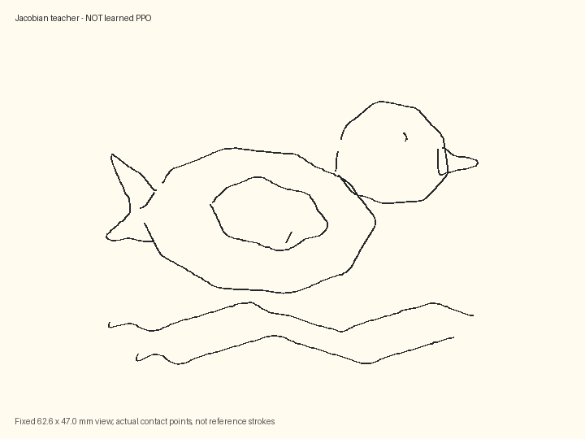
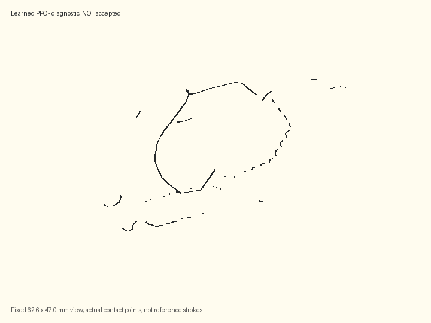
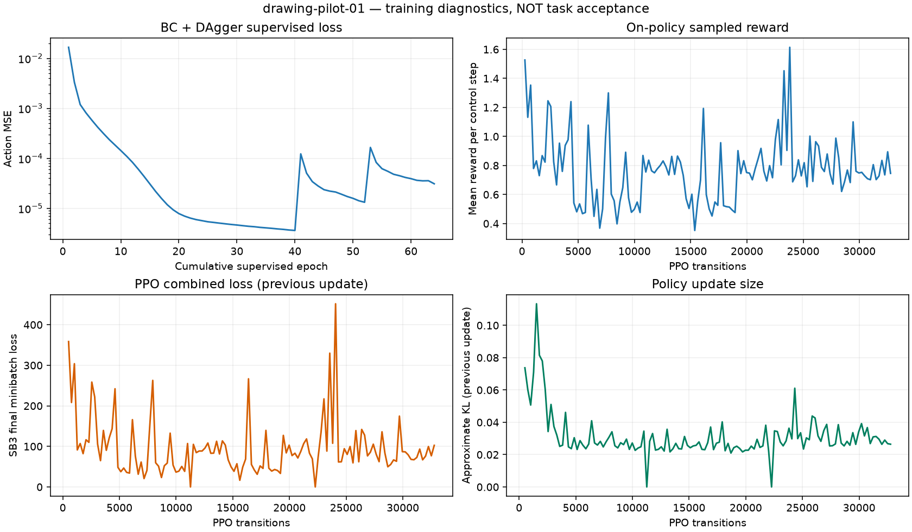
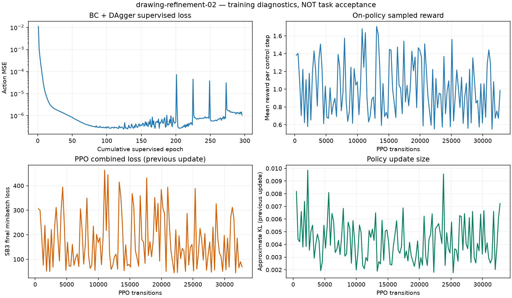

# 第八案例结果 / Drawing results

Author: George Hu · 2026-09-11

## 结论 / Conclusion

完整绘画案例、物料场景、数据生成、BC/DAgger/PPO 训练、独立 ONNX 导出、评估、视频和 Viewer 接口已经实现。
**学习策略尚未通过完整绘画验收。教师成功不能当作 PPO 成功。**

The complete simulation/training/evaluation pipeline exists. **Neither learned PPO trial is accepted.**
The Jacobian teacher establishes feasibility only; it is not a trained policy.

## 教师可行性 / Teacher feasibility

Full 32-second, unassisted, seed-4 rollout: coverage **100.00%**,
precision **100.00%**, symmetric Chamfer **0.159 mm**,
grasp retention **99.94%**, peak force **0.284 N**.
This is one nominal feasibility rollout, not generalization evidence or hardware validation.

## 两次真实训练 / Two actual training trials

Each trial performs **32,768 on-policy PPO transitions** after supervised warm-start;
total PPO transitions: **65,536**. Evaluations run the deterministic exported ONNX.
Case families: nominal, shifted target, 90% target scale, and reduced pad friction.
BC and PPO use matching evaluation seeds/configurations within each report.

| Run / controller | Accepted episodes | Mean coverage | Mean precision | Full episodes |
|---|---:|---:|---:|---:|
| drawing-pilot-01 / BC | 0/32 | 33.4% | 67.9% | 32/32 |
| drawing-pilot-01 / PPO | 0/32 | 15.9% | 40.3% | 0/32 |
| drawing-refinement-02 / BC | 0/32 | 67.2% | 86.8% | 8/32 |
| drawing-refinement-02 / PPO | 0/32 | 24.2% | 62.4% | 30/32 |

`pilot-01`: BC 40 epochs, 2 DAgger rounds, support curriculum 1 → 0.3 → 0.
`refinement-02`: BC 200 epochs, 4 DAgger rounds, spread teacher targets, no base support,
smaller PPO learning rate and exploration standard deviation. Exact settings/hashes are in [results.json](results.json).
Do not compare different seeds as a causal PPO improvement experiment. Both stored matched BC/PPO
comparisons decline in coverage; `ppo_improvement_claimed` remains false.

## 诊断 / Diagnosis

- **观察 / Observed:** the contact-only teacher completes the drawing; releasing the jaw drops the pencil.
- **观察 / Observed:** BC imitates local actions more accurately than the PPO refinements reproduce the whole drawing.
- **观察 / Observed:** both learned evaluations fail the strict full-episode geometry/contact/balance gates.
- **推断 / Inference:** behavior-cloning distribution shift and PPO exploration/update drift remain important risks.
  This is not a proven single root cause; the next experiment should compare a residual actor, pressure control,
  and conservative policy updates with matched seeds, while preserving the same acceptance rules.
- No target pixels, welds, hidden pencil attachments, or teacher actions are used during PPO evaluation.
  The pencil remains a free MuJoCo body; the old head collision meshes cannot clamp it.

## 文件与复现 / Evidence and reproduction

- [Chinese workflow](README.md) / [English workflow](README.en.md): BOM, exact commands, assumptions, algorithm and contracts.
- [Teacher video](teacher-render/rollout.mp4), [contact sheet](teacher-render/frame_sheet.png), [render report](teacher-render/render.json).
- Learned run artifacts: `rlx/runs/studio/drawing/drawing-pilot-01/` and `drawing-refinement-02/`.
- Each run includes datasets, provenance sidecars, BC/PPO checkpoints, ONNX, CSV training histories,
  reward/loss plots, source-bound evaluation and actual-contact render files.
- [Eight-case browser receipt](evidence/verification.json), [runtime versions](environment.json), [generated scene](scene.xml).
  Regenerate the scene after checkout: its mesh directory points to the current workspace.
- To regenerate this measured report and the README GIFs from existing artifacts:
  `PYTHONPATH=rlx:microduck_local/src rlx/.venv-microduck/bin/python docs/drawing-case/build_report.py`.

The GIFs are **4× time-compressed** versions of actual rollouts, not real-time robot motion.
Reference target artwork is [reference.svg](reference.svg); it is never substituted for the measured ink.
The separate `microduck-drawing-v1` 83/15 interface, preloaded pencil and stronger XML gains are
simulation assumptions. No stock-robot deployment, autonomous pickup, or physical material purchase is claimed.
