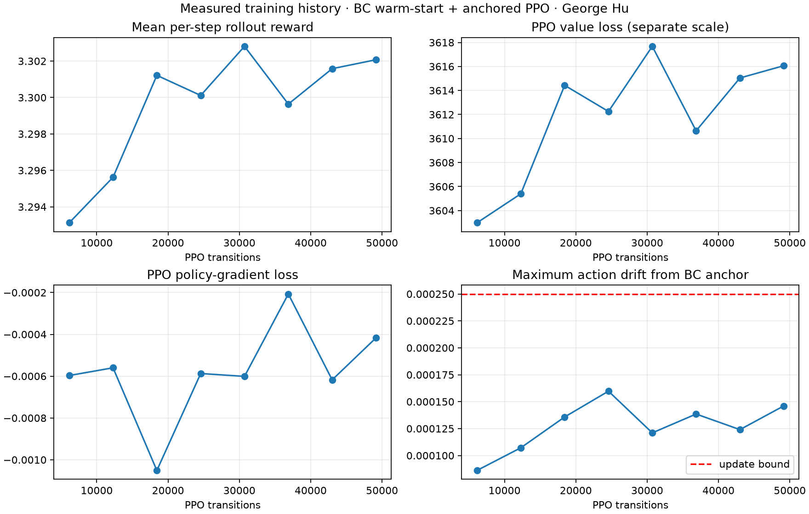
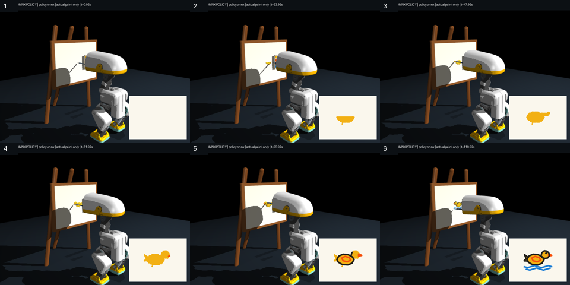

# 彩色画刷：实测结果 / Measured color-brush results

Author: George Hu · 2026-09-11

**发布模型 `brush-color-v2-03`：独立 ONNX 验收 40/40 通过。**
固定游泳鸭模板，十组不同场景各四个初始种子；包括组合位置/大小/摩擦/柔软度扰动。
这是学习到的运动反馈控制器 + PPO，不是学习视觉理解或任意构图。

| 指标 / Metric | BC + DAgger | BC + DAgger + PPO |
|---|---:|---:|
| 通过回合 / Accepted | 40/40 | 40/40 |
| 平均覆盖率 / Coverage | 100.0000% | 100.0000% |
| 平均精度 / Precision | 99.9635% | 99.9532% |
| 最大笔尖/调色盘法向力 / Peak force | 0.044889 N | 0.040318 N |
| 最大毛束压缩 / Peak compression | 2.3075 mm | 1.5518 mm |

每个回合约 119.96 秒；颜色分别是金黄、橙、深灰和蓝。
PPO 运行 49,152 个真实 on-policy transition，8 次更新满足预设漂移上限。
**BC 基线本身已能绘画；这些数据不支持“PPO 比 BC 更好”的因果结论。**
所谓 accepted update 只代表通过动作漂移约束，不代表画质提高。

## 验收 / Acceptance

- 每种颜色覆盖率、精度均至少 95%，曲线距离容差 1.5 mm；完整回合，不摔倒、不掉笔。
- 双喙夹持比例 ≥90%；笔尖/调色盘最大法向力 <0.5 N；毛束最大压缩 <3.5 mm；抬笔漏画 <5%。
- 四种颜料须按计划通过真实接触依次取得；空动作和张嘴对照不能通过。
- 评估一次性读取 immutable ONNX bytes；环境、reference、actor、base source 与归档训练 pipeline 均有 SHA-256 门禁。
- 当前 evaluator 可与训练 pipeline 不同；归档训练脚本必须匹配内嵌 hash，报告以 `training_pipeline_source_match` 明示差异。
- 最终录像来自同一 ONNX：`6e083a2a1a0e3114016be9ef0d377d9e9245648ca174303c5f8d0340bdf4500e`，没有运行时教师控制器。

## 训练尝试与边界 / Trials and limits

`brush-color-v2-01` 是初步成功模型，20/20 小范围测试通过；其 ONNX 动态宽度注记被 Lab 严格接口拒绝，故不作为发布模型。
`brush-color-v2-02` 改用教师数据种子 101 后，BC 验证失败，未提升为成功示例。
发布模型使用教师数据种子 11、训练种子 101；这显示训练仍有种子敏感性，不能声称任意重训都保证成功。
三个 run 的训练与诊断保留在 `rlx/runs/studio/drawing/`，不删除失败实验。
训练改善同时更改了工具、动作表示和数据流程，不能把所有改善单独归因于柔软画刷或 PPO。
当前 actor 追踪预编排的笔画/取色目标，不学习视觉规划，也不具备错过蘸色后的自主重规划。
毛束是一个被动弹簧接触近似，装饰毛丝不是逐根柔性有限元；不模拟颜料流体或混色。
画刷预装在嘴中，不包含自主拾取、清洗或真实硬件验证。

## 文件 / Files

- [中文复现](README.md) · [English workflow](README.en.md) · [旧 PPO 失败诊断](DIAGNOSIS.md)
- [完整实时视频](media/rollout.mp4) · [4× GIF](media/brush.gif) · [原始接触 CSV](media/raw_trace.csv)
- [最终评估](eval.json) · [匹配 BC 基线](bc-eval.json) · [训练记录](training.json) · [结果数据](results.json)
- [Studio API 验证](evidence/workflow.json)

English summary: the released learned controller passes the fixed-template colored-duck benchmark.
Painting pixels come only from physical brush contact after physical palette loading. The matched BC baseline
already succeeds; PPO completed genuine on-policy updates but is not claimed to improve painting quality.
This is a simulation-only motor-control result, not arbitrary image generation or hardware certification.
