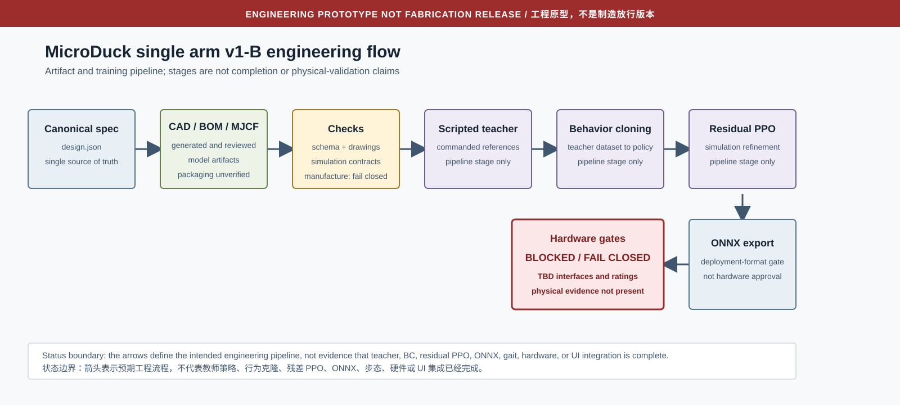

# MicroDuck single arm v1-B engineering package

> **ENGINEERING PROTOTYPE NOT FABRICATION RELEASE**  
> **工程原型，不是制造放行版本**

This package documents one five-actuator arm cartridge: four pose axes plus one
rotary geared gripper. It provides editable OpenSCAD, review drawings, a
logical electrical netlist, a bilingual BOM, a commanded test SOP, and a
fail-closed acceptance record.

本文件包描述一个五执行器单臂卡匣：四个姿态轴加一个旋转齿轮夹爪。内容包括
可编辑 OpenSCAD、评审图、电气逻辑网表、双语 BOM、指令式测试 SOP 和默认
失败关闭的验收记录。

## Design boundary / 设计边界

- Nominal axes: shoulder-elbow 55 mm, elbow-wrist 50 mm, wrist-TCP 30 mm.
- Five `XL330-M288-T` candidates at 18 g each.
- Motor envelope `20 x 34 x 26 mm` is clearance-only. The available visual
  mesh is about 29 mm deep and is not a manufacturing interface.
- The gripper uses two equal external gears at local `y = +/-12 mm`, ratio
  `-1`, with 30 mm rotary jaws about parallel +Z axes. Left joint range is
  `[-0.32, 0] rad`; right is `[0, 0.32] rad`; `right = -left`.
- Central trunk mount target is 20 g; complete arm cartridge target is 160 g.
  Both are unverified design targets.
- Servo/horn holes, gear tooth form, bearings, fasteners, tolerances, cable
  exits, and base attachment are intentionally absent.
- Motor envelopes follow the canonical local body-frame centers. Gripper motor
  center is `[7, 0, 22] mm` above the hand frame; wrist motor center is
  `[25, 0, 20] mm` in the forearm frame. Overall packaging, interference,
  cable routing, and table clearance remain unverified.

- 标称轴距：肩肘 55 mm、肘腕 50 mm、腕部到 TCP 30 mm。
- 五颗 `XL330-M288-T` 候选电机，每颗 18 g。
- `20 x 34 x 26 mm` 仅是间隙包络。现有可视网格深度约 29 mm，不是制造接口。
- 夹爪为两只等尺寸外啮合齿轮，本地中心位于 `y = +/-12 mm`，传动比 `-1`，
  30 mm 旋转夹指绕平行 +Z 轴运动。左关节范围 `[-0.32, 0] rad`，右关节范围
  `[0, 0.32] rad`，并满足 `right = -left`；不使用理想滑块。
- 中央躯干安装件目标 20 g，完整手臂卡匣目标 160 g；两者均未验证。
- 舵机/舵盘孔、齿形、轴承、紧固件、公差、走线出口和根部连接均故意留空。
- 电机包络采用规格中的本体局部坐标。夹爪电机中心在手部坐标系
  `[7, 0, 22] mm`，腕部电机中心在前臂坐标系 `[25, 0, 20] mm`。总体包装、
  干涉、走线和桌面间隙均未验证。

## Canonical source / 唯一规格源

`hardware/microduck-arm-v1/spec/design.json` is owned by the design lead. The
generator reads it and rejects values inconsistent with v1-B. No duplicate
specification is stored in this documentation slice.

`hardware/microduck-arm-v1/spec/design.json` 由设计负责人维护。生成器读取该文件，
并拒绝与 v1-B 不一致的数值。本文件包不保存冲突的规格副本。

```bash
python3 hardware/microduck-arm-v1/cad/generate_engineering.py
python3 hardware/microduck-arm-v1/cad/generate_engineering.py --manufacture-check
```

The second command is expected to return nonzero until every TBD release gate
has objective evidence. A zero exit would require a separately reviewed future
revision.

第二条命令在所有 TBD 放行门槛获得客观证据前应返回非零。只有经过独立评审的
未来修订才可允许成功。

## Engineering and training flow / 工程与训练流程



The current engineering CLI regenerates the CAD parameters, mechanical and
electrical review drawings, netlist, and fail-closed manufacture record from
the canonical specification:

当前工程命令行从唯一规格重新生成 CAD 参数、机械和电气评审图、网表以及失败关闭的
制造检查记录：

```bash
python3 hardware/microduck-arm-v1/cad/generate_engineering.py
python3 hardware/microduck-arm-v1/cad/generate_engineering.py --manufacture-check
cd rlx
uv run --with pytest pytest -q tests/test_microduck_arm_v1_hardware.py
```

The intended downstream sequence is scripted teacher, behavior cloning,
residual PPO, ONNX export, and then independent hardware release gates. These
are pipeline stages, not claims of completed training or integration. The
leader-owned [English results](RESULTS.en.md) and
[Chinese results](RESULTS.zh-CN.md) are the status and evidence records when
present. This package does not claim completed gait, hardware operation, or UI
integration.

预期后续顺序为脚本教师、行为克隆、残差 PPO、ONNX 导出，再进入独立硬件放行门槛。
这些只是流程阶段，不表示训练或集成已经完成。负责人维护的
[英文结果](RESULTS.en.md) 和 [中文结果](RESULTS.zh-CN.md) 在文件存在时作为状态
和证据记录。本文件包不声明步态、硬件操作或 UI 集成已经完成。

## Build the bilingual engineering books / 构建双语工程书

```bash
bash docs/microduck-arm-v1/build-book.sh
```

The script requires installed `pandoc`, `xelatex`, and `rsvg-convert`. It
fails clearly until both leader-owned result files exist, then writes:

- `docs/microduck-arm-v1/MicroDuck-Arm-v1-B-Engineering.en.pdf`
- `docs/microduck-arm-v1/MicroDuck-Arm-v1-B-Engineering.zh-CN.pdf`

脚本需要已安装的 `pandoc`、`xelatex` 和 `rsvg-convert`。在两份负责人结果文件都
存在之前，脚本会明确失败；文件齐备后生成上述英文和中文 PDF。

## Modeling modes / 建模模式

**Fixed-root bench mode** is the only intended first physical integration:
the arm root is fixed to a separately verified bench fixture, with a low
workspace, catch provision, conservative software limits, and an accessible
power disconnect. This package does not design or approve that fixture.

**Floating mode** is a simulation assumption only. It may use provisional
mass placeholders to study system behavior, but it does not prove that a
MicroDuck can carry, power, balance, or safely control this arm. No attachment
to the original robot body or battery positive is approved.

**固定根部台架模式**是首个实体集成的唯一预期方式：手臂根部固定到另行验证的
台架夹具，采用低位工作区、承接措施、保守的软件限位和可触及的断电装置。本
文件包不设计也不批准该夹具。

**浮动模式**仅是仿真假设。可使用临时质量占位值研究系统行为，但不能证明
MicroDuck 能承载、供电、平衡或安全控制该手臂。禁止把手臂接到原机电池正极，
也未批准任何机身安装。

## Files / 文件

- `hardware/microduck-arm-v1/cad/microduck_arm_v1_b.scad`: editable concept.
- `hardware/microduck-arm-v1/cad/mechanical-dimensions.svg`: dimension review.
- `hardware/microduck-arm-v1/cad/mechanical-dimensions.pdf`: PDF export.
- `hardware/microduck-arm-v1/cad/manufacture-check.json`: fail-closed gates.
- `hardware/microduck-arm-v1/electrical/wiring.svg`: bench wiring concept.
- `hardware/microduck-arm-v1/electrical/wiring.pdf`: PDF export.
- `hardware/microduck-arm-v1/electrical/circuit.svg`: logical circuit boundary.
- `hardware/microduck-arm-v1/electrical/circuit.pdf`: PDF export.
- `hardware/microduck-arm-v1/electrical/netlist.json`: unresolved-safe netlist.
- `BOM.md`, `SOP.md`, `HARDWARE-ACCEPTANCE.md`: bilingual controlled records.
- `engineering-flow.svg`: intended pipeline with the hardware gate blocked.
- `build-book.sh`: English/Chinese PDF book builder; requires leader results.

Official references used for candidate identity and connector semantics:

- ROBOTIS XL330-M288-T e-Manual:
  `https://emanual.robotis.com/docs/en/dxl/x/xl330-m288/`
- ROBOTIS U2D2 e-Manual:
  `https://emanual.robotis.com/docs/en/parts/interface/u2d2/`

These references do not release the project-specific mechanical or electrical
interfaces.
