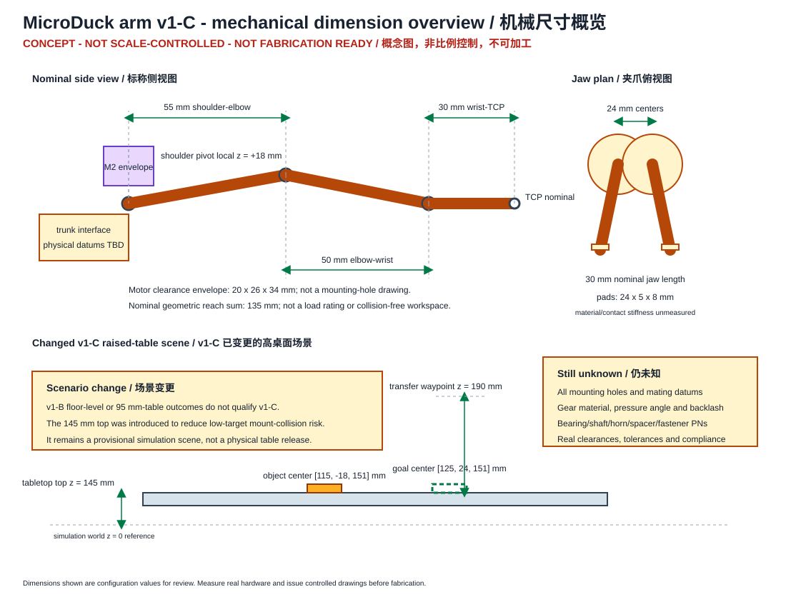
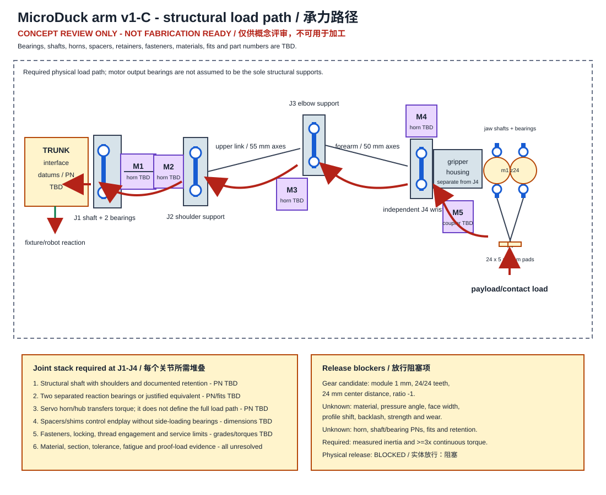
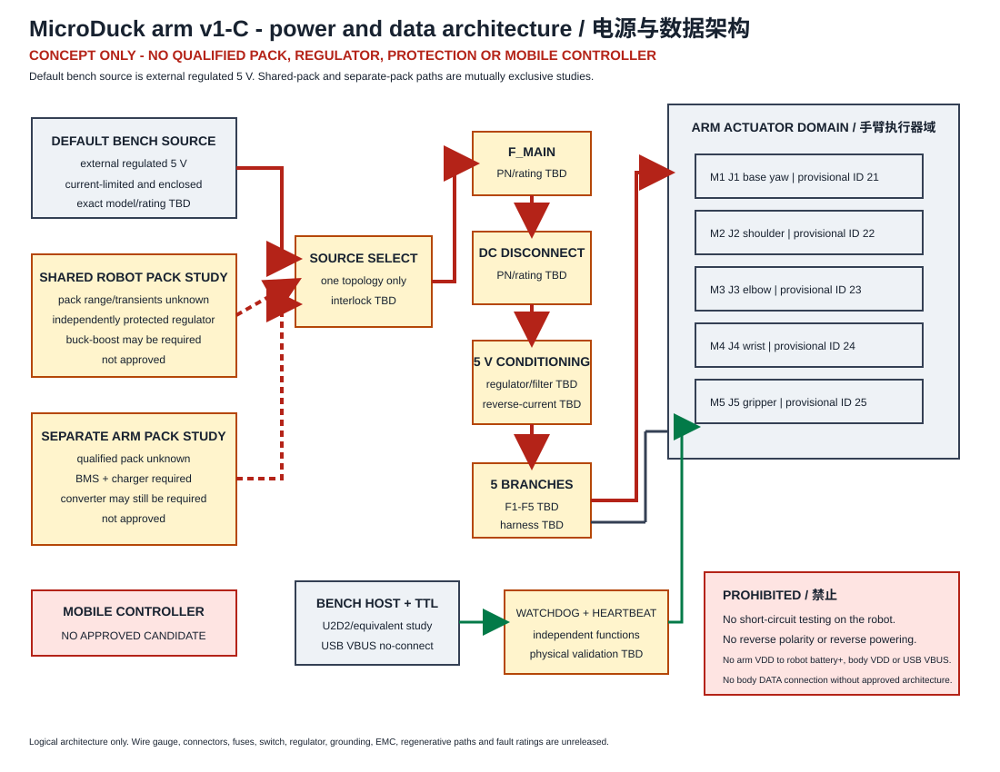

# 放行声明

> **工程配置基线 - 不可用于加工**

本文定义 MicroDuck 单臂 v1-C 卡匣的评审基线。它不是制造图纸、电气放行文件、
合格电源架构、移动控制器设计、安全认证，也不是已完成实体测试的记录。

本基线按失败关闭原则处理：

- 加工放行：**阻塞**；
- 带电台架放行：**等待分阶段授权，当前阻塞**；
- 机器人/移动放行：**阻塞**；
- 实体评估：**未执行**；
- 候选 A/B 资格对比：**未执行**。

实际结果必须写入由负责人维护的独立文件 `RESULTS.zh-CN.md`。缺失结果、空证据栏、
仿真结果、估算值或 v1-B 结果都不能转化为 v1-C 通过结论。

# 1. 权威来源与追溯

当前配置源为 `hardware/microduck-arm-v1c/spec/design.json`。配置校验、环境、
模型适配和安全状态模型分别位于：

- `microduck_arm_v1c/config.py`；
- `microduck_arm_v1c/env.py`；
- `microduck_arm_v1c/model.py`；
- `microduck_arm_v1c/safety.py`。

供应商资料的下载状态和哈希记录在
`hardware/microduck-arm-v1c/vendor/SOURCE-MANIFEST.md`。保留的 Pololu
D24V60F5/D24V90F5 几何文件仅供参考，不代表变换器或项目集成已经批准。ROBOTIS
图纸链接虽已定位，但返回的是下载落地页 HTML，因此没有把错误文件保留为图纸。

旧目录 `docs/microduck-arm-v1/` 仅作为 v1-B 参考。v1-C 只在当前规格明确说明时
继承标称运动学长度和旧仿真几何，不继承 v1-B 的评估结果、放行状态、旧地面场景
成功记录或旧供电决定。

官方候选资料：

- <https://emanual.robotis.com/docs/en/dxl/x/xl330-m288/>
- <https://emanual.robotis.com/docs/en/dxl/x/xl330-m077/>
- <https://www.pololu.com/product/2866/resources>
- <https://mujoco.readthedocs.io/en/stable/XMLreference.html>

# 2. v1-C 配置

## 2.1 形态与控制契约

机器人模型包含 10 个腿部关节和 5 个手臂执行器。手臂为 4 个姿态关节加 1 个夹爪
执行器：

| 关节 | 功能 | 动作索引 | 临时总线 ID |
| --- | --- | ---:| ---:|
| J1 / M1 | 根部偏航 | 10 | 21 |
| J2 / M2 | 肩部俯仰 | 11 | 22 |
| J3 / M3 | 肘部俯仰 | 12 | 23 |
| J4 / M4 | 腕部俯仰 | 13 | 24 |
| J5 / M5 | 夹爪驱动 | 14 | 25 |

ID `21-25` 只是配置占位。实际 ID、实体针脚映射、固件、执行器身份和标定均未验证。
本基线没有实现或批准真实电机 I/O。

仿真控制周期为 20 ms，物理步长为 2 ms。手臂关节变化率筛选限制为
`0.4 rad/s`，腿部为 `6 rad/s`。这些只是仿真筛选值，不是合格的硬件速度或加速度
限制。

## 2.2 候选配置

| 候选 | M1 | M2 | M3 | M4 | M5 | 电机质量 |
| --- | --- | --- | --- | --- | --- | ---:|
| A，默认但待资格验证 | M288 | M288 | M288 | M288 | M288 | 5 x 18 g |
| B，研究候选 | M288 | M288 | M288 | M077 | M077 | 5 x 18 g |

两种候选电机的文件质量均为 18 g：

| 候选电机 | 减速比 | 5 V 堵转力矩 | 5 V 空载转速 | 持续额定值 |
| --- | ---:| ---:| ---:| --- |
| XL330-M288-T | 288.4 | 0.52 N m | 103 rpm | 未知 |
| XL330-M077-T | 77.5 | 0.215 N m | 383 rpm | 未知 |

堵转力矩和空载转速不是持续工作点。不能因为质量相同或减速比不同，就自动判定候选 B
在能耗、输出惯量、回驱、跟踪或抗扰方面更优。放行需要输出端惯量与回驱实测、匹配
任务的能耗和温升试验、合格持续力矩-速度包络，以及 A/B 跟踪与扰动对比。

# 3. 几何与已变更任务场景



标称评审几何：

| 参数 | 基线值 | 放行含义 |
| --- | ---:| --- |
| 肩到肘 | 55 mm | 仅为运动学轴距 |
| 肘到腕 | 50 mm | 仅为运动学轴距 |
| 腕到 TCP | 30 mm | 仅为运动学距离 |
| 几何长度总和 | 135 mm | 不是额定力臂或无碰撞工作区 |
| 肩部转轴 | 本地 `[0, 0, 18]` mm | v1-C 变更，与肩电机包络中心对齐 |
| 电机间隙包络 | 20 x 26 x 34 mm | 不是安装图 |
| 夹爪转轴间距 | 总计 24 mm | 仅为齿轮中心候选 |
| 夹指长度 | 标称 30 mm | 实际截面和安装待定 |
| 建模接触垫 | 24 x 5 x 8 mm | 实物属性未测 |

当前任务场景为 `raised_tabletop_v1_c`：

- 桌面顶面：`z = 145 mm`；
- 物体半高：`6 mm`；
- 物体初始中心：`[115, -18, 151] mm`；
- 目标中心：`[125, 24, 151] mm`；
- 转移路径点高度：`z = 190 mm`。

这是一个已变更场景。早期 95 mm 桌面或地面级布置使目标过低并增加安装件碰撞风险。
145 mm 高桌面仍只是临时仿真场景，不是已放行的实体桌面、夹具或间隙结论。

矩形接触垫在 MuJoCo 中使用半尺寸 `[12, 2.5, 4] mm`，仿真接触参数为
`solref=".004 1"` 和 `solimp=".95 .99 .001"`。这些参数不能代表真实弹性体、
硬度、摩擦系数、压缩曲线、接触刚度、粘接方式、寿命或夹持额定值。

# 4. 机械架构与真实承力路径



要求的实体承力路径为：

**载荷 -> 接触垫 -> 刚性夹指 -> 夹指轴 -> 夹指轴承 -> 夹爪壳体 -> 独立腕轴与
腕轴承 -> 前臂 -> 肘轴与轴承 -> 上臂连杆 -> 肩轴与轴承 -> 根部偏航轴与轴承 ->
躯干接口 -> 夹具或机器人结构。**

电机输出花键和舵盘只负责把执行器扭矩传入此路径。除非厂家明确批准对应实测外载，
不得把电机输出轴承当作完整的径向、轴向、弯曲或倾覆支撑。

## 4.1 放行前必须定义的关节硬件

J1-J4 每个组件都必须形成受控定义：

- 结构轴的材料、直径、轴肩、跳动和疲劳；
- 两平面径向/轴向支撑，或有充分论证的等效方案；
- 轴承厂家型号、静/动额定值、配合、预紧/游隙、润滑和防污染；
- 舵盘/轮毂准确型号、花键身份、定位台、孔距、中心螺钉、允许扭矩和配合；
- 控制轴向堆叠且不会给轴承施加异常侧载的隔套或垫片；
- 轴端挡圈、螺母、卡簧、螺纹、锁止方式和拔脱证据；
- 支架和连杆材料、工艺、截面、公差和证明载荷；
- 结构紧固件型号、等级、长度、啮合长度、拧紧扭矩、锁固、见证标记、工具空间和
  重复使用规则；
- 线缆通道、弯曲半径、应力释放、弯折寿命和全行程间隙。

上述零件型号目前全部为 `TBD`。不得依据电机包络或旧可视网格推断孔位和配合面。

## 4.2 独立腕部与夹指传动

腕部是独立结构关节。J4 需要独立轴、轴承对、承载件、舵盘接口和轴向保持。夹爪壳体
安装在腕部输出端。

夹爪是另一套独立机构。M5 通过明确的舵盘/联轴器/传动驱动一根夹指轴，第二根夹指轴
为从动轴，由等尺寸外啮合齿轮驱动。两根夹指轴都需要独立支撑和保持。设计不得默认
把腕轴、主动夹指轴和从动夹指轴合并为一根未定义轴。

## 4.3 齿轮定义

当前运动学候选为：

- 模数：`1 mm`；
- 主动齿轮：`24 齿`；
- 从动齿轮：`24 齿`；
- 标称中心距：
  `m(z1 + z2)/2 = 1 mm(24 + 24)/2 = 24 mm`；
- 传动比：`-1`；
- 左侧主动夹指范围：`[-0.32, 0] rad`；
- 从动夹指：等角度、反方向旋转。

这不是齿轮放行。材料、压力角、齿宽、变位、齿根圆角、精度等级、回差、中心距公差、
润滑、磨损、允许齿载、轮毂几何、轴配合、保持、防护和碎屑行为均未知。完成这些定义
以及实体循环/载荷证据前，机构保持阻塞。

# 5. 工程 BOM 与质量基线

受控逐项 BOM 为 `ENGINEERING-BOM.csv`。其中对电机、连杆、支架、轴承、轴、舵盘、
隔套、保持件、紧固件、独立腕部零件、夹指传动、齿轮、夹指、接触垫、线束、控制器、
电源和安全硬件记录 ID、数量、功能、候选、修订、质量、重心、接口、状态、所需证据、
责任人和门槛。

## 5.1 修正后的质量目标

| 分类 | 目标或估算 |
| --- | ---:|
| 五颗电机 | 90 g |
| 连杆 | 20 g |
| 支架 | 10 g |
| 夹爪 | 10 g |
| 躯干接口 | 10 g |
| 线束和紧固件 | 10 g |
| 余量 | 10 g |
| **受控总质量** | **160 g** |

用户给出的分类预算合计为 170 g；受控 v1-C 目标修正为 160 g。放行时必须有不超过
160 g 的完整实装质量账。不得用负余量或遗漏零件掩盖超重。

从 v1-B 继承的 70 g 电子件、80 g 独立电池、25 g 电源/通信和 8 g 传感器壳体只是
卡匣外部的仿真占位，不是已采购零件或实测包装。

## 5.2 惯量估算

下表是当前规格中的长方体本体坐标系对角惯量估算，不是实测主惯量，也不是已放行的
整机惯量模型。

| 部件 | 质量 | 包络尺寸 (m) | 对角惯量估算 `(Ixx, Iyy, Izz)` kg m2 |
| --- | ---:| --- | --- |
| M1 | 0.018 kg | 0.020 x 0.026 x 0.034 | `(2.748e-6, 2.334e-6, 1.614e-6)` |
| M2 | 0.018 kg | 0.020 x 0.026 x 0.034 | `(2.748e-6, 2.334e-6, 1.614e-6)` |
| M3 | 0.018 kg | 0.020 x 0.026 x 0.034 | `(2.748e-6, 2.334e-6, 1.614e-6)` |
| M4 | 0.018 kg | 0.020 x 0.026 x 0.034 | `(2.748e-6, 2.334e-6, 1.614e-6)` |
| M5 | 0.018 kg | 0.020 x 0.026 x 0.034 | `(2.748e-6, 2.334e-6, 1.614e-6)` |
| 连杆 | 0.020 kg | 0.090 x 0.012 x 0.008 | `(3.46667e-7, 1.3606667e-5, 1.374e-5)` |
| 支架 | 0.010 kg | 0.050 x 0.040 x 0.012 | `(1.453333e-6, 2.203333e-6, 3.416667e-6)` |
| 夹爪 | 0.010 kg | 0.040 x 0.030 x 0.020 | `(1.083333e-6, 1.666667e-6, 2.083333e-6)` |
| 接口 | 0.010 kg | 0.040 x 0.030 x 0.008 | `(8.03333e-7, 1.386667e-6, 2.083333e-6)` |
| 线束/紧固件 | 0.010 kg | 0.080 x 0.020 x 0.010 | `(4.16667e-7, 5.416667e-6, 5.666667e-6)` |
| 余量 | 0.010 kg | 无 | 无惯量估算 |

主惯量放行门槛当前明确为失败。进入 S6 前必须称量完整组件、至少用三个姿态测量重心、
记录每个部件姿态，并在带不确定度的条件下推导或测量整机惯量。

# 6. 载荷、力矩与结构余量

每个关节按下式计算：

```text
tau_g,j = sum_i(m_i * g * 第i个远端部件相对关节j的水平力臂)
tau_required_continuous,j >= 3 * max_released_pose(tau_g,j)
```

结构和执行器评审还必须计入加速度、反射惯量、接触载荷、线缆力、摩擦、回差冲击、
扰动和热占空比。3 倍系数是最低持续力矩门槛，不能把堵转力矩简单除以三后当作持续
能力。

一个刻意保守的边界是假设 160 g 卡匣和 20 g 载荷全部位于 135 mm 几何末端：

```text
3 * 0.18 kg * 9.80665 m/s2 * 0.135 m = 0.715 N m
```

由于真实质量是分布的，该数值不是实际肩部需求；但它说明两个候选都缺少放行证据：
M288 的文件值是 0.52 N m 堵转力矩，M077 为 0.215 N m，持续额定值未知。仿真的
`0.1 N m` 力矩限制同样只是筛选假设。

# 7. 电源、接线与控制器架构



## 7.1 台架默认方案

默认资格测试使用外部稳压 5 V 台式电源，并配有限流、封闭外壳、校准测量、主保护、
手动直流额定断电器和逐支路评审。当前没有选定电源、保险丝、连接器、导线、开关或
支路保护的准确型号。

## 7.2 共用主电池研究方案

共用机器人主电池只能通过独立保护的变换器开展研究。机器人电池的最低/最高电压、
瞬态、负载阶跃和再生行为未知，因此可能需要升降压变换器；不能依据标称电压默认
只需降压。

已保留的 Pololu D24V60F5/D24V90F5 机械文件只是供应商参考，不代表其输入范围、
电流、温升、动态、安装或反向电流行为已适用于本机器人。

## 7.3 独立电池研究方案

独立手臂电池仍取决于准确的化学体系、串数、容量、故障电流、BMS、充电器、外壳、
连接器、运输控制、续航、温升、变换器和再生保护。当前没有合格电池包。

## 7.4 禁止连接和操作

- 禁止故意短接电源，也不得在机器人上执行短路测试。
- 禁止反接极性。
- 禁止把手臂 VDD 接到机器人电池正极、机身 VDD 或 USB VBUS。
- 禁止手臂电源或 USB 接口反向给机器人供电。
- 未经批准架构，禁止把手臂 DATA 接到机身执行器总线。
- U2D2 能枚举不代表能够给执行器供电。

当前没有批准的移动控制器。U2D2 或等效设备仅作为台架通信研究候选。

# 8. 安全与控制门槛

当前安全代码是无设备 I/O 的确定性仿真/HIL 状态模型，包含：

- 100 ms 指令时限；
- 独立的 100 ms 软件心跳时限；
- 单调序号和时间戳检查；
- 重放检测；
- E-stop、过流和欠压锁存故障；
- 失败关闭的运动权限。

重复读取或心跳流量不能刷新过期指令。总线看门狗只请求停止，不保证扭矩切除。实体
急停、电源隔离、接触器/断电器行为、故障检测和真实执行器停止时间均未验证。

手臂模型采用 v1-C 的 15 动作、64 观测契约。当前没有批准的移动控制器实现实体映射。
硬件软件必须保持确定的 J1-M1 至 J5-M5 映射、真实唯一 ID、关节方向和零位标定、
变化率/电流/温度限制、看门狗、心跳以及明确的使能/解除/复位状态。

# 9. 分阶段硬件验收

完整双语指令流程见 `HARDWARE-SOP.md`，逐单元计划矩阵见 `TEST-MATRIX.csv`。

| 阶段 | 范围 | 当前状态 |
| --- | --- | --- |
| S0 | 配置与证据审计 | 未执行 |
| S1 | 断电机械/承力路径检查 | 未执行 |
| S2 | 隔离电源域资格验证 | 未执行 |
| S3 | 扭矩关闭通信与安全逻辑 | 未执行 |
| S4 | 固定根部单轴动态运动 | 阻塞 |
| S5 | 固定根部协调运动与载荷阶梯 | 阻塞 |
| S6 | 受约束整机扰动/故障测试与移动决策 | 阻塞 |

载荷等级为 P0、P5、P10、P20、P30、P40 和 P50，单位为克。P0-P10 是调试点，
P20 是原地载荷目标。P30-P50 是可选工程过载点，不是额定值；必须另行授权，若不安全
可以取消。

进入下一阶段或载荷等级，必须有前一项可追溯测量和经评审的通过结论。当前没有任何
矩阵单元通过。v1-B 结果和当前仿真运行不能填入实体证据单元。

# 10. 放行门槛

在责任人关闭所有适用项之前，加工、带电台架运动和移动集成保持阻塞：

1. 实体机器人清单和准确执行器型号。
2. 官方配合几何、实测、配合样件和受控图纸。
3. 完整轴、轴承、舵盘、隔套、保持件、紧固件、支架和连杆定义，以及结构计算和
   证明载荷。
4. 独立腕部和夹指传动放行。
5. 齿轮材料、压力角、齿宽、回差、强度、磨损、保持和防护。
6. 接触垫实测尺寸、材料、摩擦、柔顺性/接触刚度、保持和磨损。
7. 不超过 160 g 的闭合质量账、实测重心和实测或验证后的完整惯量。
8. 满足 3 倍门槛的合格持续力矩-速度-温升包络。
9. 候选 A/B 的跟踪、能耗、温升、回驱和抗扰对比。
10. 合格电源/电池、适用时的 BMS/充电器、变换器、反向电流行为、保险丝、断电器、
    连接器、导线、接地以及瞬态/温升证据。
11. 实体唯一总线 ID 的映射和标定；临时 ID 不算证据。
12. 独立看门狗、软件心跳、实体急停、复位和真实停止响应验证。
13. 已选定并完成评审的移动控制器。
14. 传感器/估计器延迟、连接柔度、动态平衡、碰撞、掉落、倾倒和人员接近验证。

# 11. 停止条件

本基线的完成标准是能够支持工程评审，同时不暗示加工或测试成功。它有意停止在零件
选型、加工、接线、带电运动和移动放行之前。后续权威记录应包括受控图纸、已选零件
证据、完成的 S/P 测试记录和由负责人维护的结果文件。
