## 阅读范围与安全说明

Microduck 是一台约 25 cm、约 800 g 的双足机器人。机载 Radxa Zero 3W 使用
RK3566 SoC，运行多个 Rust 守护进程。`robotd` 以 50 Hz 读取 IMU 与关节，执行
ONNX 策略，并控制同一 Dynamixel 总线上的 15 个舵机。

本书以 `microduck/` 当前源码和设计文档为依据。它面向三类读者：

* 希望理解机器人软硬件分层的学生
* 需要修改守护进程、策略加载或通信协议的开发者
* 负责部署、升级、恢复和现场诊断的维护者

> [!WARNING]
> 机器人会运动、跌倒并夹伤手指。开发时先架空或可靠支撑机器人，清空运动区，
> 保持本地停止手段可用。不要让远程、蓝牙或实验代码直接写舵机总线。
> `robotd` 必须保持唯一总线写入者和最终安全裁决者。

默认源码目录：

```text
/Volumes/ExternalSSD/geoagent/microduck-lab/microduck
```

本书不把设计文档中的未来方向冒充已经交付的功能。每次准备上机前，都应查看
`docs/project/roadmap.md` 和当前 release，而不是只依赖本书日期。

## 第一篇 系统全景

### 第 1 章 机器人由什么组成

Microduck 的关键硬件如下：

| 子系统 | 组成 | 软件所有者 |
|---|---|---|
| 计算 | Radxa Zero 3W、RK3566、aarch64 Linux | systemd 和各守护进程 |
| 运动 | 15 个 Dynamixel XL330 类舵机 | `robotd` |
| 姿态 | `imu_to_dxl` v2，设备 ID 200 | `robotd` |
| 深度 | VL53L5CX 或 VL53L8CX，8×8 ToF | `tofd` |
| 视觉 | 头部相机、Rockchip ISP、MPP H.264 | `mediad` |
| 音频 | 麦克风、扬声器、板载 codec | `mediad`、`robotd`、`sounds` |
| 本地输入 | USB/BLE 游戏手柄 | `padd` 与 `configd` |
| 网络 | Wi-Fi、BLE、WebRTC | `configd`、`btd`、`mediad` |
| 电源 | NP-F550 2S 电池，软件估算 6.6–8.2 V | `robotd` 遥测与关机流程 |

一个容易混淆的事实：机器人有 15 个实体关节，但策略输出 14 个动作。嘴部位于
关节数组索引 9，不属于强化学习动作，由鸣叫、合唱或 theremin 等独立逻辑控制。

### 第 2 章 七守护进程架构



系统通过进程边界隔离实时控制、恢复路径、媒体和传感器故障。

| 服务 | 主要职责 | 关键接口 |
|---|---|---|
| `robotd` | 50 Hz 控制、策略、总线、安全、健康 | `/run/robotd.sock` |
| `configd` | Wi-Fi、身份、PIN、手柄配对、关机 | `/run/configd.sock` |
| `updaterd` | 下载、验证、安装、健康门控、回滚 | `/run/updaterd.sock` |
| `btd` | BLE GATT 到共享 API 的子集适配 | BLE GATT |
| `padd` | 游戏手柄输入转成机器人意图 | `/run/padd/pad.sock` 和 `robotd` |
| `mediad` | 相机、麦克风、WebRTC 和网页控制台 | TCP 8080、8443 |
| `tofd` | 发布 8×8 深度矩阵 | `/run/tofd/tof.sock` |

三个架构不变量：

1. `robotd` 是唯一能写运动总线的进程
2. `configd`、`updaterd` 和 `btd` 在 `robotd` 损坏时仍应可用于恢复
3. `robotd` 控制循环不得同步等待其他服务

客户端发送的是意图，例如速度、视线、坐下或技能，而不是舵机角度。即使网络端
错误、卡顿或发送恶意值，安全层仍有机会拒绝。

### 第 3 章 Rust workspace 与 crate 地图

工作区使用 Rust 2024 edition，最低 Rust 1.89。根 `Cargo.toml` 包含 19 个成员。

守护进程 crate：

```text
robotd      updater      configd      btd
padd        mediad       tof
```

核心库：

```text
duck-control       运动总线、IMU、观测、策略、安全
duck-ipc-proto     JSON-RPC 共享类型
kinematics         MJCF 模型与正运动学
odometry           足接触与 IMU 里程计
sounds             声音合成、音色与乐谱
pet-detect         头部抓挠检测 CNN
robotd-params      robotd 启动参数 schema
```

工具：

```text
robotctl           机载 CLI 与 monitor
duckctl            笔记本 BLE 客户端，不部署到机器人
xtask              package、sign、promote
test-support       签名 release 测试夹具
```

查看 workspace 元数据：

```bash
cd /Volumes/ExternalSSD/geoagent/microduck-lab/microduck
cargo metadata --no-deps --format-version 1 > /tmp/microduck-metadata.json
python3 - <<'PY'
import json
meta = json.load(open('/tmp/microduck-metadata.json'))
for package in sorted(meta['packages'], key=lambda value: value['name']):
    print(package['name'], package['version'])
PY
```

## 第二篇 控制核心

### 第 4 章 关节、设备 ID 与总线

`duck-control/src/model.rs` 定义 15 个关节：

```text
索引  设备 ID  关节
0     20       left_hip_yaw
1     21       left_hip_roll
2     22       left_hip_pitch
3     23       left_knee
4     24       left_ankle
5     30       neck_pitch
6     31       head_pitch
7     32       head_yaw
8     33       head_roll
9     34       mouth
10    10       right_hip_yaw
11    11       right_hip_roll
12    12       right_hip_pitch
13    13       right_knee
14    14       right_ankle
```

IMU 板使用 ID 200。全部设备共享 `/dev/ttyS2` 上的 1 Mbps Dynamixel Protocol 2
总线。`robotd` 使用排他打开，避免两个进程同时发送数据包。

一个控制周期使用同步读取和同步写入，而不是逐个舵机请求。若每台设备保留过长的
返回延迟，16 个设备会把周期预算消耗掉，因此真实配置将 return delay 调低。

检查模型常量：

```bash
rg 'NUM_JOINTS|JOINT_IDS|IMU_ID|ttyS2' duck-control robotd
```

### 第 5 章 50 Hz 控制循环



周期为 20 ms，采用 missed-tick skip 语义。核心步骤是：

1. `read`：一次事务读取 IMU 和 15 个舵机
2. `observe`：构造 61 维策略观测
3. `decide`：处理意图、选择策略并执行 ONNX
4. `safety.apply`：拒绝非有限值并限制目标
5. `write`：同步写入 15 个目标位置
6. `publish`：更新健康状态，按需推送状态帧

循环伪代码：

```rust
let mut interval = tokio::time::interval(Duration::from_millis(20));
interval.set_missed_tick_behavior(MissedTickBehavior::Skip);

loop {
    interval.tick().await;
    let sensors = bus.read_all()?;
    let observation = Observation::build(&sensors, &command);
    let action = scheduler.infer(&observation)?;
    let proposed = model.targets_from_action(action, mouth_target);
    let safe = safety.apply(&sensors, proposed)?;
    bus.write_targets(&safe)?;
    state.publish(&sensors, &safe);
}
```

实际类型和错误处理以 `robotd/src/main.rs` 与 `duck-control` 为准。循环内不应新增
网络请求、文件读取、相机帧复制或阻塞锁。

### 第 6 章 总线丢包与过期观测

一次总线事务偶尔失败并不等于所有执行器失控。当前设计允许最多连续三个 tick
沿用最后有效观测，约 60 ms；超过范围后保持静止。

设计权衡：

* 第一次失败立即断力矩可能让机器人直接摔倒
* 无限使用旧观测会让策略在盲态继续运动
* 三个 tick 是短暂通信抖动与可接受数据年龄之间的边界

开发测试应覆盖：

```text
成功 -> 失败 -> 成功             继续并恢复
成功 -> 连续 3 次失败            仅短暂沿用旧观测
成功 -> 超过容许次数失败         停止或保持安全姿态
写事务失败                       不伪造“已执行”状态
```

### 第 7 章 61 维观测契约



观测切片：

| 索引 | 长度 | 内容 |
|---|---:|---|
| 0:3 | 3 | 躯干坐标系角速度，rad/s |
| 3:6 | 3 | 投影重力方向 |
| 6:20 | 14 | 相对 home 的关节位置，不含 mouth |
| 20:34 | 14 | 关节速度，不含 mouth |
| 34:48 | 14 | 上一次策略动作 |
| 48:51 | 3 | 期望 $v_x$、$v_y$、$\omega_z$ |
| 51:55 | 4 | 颈部与头部目标 |
| 55:57 | 2 | 身体 x、y，当前保持未绑定值 |
| 57 | 1 | 身体 z |
| 58:60 | 2 | 身体 roll、pitch |
| 60 | 1 | yaw，当前保持未绑定值 |

总维度：

$$
3+3+14+14+14+3+4+2+1+2+1=61
$$

任何策略都必须输入 `[1,61]` 并输出 `[1,14]`。不要为新技能删除未使用的槽位；
改变维度意味着新契约、新训练和新部署路径。

### 第 8 章 14 维动作如何驱动 15 个关节

策略动作跳过 mouth：

```rust
const ACTION_LEN: usize = 14;

for (action_index, joint_index) in
    (0..NUM_JOINTS).filter(|index| *index != MOUTH_INDEX).enumerate()
{
    targets[joint_index] = home[joint_index]
        + action_scale[joint_index] * action[action_index];
}

targets[MOUTH_INDEX] = mouth_command;
```

上例表达映射原理，具体常量和滤波以当前源码为准。最终目标还会经过头部/腿部
低通和安全限制。

Home pose 是训练与部署共享的坐标基准。策略看到的是相对 home 的关节位置，
所以未经同步修改就改变实体 home 会产生系统性观测偏差。

### 第 9 章 策略选择与技能调度

站立、行走和显式技能共享同一 61→14 接口。典型选择逻辑：

```text
速度意图幅度很小       -> standing policy
速度意图超过阈值       -> walking policy
显式 ground_pick       -> ground-pick policy
显式 kick_left/right   -> kick policy
显式 roulade           -> roll/recovery policy
显式 sit_toggle        -> sit scheduler
```

技能不是客户端持续发送关节轨迹。客户端请求一个有语义的意图，`robotd` 内部调度
策略与状态机，从而保留安全裁决和切换控制。

### 第 10 章 ONNX 载入与推理

ONNX Runtime 版本在根 `Cargo.toml` 中统一管理：最低 1.23，目标 1.28.0。
载入分两层：

1. 先动态探测 `libonnxruntime`，把缺库和版本问题转成可诊断错误
2. 创建 session，启用图优化并验证输入输出形状

概念代码：

```rust
fn validate_policy(session: &Session) -> Result<()> {
    ensure!(session.input_shape() == [1, 61], "expected [1,61]");
    ensure!(session.output_shape() == [1, 14], "expected [1,14]");
    Ok(())
}
```

每 tick 推理数据流：

```text
[f32; 61]
  -> ONNX Runtime
  -> [f32; 14]
  -> home + scale × action
  -> 补入 mouth 目标
  -> 安全限制
  -> [15 个舵机目标]
```

策略载入失败会使健康检查失败，更新系统因此有机会回滚。不要在 shape 不匹配时
截断或补零继续运行。

### 第 11 章 安全层与失效语义

安全层至少负责：

* 拒绝 NaN 和无穷
* 关节范围限制
* 目标速度限制
* 启动力矩门控
* 无意图时 deadman 归零
* 安全姿态和可选跌倒卸力
* 总线不可见时停止继续推进策略

网络客户端只能发送意图。远程连接中断、浏览器休眠、BLE 掉线或 LLM 推理停顿时，
本地 deadman 必须独立生效。

温度和电压被监测并发布，但“显示了温度”不等于已经建立完整热保护。任何新增
高负载技能仍需实体占空比和温升验证。

## 第三篇 IPC 与控制入口

### 第 12 章 JSON-RPC 2.0 over Unix socket

共享协议位于 `duck-ipc-proto`。一条消息是一行 JSON，即 NDJSON：

```json
{"jsonrpc":"2.0","id":1,"method":"robot.health","params":{}}
```

响应：

```json
{"jsonrpc":"2.0","id":1,"result":{"healthy":true}}
```

通知没有 `id`：

```json
{"jsonrpc":"2.0","method":"robot.state","params":{"sequence":42}}
```

Unix socket 的好处：

* 文件系统 mode 和 group 提供第一层访问控制
* `SO_PEERCRED` 能得到调用者 uid、gid、pid
* 不会因错误绑定 `0.0.0.0` 暴露更新接口
* 同一连接可同时承载请求、响应和服务端通知

### 第 13 章 权限与单一状态所有者

权限有两层：

1. socket mode 0660 和所属组决定谁可以连接
2. `allow_uids`、`allow_gids` 决定谁可以调用修改操作

只读状态可以比写操作开放，便于现场支持。修改接口必须记录 peer credential，
从而回答“谁触发了回滚或关机”。

状态所有权示例：

| 状态 | 所有者 | 存储位置 |
|---|---|---|
| Wi-Fi 凭据 | NetworkManager | root-only profile |
| 机器人名称和 PIN | `configd` | `/var/lib/robot/config/config.json` |
| daemon 配置 | 对应服务 | `/etc/robot/*.toml` |
| release 内容 | `updaterd` | `/opt/robot/daemon/releases/<version>` |
| 当前 release | `updaterd` | `/opt/robot/daemon/current` symlink |

配置文件通过锁、临时文件和原子 rename 更新，避免断电留下半个 JSON。

### 第 14 章 robotctl 本地控制

`robotctl` 是机载诊断和操作入口。先查看帮助，不凭记忆猜参数：

```bash
robotctl --help
robotctl health
robotctl state
```

典型诊断顺序：

```bash
robotctl health
systemctl --failed
journalctl -u robotd -n 200 --no-pager
journalctl -u updaterd -n 200 --no-pager
```

`robotctl monitor` 将关节角和 IMU 重力方向渲染为终端监视界面。它是观察者，
不是第二个运动控制器。

### 第 15 章 padd 与游戏手柄

`padd` 读取 evdev/gamepad 输入并发送 `robot.move`、`robot.stop` 和技能意图。
它是不具备串口权限的普通客户端。

常见映射包括：

| 输入 | 动作 |
|---|---|
| 左摇杆 | 平移速度 |
| 右摇杆 | 转向或头部控制，取决于模式 |
| A | ground pick |
| X | roulade |
| LB / RB | 左踢 / 右踢 |
| D-pad Down | 坐下切换 |
| Start | 策略开关 |
| RT | 嘴部或鸣叫 |

从笔记本调试手柄时，先停止机载 `padd`，避免两个客户端竞争：

```bash
sudo systemctl stop padd
ssh -L /tmp/robotd.sock:/run/robotd.sock radxa@<robot-ip>
```

另一终端：

```bash
cargo run -p padd -- --socket /tmp/robotd.sock
```

完成后恢复：

```bash
sudo systemctl start padd
```

### 第 16 章 BLE、btd 与 duckctl

`btd` 是 BLE GATT 传输适配器，不拥有机器人配置或运动状态。它转发共享 API 的
低带宽子集。大模型、视频和完整 release 不应通过 BLE 传输。

笔记本客户端：

```bash
cargo run -p duckctl -- --help
```

实际配对和命令以 `docs/robot/duckctl.md` 为准。BLE 吞吐有限，请求分片必须保持
顺序；实现选择单线程处理分片，避免线程池重排导致消息拼接错误。

## 第四篇 配置、感知与媒体

### 第 17 章 configd、Wi-Fi 与身份

`configd` 通过 D-Bus 调用 NetworkManager 和 BlueZ，管理：

* Wi-Fi 扫描和连接
* 机器人名称与配对 PIN
* 游戏手柄 bonding
* 关机或重启请求

Wi-Fi 凭据由 NetworkManager 保存，`configd` 不复制一份私有凭据数据库。
此服务不依赖 `robotd`，因此控制程序损坏时仍可重新联网和恢复。

配置写入模式：

```rust
fn atomic_replace(path: &Path, bytes: &[u8]) -> io::Result<()> {
    let temporary = path.with_extension("tmp");
    fs::write(&temporary, bytes)?;
    File::open(&temporary)?.sync_all()?;
    fs::rename(temporary, path)?;
    Ok(())
}
```

实际实现还需要文件锁、权限和父目录持久化处理；阅读 `configd/src/store.rs`。

### 第 18 章 ToF 深度传感器

`tofd` 自动识别 VL53L5CX 或 VL53L8CX，通过 I²C 上传固件并发布 8×8 深度矩阵。
每个 zone 包含距离和状态：

* 状态 5 或 9 表示有效测量
* 状态 255 表示没有目标
* 其他状态表示测量不可用

`tofd` 只发布传感器坐标系中的原始区域，不伪造机器人坐标。要把深度转换到世界
坐标，需要同时订阅 `robot.state`，再使用 `kinematics` 的头部正运动学。

无板环境可运行 fake 模式：

```bash
cargo run -p tof --bin tofd -- --fake
```

### 第 19 章 正运动学与里程计

`kinematics` 从 MJCF 读取关节树并编译常用 FK 链。实时查询应避免分配。
齐次变换链为：

$$
{}^WT_T = {}^WT_0
\prod_{i=1}^{n} {}^{i-1}T_i(q_i)
$$

`odometry` 使用脚底接触点作为局部锚点，并结合 IMU 姿态推算相对运动。由于没有
磁力计，yaw 会漂移；它不是绝对定位系统。

测试 FK：

```bash
cargo test -p kinematics
cargo test -p odometry
```

### 第 20 章 mediad、相机和 WebRTC

`mediad` 负责相机、麦克风、硬件 H.264、WebRTC 和控制台。典型媒体路径：

```text
libcamera -> Rockchip ISP -> MPP H.264 -> GStreamer WebRTC
```

一个 PeerConnection 可包含：

```text
video track
microphone / speaker tracks
reliable ordered "control" data channel
unreliable unordered "teleop" data channel
```

高频遥操作使用最新值优先，旧摇杆包的重传通常比丢弃更危险。低频控制命令使用
可靠有序通道。

端口与入口：

```text
:8080 机器人自带网页控制台
:8443 WebRTC signalling
```

互联网访问还需要 signalling、STUN，通常还需要 TURN。Wi-Fi 可用不等于外网
能直连。相机和麦克风进入家庭环境时，还必须有用户同意、明显的工作指示和撤销
机制。

### 第 21 章 视觉与 NPU

`duck-detect` 使用 Rockchip NPU 运行模型，NPU runtime 版本固定为 v2.3.2。
`pet-detect` 是独立的小型 CNN，用于检测头部抓挠等声音/触碰模式。

控制环不应接收原始 640×480×RGB 帧。更合理的数据流是：

```text
相机 -> mediad / detector -> 小型特征或事件 -> robotd 最新值缓存
```

640×480 RGB 30 fps 的未压缩数据率约为：

$$
640\times480\times3\times30\approx27.6\,\text{MB/s}
$$

跨进程复制会浪费内存带宽。若未来必须共享帧，应使用 dmabuf 或共享内存环形缓冲，
socket 只传递帧编号和元数据。

## 第五篇 更新、恢复与发布

### 第 22 章 为什么更新完整 release 而不是补丁

每个 release 是完整目录：

```text
/opt/robot/daemon/releases/<version>/
/opt/robot/daemon/current -> releases/<version>/
```

配置和校准位于 release 目录之外，所以升级和回滚不会覆盖每台机器的状态。
完整目录交换带来几个优点：

* 新旧版本边界清楚
* 原子 symlink 切换速度快
* 回滚不需要逆向执行补丁
* 健康检查失败时旧目录仍完整存在

### 第 23 章 签名、健康门控与回滚



更新流程：

1. 下载 artifact、manifest 和签名
2. 校验 SHA-256 和 minisign
3. 解包到新的 release 目录
4. 运行受控 hooks
5. 原子切换 `current`
6. 按定义顺序重启服务
7. 调用 `robot.health`
8. 健康则确认，否则切回旧版本
9. 使用 journal 和 boot counter 处理断电恢复

CPU 密集型哈希、签名验证、zstd 解包和递归删除必须放到 `spawn_blocking`，否则
会阻塞 updater 的 async 状态和订阅服务。

### 第 24 章 服务重启顺序

`robotd`、`configd` 和 `padd` 在更新中重启。`updaterd` 不能在自己执行更新时立即
重启，`btd` 也可能正在承载回复，因此二者延迟重启。

检查实际运行版本：

```bash
robotctl health
```

如果 installed release 与某个 daemon identity 不同，先查看 journal，再按需重启：

```bash
sudo systemctl restart configd
sudo systemctl restart updaterd
```

精确顺序以 `docs/design/restart-order.md` 为准。

### 第 25 章 策略通道与热加载

策略与 daemon release 分开，避免每次策略训练都重新发布整套守护进程。
通道语义：

| 来源 | 更新策略 |
|---|---|
| 官方 Pollen | 可配置自动更新 |
| 社区策略 | 不自动更新 |
| 本地策略 | 显式配置或开发覆盖 |

加载新策略时先验证文件、manifest 和 61→14 shape，再在安全状态切换。网络或形状
变化时应先回 home，不能在运动中把输出含义不同的策略直接替换。

### 第 26 章 package、sign 与 promote

本地可构建包结构，但正式 release 在 CI 中签名。

```bash
cargo xtask package \
  --version 1.2.3 \
  --channel daemon \
  --bin-dir dist/ \
  --out .
```

签名与发布示例：

```bash
cargo xtask sign --dir dist/ --key secret.key
cargo xtask promote \
  --version 1.2.3 \
  --staging-tag daemon-staging-v1.2.3 \
  --stable-tag daemon-v1.2.3
```

不要把生产私钥放在开发机或仓库中。版本必须先与 workspace 版本一致，`xtask`
会拒绝 tag 与 `Cargo.toml` 不匹配的包。

## 第六篇 开发与验证

### 第 27 章 本地构建

确认工具链：

```bash
rustc --version
cargo --version
```

要求 Rust 1.89 或更高。完整测试：

```bash
cd /Volumes/ExternalSSD/geoagent/microduck-lab/microduck
cargo test --workspace
```

单 crate：

```bash
cargo test -p duck-control
cargo test -p duck-ipc-proto
cargo test -p updater
```

格式化和 lint：

```bash
cargo fmt --all --check
cargo clippy --workspace --all-targets -- -D warnings
```

Linux 需要 libudev 和 GStreamer 开发包；macOS 可运行全部主测试，但 Linux-only
D-Bus、GStreamer 和 I²C 路径仍需目标平台编译与板上验证。

### 第 28 章 aarch64 交叉编译

默认机器人目标为 `aarch64-unknown-linux-gnu`。使用 cargo-zigbuild：

```bash
cargo zigbuild --target aarch64-unknown-linux-gnu --bins
```

`duckctl` 是笔记本 BLE 客户端，不属于机器人默认成员，因此不会无意义地部署到板上。

针对 Linux-only crate 做目标 lint：

```bash
RUSTFLAGS="-D warnings" cargo clippy \
  -p configd \
  --all-targets \
  --target aarch64-unknown-linux-gnu
```

### 第 29 章 开发板推送

不经过 CI，将当前分支构建并作为普通受门控更新安装：

```bash
scripts/dev-push.sh radxa@<board>
```

使用容器构建：

```bash
scripts/dev-push.sh radxa@<board> --docker
```

先阅读 `docs/robot/dev-push.md` 的 dry-run、旧板首次推送和失败恢复步骤。开发推送
仍走签名/安装/重启/健康门控语义，不应使用 `scp` 覆盖运行中的二进制。

### 第 30 章 板级验证

CI 的板级测试覆盖 Debian 13 环境中的安装与恢复：

```bash
scripts/board-test.sh
```

关注场景：

* 篡改 artifact 必须拒绝
* postinstall 失败必须回滚
* 新 `robotd` 不健康必须回滚
* 切换后断电必须由 journal 恢复
* socket mode 和 peer credential 必须正确
* boot counter 必须能回到可启动版本

### 第 31 章 测试设计方法

控制和更新测试应使用故障注入，而不是只测试成功路径。

```rust
#[test]
fn unhealthy_release_rolls_back() {
    let old = fixture.release("1.0.0").healthy();
    let new = fixture.release("1.1.0").unhealthy_robotd();
    install(old);
    let result = apply(new);
    assert!(result.is_err());
    assert_eq!(current_version(), "1.0.0");
}
```

上例展示应验证的因果关系。实际 fixture 与 API 见 `updater/tests/apply.rs`。

每个重要不变量至少需要一个反例测试：

* 61/14 shape 不匹配
* NaN 策略输出
* 总线连续读取失败
* RPC 无权限修改
* 配置写入中断
* 签名错误
* current 切换后服务不健康
* BLE 分片乱序
* 订阅者过慢

## 第七篇 运行、诊断与扩展

### 第 32 章 从开机到站立

启动链概念顺序：

```text
boot
 -> systemd 启动 recovery-capable services
 -> updater 检查 journal / boot counter
 -> robotd 打开总线并读取传感器
 -> 加载并验证 ONNX
 -> 捕获或保持安全姿态
 -> health 变为可用
 -> 用户显式启用策略
 -> 才允许运动
```

机器人不能因为 daemon 启动就自动迈步。启动默认应保持不动，等待明确意图。

### 第 33 章 健康检查与日志

每个 daemon 的第一条日志应包含自身 identity，即版本、commit、目标和 release。
统一写 stderr，由 journald 管理。

```bash
robotctl health
journalctl -u robotd --since '10 min ago' --no-pager
journalctl -u configd --since '10 min ago' --no-pager
journalctl -u updaterd --since '10 min ago' --no-pager
```

故障排查顺序：

1. 记录 installed release 和各 daemon identity
2. 查看 `systemctl --failed`
3. 查看目标服务 journal
4. 检查 socket 是否存在及权限
5. 检查依赖设备节点
6. 确认失败发生在启动、RPC、控制 tick 还是更新
7. 只修改一个变量并重试

### 第 34 章 常见故障表

| 现象 | 优先检查 | 避免 |
|---|---|---|
| `robotd` 不健康 | ONNX Runtime、策略 shape、UART、journal | 关闭健康门控 |
| 舵机偶发掉帧 | return delay、线路、总线错误计数 | 立即无限增加重试 |
| 机器人持续不动 | policy enable、deadman、意图、健康状态 | 直接写串口 |
| 更新后修复未生效 | daemon identity 与 installed release | 再次覆盖文件 |
| 更新回滚 | `robot.health` 和 hooks journal | 删除旧 release |
| 手柄漂移 | deadzone 与第二个 `padd` 实例 | 放宽安全层 |
| BLE 命令截断 | 分片顺序、MTU、消息大小 | 经 BLE 传大模型 |
| 视频无画面 | libcamera、ISP、MPP、GStreamer 插件 | 把媒体放入 robotd |
| ToF 无数据 | 型号检测、I²C、固件上传、zone 状态 | 把无目标当 0 mm |
| 远程无法连接 | signalling、STUN、TURN、NAT | 假定 Wi-Fi 即公网 |

### 第 35 章 添加新 RPC 方法

推荐步骤：

1. 在 `duck-ipc-proto` 定义请求、响应和通知类型
2. 标记方法是只读还是修改操作
3. 在所有传输中复用同一类型
4. 在 owner daemon 实现，不复制状态
5. 添加无权限、坏参数、超时和 peer dead 测试
6. 更新 API version 或兼容规则
7. 给 `robotctl` 增加诊断入口

示例类型：

```rust
#[derive(Debug, Serialize, Deserialize)]
pub struct GazeRequest {
    pub yaw_rad: f32,
    pub pitch_rad: f32,
    pub duration_ms: u32,
}

#[derive(Debug, Serialize, Deserialize)]
pub struct GazeAccepted {
    pub sequence: u64,
}
```

服务端必须验证有限值、范围和期限，不能把 JSON 直接变成舵机目标。

### 第 36 章 添加新策略

策略发布清单的权威定义位于 `docs/policy-manifest.md`。基本步骤：

1. 在训练仓库保持 61 维观测和 14 维动作
2. 导出包含正确归一化的 ONNX
3. 用部署侧 shape 检查器验证
4. 编写 manifest，说明技能、模型版本和兼容性
5. 在仿真中运行确定性评估
6. 渲染并人工查看完整 rollout
7. 在架空机器人上低风险试运行
8. 验证停止、切换和跌倒路径
9. 通过策略通道发布，而不是夹带 daemon release

不要只根据训练 reward 或随机策略视频宣布可部署。

### 第 37 章 添加新守护进程

只有满足独立所有权或故障隔离时才增加 daemon。判断问题：

* 它是否拥有独立硬件或持久状态
* 它崩溃时是否应保留运动控制
* 它是否需要 root、D-Bus 或大型依赖
* 它能否通过库或现有 owner 内模块实现
* 它是否必须进入恢复路径

若确实需要：

1. 新建 workspace crate
2. 明确唯一状态所有者
3. 定义 Unix socket 和权限
4. 在 `duck-ipc-proto` 添加共享类型
5. 编写 systemd unit、identity 和 journald 配置
6. 加入 installer、hooks、restart order 和 board tests
7. 验证升级、回滚和旧 release 不含该 binary 时的行为

## 附录 A 完整实践路线

### A.1 第一天：阅读和本地测试

```bash
cd /Volumes/ExternalSSD/geoagent/microduck-lab/microduck
rustc --version
cargo test --workspace
cargo fmt --all --check
```

阅读顺序：

1. `README.md`
2. `docs/design/architecture.md`
3. `docs/design/robotd-design.md`
4. `duck-control/src/model.rs`
5. `duck-control/src/obs.rs`
6. `duck-control/src/policy.rs`
7. `duck-control/src/safety.rs`
8. `robotd/src/main.rs`

### A.2 第二天：协议和恢复

```bash
cargo test -p duck-ipc-proto
cargo test -p updater
cargo test -p configd
```

阅读：

```text
docs/design/updater-design.md
docs/design/restart-order.md
updater/tests/apply.rs
configd/src/store.rs
```

### A.3 第三天：模拟传感器与客户端

```bash
cargo run -p tof --bin tofd -- --fake
cargo run -p robotctl -- --help
cargo run -p duckctl -- --help
```

不连接实体机器人时，不应假装运行硬件总线测试。

### A.4 第四天：交叉编译

```bash
cargo zigbuild --target aarch64-unknown-linux-gnu --bins
RUSTFLAGS="-D warnings" cargo clippy \
  -p configd --all-targets --target aarch64-unknown-linux-gnu
```

### A.5 第五天：受控板上验证

1. 确认机器人可靠支撑且运动区清空
2. 记录当前 release 和回滚目标
3. 运行 `scripts/dev-push.sh --dry-run`，以实际帮助为准
4. 通过普通 gated update 安装
5. 核对所有 daemon identity
6. 先验证 health 和 stop
7. 再启用低风险动作
8. 收集 journal 和版本证据
9. 验证重启与回滚

## 附录 B 关键文件索引

| 主题 | 文件 |
|---|---|
| 系统架构 | `docs/design/architecture.md` |
| 控制环 | `docs/design/robotd-design.md` |
| 更新引擎 | `docs/design/updater-design.md` |
| 重启顺序 | `docs/design/restart-order.md` |
| 策略通道 | `docs/design/policy-channel-design.md` |
| WebRTC | `docs/design/remote-webrtc.md` |
| API 类型 | `duck-ipc-proto/src/lib.rs` |
| 关节与 home | `duck-control/src/model.rs` |
| Dynamixel | `duck-control/src/bus.rs` |
| 观测 | `duck-control/src/obs.rs` |
| 策略 | `duck-control/src/policy.rs` |
| 安全 | `duck-control/src/safety.rs` |
| 主控制 | `robotd/src/main.rs` |
| 配置存储 | `configd/src/store.rs` |
| ToF | `tof/src/lib.rs`、`tof/src/main.rs` |
| CLI | `robotctl/src/main.rs` |
| BLE 客户端 | `duckctl/src/main.rs` |
| 发布工具 | `xtask/src/main.rs` |
| 开发板命令 | `docs/robot/cheatsheet-dev.md` |

## 附录 C 术语表

| 术语 | 含义 |
|---|---|
| Intent | 速度、视线、技能等高层请求，不是电机写入 |
| NDJSON | 每行一个 JSON 对象的消息分帧方式 |
| UDS | Unix Domain Socket，Unix 域套接字 |
| Peer credential | 内核提供的客户端 uid、gid、pid |
| Deadman | 命令停止到达时自动停止运动的机制 |
| Home pose | 训练和部署共享的关节参考姿态 |
| ONNX | 跨框架神经网络模型格式 |
| Health gate | 新版本只有健康检查通过才保留 |
| Atomic swap | 通过原子 symlink rename 切换 release |
| Rollback | 新版本失败后恢复旧 release |
| ToF | Time of Flight，飞行时间深度测量 |
| FK | Forward Kinematics，正运动学 |
| WebRTC | 实时音视频和数据通道协议栈 |
| TURN | NAT 无法直连时的 WebRTC 中继服务 |

## 附录 D 上机前检查单

* 机器人已可靠支撑，脚和头部运动区无人员
* 本地停止手段可用
* 电池电压与连接器状态正常
* 当前 release、commit 和回滚版本已记录
* `robotctl health` 无未知不健康项
* 所有 daemon identity 与 installed release 一致
* 策略 manifest、ONNX shape 和来源已验证
* 游戏手柄 deadzone 和 deadman 已验证
* 没有第二个进程打开 `/dev/ttyS2`
* journal 正常记录，磁盘空间足够
* 远程媒体已获得用户同意并显示工作状态
* 更新失败路径和网络断开行为已演练

当任何一项不明确时，保持机器人静止并先完成诊断。
