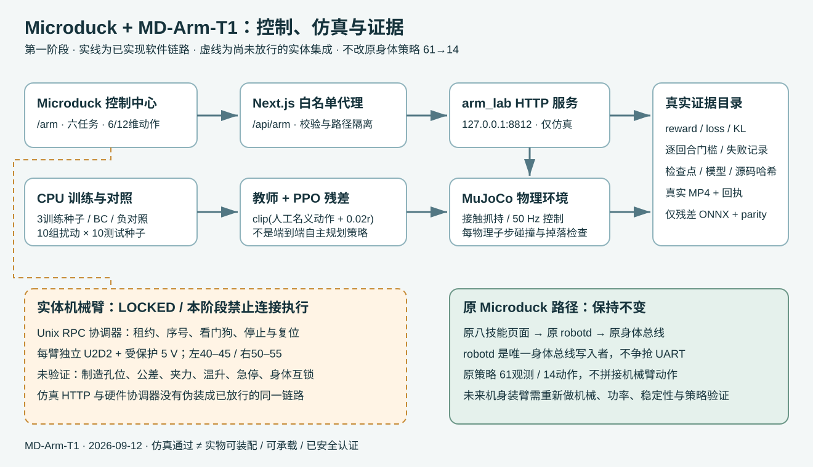
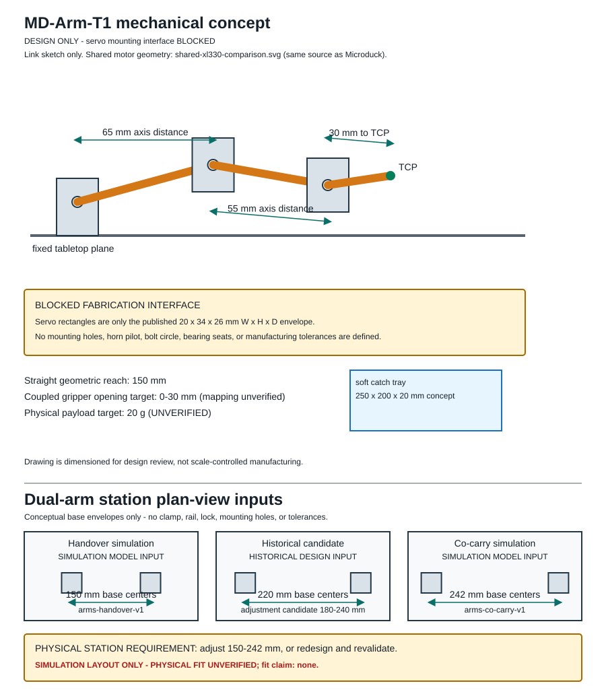
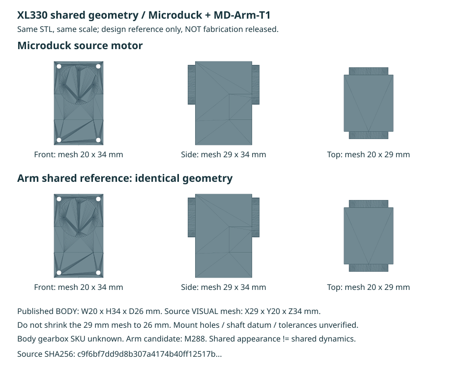
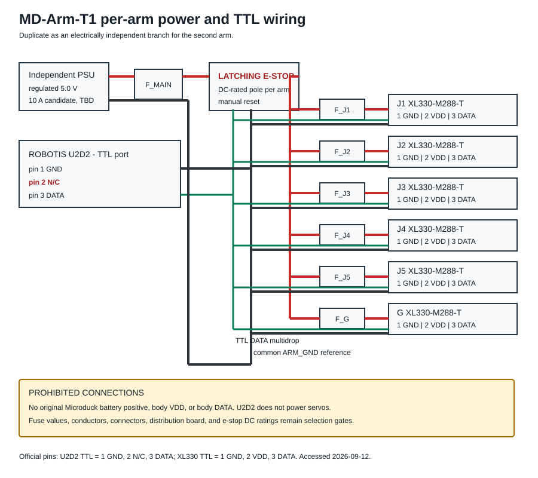

## 阅读前的安全边界

MD-Arm-T1 是一套桌面机械臂研究方案。当前仓库已经实现参数化概念几何、
可机读 BOM 和网表、MuJoCo 接触仿真、教师控制、行为克隆诊断、残差 PPO、
严格评估、Viewer 页面、Unix RPC 协调器及 Dynamixel Protocol 2 离线编码。
实体串口创建仍被代码硬拒绝，制造接口、供电保护和实物标定尚未放行。

> [!WARNING]
> 本书不是接线许可、制造图纸或功能安全认证。不要将机械臂 VDD 接到
> Microduck 电池正极，不要将机械臂 DATA 接到身体舵机总线，不要用 U2D2
> 给舵机供电。保险、线径、急停触点、支架孔位、夹爪映射和温升必须在
> 独立硬件评审中确定。

书中命令默认从工作区根目录执行：

```text
/Volumes/ExternalSSD/geoagent/microduck-lab
```

完成本书后，你应能做到以下事项：

* 解释五个姿态关节和一个夹爪动作为什么不等于任意六维位姿控制
* 从力矩、速度、供电和通信约束推导设计边界
* 重新生成机械图、接线图、概念 STL 和哈希清单
* 理解 66 维单臂与 116 维双臂观测契约
* 启动 MuJoCo 后端和 `/arm` 控制中心
* 运行教师、负对照、BC 诊断、残差 PPO、评估和视频渲染
* 通过 JSON-RPC 模拟服务理解租约、截止时间、序号和看门狗
* 区分仿真通过、软件验证通过、台架放行和实体部署

## 第一篇 系统原理

### 第 1 章 问题定义与设计目标

Microduck 原身体控制链使用固定的 61 维观测和 14 维动作。机械臂不能通过
修改全局关节数塞入旧 ONNX，因为这样会同时破坏训练、导出和机载推理契约。
本项目采用隔离式架构：身体仍由 `robotd` 独占原总线，机械臂拥有独立电源、
独立 U2D2、独立关节映射和独立策略契约。

设计目标分成四层：

| 层级 | 目标 | 当前状态 |
|---|---|---|
| 机械 | 约 150 mm 几何伸展、桌面固定、轻量夹爪 | 概念设计，未制造放行 |
| 电气 | 每臂独立 5 V、电流保护、TTL 多点总线、硬件急停 | 网表完成，器件额定值待定 |
| 软件 | 50 Hz 控制、租约、限速/限加速度、故障停机 | 模拟路径与协议测试完成 |
| 学习 | 六种单臂/双臂课程、可审计评估和视频证据 | 仿真课程已实现，非实物证明 |

第一原则是保持边界清晰。仿真用于验证算法与接口，台架用于验证电气、热、
几何和传感器，实体部署还需要完整的互锁与 sim2real 工作。

### 第 2 章 总体架构



系统中存在两条刻意分开的链路。

训练与课堂链路：

```text
浏览器 /arm
  -> Next.js /api/arm 白名单代理
  -> 127.0.0.1:8812 arm_lab
  -> ArmEnv + MuJoCo
  -> 教师、手动控制或 PPO 残差
  -> evaluation.json、MP4、接触图和哈希回执
```

部署准备链路：

```text
Unix JSON-RPC 客户端
  -> Coordinator
  -> 租约、序号、截止时间、身体互锁、看门狗
  -> LockedTransport 或 SimulatedTransport
  -X-> Xl330Transport 实体创建路径（当前硬拒绝）
```

这两条链路没有被描述成同一个已部署系统。HTTP 后端服务 MuJoCo，Unix RPC
用于验证部署控制语义。真实硬件接入前，需要把感知、策略、协调器和已审核的
串行传输组合成一条可证明的闭环。

### 第 3 章 坐标系、自由度与动作语义

单臂关节顺序固定为：

```python
ARM_JOINTS = (
    "base_yaw",
    "shoulder_pitch",
    "elbow_pitch",
    "wrist_pitch",
    "wrist_roll",
    "gripper_width",
)
```

前五项控制姿态关节，第六项控制两指联动开口。夹爪开合不增加工具中心点
(TCP) 的空间姿态自由度，所以它不是一个可用于任意方向定位的腕关节。

推荐坐标约定如下：

* 世界坐标系 $W$ 固定在桌面场景
* 底座坐标系 $B$ 的原点位于 J1 旋转轴中心
* 工具坐标系 $T$ 固定在两指中心
* $+z$ 指向桌面上方
* $+x$ 指向机械臂名义前方
* 旋转遵循右手定则

动作不是绝对位置，而是归一化速度请求 $a_i \in [-1,1]$。协调器先计算请求
速度，再施加加速度和位置限制：

$$
v_i^* = a_i v_{i,\max}
$$

$$
v_{i,k+1} = v_{i,k} +
\operatorname{clip}(v_i^* - v_{i,k}, -\alpha_{i,\max}\Delta t,
\alpha_{i,\max}\Delta t)
$$

$$
q_{i,k+1} = \operatorname{clip}(q_{i,k} + v_{i,k+1}\Delta t,
q_{i,\min}, q_{i,\max})
$$

其中 $\Delta t=0.02\,\text{s}$。姿态关节最大速度为 $0.4\,\text{rad/s}$，
最大加速度为 $1.0\,\text{rad/s}^2$；夹爪分别为
$0.01\,\text{m/s}$ 和 $0.025\,\text{m/s}^2$。

## 第二篇 机械与电气设计

### 第 4 章 机械构型



名义几何参数来自项目设计输入，不是成品测量：

| 参数 | 数值 | 含义 |
|---|---:|---|
| 肩高 | 80 mm | 桌面到肩部参考轴 |
| 肩至肘 | 65 mm | 第一连杆名义长度 |
| 肘至腕 | 55 mm | 第二连杆名义长度 |
| 腕至夹持中心 | 30 mm | 末端偏置 |
| 最大几何伸展 | 150 mm | 三段长度算术和，不是安全工作区 |
| 交接底座中心距 | 150 mm | 当前 handover 仿真布局 |
| 协作搬运中心距 | 242 mm | 当前 co-carry 仿真布局 |

安全工作区必须小于几何球壳，因为关节限位、自碰撞、桌面、障碍物、线束和
夹具会进一步削减可达空间。当前 150 mm 与 242 mm 是两个场景布局，尚无一个
经过验证的可调底座覆盖二者。

#### 4.1 重力矩估算

水平伸展时，肩部静态重力矩可按下式进行第一轮筛选：

$$
\tau_s = g\sum_j m_j r_j
$$

例如 20 g 物体位于 150 mm 处，仅物体贡献：

$$
\tau_{payload}=9.81\times0.020\times0.150
=0.02943\,\text{N·m}
$$

设计文档中含远端电机、支架和物体的肩部估算约为
$0.1514\,\text{N·m}$。这不是连续承载认证。XL330 的堵转力矩不能当作持续
工作力矩，真实设计还要加入加速度、夹持偏心、线束阻力、齿隙和温升余量。

#### 4.2 参数化 CAD 的作用与限制

编辑源位于：

```text
hardware/md-arm-t1/cad/md_arm_t1.scad
```

它用于表达包络、连杆空白件、工作区和站位关系。它没有可制造的舵机孔、
花键、轴承座或工艺公差。生成脚本故意不把概念模型伪装成加工图。

重新生成全部硬件审查资产：

```bash
python3 hardware/md-arm-t1/scripts/generate.py
python3 -m unittest discover -s hardware/md-arm-t1/tests -p 'test_*.py' -v
```

检查输出：

```bash
ls -lh hardware/md-arm-t1/generated
python3 - <<'PY'
import json
from pathlib import Path
manifest = json.loads(
    Path("hardware/md-arm-t1/generated/manifest.json").read_text()
)
for name, digest in sorted(manifest["sha256"].items()):
    print(digest, name)
PY
```

#### 4.3 从概念件到可制造支架

制造放行要按以下顺序执行：

1. 确认采购实物完整型号为 `XL330-M288-T`
2. 下载 ROBOTIS 官方 PDF、DWG 或 STEP
3. 用卡尺测量机身、法兰、轴端、紧固件和插头弯曲空间
4. 建立官方模型与实测模型的偏差表
5. 设计肩/肘双侧支撑，避免长悬臂载荷直接压在输出轴承上
6. 打印或加工单孔位试片，不装整臂
7. 检查插拔、螺钉啮合长度、工具可达性和线束应变释放
8. 完成试片评审后再冻结支架版本

### 第 5 章 XL330 与材料选择



候选执行器为 XL330-M288-T。当前采用的厂商事实包括：18 g、推荐 5.0 V、
3.7 至 6.0 V 输入范围、5 V 堵转力矩 0.52 N·m、堵转电流 1.47 A、
Dynamixel Protocol 2.0 和 TTL 半双工通信。

> [!IMPORTANT]
> “堵转”是边界工况，不是额定连续工作点。不能用 $0.52\,\text{N·m}$
> 除以设计力矩得出可长期工作的安全系数。

单臂候选 BOM 的关键件包括：

* 六颗 XL330-M288-T
* 一个 U2D2 TTL 适配器
* 匹配的 JST EH-3 线束
* 独立 5.0 V 稳压电源
* 主支路保护和六个执行器分支保护
* 正确直流分断额定值的急停触点
* 固定底座、接物盘、软爪垫和线束应变释放

机器可读 BOM 位于 `hardware/md-arm-t1/bom.json`。先读结构，再生成采购核对表：

```python
import json
from pathlib import Path

bom = json.loads(Path("hardware/md-arm-t1/bom.json").read_text())
for item in bom["items"]:
    print(item.get("quantity_per_arm"), item["name"], item.get("status"))
```

采购时不要只匹配商品标题。至少核对型号后缀、连接器、工作电压、协议、
固件、附件和可追溯来源。

### 第 6 章 供电与 TTL 电路



每臂最坏堵转电流的算术和为：

$$
I_{stall,sum}=6\times1.47=8.82\,\text{A}
$$

这解释了为什么 10 A 级电源是候选起点，但不代表线束、连接器或分配板可以
承受 10 A，也不允许六个舵机同时堵转。

#### 6.1 网表中的五类关键网络

| 网络 | 作用 |
|---|---|
| `ARM_5V_RAW` | 每臂独立稳压电源到主保护输入 |
| `ARM_5V_FUSED` | 主保护之后、急停触点之前 |
| `ARM_5V_ENABLED` | 急停触点之后、各关节分支之前 |
| `ARM_GND` | 电源回路与 TTL 信号共同参考地 |
| `TTL_DATA` | U2D2 与六个执行器的半双工多点数据线 |

U2D2 TTL 端口定义为 pin 1 GND、pin 2 N/C、pin 3 DATA；XL330 为
pin 1 GND、pin 2 VDD、pin 3 DATA。U2D2 不向 Dynamixel 提供 VDD。

用 Python 审计关键禁接项：

```python
import json
from pathlib import Path

netlist = json.loads(
    Path("hardware/md-arm-t1/netlists/arm-ttl-netlist.json").read_text()
)
assert "U2D2_TTL:2_N/C" in netlist["explicit_no_connects"]
assert "USB:VBUS_TO_ARM_VDD" in netlist["explicit_no_connects"]
assert "MICRODUCK_BATTERY:+" in netlist["explicit_no_connects"]
assert "MICRODUCK_BODY_BUS:DATA" in netlist["explicit_no_connects"]
print("关键禁接网络存在")
```

#### 6.2 断电接线核对顺序

1. 所有电源断开，拔下 USB
2. 按连接器编号而不是线色识别 pin 1、2、3
3. 测量每条线的端到端连续性
4. 验证 VDD 与 GND、DATA 之间无短路
5. 验证 U2D2 pin 2 保持悬空
6. 验证急停动作切断每臂正极支路
7. 验证释放急停不会自动启动软件任务
8. 记录保险、线径、连接器和急停触点的实际额定值
9. 由硬件评审者签字后才进入限流电源台架阶段

> [!CAUTION]
> 当前仓库没有给出保险值和线径，因为这些值依赖实际连接器、线长、环境、
> 电源限流与实测瞬态。不要把“待选型”替换成未经计算的通用数值。

## 第三篇 控制软件

### 第 7 章 契约优先设计

控制契约集中在 `arm_control/contracts.py`。单臂契约是 66 维观测、6 维动作；
双臂契约是 116 维观测、12 维动作。设备 ID 与舵机 ID 固定映射：

```python
LEFT_SERVO_IDS = tuple(range(40, 46))
RIGHT_SERVO_IDS = tuple(range(50, 56))

SINGLE_CONTRACT = PolicyContract("md-arm-table-v1", 66, 6, 1)
DUAL_CONTRACT = PolicyContract("md-dualarm-table-v1", 116, 12, 2)
```

每个设备根据设备名、舵机 ID、关节名、单位、限位、速度和加速度计算
`joint_map_hash`。客户端必须回传这个哈希，避免把正确长度的动作发给错误的
关节顺序。

动作验证同时拒绝错误长度、布尔值、NaN、无穷和超出 $[-1,1]$ 的值：

```python
def validate_action(values):
    if not isinstance(values, list) or len(values) != 6:
        raise ContractError("action must contain exactly 6 values")
    action = tuple(finite_number(value, f"action[{index}]")
                   for index, value in enumerate(values))
    if any(abs(value) > 1.0 for value in action):
        raise ContractError("normalized actions must be within [-1, 1]")
    return action
```

这种严格验证比自动截断输入更安全，因为上游维度错误不会被悄悄隐藏。

### 第 8 章 状态机、租约与看门狗

控制状态为：

```text
LOCKED -> READY -> EXECUTING
                  |       |
                  v       v
          PROTECTIVE_STOP ESTOP
                  |       |
                  +--人工检查与显式 reset--+
```

状态语义：

| 状态 | 含义 | 可否接收动作 |
|---|---|---:|
| `LOCKED` | 传输未授权或服务锁定 | 否 |
| `READY` | 可申请独占租约 | 否 |
| `EXECUTING` | 有效租约正在控制 | 是 |
| `PROTECTIVE_STOP` | 看门狗、互锁或传输故障 | 否 |
| `ESTOP` | 急停锁存 | 否 |

租约最长 500 ms，每条命令包含会话 ID、会话 epoch、严格递增序号、单调时钟
截止时间、契约、维度、关节哈希和每臂动作。连续五个控制周期没有有效命令，
即 100 ms，协调器进入保护停止。

关键逻辑可概括为：

```python
if now - lease.last_command_at > COMMAND_WATCHDOG_S:
    self._protective_stop(lease.devices,
                          "five-tick command watchdog expired")

if not self.body_interlock.maintain(lease.session_id):
    self._protective_stop(lease.devices, "body interlock lost")
```

停止后不会自动续跑。`reset` 要求物理急停已释放、传输读数有效，并要求精确的
人工确认文本：

```text
I inspected the arm and cleared the cause
```

### 第 9 章 JSON-RPC 协议

Unix socket 使用一行一个 JSON-RPC 2.0 对象的 NDJSON。请求行上限 64 KiB，
未知 envelope 字段、未知方法、非对象参数和超长请求都会被拒绝。

启动模拟服务：

```bash
python3 -m arm_control.daemon \
  --transport simulation \
  --devices left-arm \
  --socket /tmp/microduck-arm.sock
```

在第二个终端运行参考客户端：

```bash
python3 arm_control/examples/unix_rpc_client.py /tmp/microduck-arm.sock
```

完整的申请租约请求：

```json
{
  "jsonrpc": "2.0",
  "id": 2,
  "method": "manipulation.acquire",
  "params": {
    "operator": "local-example",
    "mode": "single_arm",
    "contract_id": "md-arm-table-v1",
    "observation_dim": 66,
    "action_dim": 6,
    "devices": ["left-arm"],
    "lease_ms": 500
  }
}
```

命令请求必须使用 `acquire` 返回的会话和哈希：

```python
command = {
    "session_id": acquired["session_id"],
    "session_epoch": acquired["session_epoch"],
    "sequence": 0,
    "deadline_monotonic_ns": time.monotonic_ns() + 100_000_000,
    "mode": "single_arm",
    "contract_id": "md-arm-table-v1",
    "observation_dim": 66,
    "action_dim": 6,
    "joint_map_hashes": {
        "left-arm": capabilities["devices"]["left-arm"]["joint_map_hash"]
    },
    "actions": {"left-arm": [0.1, 0.0, 0.0, 0.0, 0.0, 0.0]},
}
```

不要缓存跨进程启动的 `session_epoch` 或单调时钟截止时间。服务重启后重新读取
能力并申请新租约。

### 第 10 章 Dynamixel Protocol 2 离线实现

`arm_control/dynamixel.py` 实现了 CRC、字节填充、指令包、状态包、Sync Read、
Sync Write 和标定映射。实体串口工厂仍拒绝打开设备。

指令包结构：

```text
FF FF FD 00 | ID | LENGTH_L LENGTH_H | INSTRUCTION | PARAMETERS | CRC_L CRC_H
```

CRC 的多项式实现为 `0x8005`。构造读取当前状态块的请求：

```python
from arm_control.dynamixel import (
    ADDR_PRESENT_CURRENT,
    PRESENT_BLOCK_LEN,
    encode_sync_read,
)

packet = encode_sync_read(
    tuple(range(40, 46)),
    ADDR_PRESENT_CURRENT,
    PRESENT_BLOCK_LEN,
)
print(packet.hex(" "))
```

构造六关节目标位置 Sync Write：

```python
import struct
from arm_control.dynamixel import ADDR_GOAL_POSITION, encode_sync_write

servo_ids = tuple(range(40, 46))
counts = (2048, 2100, 1900, 2048, 2048, 1000)
values = tuple(struct.pack("<i", count) for count in counts)
packet = encode_sync_write(servo_ids, ADDR_GOAL_POSITION, values)
```

关节值与编码器计数之间的标定模型为：

$$
c_i=c_{0,i}+d_i q_i s_i
$$

其中 $c_0$ 是零位计数，$d\in\{-1,+1\}$ 是方向，$s$ 是每单位计数。
标定文件必须保证所有软件限位映射到 0 至 4095 内。

> [!NOTE]
> 能编码协议包不代表可连接硬件。`PosixSerialStream.open()` 和
> `open_xl330_transport()` 当前都抛出硬件不可用错误，这是有意的安全边界。

### 第 11 章 控制服务测试

运行全部控制测试：

```bash
python3 -m unittest discover -s arm_control/tests -p 'test_*.py' -v
```

应重点理解以下反例：

* 错误动作维度必须失败
* NaN 和无穷必须失败
* 重复或跳号序列必须失败
* 过期截止时间必须触发保护停止
* 身体互锁丢失必须停止租约中的全部机械臂
* ticker 超出 50 Hz 预算时不能继续执行
* 实体 transport 创建必须失败
* ESTOP 后不能未经人工确认自动恢复

## 第四篇 MuJoCo 仿真

### 第 12 章 场景与时间尺度

环境入口位于 `rlx/rlx/environments/arm.py`，六个案例为：

```python
CASES = (
    "arm-reach-v1",
    "arm-pick-place-v1",
    "arm-relocate-v1",
    "arm-carry-v1",
    "arms-handover-v1",
    "arms-co-carry-v1",
)
```

MuJoCo 物理步长为 2 ms，控制步长为 20 ms，所以一个控制动作通常覆盖十个
物理子步。接触与碰撞必须逐物理子步审计，不能只看控制步末端，否则 2 ms
到 18 ms 的短暂碰撞可能完全消失。

生成场景资产：

```bash
rlx/.venv-microduck/bin/python \
  rlx/examples/ppo_microduck_arm.py assets \
  --output rlx/assets/md_arm_t1
```

检查生成文件：

```bash
find rlx/assets/md_arm_t1 -maxdepth 1 -type f -print
```

### 第 13 章 观测与动作契约

单臂观测为 66 维，双臂为 116 维。它们与身体 61/14 契约相互独立。观测包含
关节状态、TCP/物体/目标关系、接触、障碍或航点上下文，以及阶段相关信息。
具体切片以 `ArmEnv` 当前源码与契约测试为准，不要凭文档猜索引。

用运行时断言锁住契约：

```python
import numpy as np
from rlx.environments.arm import ArmEnv

single = ArmEnv("arm-pick-place-v1")
obs, info = single.reset(seed=101)
assert obs.shape == (66,)
assert single.action_space.shape == (6,)
assert np.isfinite(obs).all()

multi = ArmEnv("arms-handover-v1")
obs, info = multi.reset(seed=101)
assert obs.shape == (116,)
assert multi.action_space.shape == (12,)
```

实体阶段不能直接读取 MuJoCo 真值。每个观测字段都要有时间戳、有效位和实体
测量来源，例如编码器、相机位姿、触点或电流估计。缺失传感器不能用零值冒充。

### 第 14 章 接触、抓取与成功门槛

当前仿真不使用 weld、瞬移或隐藏托举力。抓取必须由两指与物体接触产生，
并依次通过以下事件：

```text
双指接触 -> 持续抓持 -> 实际抬升 -> 搬运/交接 -> 受控放置 -> 松爪退出 -> 稳定
```

典型单臂放置门槛包括：

* 双指接触持续至少 20 ms
* 物体实际抬升至少 20 mm
* 空中失去抓握不得超过 20 ms
* 物体到达目标误差不超过 10 mm
* 释放后物体由桌面或目标支撑
* 夹爪开口至少 26 mm
* TCP 退出至少 30 mm
* 终态线速度和角速度受限并稳定 2 s

成功判定读取当前状态和事件序列，不能使用“本回合历史上曾经抬高过”这种峰值
计数器代替完整操作。

### 第 15 章 教师控制器

教师由解析 IK 和定时有限状态机组成。它完成接近、闭爪、抬升、航点、放置和
退出等名义动作。PPO 只学习其上的小残差。

一个典型教师 FSM 可以写成：

```python
def teacher_action(state):
    if state.stage == "approach":
        return move_tcp(state.pregrasp, gripper="open")
    if state.stage == "close":
        return hold_tcp(state.pregrasp, gripper="close")
    if state.stage == "lift":
        return move_tcp(state.lift_pose, gripper="close")
    if state.stage == "transport":
        return move_tcp(state.target_above, gripper="close")
    if state.stage == "place":
        return move_tcp(state.target, gripper="close")
    if state.stage == "release":
        return hold_tcp(state.target, gripper="open")
    return move_tcp(state.retreat, gripper="open")
```

这段代码展示结构，实际门槛、动作和阶段以 `ArmEnv.teacher_action()` 为准。
教师通过不等于学习成功，但教师不通过时不应开始 PPO，因为策略会在错误的
名义轨迹上学习残差。

运行教师评估：

```bash
rlx/.venv-microduck/bin/python \
  rlx/examples/ppo_microduck_arm.py teacher \
  --case arm-pick-place-v1 \
  --output /tmp/md-arm-teacher
```

### 第 16 章 启动本地控制中心

终端 A 启动 MuJoCo HTTP 后端：

```bash
rlx/.venv-microduck/bin/python scripts/arm_lab.py --port 8812
```

终端 B 启动 Next.js：

```bash
cd duck-viewer
npm run dev
```

打开终端打印的 URL，并进入 `/arm`。不要假定端口一定是 3000，因为开发服务
可能自动选择其他端口。

推荐课堂操作顺序：

1. 选择 `arm-reach-v1`
2. 固定 seed 后 reset
3. 每次只移动一个滑块，观察关节方向
4. 尝试零动作并确认不会误判成功
5. 启用 Teacher，观察状态机阶段
6. 暂停并逐帧检查接触与目标
7. 切换 pick-place，比较接近、抓持、抬升、释放和退出
8. 最后进入双臂案例，观察两臂必须同时参与的门槛

## 第五篇 学习算法

### 第 17 章 为什么采用残差 PPO

端到端 PPO 必须同时发现 IK、接触时机、夹持、搬运和释放，探索空间很大。
本项目先用教师提供名义控制，再让 PPO 学习有界修正：

$$
a_t=\operatorname{clip}(a_t^{teacher}+0.02a_t^{ppo},-1,1)
$$

这提高了当前课程中的训练稳定性，但能力归因必须诚实：策略不是从零学会完整
规划，教师承担了大部分任务结构。

PPO 的裁剪目标为：

$$
L^{CLIP}(\theta)=\mathbb{E}_t\left[
\min(r_t(\theta)\hat A_t,
\operatorname{clip}(r_t(\theta),1-\epsilon,1+\epsilon)\hat A_t)
\right]
$$

其中 $r_t$ 是新旧策略概率比，$\epsilon=0.1$。当前训练还使用
$\gamma=0.99$、GAE $\lambda=0.95$、学习率 $10^{-4}$ 和最大梯度范数 0.5。

### 第 18 章 行为克隆诊断

BC 用教师轨迹拟合全动作。它的价值是暴露数据覆盖、阶段编码和优化问题，不是
自动成为部署策略。

最小数据采集结构：

```python
observations = []
actions = []
obs, _ = env.reset(seed=seed)
for _ in range(episode_steps):
    action = env.teacher_action()
    observations.append(obs.copy())
    actions.append(action.copy())
    obs, reward, terminated, truncated, info = env.step(action)
    if terminated or truncated:
        break
```

MSE 下降只说明动作拟合变好。必须把 BC 放回环境运行，并使用与 PPO 相同的任务
门槛检查。当前历史结果中多个操作案例 BC 为 0/100，这些失败应保留。

### 第 19 章 运行单任务 PPO

先创建新目录，避免覆盖旧证据：

```bash
RUN=rlx/runs/arm/tutorial-pick-place-seed101
mkdir -p "$(dirname "$RUN")"
test ! -e "$RUN"
```

训练：

```bash
rlx/.venv-microduck/bin/python \
  rlx/examples/ppo_microduck_arm.py train \
  --case arm-pick-place-v1 \
  --seed 101 \
  --steps 32768 \
  --output "$RUN"
```

评估：

```bash
rlx/.venv-microduck/bin/python \
  rlx/examples/ppo_microduck_arm.py eval \
  --case arm-pick-place-v1 \
  --seed 101 \
  --seeds-per-config 10 \
  --output "$RUN"
```

负对照：

```bash
rlx/.venv-microduck/bin/python \
  rlx/examples/ppo_microduck_arm.py negative \
  --case arm-pick-place-v1 \
  --output "$RUN"
```

检查关键产物：

```bash
find "$RUN" -maxdepth 1 -type f -print | sort
python3 - <<'PY' "$RUN/evaluation.json"
import json, sys
report = json.load(open(sys.argv[1]))
print("passed:", report["passed"])
print("success rate:", report["success_rate"])
print("failed gates:", report.get("failed_gate_counts", {}))
PY
```

### 第 20 章 批量训练与资源控制

六案例、三个种子可通过批处理运行：

```bash
rlx/.venv-microduck/bin/python scripts/run_arm_experiments.py \
  --output rlx/runs/arm/tutorial-batch \
  --workers 3
```

不要盲目增加 worker。MuJoCo、PyTorch 和 BLAS 线程可能叠加，导致吞吐下降或
系统内存压力。先以一个案例测量峰值内存和每秒步数，再逐步增加并发。

批量实验必须满足：

* 新输出目录，不覆盖已有结果
* 每个案例和种子保存独立配置与源码身份
* 失败任务保留日志
* 训练完成后单独评估
* 不用训练回报替代确定性评估

### 第 21 章 奖励、课程与可学习性

奖励用于优化，门槛用于验收。奖励项应稠密、有界、可观测，惩罚项按约定保持
非正。若策略从未访问目标状态，继续调奖励不会创造训练数据。

设计奖励前回答四个问题：

1. 策略观测中哪些索引能看见被奖励的量
2. 该量的坐标系是什么
3. 是否存在一次性冲高后躺平的投机路径
4. 零动作、开爪或禁用一臂是否也能获得高分

课程可以调整初始状态、物理难度和判断严格度，但不应在每一阶段悄悄改变最终
优化目标。双臂交接当前使用 5 g 降载课程，这不能写成 20 g 能力。

## 第六篇 六个完整设计案例

六个案例共享 MD-Arm-T1 的关节、控制周期和安全边界，但任务状态机、场景上下文、
成功门槛与负对照不同。单臂案例使用 66 维观测和 6 维动作；双臂案例使用 116 维
观测和 12 维动作。它们都与 Microduck 身体的 61/14 契约隔离。

| 案例 | 类型 | 核心能力 | 必须排除的伪成功 |
|---|---|---|---|
| `arm-reach-v1` | 单臂 | 末端触达 | 初始位置或零动作自动命中 |
| `arm-pick-place-v1` | 单臂 | 抓取、抬升、放置、退出 | 推入目标或开爪托举 |
| `arm-relocate-v1` | 单臂 | 绕障移物 | 穿障、碰障或掉落滚入目标 |
| `arm-carry-v1` | 单臂 | 持物通过多个航点 | 跳过航点或瞬时经过 |
| `arms-handover-v1` | 双臂 | 受控交接 5 g 物体 | 单臂独立完成或空中失持 |
| `arms-co-carry-v1` | 双臂 | 协同搬运 17 g 总成 | 单臂拖拽、掉落或内力失控 |



后续各案例都按同一模板描述：任务定义、场景与契约、教师阶段、奖励与验收、
负对照、运行方法和严格结果。奖励只指导优化，验收门槛才决定任务是否完成。

### 案例 1 末端触达 arm-reach-v1

这个案例验证最基础的末端定位能力。场景中没有可抓取物体，机械臂需要把工具中心点
移动到目标位置，并让工具轴保持向下。它用于先检查坐标系、关节方向、解析 IK、
动作缩放和位置保持，再进入接触任务。

| 设计项 | 实现值 |
|---|---|
| 机械臂 | 单臂，底座位于世界原点 |
| 名义目标 | $[0.087, 0.018, 0.030]$ m |
| 目标扰动 | 每轴约 $\pm 0.002$ m |
| 场景物体 | 无，观测中的物体块清零 |
| 契约 | 66 维观测，6 维动作 |
| 回合时限 | 12 s |
| 统计门槛 | 成功率至少 95% |

教师没有抓取状态机，只向解析 IK 提供一个目标：

```python
def reach_teacher_targets(goal):
    return [(goal.copy(), 0.030)]
```

这里的 `0.030` 表示夹爪保持 30 mm 打开。它不是抓取动作。最终判定同时要求：

* 非法接触、机械臂碰撞、自碰撞和掉落计数全部为零
* TCP 到目标的距离不超过 5 mm
* TCP 向下轴误差不超过 5°
* 位置与方向连续保持 50 个控制步，即 1 s

奖励主要使用 TCP 误差下降量：

$$
r_{progress}=20(e_{t-1}-e_t)
$$

另有成功奖励、动作幅值惩罚、动作变化惩罚和碰撞惩罚。零动作是必要负对照，
它必须在所有测试回合失败，否则初始目标或评估器可能产生自动成功。

运行教师与训练：

```bash
CASE=arm-reach-v1
OUT=rlx/runs/arm/tutorial-$CASE-seed101

rlx/.venv-microduck/bin/python \
  rlx/examples/ppo_microduck_arm.py teacher \
  --case "$CASE" --output "$OUT/teacher"

rlx/.venv-microduck/bin/python \
  rlx/examples/ppo_microduck_arm.py train \
  --case "$CASE" --seed 101 --steps 32768 --output "$OUT"
```

严格 v3 中，三个训练 seed 的主评估和独立留出评估均为 100/100。该结论证明
当前仿真课程可复现，不证明实体末端误差达到 5 mm。

### 案例 2 抓取放置 arm-pick-place-v1

抓取放置案例加入真实接触、抬升、运输、释放和退出。黄色方块尺寸为
9 mm × 9 mm × 9 mm，质量为 20 g。

| 设计项 | 实现值 |
|---|---|
| 起点 | $[0.085, -0.022, 0.0091]$ m |
| 终点 | $[0.085, 0.025, 0.0091]$ m |
| 机械臂 | 单臂 |
| 契约 | 66 维观测，6 维动作 |
| 回合时限 | 20 s |
| 统计门槛 | 成功率至少 90% |

教师状态机总长 17.5 s：

| 阶段 | 时长 | TCP 与夹爪目标 |
|---|---:|---|
| 接近 | 2.5 s | 移到预抓取位，夹爪从 30 mm 开始闭合 |
| 夹紧 | 2.0 s | 保持位姿，闭合到双指接触 |
| 抬升 | 2.0 s | 在起点上方抬高 32 mm |
| 运输 | 3.0 s | 移到目标上方 32 mm |
| 下降 | 2.5 s | 降至目标面 |
| 释放 | 2.0 s | 夹爪打开到 30 mm |
| 退出 | 2.5 s | 张爪并抬离物体 |

成功不是“物体曾经进入目标”。评估器要求完整事件序列：

```text
grasped -> lifted -> released -> settled
```

关键门槛如下：

* 双指抓持并抬升至少 20 mm，持续 50 个控制步
* 释放动作受控，不能依靠碰撞把物体弹开
* 物体距目标不超过 10 mm
* 释放后由桌面支撑，线速度和角速度足够低
* 无夹爪接触状态稳定 100 个控制步，即 2 s
* 全程无非法接触、自碰撞和掉落

必须运行零动作和持续开爪两种负对照。前者排除初始状态自动完成，后者排除
推、托或接触穿透冒充抓取。严格 v3 的三个 seed 在主评估与独立留出评估中均为
100/100；这仍是仿真中的 20 g 方块结果。

### 案例 3 绕障移物 arm-relocate-v1

绕障移物沿用抓取放置的基本事件链，但在直接路径中央加入障碍物。该案例用于检查
场景上下文是否进入观测、规划是否避开障碍，以及非法接触是否真正进入失败门槛。

| 设计项 | 实现值 |
|---|---|
| 起点 | $[0.085, -0.032, 0.0091]$ m |
| 终点 | $[0.085, 0.034, 0.0091]$ m |
| 障碍物尺寸 | 36 mm × 12 mm × 20 mm |
| 障碍物中心 | $[0.085, 0.002, 0.010]$ m |
| 物体 | 9 mm 方块，20 g |
| 契约 | 66 维观测，6 维动作 |
| 回合时限 | 25 s |

观测中增加障碍物位置、尺寸和有效标志。评估器把机械臂或物体与障碍物的违规接触
计入 `invalid_contacts`，所以穿过障碍物不会因最终位置正确而通过。

状态机仍包含接近、夹紧、抬升、运输、下降、释放和退出。与普通抓取放置相比，
运输段必须形成绕障路径。验收包含普通放置的全部门槛，并额外依赖
`no_illegal_contact` 排除碰障和穿障。

复现一个固定 seed：

```bash
CASE=arm-relocate-v1
OUT=rlx/runs/arm/tutorial-$CASE-seed202

rlx/.venv-microduck/bin/python \
  rlx/examples/ppo_microduck_arm.py train \
  --case "$CASE" --seed 202 --steps 32768 --output "$OUT"

rlx/.venv-microduck/bin/python \
  rlx/examples/ppo_microduck_arm.py eval \
  --case "$CASE" --seed 202 --seeds-per-config 10 --output "$OUT"
```

严格 v3 的主评估和独立留出评估均为三个 seed 各 100/100。实体迁移时仍需验证
障碍物位姿估计、机械臂外形膨胀、标定误差和制动距离，不能直接采用仿真净空。

### 案例 4 航点搬运 arm-carry-v1

航点搬运要求夹持 20 g 方块依次通过三个空间航点，再下降放置。它检查长路径保持、
航点顺序、物体姿态和夹持连续性。

三个航点为：

```python
waypoints = (
    start + [0.015, 0.025, 0.030],
    start + [0.000, 0.040, 0.030],
    goal  + [0.000, 0.000, 0.030],
)
```

| 设计项 | 实现值 |
|---|---|
| 机械臂 | 单臂 |
| 物体 | 9 mm 方块，20 g |
| 航点数量 | 3 |
| 最小累计路径 | 80 mm |
| 运输最大倾角 | 小于 10° |
| 契约 | 66 维观测，6 维动作 |
| 回合时限 | 30 s |

教师状态机扩展为九段：抓取、夹紧、抬升、航点 0、航点 1、航点 2、下降、
释放和退出。各航点只有按顺序进入容差区才推进 `waypoint_index`。

除抓取放置门槛外，还必须满足：

* `three_waypoints`，三个航点全部按顺序访问
* `path_80mm`，物体实际累计路径至少 80 mm
* `tilt_below_10deg`，运输期间最大倾角小于 10°

只检查终点会漏掉跳过航点和瞬时穿越，因此航点索引、路径积分和运输倾角必须跨
整个回合累计。严格 v3 的三个训练 seed 及其独立留出评估均为 100/100。

### 案例 5 双臂交接 arms-handover-v1

双臂交接把物体从左臂传给右臂。两臂底座中心距为 150 mm，每臂拥有独立 6 维
动作。双臂观测为 116 维，包含两臂局部状态、相对 TCP 位姿、任务阶段和物体倾角。

| 设计项 | 实现值 |
|---|---|
| 左底座 | $[0, -0.075, 0]$ m |
| 右底座 | $[0, 0.075, 0]$ m |
| 交接区 | $[0.075, 0, 0.041]$ m |
| 物体 | 7 mm × 50 mm × 16 mm 条状物，5 g |
| 契约 | 116 维观测，12 维动作 |
| 回合时限 | 30 s |
| 统计门槛 | 成功率至少 85% |

十阶段教师调度如下：

| 阶段组 | 左臂行为 | 右臂行为 |
|---|---|---|
| 0 至 2 | 接近、夹紧、抬升 | 在接收侧张爪等待 |
| 3 | 携物进入交接区 | 张爪进入交接区 |
| 4 至 5 | 保持后逐步释放 | 闭爪并建立接收抓持 |
| 6 | 退出交接区 | 抬升并确认单臂持物 |
| 7 至 9 | 继续退出 | 搬运、放置、释放和退出 |

交接判定增加两个时间门槛：

* 双臂同时接触且物体离桌至少 25 个控制步，即 500 ms
* 左臂释放后，右臂独立持物至少 50 个控制步，即 1 s

`disable_right` 是该案例最重要的负对照。若禁用右臂仍能成功，说明评估器没有
证明“交接”发生。当前课程仅使用 5 g 条状物。严格 v3 的三个 seed 在主评估和
独立留出中均为 100/100，不能据此声称双臂已经交接 20 g。

### 案例 6 双臂共同搬运 arms-co-carry-v1

共同搬运要求两臂持续分担托盘载荷，并把总成平移至少 50 mm。它同时检查双臂
接触比例、负载分配、内力、托盘倾角和载荷滑移，是六个案例中约束最多的一项。

| 设计项 | 实现值 |
|---|---|
| 左右底座中心距 | 242 mm |
| 托盘 | 50 mm × 94 mm × 6 mm，8 g |
| 两个把手 | 每个 2 g |
| 顶部载荷 | 10 mm 方块，5 g |
| 总质量 | 17 g |
| 起点 | $[0.045, 0, 0.0031]$ m |
| 终点 | $[-0.007, 0, 0.0031]$ m |
| 契约 | 116 维观测，12 维动作 |
| 回合时限 | 35 s |

教师使用七阶段流程：接近 3 s、夹紧 2 s、抬升 3 s、运输 6 s、下降 3 s、
释放 2 s、退出 3 s。严格修复 v3 的关键变化是抬升、运输和下降阶段不再使用
跳变目标，而采用同步五次平滑笛卡尔插值：

$$
s(u)=10u^3-15u^4+6u^5,\qquad u\in[0,1]
$$

$$
p(u)=p_0+(p_1-p_0)s(u)
$$

该曲线在两端的一阶与二阶导数为零，减少阶段边界的垂直冲击和双臂对抗内力。
两臂必须使用相同的时间参数 $u$，否则各自平滑仍可能产生不同步拉扯。

共同搬运专属门槛：

| 门槛 | 要求 |
|---|---|
| 双臂抓持比例 | 运输时间的至少 95% 双臂都接触 |
| 托盘倾角 | 最大值小于 5° |
| 顶部载荷滑移 | 最大值小于 5 mm |
| 单臂负载占比 | 每臂至少承担总重的 20% |
| 合力一致性 | 有效支撑样本比例至少 95% |
| 峰值对抗内力 | 小于 1 N |
| 平移距离 | 至少 50 mm |

历史严格复查曾出现 1800 回合中的两个真实失败，表现为下降速度超过 30 mm/s，
峰值内力约 1.2 N。v3 保持任务质量、奖励、物理和评估门槛不变，只把三个阶段的
目标改为同步五次平滑轨迹。修复后主评估 1800/1800、独立留出 1800/1800，
21 个已知失败回归全部通过，观察到的峰值内力降至约 0.535 至 0.649 N。

这些数字只对应现有 17 g 托盘总成。它们不构成双臂 20 g 能力声明，也不构成
舵机连续力矩、结构刚度或热稳定性验证。

### 六案例统一运行与证据检查

批量运行六案例和三个训练 seed：

```bash
rlx/.venv-microduck/bin/python scripts/run_arm_experiments.py \
  --output rlx/runs/arm/tutorial-six-cases \
  --workers 3
```

单案例评估与负对照：

```bash
CASE=arms-co-carry-v1
RUN=rlx/runs/arm/tutorial-six-cases/$CASE/seed-101

rlx/.venv-microduck/bin/python \
  rlx/examples/ppo_microduck_arm.py eval \
  --case "$CASE" --seed 101 --seeds-per-config 10 --output "$RUN"

rlx/.venv-microduck/bin/python \
  rlx/examples/ppo_microduck_arm.py negative \
  --case "$CASE" --output "$RUN"
```

每个案例都要保留下列证据：

* 训练配置、源码身份和 `actual_env_steps`
* 主评估与独立留出的逐回合门槛
* 零动作、开爪和适用的禁用右臂负对照
* MP4、接触图和带哈希的渲染回执
* 失败回合的视频与门槛计数
* 环境、流水线和检查点哈希

严格 v3 汇总为：主评估 1800/1800、独立留出 1800/1800、已知失败回归
21/21、物理步长检查 12/12、负对照意外成功 0/130、保存的软件测试 165 项通过。
这些结果应与 `repair-v3/RESULTS.zh-CN.md` 和原始 JSON 一起审阅。

## 第七篇 评估、证据与部署

### 第 22 章 严格评估

每个检查点使用独立测试种子和多组小扰动。总体通过率之外，还要检查每组最低
成功率、Wilson 区间和失败门槛。

Wilson 区间可按下式计算：

$$
\hat p_W=\frac{\hat p+z^2/(2n)}{1+z^2/n}
$$

$$
h_W=\frac{z}{1+z^2/n}
\sqrt{\frac{\hat p(1-\hat p)}{n}+\frac{z^2}{4n^2}}
$$

95% 区间取 $z=1.96$。小样本的 100% 成功并不意味着真实成功率为 100%。

必须运行的负对照包括：

| 对照 | 目的 |
|---|---|
| zero | 排除重力、初始姿态或计时器自动完成 |
| open_gripper | 排除推、托或碰撞替代抓取 |
| disable_right | 双臂任务必须需要右臂参与 |

### 第 23 章 视频、接触图与哈希回执

渲染一个已训练检查点：

```bash
rlx/.venv-microduck/bin/python \
  rlx/examples/render_microduck_arm.py \
  --case arm-pick-place-v1 \
  --checkpoint "$RUN/ppo-residual.zip" \
  --output "$RUN" \
  --export
```

预期产物包括：

* `rollout.mp4` 完整物理回放
* `contact-sheet.png` 多帧诊断图
* `render-receipt.json` 案例、seed、控制器与哈希
* 残差 ONNX 导出产物

检查视频时至少观察接近、双指接触、抬升、运输、放置、松爪和退出。只看最后
一帧无法发现瞬时穿透、掉落后滚入目标或错误手臂完成任务。

> [!IMPORTANT]
> 导出的 ONNX 是残差演员，不是完整控制器。它必须与相同教师 FSM、观测契约、
> 0.02 缩放和安全限制配套。

### 第 24 章 当前验证结果应如何解释

历史仿真结果显示六个课程的教师与 PPO 组合达到预设门槛，严格修复结果位于
`repair-v3/RESULTS.zh-CN.md`。这些结果支持“当前源码和课程在仿真中可复现”，
不支持“实体机械臂达到同样成功率”。

当前明确未完成：

* 舵机安装孔、紧固件和公差放行
* 夹爪角度、开口、夹力与软垫变形标定
* 电源、保险、线径、连接器和急停额定协调
* 真实位置、电流、电压、温度与视觉观测闭环
* 30 分钟以上逐级负载温升与重复运动
* `robotd` 可证明的身体独占互锁
* 实体串口工厂与授权部署链
* 完整 sim2real 随机化和官方 GPU 栈重训

### 第 25 章 实物台架的分阶段方法

本章给出评审流程，不给出绕过硬件锁的启动命令。

#### 阶段 A 断电检验

1. 核对每颗舵机完整型号和序号
2. 测量支架、输出轴、螺钉和插头空间
3. 完成线束 pin-to-pin 连续性表
4. 检查所有 VDD、GND、DATA 之间无短路
5. 验证底座夹具、接物盘和运动区隔离
6. 记录急停触点、保险、线径和连接器额定值

#### 阶段 B 限流单关节

1. 只连接一个卸载舵机
2. 将机械结构置于不会坠落的位置
3. 使用实验室限流电源，从保守电流限制开始
4. 读取身份和状态，不立即启用力矩
5. 人工转动检查方向、卡滞和线束
6. 建立零位、方向和计数比例
7. 以很小速度执行短行程
8. 记录电压、电流、温度、误差和急停响应

#### 阶段 C 空载单臂

1. 逐关节加入，不安装载荷
2. 每加入一个关节重新做 ID、方向和限位检查
3. 从 80 至 100 mm 工作半径开始
4. 先单关节，再两关节，再完整慢速轨迹
5. 验证软件停止、硬件急停和断线行为
6. 检查线束弯折、连接器松动和结构挠度

#### 阶段 D 逐级轻载

1. 使用软质、已称重的测试块
2. 从低高度、接物盘上方开始
3. 每次只增加一个变量，例如质量、半径或占空比
4. 至少记录峰值与持续电流、外壳温度、跟踪误差
5. 运行 30 分钟教学占空比，并确认温度趋于稳定
6. 持续升温、欠压、误差恶化或保护触发时撤回负载

#### 阶段 E 双臂与 Microduck 协同

1. 先验证两个独立电源支路和两个 U2D2
2. 测量 150 mm 与 242 mm 站位是否真实可实现
3. 验证一臂故障时另一臂和负载的安全状态
4. 建立身体保持与机械臂租约的真实互锁
5. 先固定 Microduck，不同时行走和操作
6. 重新建模质量、惯量、重心和电缆牵引
7. 只有通过独立评审后才研究移动操作

### 第 26 章 故障排查

| 现象 | 优先检查 | 不要做 |
|---|---|---|
| 服务处于 `LOCKED` | transport 类型和硬件授权边界 | 修改布尔值绕过锁 |
| `SEQUENCE` 错误 | 每个会话从 0 严格递增 | 重发旧命令 |
| `DEADLINE` 错误 | 单调时钟和 100 ms 截止时间 | 使用墙上时钟 |
| 100 ms 后停止 | 客户端是否持续 50 Hz 发送 | 延长看门狗掩盖卡顿 |
| 关节方向相反 | 标定 direction 与关节映射 | 交换未知线序 |
| 仿真抓不住 | 双指接触、摩擦、阶段、夹口 | 添加 weld 或瞬移 |
| 回报高但任务失败 | 独立门槛和负对照 | 用 reward 宣布通过 |
| 视频看似成功 | 全程、接触图、回执哈希 | 只看终帧 |
| U2D2 可见但舵机掉线 | 外部 5 V、共地、DATA、ID | 从 USB VBUS 给舵机供电 |
| 温度持续上升 | 力矩、占空比、半径、结构卡滞 | 继续运行到保护上限 |

### 第 27 章 完整复现清单

#### 27.1 环境与静态资产

```bash
python3 hardware/md-arm-t1/scripts/generate.py
python3 -m unittest discover -s hardware/md-arm-t1/tests -v
python3 -m unittest discover -s arm_control/tests -v
```

#### 27.2 仿真契约与验收

```bash
rlx/.venv-microduck/bin/python -m pytest \
  rlx/tests/test_arm_contract.py \
  rlx/tests/test_arm_evaluation.py \
  rlx/tests/test_arm_pipeline.py \
  -v
```

#### 27.3 场景、服务与页面

```bash
rlx/.venv-microduck/bin/python \
  rlx/examples/ppo_microduck_arm.py assets \
  --output rlx/assets/md_arm_t1

rlx/.venv-microduck/bin/python scripts/arm_lab.py --port 8812
```

在另一终端运行：

```bash
cd duck-viewer
npm run dev
```

#### 27.4 学习与证据

```bash
RUN=rlx/runs/arm/tutorial-reach-seed101
rlx/.venv-microduck/bin/python \
  rlx/examples/ppo_microduck_arm.py train \
  --case arm-reach-v1 --seed 101 --steps 32768 --output "$RUN"

rlx/.venv-microduck/bin/python \
  rlx/examples/ppo_microduck_arm.py eval \
  --case arm-reach-v1 --seed 101 --output "$RUN"

rlx/.venv-microduck/bin/python \
  rlx/examples/render_microduck_arm.py \
  --case arm-reach-v1 \
  --checkpoint "$RUN/ppo-residual.zip" \
  --output "$RUN" --export
```

#### 27.5 最终人工复核

1. 测试命令是否全部通过
2. `evaluation.json` 是否明确 `passed`
3. 每个扰动组是否达到最低门槛
4. 负对照是否全部失败
5. MP4 是否展示完整事件顺序
6. 回执的 case、controller、源码和检查点哈希是否匹配
7. 书面结论是否限定为仿真
8. 是否仍保持实体硬件路径锁定

## 附录 A 关键路径索引

| 主题 | 路径 |
|---|---|
| 总设计 | `docs/robot-arm-design/README.md` |
| 硬件说明 | `hardware/md-arm-t1/README.md` |
| 规格 | `hardware/md-arm-t1/spec/md-arm-t1.json` |
| BOM | `hardware/md-arm-t1/bom.json` |
| TTL 网表 | `hardware/md-arm-t1/netlists/arm-ttl-netlist.json` |
| OpenSCAD | `hardware/md-arm-t1/cad/md_arm_t1.scad` |
| 控制契约 | `arm_control/contracts.py` |
| 协调器 | `arm_control/coordinator.py` |
| RPC | `arm_control/rpc.py` |
| Dynamixel | `arm_control/dynamixel.py` |
| 示例客户端 | `arm_control/examples/unix_rpc_client.py` |
| MuJoCo 环境 | `rlx/rlx/environments/arm.py` |
| PPO | `rlx/examples/ppo_microduck_arm.py` |
| 渲染 | `rlx/examples/render_microduck_arm.py` |
| HTTP 后端 | `scripts/arm_lab.py` |
| Viewer | `duck-viewer/app/arm` 与 `duck-viewer/components/ArmStudio.tsx` |
| 严格修复结果 | `docs/robot-arm-design/repair-v3/RESULTS.zh-CN.md` |

## 附录 B 术语表

| 术语 | 含义 |
|---|---|
| TCP | Tool Center Point，工具中心点 |
| IK | Inverse Kinematics，逆运动学 |
| FSM | Finite State Machine，有限状态机 |
| BC | Behavior Cloning，行为克隆 |
| PPO | Proximal Policy Optimization，近端策略优化 |
| Residual policy | 在名义控制上学习小修正的策略 |
| TTL half-duplex | 单根数据线分时发送和接收 |
| Lease | 有明确所有者和过期时间的控制权 |
| Watchdog | 未按时收到有效命令时触发停止的机制 |
| Held-out evaluation | 使用未参与训练的种子和配置进行评估 |
| Sim2real | 从仿真策略迁移到真实硬件的过程 |

## 附录 C 放行判定

只有下列问题全部有可追溯证据时，才能讨论解除实体锁：

* 可制造 CAD 是否经过官方模型、实测尺寸和试片验证
* 电源与保护是否完成器件级额定和故障分析
* 急停是否能以正确直流额定切断两臂正极并防止自动复位
* 每个关节的零位、方向、比例和软硬限位是否完成双人复核
* 实体观测是否与 66/116 维契约逐项对应并带有效性
* 50 Hz 调度、USB 延迟和断线行为是否经过压力测试
* 空载和逐级负载温升是否达到稳定状态
* 身体与机械臂是否存在可证明的独占互锁
* 失败时负载是否由被动结构、低高度和接物盘保护
* 评审者是否签署特定 deployment ID 的限时台架授权

在此之前，正确状态仍是：仿真可运行，协议可测试，实体硬件不可启动。
