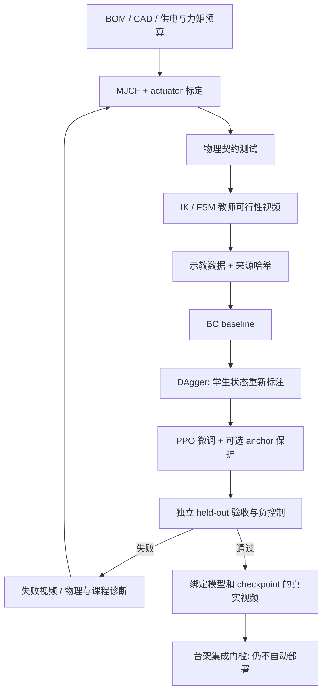

# 六个机械臂课堂实验：从 MuJoCo 到 RLX/PPO 验证

日期：2026-09-12 · **本文件保留原始设计目标，不是实测结果表。** 后续软件实现已运行模型、训练和视频，见 [IMPLEMENTATION.md](IMPLEMENTATION.md) 与 [RESULTS.md](RESULTS.md)。

> 当前实现是人工 IK/FSM + 有界 PPO 残差；双臂交接仅5 g、共同搬运为17 g总重。原20 g双臂目标、完整自主规划、制造与实体电气验证均未完成。不能用降载仿真课程的通过，替代本文件尚未达到的原始目标。每次训练归档了当时版本，不随本文后续说明改变历史证据。

配套：[架构与 BOM](README.md) · [网页原型](index.html) · [依据](SOURCES.md)。本设计中的拟建脚本/目录名称不能直接视为可执行命令；当前实际命令以实现文档为准。

## 1. 从已有八案例继承什么

| 现有案例 | 可继承经验 | 机械臂设计约束 |
|---|---|---|
| Dance | 动态目标 + 静止负控制能发现“停着也拿分” | 不仅奖励接近物体，还要完整抓起、搬运、释放 |
| Swing | 先让物理课程访问目标状态，再减少辅助 | teacher/辅助 reset 单独记录；最终评估从真实桌面 reset 开始 |
| Running | 用指令方向检验实际运动 | 换目标后必须相应移动，不只播放固定动作 |
| Stilts | 形态是实验身份 | 连杆、固定夹爪结构和电机变更更新 morphology hash；被搬物体变更更新 payload hash，场景变化更新 scene hash |
| Backflip | 辅助起跳、PPO 落地和站立交接分别归因 | IK、FSM、PPO 各自责任公开，不把完整流程都叫 PPO 学会 |
| Basketball | 平衡通过不等于滚动操控通过 | 夹住不等于搬到目标；单臂成功不等于双臂合作 |
| Bridge | 进度和视频不是跨越完成 | 漂亮动作但漏释放/掉物仍失败，保留诊断视频 |
| Drawing 彩笔 v2 | 当前 PPO、matching BC 均 40/40；历史铅笔失败仍保留 | 真接触计分、DAgger 和 anchor 保护；PPO 保留 BC 不等于提升 |

不把八个“场景”写成八个“均已学会”的策略。绘画依据为当前 `docs/drawing-case/brush/README.md`，不是早期课堂归档里的铅笔失败报告。

## 2. 共用 MuJoCo 场景规格（拟建）

### 2.1 模型与物理

- 资产组织提案：`rlx/assets/md_arm_t1/arm.xml`、`gripper.xml`、`table.xml`、`objects.xml`；单臂/双臂场景单独组装；所有资产和网格记录源头、许可证和 SHA-256。
- 世界坐标 Z 向上；桌面上方固定 arm base；物品是 `freejoint` 刚体。底座固定是实验前提，不属于抓取辅助；物体不能 weld 到夹爪、投影到目标或每步重写位置。
- 两根夹爪指由一个执行器带动，用机构耦合约束表达；约束只能在夹爪机构内部，不能跨接被抓物体。TCP 放在指尖中点，左右爪垫分组统计接触。
- 先用简单凸几何验证碰撞和惯量，再加入外观网格；外观不能改变物理判据。模拟 actuator 的限位、速度、扭矩饱和、延迟、摩擦及指垫柔顺，不用无限力位置伺服。
- 初始物理步长候选 0.002 s，控制 0.02 s，即 10 个子步 / 50 Hz；接触不稳则用 0.001 s / 20 子步复核。两步长下成功判据一致才接受，不靠调软接触隐藏穿透。
- 完成静态重力、单关节阶跃/阻尼、夹爪开口、抬起/释放、碰撞几何、reset 和无控制自由落体检查；达到阶段 G1 才开始 teacher 数据采集。
- 先无负载 reach；抓取只选已通过 IK/碰撞可达性检查的初始姿态。随机 reset 的拒绝采样次数、排除条件、接受率必须记录，不能只留下容易种子却声称泛化。

### 2.2 观测契约草案

统一米/秒/弧度，世界与 base 的变换写入 manifest。旋转 6D 使用旋转矩阵前两列，列序固定；不是六维欧拉角。训练/导出共用归一化，部署禁止再套一次不同归一化。

单臂 `md-arm-table-v1`：`obs[batch,66] → action[batch,6]`。初稿的 56 维基础块不足以表达随机障碍和末端航点，设计校验后补齐 10 维任务上下文，尚无旧机械臂模型需要迁移。

| 切片（左闭右开） | 维度 | 内容 |
|---|---:|---|
| 0:5 | 5 | 五姿态关节相对零点位置 |
| 5:10 | 5 | 五关节速度 |
| 10:12 | 2 | 夹爪宽度与宽度速度 |
| 12:18 | 6 | 上一拍安全过滤后实际执行动作 |
| 18:27 | 9 | TCP 在臂 base 中的位置 3 + 旋转 6 |
| 27:42 | 15 | 物体在 base 中的位置 3、旋转 6、线速度 3、角速度 3 |
| 42:51 | 9 | 目标在 base 中的位置 3 + 旋转 6 |
| 51:53 | 2 | 两个指垫是否接触目标物体 |
| 53:54 | 1 | 剩余时间比例 |
| 54:56 | 2 | 物体估计和目标的有效性掩码 |
| 56:59 | 3 | 单个箱形障碍中心位置，base 坐标 |
| 59:62 | 3 | 障碍的半尺寸（局部 xyz） |
| 62:63 | 1 | 障碍绕 Z 轴的 yaw，范围限定避免跨 ±π 边界 |
| 63:64 | 1 | 障碍有效掩码；无障碍时 56:63 置零 |
| 64:65 | 1 | 已完成航点比例；非多航点任务为 0 |
| 65:66 | 1 | 当前目标是否终点；只在终点允许完成放置 |
| **合计** | **66** | reach 无物品时物体块置零且物体 mask=0，场景类型由所选策略决定 |

动作 0:5 是归一化关节速度；映射到初始 ±0.4 rad/s 后乘 0.02 s（每拍最多 0.008 rad），再积分、限位/加速度过滤。动作 5 是归一化夹爪宽度速度，初始 ±0.01 m/s，每拍最多 0.2 mm。低层转换为舵机目标位置；不能把这些动作当成角度偏移或力矩直接下发。

物体到目标的旋转奖励只约束本任务可实现的轴/容差；五姿态关节不能被要求满足一般六自由度 pose。夹爪按物理开口正负方向标定，左右臂不能简单把所有角度乘 −1。A4 的 42:51 为当前航点，由明确的作者航点调度器依次更新，65:66 区分中间航点和终点；调度器不是 PPO 学到的任务规划。A3 首版仅一个刚性箱形障碍，多障碍/运动障碍需扩展契约，不能让策略看不到障碍却宣称有感知避障。

双臂 `md-dualarm-table-v1`：`obs[batch,116] → action[batch,12]`，两臂基座固定。对象/TCP 信息转换到工作台坐标，托盘内物品的额外状态明确使用托盘坐标。

| 切片 | 维度 | 内容 |
|---|---:|---|
| 0:27 | 27 | 左臂自体/TCP 块（对应单臂 0:27，TCP 改为桌面坐标） |
| 27:54 | 27 | 右臂同序块 |
| 54:69 | 15 | 共享物体位置、旋转、线/角速度 |
| 69:78 | 9 | 共同目标位置/旋转 |
| 78:82 | 4 | 两臂各两个指垫对目标物的接触 |
| 82:83 | 1 | 剩余时间比例 |
| 83:85 | 2 | 物体/目标有效掩码 |
| 85:94 | 9 | 右 TCP 在左 TCP 坐标系中的相对位置/旋转 |
| 94:100 | 6 | 各 TCP 到物体的位置差，工作台坐标 |
| 100:106 | 6 | 作者定义 FSM 阶段 one-hot：接近/夹取/抬升/转移/释放/稳定 |
| 106:108 | 2 | 被搬运对象倾角（桌面坐标 roll/pitch） |
| 108:109 | 1 | 对象是否被桌面/目标托架支撑 |
| 109:112 | 3 | 托盘内软块相对托盘的位移，以期望初始位置为零点 |
| 112:115 | 3 | 该软块相对托盘的线速度 |
| 115:116 | 1 | 托盘内软块估计有效；B1 无托盘内物品则整个额外块置零 |
| **合计** | **116** | 阶段由已发生接触和测量确定，不使用未来轨迹真值 |

动作顺序是左臂 6 + 右臂 6。首版用集中式 actor/critic，避免两个独立策略互相争抢对象；无需先引入多智能体算法。FSM 是明确的作者控制组件，不是 PPO 学到的高层规划。双臂交接阶段的转移表示“接收臂建立抓握后发送臂释放”。

硬件对应关系：关节/TCP 来自编码器和 FK；物体/速度来自相机跟踪；接触来自传感器及经验证的估计。MuJoCo 精确接触/支撑布尔值不天然可在硬件获得；在验证感知等价前两份契约都标 `simulation_only=true`。不得用估计可信度低的零值掩盖丢跟踪。

## 3. 六个案例和逐步动作

以下全部门槛都是**建议预注册的教学验收目标**，不是已测成绩。抓取统一基础：对象有双指真实接触、离原支撑面 ≥20 mm、连续保持 ≥1 s，且没有物体附着/外力辅助。对象高度以其 reset 时底面为基准，不把 COM 离桌面本身的高度当抬升。

### A1 `arm-reach-v1`：标定与末端到达

- 材料：单臂、固定底板、标定靶点；不夹物品。
- 场景：TCP 前方可达球内抽取目标，先平面后立体；所有目标通过 IK 与碰撞筛选。
- 动作：安全 home → 转底座 → 肩肘接近 → 腕姿态对齐 → 保持 → 返回。
- 教师：阻尼最小二乘 IK + 时间参数化，不把 IK 轨迹当 PPO 结果。
- PPO：先只学 reach，目标距离进展、末端误差、动作平滑为主；限制不适定姿态项。
- 验收：目标误差 ≤5 mm，任务指定的可控工具接近轴夹角 ≤5°，两者同时连续保持 1 s，12 s 内完成，无自碰/桌碰，至少 95/100 held-out episodes 成功；不要求任意六自由度姿态。
- 负控制：零动作、随机初始化 actor、交换目标；交换目标后应跟随新目标，而不是只到一个固定位置。
- 学生练习：改关节零点 +3°，观察误差；恢复标定后重新评估，不靠提高奖励补标定错误。

### A2 `arm-pick-place-v1`：取物并放下

- 材料：15–25 mm 软块（初始目标 20 g）、软爪垫、目标框和接物盘。
- 场景：物体平放，目标距离源点初始 40–60 mm，整个路径处于可达工作区。
- 动作：预抓取 → 下探 → 双指闭合 → 抬升 → 平移 → 降低 → 松爪 → 撤离。
- 教师/课程：先已夹住物体的 lift 子任务，再逐步回退到预抓取，最终 reset 必须从未抓物体开始；任何辅助 reset 记录数量。
- 验收：完成统一抓取；放置后位置误差 ≤10 mm、速度 <0.02 m/s，夹爪打开且 TCP 离物体 ≥30 mm，稳定 2 s；20 s 内完成，至少 90/100。
- 负控制：始终张爪、零摩擦诊断、禁用夹爪。物体仅被推到框内不能算抓取成功。
- 课堂视频：侧视确认离桌，顶视确认放置，叠加两指接触/物体高度；不能只播放终点。

### A3 `arm-relocate-v1`：绕障碍移动物品

- 材料：A2 软块，加 20 mm 高软障碍，目标仍在同一工作区。
- 场景：障碍挡住源点—目标的直接低位路径；障碍位置也随机化，不只是目标变化。
- 动作：抓取 → 抬到障碍顶以上 ≥10 mm → 绕/越障碍 → 放置并撤离。
- 训练：从 A2 权重开始可行，但另记新 run/scene/recipe；机械臂结构未变则保留 morphology hash。障碍高度从 0→10→20 mm，不一步设太难。
- 验收：A2 完整成功条件 + 所有臂/物体对障碍的非法接触为 0；25 s 内、至少 90/100。
- 负控制：不抬高的脚本；如果它撞障碍仍被打为成功，先修 evaluator。
- 拓展：低摩擦物体、标定偏差、遮挡；先设 perturbation 组，不能看完测试结果再挑简单组报告。

### A4 `arm-carry-v1`：持物搬运，不是鸭子行走

- 材料：轻块或带把手小物件；先不做盛液容器。
- 场景：固定机械臂的工作区内三个航点，总路径 ≥80 mm；所有航点经过姿态和碰撞预检。
- 动作：抓起 → 依次经过三个航点 → 搬运期间保持姿态 → 终点释放。
- 训练：先短路径/宽容差，再增程；目标是对象运动，不是只有 TCP 到位。
- 验收：各航点物体误差 ≤10 mm、对象倾角 <10°、非末端支撑接触为 0、未掉落，最终完成 A2 释放；30 s 内、至少 90/100。
- 消融：关掉姿态奖励，比较姿态误差；去掉航点次序检查，检验是否被终点捷径欺骗。
- 边界：这里的“搬东西”是固定底座臂搬运；Microduck 走路同时搬物是未来 P6，不能混称。

### B1 `arms-handover-v1`：双臂交接

- 材料：两套臂、长约 35 mm 的轻软交接棒、中央交接区、接物盘；总质量先不超过单臂 20 g 目标。
- 场景：双臂各有互不碰撞的抓持点；底座距 220 mm 起步，根据 IK/碰撞实测调整。
- 动作：左臂从桌面取物 → 进入交接区 → 右臂双指建立抓握并保持 ≥0.5 s → 左臂释放 → 右臂独立持物 ≥1 s → 放到右侧目标。
- 训练：从各臂 A2 teacher/BC 初始化数据，不把网络权重直接按输出拼接；用统一双臂观测重新拟合，PPO 微调。
- 验收：上述接触顺序全部成立，交接过程对象不接触桌面/托架，无掉落和臂间碰撞，最后按 A2 释放；30 s 内、至少 85/100；角色互换另报，不自动宣称对称泛化。
- 负控制：右臂始终张开、左臂提前释放、中央添加透明固定支撑的诊断场景。接受前两者或漏报支撑说明评分器错误。
- 归因：若 FSM 决定放手时机，应写“FSM + 学习控制”，不能说策略自主发现交接规则。

### B2 `arms-co-carry-v1`：双臂协作搬托盘

- 材料：两臂、超轻双把手托盘和软块；**托盘+物品总质量目标先 ≤20 g**，不是每臂各 20 g。
- 场景：托盘把手间距先约 80 mm；每侧都在自己工作区内；托盘不可绑定到两个 TCP。
- 动作：两臂分别接近把手 → 同时真实抓取 → 抬升 ≥20 mm → 搬运 ≥50 mm → 放到目标支架 → 同时撤离。
- 训练：先空盘短距离，再加入软块、增程；共享对象奖励 + 接触/内力限制，避免两臂拉扯。
- 验收：运输阶段双臂均有有效抓握 ≥95% 时长，托盘倾角 <5°、物品相对托盘位移 <5 mm，无掉落/非法碰撞，最终释放并稳定 2 s；35 s 内、至少 85/100。
- 合作审计：左右端负载分担目标各 ≥20% 的重力支撑（通过模拟接触力在准静态区段估计）；记录净支持、滑移及内力峰值，阈值须在训练前经模型/台架标定固定。
- 负控制：关闭一侧夹爪、将一侧停住；评分必须拒绝“单臂拖盘到终点”。若任务本身允许单臂完成，只能报单臂搬运，不能宣称必要协作。

## 4. 教师、BC/DAgger 与 PPO 的训练路线

### 4.1 数据与初始训练配方

1. **Teacher**：先 20 个不同起始布局全部完成全流程，再扩到训练分布。失败优先修模型、可达性或课程，不无限加 reward。
2. **BC**：收集提案 200–500 episodes，保存 `(obs, action, measured_state, contacts, task_phase)` 与 teacher 版本；按 episode 划分 train/validation，不能随机打散相邻帧造成泄漏。
3. **DAgger**：提案 2–4 轮，在 student 访问的状态上查询教师；记录 teacher/student 控制比例，明确数据中的辅助行为。真机未解锁前只能仿真采样。
4. **PPO**：从同一 BC checkpoint 初始化 actor，critic 新建；固定三个训练种子 101/202/303。先小规模 finite smoke，不把 smoke 当 skill pass。
5. **Anchor 可选**：固定 BC 数据上的行为约束或验证集回滚，记录被拒绝更新数。它属于复合方法；拒绝过多应停下来诊断，而非隐藏更新失败。
6. **匹配对照**：同一初始模型分别运行 BC-only 与 BC→PPO，用完全相同 held-out episodes 比较。只有收益超过统计波动、代价未恶化才主张 PPO 有提升。

起步参数（提案，不是稳定配方）：8 个 CPU 环境，rollout 256 步/环境，每 update 2048 transitions，minibatch 256，4 epochs，Adam lr `1e-4`，clip `0.1`，gamma `0.99`，GAE lambda `0.95`，entropy coef `0.001`，value coef `0.5`，max grad norm `0.5`，KL 提前停止目标 `0.02`。先 20 updates 检查数值，再按 100/500/1000 updates 分阶段评估；这些分别是 40,960 / 204,800 / 1,024,000 / 2,048,000 条实际 transitions，不含 teacher/BC 样本。

在 Mac 上先 benchmark 1/4/8 env，再确定并发；没有实测吞吐前不承诺耗时。现有 RLX 与绘画训练后端并不完全相同，下一阶段需选择一个已有可用后端并固定版本，不能把未验证的新 arm 环境硬塞进 61/14 adapter。设计不新增依赖。

### 4.2 奖励草案：先锁评价器，再调奖励

初始形式：`r = 1.0*progress + 0.5*grasp + 0.5*lift + 5.0*new_success - 0.01*effort - 0.05*action_change - 1.0*collision - 2.0*drop`。

- progress 为归一化任务距离的改善，使用有界 potential shaping；相位转换时保持定义连续或重置基准，不能因为切阶段凭空产生奖励。
- grasp / lift 是正确对象、正确阶段的测量值，归一化到 [0,1]，按秒计分后乘控制周期；避免原地抓住永远赚分。
- new_success 只在首次完整终态给一次；episode 结束不能再次累积。
- effort/action_change 非负，按归一化动作平方和/变化平方和定义；记录未缩放 raw 值和权重。界面惩罚系数保持非负，由公式减号施加，避免“双重负号”。
- collision/drop 为事件惩罚；严重碰撞、掉出安全区、NaN、非法约束辅助立即终止，不能用高奖励抵消硬失败。
- A3 增加障碍距离/净空诊断，A4 增加姿态误差，B1 增加交接顺序，B2 增加托盘姿态和拉扯惩罚；每次变权重生成新 recipe hash 并重训。
- 接触力不是绝对越大越好；夹爪压坏物体或两臂互拉都不可因“抓得牢”受奖励。

### 4.3 课程与随机化

训练初期用确定性布局，成功后逐级加：物体平移 ±5→±15 mm，物体朝向 ±10→±30°，质量 5→20 g，摩擦候选 0.5–1.0，关节阻尼/摩擦 ±10%，动作延迟 0→1→2 control ticks，姿态估计噪声候选 1–3 mm / 1–3°。这些范围是仿真探索值，实物前须用测量分布替代。

先在单因素扰动组定位失败，再评估联合分布。不得删除失败种子。验证组用于调参；held-out 测试组密封直到候选冻结。更大质量/半径是 OOD，单独报告，失败不回头修改测试集。

## 5. 指标矩阵：reward/loss 只是其中一层

| 层次 | 每次必须记录 | 如何解释 |
|---|---|---|
| 数据 | teacher episodes/transitions、DAgger 各轮数据量、BC MSE、held-out action error | 模仿拟合误差不是任务成功率 |
| PPO | env_steps、update、optimizer_steps、return mean/std、episode length | 真实交互与优化次数分开，不把 BC 训练当 PPO 采样 |
| 优化诊断 | policy_loss、value_loss、total_loss、entropy、approx_KL、clip_fraction、explained_variance、grad_norm、learning_rate | policy loss 可为负；不能一概“越低越好”；缺失为 null |
| 奖励拆分 | approach/grasp/lift/transport/release、effort、collision、drop 原始值和加权贡献 | 查清策略到底靠哪项得分 |
| 任务 | 成功数/总数、每阶段通过率、时间、位置/姿态误差、物体路径、滑移/掉落 | 完整定义见各案例，逐 episode 保留 |
| 接触物理 | 双侧接触率、抬升高度、非法接触、峰值接触力/冲量、辅助计数 | 没有真实抓起不能算抓取；台架上不把电流当精确接触力 |
| 双臂 | 同时抓持率、交接顺序、独立持物时间、托盘倾角、负载分担/内力 | 防止单臂捷径和作者动作冒领学习成果 |
| 工程 | 控制周期 p50/p95/p99/max、超时次数、状态新鲜度、模型/配方哈希 | 平均 50 Hz 不代表没有危险尾延迟 |
| 实体台架（未来） | 电压最低值、电流/温度曲线、夹持力、停止响应、落物情况 | 这些现在全为未测，仿真不能代填 |

推荐工件：`manifest.json`、`recipe.json`、`metrics.jsonl`、`teacher-manifest.json`、`bc-evaluation.json`、`evaluation.json`、`episodes.csv`、`policy.onnx`、`render-receipt.json`、`videos/`、`contact-sheet.jpg`。命名最后需与现有 artifact 路由衔接，不能只创建同名空文件就解锁通过状态。

manifest 最小字段：contract/version、joint order、units、control dt、actuator model、geometry/scene/tool/payload/normalizer/source hashes、repo commit 和 dirty source hashes、train/eval seeds、backend/依赖版本、teacher/BC/PPO 身份、actual env_steps、assistance、所有工件哈希。仅 Git commit 不足以覆盖当前未提交代码。

## 6. 验证与验收门槛

### 6.1 验证矩阵

| Gate | 检查 | 通过证据 | 拒绝条件 |
|---|---|---|---|
| G0 规格 | 实物型号/关节数/线序；CAD 质量与力矩 | 验货照片、BOM、台架许可 | 拍卖标题代替规格、供电未知 |
| G1 物理 | MJCF 编译、reset、finite、接触、重力、步长收敛 | 合同单测、两步长对照、teacher 全程视频 | weld 抓物、瞬移、穿透、无限伺服力 |
| G2 学习 | BC 与 PPO 配对，三个训练 seed | 数据/权重变化、真实采样日志、无泄漏清单 | teacher 伪装 PPO、只有 checkpoint |
| G3 技能 | 每模型 100 held-out episodes，案例全指标 | per-episode JSON/CSV、成功率与置信区间 | 只报 reward、挑最好 episode、缺失误差 |
| G4 负控制 | 零动作/随机 actor/张爪/单侧失效等 | 评分器拒绝其冒充完整成功 | 负控制也能获得 skill pass |
| G5 导出/渲染 | ONNX/native、同一 episode 和 source hash | 输出 max abs error ≤1e-4（float32 起步门槛）、独立 rollout、receipt | normalizer 不匹配、视频换模型 |
| G6 网页 | 真命令/状态/媒体/权限（实现后） | API 契约、路径安全、cancel、video range、桌面/移动端检查 | UI 标绿但 evaluator 失败，过期工件默认最新 |
| G7 台架 | 限位、电源、热、急停、掉线、重连、不争总线 | 有人监督的低速测试和故障注入录像 | 暗中自动上电/续跑、危险掉物、身体回路受阻 |
| G8 移动集成 | 新质量/惯量/支撑/抗扰/整机策略 | 独立整机报告 | 只因接口尺寸兼容就上机 |

### 6.2 样本量与统计诚实

- 每个候选固定 10 个测试配置 × 10 个 reset seed = 100 episodes，配置来自预定义测试分布，不把同一确定性 reset 的重复播放当 100 个独立样本。
- 每个训练种子分别满足案例门槛，不能用最好 seed 盖过另外两个失败；报告三者均值/离散与最差配置组。
- 每一配置组至少 8/10 成功的额外提案门槛，防止整体均值掩盖某个工况完全失败。
- 报 Wilson 95% 区间，并标注同配置样本可能相关；需要总体统计结论时按配置分层/聚类分析。90/100 的区间约 82.6%–94.5%，不等于保证真实成功率 ≥90%。
- 台架试验与仿真测试分开；20 次低速台架试验通过不构成产品安全认证。
- 验证集 anchor、checkpoint 选择与 held-out 测试严格分离；不得把最终测试失败反馈回训练后仍称同一测试集“独立”。

### 6.3 故障注入与回归

未来实现至少覆盖：错误观测维度/关节顺序、NaN、无效姿态、丢帧/乱序、错误模型 hash、USB 拔出、看门狗超时、软件取消、负载滑落、相机遮挡、关节卡住、急停后自动重连。物理硬件卡住等测试先用仿真/HIL，不能通过故意破坏舵机完成。

原八案例的目录、61/14 adapter 和身体 RPC 不动；新实验注册、配方字段、命令生成、评价投影和渲染回执有独立分支。对现有 API 成功/失败/诊断/无工件状态做回归，不能让新臂加入后旧失败案例变成通过。

## 7. 视频生成与课堂展示方案

**当前没有机械臂视频。** 网页显示待生成，不借用 LeArm 宣传片作为本项目验证。

1. G1 teacher：录制 1 个完整成功和 1 个真实失败/纠正案例；片头 `TEACHER / SIMULATION`。
2. BC baseline：固定测试集至少保留一个代表性成功与一个失败（若有）；不能只保留 PPO 好看片段。
3. PPO：对固定 eval episode 全程渲染，不重新采 seed；片头/叠字包括 case、run、controller、seed、assistance、物体质量、`SIMULATION ONLY`。
4. 视频时间来自模拟时间戳：建议 25 fps，50 Hz 控制每两拍一帧，固定 1280×720；10 s 模拟应约 10 s 视频，另记录丢帧/加速播放，不只按墙钟速度截屏。
5. 两视角：顶视看搬运路径/遮挡，侧视看离桌/释放；双臂必须同时可见。画面叠加对象高度、误差、阶段、接触/掉落和 episode verdict，不能把目标 ghost 当实际对象。
6. 接触图/轨迹来自同一 episode trace；末帧不足以证明完整流程。视频旁展示失败原因与相同 evaluation.json。
7. receipt 绑定 scene、mesh、source、recipe、checkpoint、normalizer、episode specification、原始 trace、视频和 contact sheet 哈希；状态变化后旧视频只能标 reference/stale。
8. 实体台架录像另标 `HARDWARE / BENCH`，拍到接物盘和操作区域；不可与仿真剪接成连续“真实表现”。

建议课堂短片 60–90 s：10 s 场景/物料 → 15 s 关节和状态图 → 15 s teacher vs BC vs PPO → 20 s 完整任务片段 → 15 s 指标/失败分析。另附无剪辑全长验收视频，短片不替代证据。下一阶段可生成字幕和英/中课堂幻灯片，本次先锁定实验事实来源。

## 8. 学生实践与实施清单

一节 90 分钟课可分：10 分钟硬件和安全 → 15 分钟关节/TCP 坐标 → 15 分钟 teacher 与接触 → 20 分钟复用预训练或短 PPO smoke → 20 分钟评估/负控制 → 10 分钟解释失败与限制。完整训练耗时由 benchmark 决定，不能让学生误以为一堂课的 smoke 就是最终模型。

学生提交物：BOM 修订、坐标图、recipe、controller 来源、reward/loss 图（实际日志）、100-episode 结果、失败分析、全程视频、hash manifest、仿真与真机能力边界。允许“失败但诊断完整”获得学习评价，不强迫为了成绩美化成功率。

下一阶段拟建文件边界（尚不存在）：

- `rlx/rlx/environments/arm.py` / `dual_arm.py`：新合同与物理，不改 shared 61/14 常量。
- `rlx/examples/ppo_microduck_arm.py`：teacher、BC/PPO、eval/export/render 生命周期。
- `rlx/tests/test_arm_contract.py` / `test_arm_evaluation.py`：先锁评价和负控制。
- `duck-viewer/lib/experiments.ts` / `rlx-job.ts` / `evaluation.ts`：新分组、配方和 fail-closed 投影。
- `duck-viewer/lib/rlx-render-evidence.ts`：扩展源绑定，保留现有视频 HTTP range 服务。
- `microduck/` 的协议与新进程：仅在 P4 单独评审后实施，原 `robotd` / `Safety` 身体控制边界保持。

**首个完成标准不是“六个案例按钮能点”，而是 A1/A2 的真实 MuJoCo 接触、可追溯 teacher、独立 evaluator 与一段诚实标注的完整视频。**
