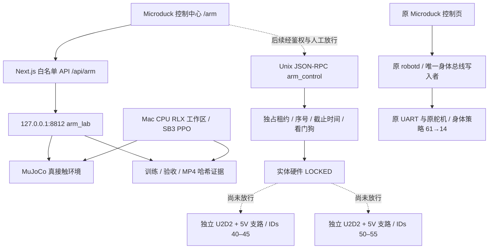
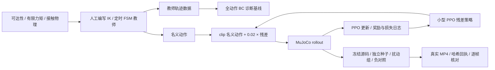

# MD-Arm-T1 实现与课堂复现实验

日期：2026-09-12。**软件仿真实现，不是制造放行或实物验收。**

## 1. 交付边界

这次新增六个机械臂实验，保留原有八个 Microduck 技能与身体策略契约。机械臂采用独立桌面底座；没有把重型机械臂挂到鸭子身上，没有改写 `microduck/` 的 `robotd`，没有接通任何实体串口或舵机。

| 交付 | 文件/入口 | 当前性质 |
|---|---|---|
| 物料规格、电源/TTL 原理图 | [HARDWARE.md](HARDWARE.md)、[BOM](../../hardware/md-arm-t1/bom.json) | 型号事实、设计参数、待测项分列 |
| 参数化 CAD、尺寸图、概念 STL | [hardware/md-arm-t1](../../hardware/md-arm-t1/) | 无精密安装孔；不能直接加工装配 |
| 六套 MuJoCo MJCF | [rlx/assets/md_arm_t1](../../rlx/assets/md_arm_t1/) | 实际可运行的刚体/接触仿真 |
| Gymnasium 环境 | [arm.py](../../rlx/rlx/environments/arm.py) | 66/6 或 116/12 独立契约 |
| BC、PPO、评估 | [ppo_microduck_arm.py](../../rlx/examples/ppo_microduck_arm.py) | 真实优化器、检查点、奖励及损失日志 |
| 视频和 ONNX | [render_microduck_arm.py](../../rlx/examples/render_microduck_arm.py) | 实际物理回放；残差专用 ONNX，非完整控制器 |
| 控制中心 | 同一 `duck-viewer` 的 `/arm` 页面 | 实时仿真、手动动作、教师控制、验收结果与视频 |
| 实物控制准备 | [CONTROL.md](CONTROL.md)、[arm_control](../../arm_control/) | Unix RPC、安全状态机、协议编码；硬件默认锁定 |

## 2. 集成架构与电气隔离




**实线是现有软件链路；虚线是尚未授权的实物集成。** HTTP 仿真并不经由 Unix 硬件协调器，也不等于已经实现机身运动互锁。`arm_control` 的模拟 transport 只用于 RPC/安全状态机测试，其固定温度、电压不是传感器实测；网页不展示这些数值为真机遥测。

每臂新购六颗 XL330-M288-T、独立 USB/U2D2 与受保护的 5 V 供电。复用的是 Dynamixel 技术栈与控制思想，不是拆走原机电机，也不保证原机不同 XL330 子型号的力矩/速度参数相同。详见硬件 BOM 中的逐项核验。

**禁止**机械臂 VDD 接原电池、机械臂 DATA 接原身体 DATA、把 U2D2 当电源、把六颗电机总电流穿过一段未经额定验证的三针线束。电源支路保护、急停触点、线束载流量以及安装公差未验证，不能给学生接线通电。

## 3. 模型参数：哪些是真实规格，哪些是仿真假设

| 项目 | 实现值 | 证据等级/限制 |
|---|---|---|
| 姿态关节 / 夹爪 | 5 个转动关节 + 1 个联动夹爪动作 | 不是任意六维姿态可达机械臂 |
| 臂长 / 肩高 | 65 / 55 / 30 mm；肩高 80 mm | 项目布局参数，非成品臂测量 |
| 控制 / 物理步长 | 50 Hz；2 ms（另测 1 ms） | 仿真配置，不承诺 Mac 实时调度 |
| 角速度 / 开合速度 | 0.4 rad/s；0.01 m/s | 动作积分为位置目标；另有关节软限位 |
| 姿态伺服 | kp=8，kv=0.15，力矩限制 ±0.16 N·m | 仿真假设；不是厂商持续额定力矩 |
| 夹爪模型 | 两滑块、一个 equality 联动；kp=350，kv=2，执行器力限 ±1 N | 还未标定真实舵机角度—开口—夹力映射 |
| 夹垫接触 | 摩擦 1.2，condim=4，扭转摩擦参数 0.005 | 假设软垫；必须实测并做 sim2real 标定 |
| 物体 | freejoint；接触摩擦抓取 | 无物体 weld、瞬移、外力托举或动画替代物理 |
| 碰撞检查 | 每个物理子步；桌面、障碍、臂间及非相邻自碰撞 | 共位腕关节壳体有显式 elbow–hand 相邻排除；不是全 CAD 碰撞验证 |
| 双臂底座间距 | 交接 150 mm；协作托盘 242 mm | 两种独立桌面布局，不能把历史 220 mm 方案冒充已验证通用布局 |

MuJoCo 使用简化胶囊/盒体和设计质量，不是由已加工 CAD、实际转动惯量、间隙或 BAM 电机标定导出的数字孪生。**仿真成功不能证明打印件装得上、舵机不发热或实物能承载。**

当前物体位姿、双指接触、负载与滑移观测来自MuJoCo真值，不是实际相机或力传感器。实物阶段还需选定桌面视觉/标记物与接触测量方案，完成内外参、世界/底座/TCP变换、时间戳和延迟验证；当前没有实体66/116维观测编码器。缺少这些测量时必须保持sim-only，不能用零值冒充有效感知。

## 4. 六个课堂实验

| ID | 内容 | 本次载荷 | 核心验收 |
|---|---|---|---|
| arm-reach-v1 | 末端触达 | 无搬运载荷 | 位置≤5 mm、工具轴≤5°，连续 1 s |
| arm-pick-place-v1 | 取物再放置 | 20 g | 双指接触抬升≥20 mm 持续 1 s；受控释放后稳定 2 s |
| arm-relocate-v1 | 跨过固定障碍移物 | 20 g | 同上；禁止碰障碍，不把推到目标当抓取 |
| arm-carry-v1 | 沿三航点搬运 | 20 g | 三航点、路径≥80 mm、运输倾角<10° |
| arms-handover-v1 | 左手给右手 | **5 g 降载课程** | 双手重叠夹持≥0.5 s、接收手单独保持≥1 s |
| arms-co-carry-v1 | 两手共同搬托盘 | 托盘12 g + 松散载荷5 g = **17 g** | 共享抓持≥95%、倾角<5°、三维载荷滑移<5 mm、平移≥50 mm |

所有操作任务必须按**接触抓持→实际抬升→有支撑的受控释放→当前目标状态稳定**完成；旧计数器历史最高值不能单独判成功。终态要求目标误差≤10 mm、无夹爪接触、开口≥26 mm、末端退出≥30 mm、物体有桌面支撑且线/角速度受限。空中丢失抓握超过 20 ms、非受控落桌、非法接触均禁止通过。

协作托盘另验证准静态载荷：至少25个控制采样，每臂平均垂直支撑≥总重20%；总支撑在重量的80%–120%内的样本≥95%；水平内力峰值<1 N。**这只是显式仿真守卫，不是已标定的硬件夹力安全阈值。** 双臂20 g额定课程与实物验收仍未完成。

## 5. 训练方法与指标解释



这里 **PPO 学的是有界小残差，而不是从零学会全部抓取规划**。教师承担到达、闭爪、抬升、运输、放下及退出顺序；双臂观测中的阶段来自该人工定时调度。BC 是带调度上下文的全动作诊断，不是自主规划基线。BC 的 MSE 下降也不能代替操作成功率；任何失败必须保留。

PPO：CPU、一个环境、每轮256步、batch256、4 epochs、两层64单元、学习率1e-4、gamma0.99、GAE0.95、clip0.1、entropy0.001、梯度上限0.5、target KL0.02。每个任务用101/202/303三个训练种子，每次32768环境步。实际版本、时长、参数变化、源码/场景/检查点哈希记录在各自 `training.json`。

日志包括 `metrics.jsonl` 的 policy/value/entropy loss、KL、clip fraction、explained variance、标准差、更新数；`episodes.jsonl` 记录每回合训练奖励、长度、是否过门槛。BC 的采样数据、逐轮MSE单列保存。任务奖励包含进度、抓握、抬升、成功、动作代价/变化、碰撞与掉落项，**奖励不是独立验收标准**。

BC表格来自训练进程内的真实诊断评估；其诊断记录没有PPO那样完整的检查点哈希绑定。因此网页不能把BC报告冒充完整验收产物，会显示证据未核实；PPO的18份主评估则经过检查点/模型/源码验证。课堂比较时要区分“记录了成功次数”与“完整产物溯源已验证”。

每个 PPO 检查点在10组配置×10个种子评估：位置随机±0.5/1/1.5/2 mm、质量±10%、摩擦±10%、小幅组合扰动。种子从50000开始，与训练、调试不同。报告包含每组成功率、失败门槛、回报、95% Wilson 区间。不同训练种子复用同一测试集，是配对比较；不能把300次合并成300个独立场景。通过标准为任务总成功率≥95%/90%/85%（随任务），且各组≥80%。这些小扰动不是完整 sim2real 随机化。

质量/摩擦扰动施加于主 `object` 刚体及其几何体；协作场景中被扰动的是12 g托盘本体，额外5 g松散载荷保持不变。因此±10%托盘质量对应15.8–18.2 g装配总重，不是整个17 g系统的±10%。起点与目标共享平面平移抖动，不是任意新目标或任意障碍布局泛化。

## 6. 复现命令

从工作区根目录运行，使用现有 `rlx/.venv-microduck`，不改动原八技能依赖：

```bash
rlx/.venv-microduck/bin/python -m pytest rlx/tests/test_arm_contract.py rlx/tests/test_arm_evaluation.py rlx/tests/test_arm_pipeline.py
python3 -m unittest discover -s arm_control/tests -v
python3 -m unittest discover -s hardware/md-arm-t1/tests -v
rlx/.venv-microduck/bin/python rlx/examples/ppo_microduck_arm.py assets --output rlx/assets/md_arm_t1
rlx/.venv-microduck/bin/python scripts/arm_lab.py --port 8812
```

保留上面的仿真服务，在另一终端从 `duck-viewer` 运行已有 `npm run dev`，打开其实际打印的端口并进入 `/arm`。已有服务可以直接访问同一页面，不需要停止旧 duck-lab；8812 特意与旧879x端口分开。

```bash
rlx/.venv-microduck/bin/python scripts/run_arm_experiments.py --output rlx/runs/arm/my-fresh-batch --workers 3
rlx/.venv-microduck/bin/python rlx/examples/render_microduck_arm.py --case arm-pick-place-v1 --checkpoint rlx/runs/arm/my-fresh-batch/arm-pick-place-v1/seed-101/ppo-residual.zip --output rlx/runs/arm/my-fresh-batch/arm-pick-place-v1/seed-101 --export
```

批处理拒绝已有目录，避免覆盖失败与旧证据。执行命令返回成功只代表程序执行完，不代表案例通过；查看 `evaluation.json` 的 `passed`、每个门槛与完整回放。

## 7. 学生实践顺序与剩余门槛

1. 先学习 BOM 上“厂商事实 / 设计假设 / 待验证”的区别，读电路图，不通电。
2. 在 `/arm` 手动移动单关节，观察几何、目标与限位，重置后运行教师；解释为什么这不是 PPO。
3. 跑零动作、开爪、双臂禁右手负对照，观察失败门槛，证明验收不是只看终点距离。
4. 训练 BC 和残差 PPO，对照回报曲线、损失、成功率、区间和不同种子的结果。
5. 看 MP4 中真实抓持、抬升、交接、落放；用回执核对案例、检查点、源码和模型版本。
6. 在独立硬件阶段完成孔位/公差、夹爪映射、电压/电流/温升、供电保护、急停响应、校准与带载测试。
7. 最后再补原 `robotd` 的可证明身体运动独占互锁、策略组合推理和桌面硬件闭环。此之前不能解除硬件锁，更不能把当前残差 ONNX 直接发给舵机。

最终结果以本目录 `RESULTS.md` 及对应运行产物为准；没有结果的项目明确保留“未执行/未通过/未验证”。
