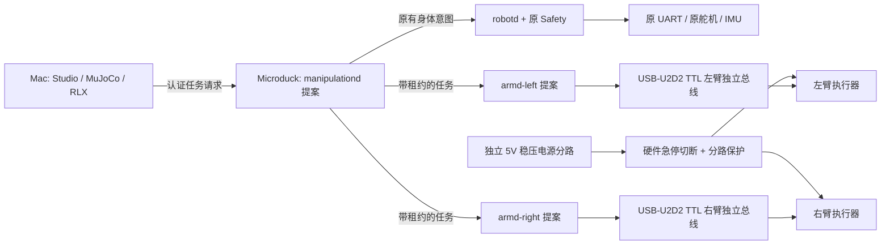

# Microduck 兼容机械臂：第一阶段设计

日期：2026-09-12 · 原文为第一阶段设计；后续已新增软件仿真实现。**尚未制造或连接实体硬件。**

> 实现与原设计的差异、启动方法、控制集成、仿真参数和课堂流程见 [IMPLEMENTATION.md](IMPLEMENTATION.md)。实际训练及验收以 [RESULTS.md](RESULTS.md) 的证据为准。下面保留原设计目标，不将未达成的目标当作实测能力。

课堂交付：[中文PDF](CLASSROOM.zh-CN.pdf) · [可点击文档/视频的HTML](CLASSROOM.zh-CN.html) · [实现验证矩阵](VERIFICATION.md) · [机械臂与身体部件一致性](COMPONENT-CONSISTENCY.zh-CN.md)。旧 `README.pdf` 是原设计快照，不是本次实现验收书。

## 0. 交付范围与推荐结论

本节记录最初设计范围；新增实现仍不更改现有八个技能、不修改 `microduck/` 的机器人运行代码。模型、PPO 和视频等新增产物单列在实现与结果文档，不从设计草案推断成功。

- [中文控制中心网页原型](index.html)：保留的离线设计原型。新增实际交互页面为同一 `duck-viewer` 的 `/arm`，不是此静态原型。
- [实验、MuJoCo、RLX/PPO、指标与视频规范](EXPERIMENTS.md)。
- [硬件网站、开源案例与本地证据](SOURCES.md)。
- [Amazon 候选选型与采购核验](AMAZON.md)：型号优先，不把商品搜索入口当库存确认。
- [本次设计校验记录](VALIDATION.md)：维度、网页、审查修订及尚未验证的内容。

**建议主线：用新购同系列 XL330 舵机做小型桌面固定臂，先单臂，再双臂；Microduck 统一调度，机械臂独立供电、独立通信总线。暂不直接装到 Microduck 身上。**

这里“兼容”首先指控制体系、通信生态、时序、训练流程及证据格式兼容，不等于机械直装、供电直连或旧策略即插即用。复用规格，不拆走原机腿部/头部舵机。机器人的机载电脑负责协调，Mac 负责训练和重型仿真，不要求 RK3566 运行训练。

拍卖臂保留为第二条“现成套件适配”路线：适合观察结构、夹爪、手柄示教和桌面抓取，但必须识别实物后决定接口。不能把宣传中的“6DOF”直接解释成六个独立姿态关节。

## 1. 已核实事实与未核实项目

下表来源编号对应 `SOURCES.md`。标为“提案”的数字是设计输入，不是测得性能。

| 项目 | 已核实证据 | 对设计的影响 |
|---|---|---|
| 用户拍卖页面 | [S1] 品牌字段 LewanSoul，正文写 LeArm；标题写 5 Servo，正文写 6 个数字舵机 | 实际版本、完整关节清单、供电、控制板协议、附件齐全程度均待验货 |
| 实体 Microduck | [L1] 15 个关节：左右腿各 5，颈/头 4，嘴 1 | 与旧材料“14 舵机”表述不同；本设计以当前源代码为准 |
| 原步态策略 | [L2] 61 维观测、14 维动作，跳过 mouth 索引 9 | 不把机械臂数据塞进旧 ONNX；新增独立契约 |
| 原通信 | [L3] XL330 控制器、Dynamixel Protocol 2、1 Mbps、50 Hz，部署 UART `/dev/ttyS2` | 可复用设计模式，但不抢占该 UART |
| 原电池读数 | [L1] 电量估算使用 6.6–8.2 V | 这是电池侧软件范围，不是舵机端实测电压，不能据此接线 |
| XL330-M288-T 候选 | [S2] 18 g，3.7–6.0 V，推荐 5.0 V，5 V 堵转 0.52 N·m / 1.47 A | 低压、轻量、带反馈；堵转力矩不能当持续额定力矩 |
| U2D2 | [S3] USB 通信适配，提供 TTL 接口，但不为舵机供电 | 必须另设合适的 5 V 电源和分配线束 |
| 软件控制权 | [L4] `robotd` 独占身体总线，客户端通过 JSON-RPC 提交意图 | 新 `armd` 独占新总线，协调器不直接写任何串口 |
| 当前绘画结果 | [L7] 彩笔 v2 PPO 和 matching BC 均 40/40 通过 | 可借鉴 BC/DAgger→受约束 PPO，但不能宣称 PPO 比 BC 更好 |

**拍卖不等于物料规格书。** 不能拿当前 LeArm AI 的供电/总线资料推断旧拍卖 LeArm；也不将已结束拍卖成交价当现行采购报价。未知内容保留在验货门槛中，不用猜测填平。

## 2. 路线选择与系统边界

| 路线 | 可复用部分 | 代价/限制 | 本阶段决策 |
|---|---|---|---|
| A：拍卖 LeArm 原装控制板 + 网关 | 金属支架、夹爪、手柄、原配软件和示教思路 | 型号/SDK/反馈未知；PWM 型可能无关节位置、电流反馈 | 条件备选，先识别，不接原机总线 |
| B：紧凑 XL330 定制桌面臂 | 原机的 Dynamixel 技术栈、低压舵机生态、位置/电流/温度反馈模式 | 需设计轻量支架、线束、夹爪和标定，肩部力矩余量有限 | **推荐研发主线** |
| C：SO-101 等成熟教学臂 | 开源装配、标定、示教流程 | [S5] follower 使用 STS3215，非 XL330，不是总线/电气直兼容 | 学习参照，不作为本设计混接替代件 |
| D：把现成金属臂直接挂上鸭子 | 表面上最快出现“有手的鸭子” | 自重、重心、冲击、电池和步态泛化均未知 | 第一阶段不做 |

若 B 的肩部力矩/热测试失败，先缩短臂长、减小载荷、移近电机或加被动配重/弹簧补偿；仍失败才另开“更强肩部舵机”硬件修订。不能换了电机后沿用旧模型、动作尺度和验收报告。

## 3. 机械构型：MD-Arm-T1（提案）

### 3.1 自由度、尺寸和关节约定

**五个姿态关节 + 一个夹爪驱动 = 六个主动执行器。** 夹爪两指联动，开合是一个自由度，不是两个；它也不增加 TCP 的姿态自由度。因此不能保证任意位置与任意三轴姿态同时可达。

| 顺序 | 名称 | 功能 | 初始软件限位草案 | 初始速度上限草案 |
|---|---|---|---|---|
| J1 | base_yaw | 底座转向 | −100°…+100° | 0.4 rad/s |
| J2 | shoulder_pitch | 肩部抬举 | −60°…+80° | 0.4 rad/s |
| J3 | elbow_pitch | 肘部折叠 | −100°…+100° | 0.4 rad/s |
| J4 | wrist_pitch | 夹爪俯仰 | −90°…+90° | 0.4 rad/s |
| J5 | wrist_roll | 夹爪滚转 | −90°…+90° | 0.4 rad/s |
| G | gripper_width | 两指间开口 | 0…30 mm | 10 mm/s |

这些范围只是建模起点，须由 CAD 无碰撞范围和实物零点收紧；禁止通电后直接运动到表中极限。夹爪角度到宽度的非线性映射须实测，夹紧以限流和接触检测结束，不靠堵死机械限位。

- 肩至肘 65 mm，肘至腕 55 mm，腕至夹持中心 30 mm：几何最大伸展约 150 mm；实际安全工作区是其中经过 IK 和碰撞检查的一部分。
- 教学对象：约 15–25 mm 的轻量软块；初始有效载荷目标 20 g，包括被搬运对象，不包括夹爪本体。
- 四个远端舵机和夹爪尽量靠近关节轴；承力关节用双侧支撑/轴承，避免输出轴承受长悬臂径向载荷。
- 底座用两点以上夹具固定到教学板；无固定夹具不执行抓取。使用软接物盘、护罩、软爪垫、圆角和可观察的走线余量。
- 桌面双臂底座中心距初始设 220 mm，可调 180–240 mm；几何上有重叠不代表有无碰撞交接区，必须扫完整双臂姿态空间。

### 3.2 初步重力矩预算：不是承载认证

最不利水平姿态使用 `τ = 9.81 × Σ(mass_kg × horizontal_lever_m)`；实际结果必须从 CAD 逐关节计算，再加加速度、线束阻力和夹持偏心。

| 肩部下游假设 | 质量 | 对肩水平力臂 | 力矩 |
|---|---:|---:|---:|
| 肘、腕俯仰、腕滚转、夹爪电机 | 各 18 g | 65 / 120 / 135 / 145 mm | 0.08211 N·m 合计 |
| 上臂轻量支架 | 20 g | 32.5 mm | 0.00638 N·m |
| 前臂轻量支架 | 15 g | 92.5 mm | 0.01361 N·m |
| 末端支架与爪垫（不含电机） | 15 g | 135 mm | 0.01987 N·m |
| 物品 | 20 g | 150 mm | 0.02943 N·m |
| **合计** | 下游 142 g | — | **约 0.1514 N·m** |

这是警告而不是通过：即使小载荷，自重也占主导。内部筛选目标定为静态 ≤0.12 N·m；0.12–0.16 N·m 为需要减重/补偿和热验证的灰区；>0.16 N·m 暂停当前肩部方案。这些是本项目保守设计门槛，**不是 ROBOTIS 连续额定值**。本草案 150 mm / 20 g 组合仍在灰区，未获制造冻结批准。

最小样机从无负载、80–100 mm 工作半径开始。六电机质量已达 108 g，加暂估 50 g 支架约 158 g，尚不含底座、电源/线束/夹具。不能以此估值推断适合装在约 800 g 的 Microduck 身上。

静态筛选值不授予任何实物 GO。每个负载组合必须额外经过最坏姿态/实际占空比的温升和重复运动台架测试：先低负载短周期，再逐步延长至至少 30 分钟的教学占空比试验，记录温度是否仍上升、峰值/持续电流、跟踪误差和停机行为；必要时延长直到热稳态，不能用“30 分钟未坏”替代热稳定。含加速度、夹持偏心与线束力的负载上界须重新计算。超过保护阈值、持续升温或跟踪恶化即撤回负载目标。

## 4. 物料清单与验货单

数量按单臂；双臂不能只把软件参数改为 2，必须补齐电源分路、底座和急停覆盖。

| 模块 | 单臂 | 双臂 | 选择/复用方式 | 下单/安装前证据 |
|---|---:|---:|---|---|
| XL330-M288-T 候选舵机 | 6 | 12 | 新购同族规格，非拆原机 | 完整型号、固件、连接器、可读 ID、扭矩/热预算 |
| U2D2 TTL 通信适配器 | 1 | 2 | 每臂独立 USB 总线，易隔离故障 | Microduck USB 主机枚举和稳定设备路径，TTL 接口接线 |
| XL330 匹配线缆/转接线 | 按 6 节拓扑 | 按 12 节拓扑 | 正确线序；不凭颜色或外形判断 | 原厂 pinout、连续性、反接/短路检查 |
| 独立稳压直流电源 | 1 | 2 | 每臂 5.0 V / 10 A 级候选 | 满载压降/纹波、限流、保护、电缆与接插件额定值 |
| 分配板、熔断/限流分路 | 1 套 | 2 套 | 就近注入电源，不能整臂电流穿过一条细菊花链 | 线径/连接器/保险配合、故障隔离设计 |
| 硬件急停与电源切断模块 | 1 套 | 1 套覆盖两路 | 正确 DC 分断额定值；手动复位 | 断电测试、负载跌落防护和无人复位行为 |
| 肩/肘支架、轴承、紧固件 | 1 套 | 2 套 | 优先轻量打印件 + 关键金属支承 | CAD 重量、挠度、碰撞、夹具保持力 |
| 联动夹爪、弹性爪垫 | 1 | 2 | 0–30 mm 草案开口，软夹持 | 角度—开口标定、偏心夹持、夹力实测 |
| 固定底板、双点夹具、接物盘 | 1 套 | 1 套加宽 | 与鸭子机身分离 | 单臂/双臂最坏负载下不滑动、不倾覆 |
| USB/RGB 相机、标定板、标记物 | 1 套 | 1 套或加侧视 | 桌面相机第一；原机摄像头后续评估 | 内外参、遮挡、帧延迟和坐标变换误差 |
| 触点/爪垫传感器 | 2 个候选 | 4 个候选 | 用于硬件双侧接触验证 | 接口电平、标定、采样和失效诊断 |
| 软块、轻托盘、障碍物 | 1 套 | 1 套 | 质量可测，桌面搬运优先 | 质量、几何、材质和摩擦测量记录 |
| 量具/仪器 | 共享 | 共享 | 卡尺、电子秤、万用表、温度与电流记录 | 可追溯读数，必要时借用示波器/负载仪 |
| Mac + Microduck 机载电脑 | 复用 | 复用 | Mac 训练；Microduck 任务协调 | USB/CPU/网络资源余量，不阻塞身体 50 Hz 回路 |

暂不提供“买齐即可工作”的价格总额；卖家链接、地区、税费与版本尚未固定。后续采购表应补单价、货源、交期、替代件和验收记录。

### 拍卖套件先做这 8 项

1. 拍摄整机、每个舵机标签、控制板正反面、电源铭牌及全部附件。
2. 按“姿态关节数 + 独立夹爪驱动数”统计，不照抄 6DOF 标签。
3. 确认各接口是 PWM、厂商串口总线还是 Dynamixel；三根线不代表相同协议。
4. 确认每个模块电压与线序，保持断电检查，不直接试插 Microduck。
5. 记录 PC/APP/手柄是否必须经专有控制板，有无公开协议和反馈 API。
6. 识别哪些关节可读真实位置、电流、温度；没有反馈不能用“已下发角度”替代观测。
7. 测量连杆、关节零点、质量和夹爪开口，建立实际模型，而不是套用 LeArm AI 数据。
8. 完成限流单关节台架测试后，才决定保留原控制板还是仅复用机械零件。

## 5. 供电、总线与安全设计

- [S2] 六个 XL330 在 5 V 的堵转电流算术和为 `6 × 1.47 = 8.82 A`，功率约 44.1 W；这不是正常运行功耗，也不是允许堵转的理由。10 A 级电源是瞬态规划，不代表细线/单个连接器能承受 10 A。
- 两臂按两套供电分配设计。USB 只承担通信；信号地与舵机电源地正确共参考，电源正极禁止回灌 USB 或原机。U2D2 不等于电隔离器。
- 电池侧 6.6–8.2 V 不可直供 6 V 上限的 XL330；原机电源板的输出能力未测量，不取电。现场接线和 DC 保护额定值须经有经验的硬件人员复核。
- 原机 ID：右腿 10–14，左腿 20–24，头嘴 30–34，IMU 200。候选新左臂 ID 40–45、右臂 50–55；它们只是保留规划，启动时还需在各独立总线上实际扫描、核对型号、序号和关节映射。
- 每条臂总线只有一个 `armd` 写入者。串口设备锁、固定 udev/设备身份映射、schema 校验、动作限位/限速/限加速度、异常关节/电压/温度监测均为硬件解锁条件。
- 原机已有约 500 ms deadman [L4]，不能据此声称机械臂也已安全。新臂提案：5 个 20 ms 周期未收到有效状态/指令即进入保护停止；协调器 500 ms 租约过期也停。每条臂需本地看门狗，不能依赖浏览器网络。
- 温度提案：55°C 警告、60°C 停止作业并按预案卸载；低于厂商 70°C 上限但仍需测外壳与内部温差。过流/欠压阈值由台架确定，当前不写死额定持续电流。
- **保护停止不等于立即松爪。** 有电且状态可信时减速并保持/安全放置；传感器失效或硬急停必须切断时，依赖被动支撑、低高度和接物盘防坠。严禁用“自动松爪”处理所有故障。
- 使用非危险轻软物品，学生手不进入运动区，不举过人，不用硬币大小易弹飞件、刀具、热物或易碎物。网络按钮不是安全认证急停；本方案不构成工业协作机器人安全认证。

## 6. 软件与统一控制中心

### 6.1 控制权和部署位置（提案）

| 层 | 运行位置 | 权限与责任 |
|---|---|---|
| Studio / 教学页面 | Mac/浏览器 | 选场景、看证据、提交任务；不写串口，不独立决定硬件解锁 |
| RLX / MuJoCo / 教师 / 训练 | Mac | CPU 起步；训练、评估、渲染，不进入实时身体回路 |
| `manipulationd` 新协调器 | Microduck 机载 Linux | 统一任务/模式/租约/日志；互斥身体移动与未授权机械臂活动 |
| `robotd` 原进程 | Microduck | 保持现有身体唯一控制权和 61/14 推理接口 |
| `armd-left/right` 新进程 | 优先 Microduck，资源不足时在受控外设节点 | 各自独占臂总线、安全过滤、状态反馈；只接受协调器有效租约 |
| 真机臂策略推理 | 优先臂进程本地，基准测试后定 | Mac 断线也可按保护预案停止；不允许网络延迟直接决定伺服时序 |

桌面离线教学可用仿真协调器；网页必须标注 `SIMULATION`，不能显示“已连接 Microduck”。机载集成目标依旧是 Microduck 为唯一控制权威，而非另起一个互不受控的机械臂产品。

### 6.2 新接口草案，不是现有可调用 API

建议扩展版本 `manipulation.v1`，使用现有 JSON-RPC/Unix socket 架构的风格，但单独的命名空间和协议类型。远程浏览器经认证网关，Unix socket 权限限制本机用户；现有 UI 能访问不等于获得运动授权。

| 提议 RPC | 内容 | 约束 |
|---|---|---|
| `manipulation.capabilities` | 设备身份、左右臂、工具、校准、支持的契约 | 读操作，不自动上电 |
| `manipulation.acquire` | 操作者、设备集合、mode、短租约 | 一次只有一个控制源；拒绝不兼容模式 |
| `manipulation.execute` | task_id、object_id、目标坐标系、recipe/checkpoint hash | 服务端检查工作区、模型匹配、时效和校准 |
| `manipulation.stop` | task_id、reason | 幂等保护停止，不能自动开启夹爪或复位急停 |
| `manipulation.state` | 序号、时间戳、关节/电流/错误、物体估计与有效性 | 旧状态明确标陈旧，拒绝伪造/重复序号 |

底层 `armd` 命令必须带 `contract_id`、`device_id`、`session_epoch`、单调序号、截止时间、关节映射哈希、单位、控制模式；拒绝非有限值、维度错、旧序号、过期和超出硬边界的命令。细节在实现阶段由协议测试固化。

状态机：`DISCONNECTED → IDENTIFIED → CALIBRATED → SIM_VERIFIED → BENCH_AUTHORIZED → READY → EXECUTING`；任何故障进入 `PROTECTIVE_STOP/ESTOP`，重新解锁必须显式确认，不自动续跑。仿真通过不能直接跨过 `BENCH_AUTHORIZED`。

### 6.3 契约隔离

- 旧 ONNX 保持 61/14，嘴的独立控制保持不变；不改全局 `NUM_JOINTS` 来“顺手加臂”。
- 新桌面单臂提案 `md-arm-table-v1`：66 观测 / 6 动作；双臂 `md-dualarm-table-v1`：116 / 12。单臂包含障碍和航点上下文，双臂包含托盘内物品状态，详细切片在 `EXPERIMENTS.md`，不兼容旧加载器。
- 实体任务必须有测量等价的观测；MuJoCo 真值不可冒充硬件摄像头结果。视觉/触觉缺失时保持 sim-only，缺少字段不能用零伪造有效传感器。
- 将来的移动操作用新 morphology 和 whole-body 契约重训；不能把“61+66”拼起来宣称已有整机控制器。

## 7. 课堂网站：一个中心、六个新案例

原八案例保留；未来增加 `Arm Lab` 分组。推荐课堂顺序：认物料 → 标坐标 → 无载 reach → 抓起放下 → 避障移物 → 固定臂搬运 → 双臂交接 → 双臂搬托盘。

每个案例统一页面结构：

1. **材料与安全**：对应 BOM 修订、真假硬件连接、禁止动作、预检表。
2. **场景与动作**：关节图、坐标轴、MuJoCo 资产状态、teacher/BC/PPO 控制来源。
3. **训练**：配方、实际命令（实现后）、数据/更新步数、可取消状态。
4. **检验**：任务指标 + 负控制 + held-out 列表，不把训练结束当通过。
5. **视频与证据**：来源绑定视频、全程回放、失败案例、接触/时间轴、哈希。
6. **下一阶段集成**：接口匹配、电源/力矩/热/机身稳定门槛，默认锁定。

视觉继承根 `DESIGN.md`：深色中性底、薄边框、mint 表示可用、amber 表示待验证；状态必须同时写文字。所有控件键盘可用，窄屏堆叠，不出现横向溢出；图有说明，动画可暂停/减弱。原型不用假动态图表，也不用概念动画冒充真实 rollout。

## 8. 分阶段实施与停止条件

| 阶段 | 工作 | 必须交付 | 进入下一阶段条件 |
|---|---|---|---|
| P0 设计（本次） | 架构、物料、契约、场景、网页原型 | 本目录设计文档 | 文档内部一致；未知硬件明确，不声称可部署 |
| P1 数字样机 | CAD/BOM 修订、单臂 MJCF、IK、接触物理与夹爪标定接口 | 真实可加载模型、teacher、独立 evaluator、首段真实视频 | 仿真力矩预算和假设明确；无 weld/teleport 抓取；teacher 全程成功；不授予实物负载许可 |
| P2 学习单臂 | BC/DAgger→PPO，四个单臂案例，held-out/负控制 | policy、loss、eval、render receipt | 分案例达到实验门槛，保留 BC 对照，原八例无接口回归 |
| P3 桌面双臂 | 两臂模型、中央策略/任务 FSM、共享物体和碰撞检查 | 交接/托盘两例视频与证据 | 不靠任一臂偷完成，物理交接真实，无隐藏约束 |
| P4 机载协调与台架 | `manipulationd/armd`、身份认证、限位、看门狗、校准 | HIL 故障测试、电源/热记录、低速录像 | 独立停止有效、原身体控制不超时、逐项人工签收 |
| P5 与 Microduck 协同 | 先固定站位/停靠工作台，鸭子导航到站再进行操作 | body/arm 互锁、坐标标定、任务日志 | 无同时争夺控制权；支撑和线缆安全 |
| P6 机身挂载研究 | CAD 安装、惯量/重心、供电、整机新策略 | 新模型/新训练/抗扰与热验证 | 独立 go/no-go；不继承桌面臂或原步态认证 |

首个实现迭代只做 `arm-reach-v1` 和 `arm-pick-place-v1`，不一口气训练六个。P1 的第一段视频应为真实 teacher rollout，标题明确不是 PPO。不承诺几小时训练成功或某固定采样量一定收敛。

### 移动集成的关键阻断项

- 静态稳定必须计算组合重心投影和支撑多边形裕度；更重双臂可能直接否决装载方案。
- 动态稳定还需起停/转向惯性、机械臂反作用力、物体滑移、跌倒和电缆牵引测试；静态未倒不证明能走。
- 原步态模型不含新质量和惯量；上臂后即使 ONNX 维度一样，也没有原行为保证。
- 原机 USB 主机、电源隔离、CPU/存储余量、可维护安装点与机载接口部署均待台架确认。
- 真六姿态自由度或 >20 g 载荷属于硬件修订需求，不能通过加奖励“学出来”。

## 9. 当前验收结论

本阶段只允许结论“设计材料已提供”。机械可制造性、150 mm / 20 g 负载、PPO 成功率、真实视频、硬件安全和移动集成全部仍待验证。更新这些状态必须链接实际资产和检验报告，不凭概念图、计划指标或用户界面改变结论。
