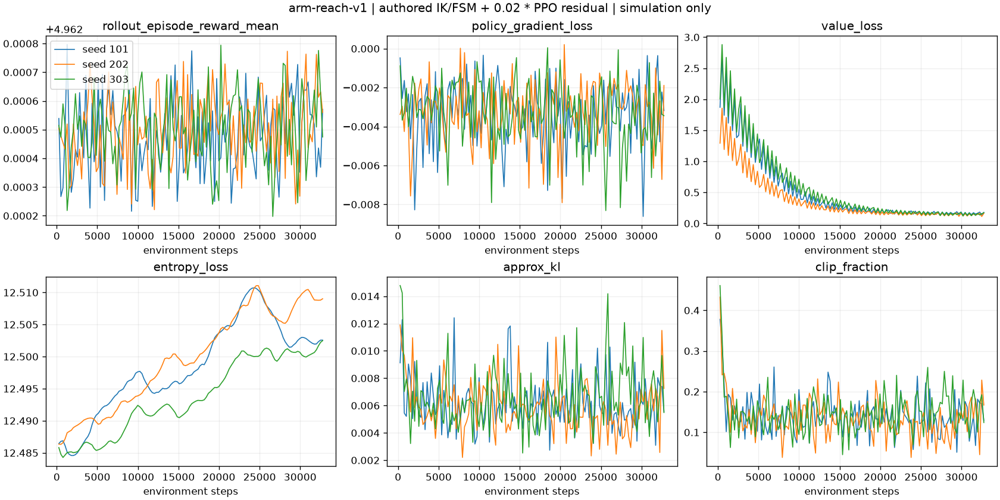
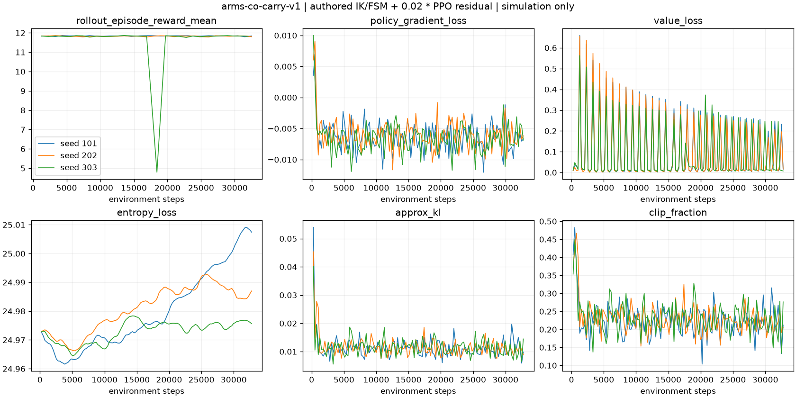

# 机械臂训练与验收结果

> **历史 v2 结果，保留用于对照，不是当前修复版的验收结论。** 当前严格修复与重新训练结果见 [repair-v3/RESULTS.zh-CN.md](repair-v3/RESULTS.zh-CN.md)。旧模型/旧视频必须使用对应归档源码复现，不应与当前环境源码混用。

日期：2026-09-12。自动汇总真实运行文件；不是实物能力证明。

**控制方法：人工 IK/定时 FSM + 0.02×PPO 残差，不是纯 PPO 从零学会操作。** 三个训练种子使用同一套独立测试配置，不能把配对回放当作300个独立场景。

## 主结果矩阵

| 任务 | 教师 | BC诊断 | PPO 101 | PPO 202 | PPO 303 | 3种子均过门槛 |
|---|---:|---:|---:|---:|---:|---|
| 末端触达 | 100/100 | 100/100 | 100/100 | 100/100 | 100/100 | 通过 |
| 抓取放置 | 100/100 | 0/100 | 100/100 | 100/100 | 100/100 | 通过 |
| 绕障移物 | 100/100 | 0/100 | 100/100 | 100/100 | 100/100 | 通过 |
| 航点搬运 | 100/100 | 0/100 | 100/100 | 100/100 | 100/100 | 通过 |
| 双臂交接（5 g） | 100/100 | 0/100 | 100/100 | 100/100 | 100/100 | 通过 |
| 共同搬托盘（17 g） | 99/100 | 23/100 | 99/100 | 98/100 | 98/100 | 通过 |

真实PPO环境步总数：**589,824**。各检查点独立记录参数变化，不用教师结果冒充PPO评估。

BC诊断失败不隐藏，不因训练MSE降低宣布任务学会。即使复合控制通过，教师已完成绝大部分任务，因此本实验不能证明PPO优于教师。测试扰动较窄；不能推断开放世界泛化或实体部署。

## 不包括的验证

- 实物20g载荷、夹力/温升、CAD装配公差、电源与保险协调、急停响应均未验证。
- 双臂交接仅5g课程，协作搬运17g总重，不冒充双臂20g能力。
- ONNX仅导出残差演员，必须配合相同教师、契约和限幅；原61→14身体策略不可替换。
- 软件互锁不是功能安全认证；HTTP仿真与硬件Unix协调器尚不是同一已放行的实物执行链。

## 末端触达 / arm-reach-v1

| 训练种子 | 步数 | 训练秒数 | 参数L2变化 | 平均测试回报 | Wilson95% | 最差扰动组 |
|---|---:|---:|---:|---:|---|---:|
| 101 | 32768 | 17.38 | 1.3183 | 4.9625 | 96.3%–100.0% | 100% |
| 202 | 32768 | 15.87 | 1.2718 | 4.9625 | 96.3%–100.0% | 100% |
| 303 | 32768 | 15.87 | 1.4624 | 4.9625 | 96.3%–100.0% | 100% |

- [全部运行文件](../../rlx/runs/arm/validated-20260912-v2/arm-reach-v1/)：源代码快照、场景、检查点、逐回合奖励、PPO损失、每个测试回合的门槛及故障。
- 负对照成功数：`{"zero": 0}`；负对照验证通过。
- PPO失败门槛计数：`{}`。
- [真实MP4](../../rlx/runs/arm/validated-20260912-v2/arm-reach-v1/seed-101/rollout.mp4)、[视频回执](../../rlx/runs/arm/validated-20260912-v2/arm-reach-v1/seed-101/render-receipt.json)、[6帧接触图](../../rlx/runs/arm/validated-20260912-v2/arm-reach-v1/seed-101/contact-sheet.png)；回放seed=50000，单次门槛通过。
- [训练曲线原始日志](../../rlx/runs/arm/validated-20260912-v2/arm-reach-v1/seed-101/metrics.jsonl)；[BC训练记录](../../rlx/runs/arm/validated-20260912-v2/arm-reach-v1/seed-101/bc-training.json)。

## 抓取放置 / arm-pick-place-v1

| 训练种子 | 步数 | 训练秒数 | 参数L2变化 | 平均测试回报 | Wilson95% | 最差扰动组 |
|---|---:|---:|---:|---:|---|---:|
| 101 | 32768 | 23.90 | 0.7921 | 10.4180 | 96.3%–100.0% | 100% |
| 202 | 32768 | 21.72 | 0.7795 | 10.4182 | 96.3%–100.0% | 100% |
| 303 | 32768 | 21.82 | 0.7738 | 10.4183 | 96.3%–100.0% | 100% |

- [全部运行文件](../../rlx/runs/arm/validated-20260912-v2/arm-pick-place-v1/)：源代码快照、场景、检查点、逐回合奖励、PPO损失、每个测试回合的门槛及故障。
- 负对照成功数：`{"zero": 0, "open_gripper": 0}`；负对照验证通过。
- PPO失败门槛计数：`{}`。
- [真实MP4](../../rlx/runs/arm/validated-20260912-v2/arm-pick-place-v1/seed-101/rollout.mp4)、[视频回执](../../rlx/runs/arm/validated-20260912-v2/arm-pick-place-v1/seed-101/render-receipt.json)、[6帧接触图](../../rlx/runs/arm/validated-20260912-v2/arm-pick-place-v1/seed-101/contact-sheet.png)；回放seed=50000，单次门槛通过。
- [训练曲线原始日志](../../rlx/runs/arm/validated-20260912-v2/arm-pick-place-v1/seed-101/metrics.jsonl)；[BC训练记录](../../rlx/runs/arm/validated-20260912-v2/arm-pick-place-v1/seed-101/bc-training.json)。

## 绕障移物 / arm-relocate-v1

| 训练种子 | 步数 | 训练秒数 | 参数L2变化 | 平均测试回报 | Wilson95% | 最差扰动组 |
|---|---:|---:|---:|---:|---|---:|
| 101 | 32768 | 24.37 | 0.8035 | 10.3967 | 96.3%–100.0% | 100% |
| 202 | 32768 | 22.15 | 0.6985 | 10.3977 | 96.3%–100.0% | 100% |
| 303 | 32768 | 22.67 | 0.7369 | 10.3966 | 96.3%–100.0% | 100% |

- [全部运行文件](../../rlx/runs/arm/validated-20260912-v2/arm-relocate-v1/)：源代码快照、场景、检查点、逐回合奖励、PPO损失、每个测试回合的门槛及故障。
- 负对照成功数：`{"zero": 0, "open_gripper": 0}`；负对照验证通过。
- PPO失败门槛计数：`{}`。
- [真实MP4](../../rlx/runs/arm/validated-20260912-v2/arm-relocate-v1/seed-101/rollout.mp4)、[视频回执](../../rlx/runs/arm/validated-20260912-v2/arm-relocate-v1/seed-101/render-receipt.json)、[6帧接触图](../../rlx/runs/arm/validated-20260912-v2/arm-relocate-v1/seed-101/contact-sheet.png)；回放seed=50000，单次门槛通过。
- [训练曲线原始日志](../../rlx/runs/arm/validated-20260912-v2/arm-relocate-v1/seed-101/metrics.jsonl)；[BC训练记录](../../rlx/runs/arm/validated-20260912-v2/arm-relocate-v1/seed-101/bc-training.json)。

## 航点搬运 / arm-carry-v1

| 训练种子 | 步数 | 训练秒数 | 参数L2变化 | 平均测试回报 | Wilson95% | 最差扰动组 |
|---|---:|---:|---:|---:|---|---:|
| 101 | 32768 | 28.41 | 0.7260 | 13.1685 | 96.3%–100.0% | 100% |
| 202 | 32768 | 23.72 | 0.5869 | 13.1693 | 96.3%–100.0% | 100% |
| 303 | 32768 | 24.89 | 0.6602 | 13.1691 | 96.3%–100.0% | 100% |

- [全部运行文件](../../rlx/runs/arm/validated-20260912-v2/arm-carry-v1/)：源代码快照、场景、检查点、逐回合奖励、PPO损失、每个测试回合的门槛及故障。
- 负对照成功数：`{"zero": 0, "open_gripper": 0}`；负对照验证通过。
- PPO失败门槛计数：`{}`。
- [真实MP4](../../rlx/runs/arm/validated-20260912-v2/arm-carry-v1/seed-101/rollout.mp4)、[视频回执](../../rlx/runs/arm/validated-20260912-v2/arm-carry-v1/seed-101/render-receipt.json)、[6帧接触图](../../rlx/runs/arm/validated-20260912-v2/arm-carry-v1/seed-101/contact-sheet.png)；回放seed=50000，单次门槛通过。
- [训练曲线原始日志](../../rlx/runs/arm/validated-20260912-v2/arm-carry-v1/seed-101/metrics.jsonl)；[BC训练记录](../../rlx/runs/arm/validated-20260912-v2/arm-carry-v1/seed-101/bc-training.json)。

## 双臂交接（5 g） / arms-handover-v1

| 训练种子 | 步数 | 训练秒数 | 参数L2变化 | 平均测试回报 | Wilson95% | 最差扰动组 |
|---|---:|---:|---:|---:|---|---:|
| 101 | 32768 | 27.06 | 0.7780 | 15.0526 | 96.3%–100.0% | 100% |
| 202 | 32768 | 26.57 | 0.7762 | 15.0528 | 96.3%–100.0% | 100% |
| 303 | 32768 | 27.46 | 0.6737 | 15.0530 | 96.3%–100.0% | 100% |

- [全部运行文件](../../rlx/runs/arm/validated-20260912-v2/arms-handover-v1/)：源代码快照、场景、检查点、逐回合奖励、PPO损失、每个测试回合的门槛及故障。
- 负对照成功数：`{"zero": 0, "open_gripper": 0, "disable_right": 0}`；负对照验证通过。
- PPO失败门槛计数：`{}`。
- [真实MP4](../../rlx/runs/arm/validated-20260912-v2/arms-handover-v1/seed-101/rollout.mp4)、[视频回执](../../rlx/runs/arm/validated-20260912-v2/arms-handover-v1/seed-101/render-receipt.json)、[6帧接触图](../../rlx/runs/arm/validated-20260912-v2/arms-handover-v1/seed-101/contact-sheet.png)；回放seed=50000，单次门槛通过。
- [训练曲线原始日志](../../rlx/runs/arm/validated-20260912-v2/arms-handover-v1/seed-101/metrics.jsonl)；[BC训练记录](../../rlx/runs/arm/validated-20260912-v2/arms-handover-v1/seed-101/bc-training.json)。

## 共同搬托盘（17 g） / arms-co-carry-v1

| 训练种子 | 步数 | 训练秒数 | 参数L2变化 | 平均测试回报 | Wilson95% | 最差扰动组 |
|---|---:|---:|---:|---:|---|---:|
| 101 | 32768 | 48.65 | 0.7953 | 11.7654 | 94.6%–99.8% | 90% |
| 202 | 32768 | 47.28 | 0.8427 | 11.6923 | 93.0%–99.4% | 90% |
| 303 | 32768 | 65.37 | 0.6508 | 11.6941 | 93.0%–99.4% | 90% |

- [全部运行文件](../../rlx/runs/arm/validated-20260912-v2/arms-co-carry-v1/)：源代码快照、场景、检查点、逐回合奖励、PPO损失、每个测试回合的门槛及故障。
- 负对照成功数：`{"zero": 0, "open_gripper": 0, "disable_right": 0}`；负对照验证通过。
- PPO失败门槛计数：`{"no_drop": 5, "internal_force_bounded": 1}`。
- [真实MP4](../../rlx/runs/arm/validated-20260912-v2/arms-co-carry-v1/seed-101/rollout.mp4)、[视频回执](../../rlx/runs/arm/validated-20260912-v2/arms-co-carry-v1/seed-101/render-receipt.json)、[6帧接触图](../../rlx/runs/arm/validated-20260912-v2/arms-co-carry-v1/seed-101/contact-sheet.png)；回放seed=50000，单次门槛通过。
- [训练曲线原始日志](../../rlx/runs/arm/validated-20260912-v2/arms-co-carry-v1/seed-101/metrics.jsonl)；[BC训练记录](../../rlx/runs/arm/validated-20260912-v2/arms-co-carry-v1/seed-101/bc-training.json)。
