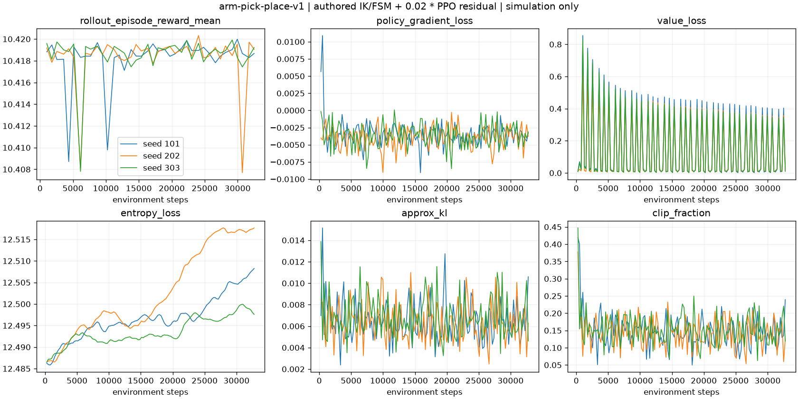
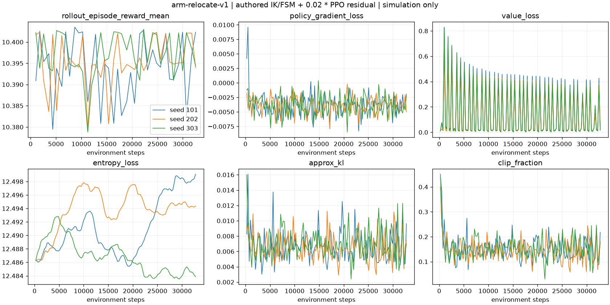
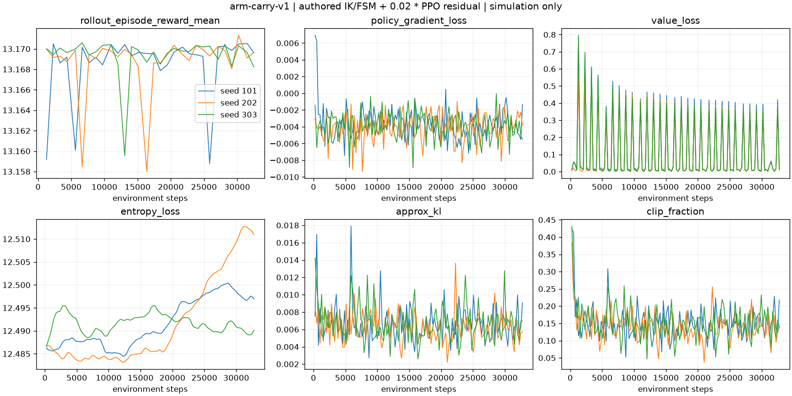
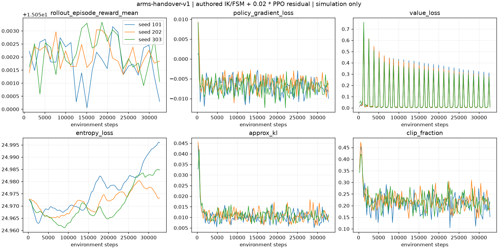
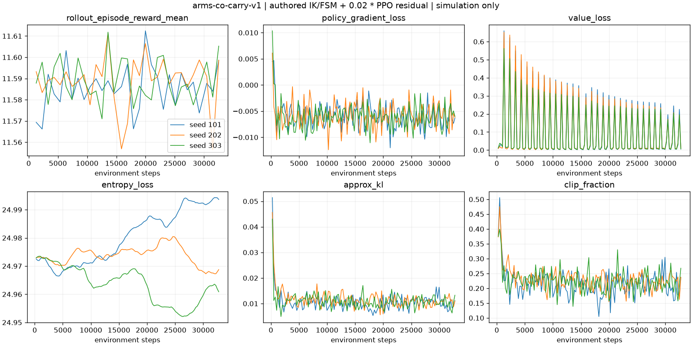

# 严格机械臂修复 v3 结果

生成时间：2026-09-12T23:47:45.708103+00:00。

**最终结论：成功。** 本结论要求主评估逐回合全过、独立留出评估逐回合全过、21 个已知失败回归全过；统计门槛单独报告，不能替代逐回合全过。

## 验收总览

| 证据 | 成功/总数 | 逐回合全过 | 统计门槛 |
|---|---:|---|---|
| 主评估 seed 80000..80909 | 1800/1800 | 通过 | 18/18 通过 |
| 独立留出 seed 110000..110909 | 1800/1800 | 通过 | 18/18 通过 |
| 已知失败回归 | 21/21 | 通过 | 不适用 |
| 物理步长检查 | 12/12 | 通过 | 不适用 |
| 负对照 | 意外成功 0/130 | 通过 | 不适用 |
| 软件测试日志 | 165 项通过 | 通过 | 不适用 |

18 个检查点的实际训练环境步数合计为 **589,824**；该数字由各 `training.json` 的 `actual_env_steps` 求和，不使用预期值代替。

## 18 个检查点结果矩阵

| 任务 | 训练 seed | 主评估 | 主逐回合全过 | 主统计门槛 | 独立留出 | 留出逐回合全过 | 留出统计门槛 |
|---|---:|---:|---|---|---:|---|---|
| 末端触达 | 101 | [100/100](../../../rlx/runs/arm/strict-repair-20260912-v3/arm-reach-v1/seed-101/evaluation.json) | 通过 | 通过 | [100/100](../../../rlx/runs/arm/strict-heldout-20260912-v3/arm-reach-v1/seed-101/evaluation.json) | 通过 | 通过 |
| 末端触达 | 202 | [100/100](../../../rlx/runs/arm/strict-repair-20260912-v3/arm-reach-v1/seed-202/evaluation.json) | 通过 | 通过 | [100/100](../../../rlx/runs/arm/strict-heldout-20260912-v3/arm-reach-v1/seed-202/evaluation.json) | 通过 | 通过 |
| 末端触达 | 303 | [100/100](../../../rlx/runs/arm/strict-repair-20260912-v3/arm-reach-v1/seed-303/evaluation.json) | 通过 | 通过 | [100/100](../../../rlx/runs/arm/strict-heldout-20260912-v3/arm-reach-v1/seed-303/evaluation.json) | 通过 | 通过 |
| 抓取放置 | 101 | [100/100](../../../rlx/runs/arm/strict-repair-20260912-v3/arm-pick-place-v1/seed-101/evaluation.json) | 通过 | 通过 | [100/100](../../../rlx/runs/arm/strict-heldout-20260912-v3/arm-pick-place-v1/seed-101/evaluation.json) | 通过 | 通过 |
| 抓取放置 | 202 | [100/100](../../../rlx/runs/arm/strict-repair-20260912-v3/arm-pick-place-v1/seed-202/evaluation.json) | 通过 | 通过 | [100/100](../../../rlx/runs/arm/strict-heldout-20260912-v3/arm-pick-place-v1/seed-202/evaluation.json) | 通过 | 通过 |
| 抓取放置 | 303 | [100/100](../../../rlx/runs/arm/strict-repair-20260912-v3/arm-pick-place-v1/seed-303/evaluation.json) | 通过 | 通过 | [100/100](../../../rlx/runs/arm/strict-heldout-20260912-v3/arm-pick-place-v1/seed-303/evaluation.json) | 通过 | 通过 |
| 绕障移物 | 101 | [100/100](../../../rlx/runs/arm/strict-repair-20260912-v3/arm-relocate-v1/seed-101/evaluation.json) | 通过 | 通过 | [100/100](../../../rlx/runs/arm/strict-heldout-20260912-v3/arm-relocate-v1/seed-101/evaluation.json) | 通过 | 通过 |
| 绕障移物 | 202 | [100/100](../../../rlx/runs/arm/strict-repair-20260912-v3/arm-relocate-v1/seed-202/evaluation.json) | 通过 | 通过 | [100/100](../../../rlx/runs/arm/strict-heldout-20260912-v3/arm-relocate-v1/seed-202/evaluation.json) | 通过 | 通过 |
| 绕障移物 | 303 | [100/100](../../../rlx/runs/arm/strict-repair-20260912-v3/arm-relocate-v1/seed-303/evaluation.json) | 通过 | 通过 | [100/100](../../../rlx/runs/arm/strict-heldout-20260912-v3/arm-relocate-v1/seed-303/evaluation.json) | 通过 | 通过 |
| 航点搬运 | 101 | [100/100](../../../rlx/runs/arm/strict-repair-20260912-v3/arm-carry-v1/seed-101/evaluation.json) | 通过 | 通过 | [100/100](../../../rlx/runs/arm/strict-heldout-20260912-v3/arm-carry-v1/seed-101/evaluation.json) | 通过 | 通过 |
| 航点搬运 | 202 | [100/100](../../../rlx/runs/arm/strict-repair-20260912-v3/arm-carry-v1/seed-202/evaluation.json) | 通过 | 通过 | [100/100](../../../rlx/runs/arm/strict-heldout-20260912-v3/arm-carry-v1/seed-202/evaluation.json) | 通过 | 通过 |
| 航点搬运 | 303 | [100/100](../../../rlx/runs/arm/strict-repair-20260912-v3/arm-carry-v1/seed-303/evaluation.json) | 通过 | 通过 | [100/100](../../../rlx/runs/arm/strict-heldout-20260912-v3/arm-carry-v1/seed-303/evaluation.json) | 通过 | 通过 |
| 双臂交接（5 g 课程） | 101 | [100/100](../../../rlx/runs/arm/strict-repair-20260912-v3/arms-handover-v1/seed-101/evaluation.json) | 通过 | 通过 | [100/100](../../../rlx/runs/arm/strict-heldout-20260912-v3/arms-handover-v1/seed-101/evaluation.json) | 通过 | 通过 |
| 双臂交接（5 g 课程） | 202 | [100/100](../../../rlx/runs/arm/strict-repair-20260912-v3/arms-handover-v1/seed-202/evaluation.json) | 通过 | 通过 | [100/100](../../../rlx/runs/arm/strict-heldout-20260912-v3/arms-handover-v1/seed-202/evaluation.json) | 通过 | 通过 |
| 双臂交接（5 g 课程） | 303 | [100/100](../../../rlx/runs/arm/strict-repair-20260912-v3/arms-handover-v1/seed-303/evaluation.json) | 通过 | 通过 | [100/100](../../../rlx/runs/arm/strict-heldout-20260912-v3/arms-handover-v1/seed-303/evaluation.json) | 通过 | 通过 |
| 双臂共同搬运（17 g 总重） | 101 | [100/100](../../../rlx/runs/arm/strict-repair-20260912-v3/arms-co-carry-v1/seed-101/evaluation.json) | 通过 | 通过 | [100/100](../../../rlx/runs/arm/strict-heldout-20260912-v3/arms-co-carry-v1/seed-101/evaluation.json) | 通过 | 通过 |
| 双臂共同搬运（17 g 总重） | 202 | [100/100](../../../rlx/runs/arm/strict-repair-20260912-v3/arms-co-carry-v1/seed-202/evaluation.json) | 通过 | 通过 | [100/100](../../../rlx/runs/arm/strict-heldout-20260912-v3/arms-co-carry-v1/seed-202/evaluation.json) | 通过 | 通过 |
| 双臂共同搬运（17 g 总重） | 303 | [100/100](../../../rlx/runs/arm/strict-repair-20260912-v3/arms-co-carry-v1/seed-303/evaluation.json) | 通过 | 通过 | [100/100](../../../rlx/runs/arm/strict-heldout-20260912-v3/arms-co-carry-v1/seed-303/evaluation.json) | 通过 | 通过 |

## 修复边界

- `repair-source-audit.json` 将生产改动限定为 `teacher_targets` 中新增的 6 行：双臂共同搬运在抬升、运输、下降阶段使用同步五次平滑笛卡尔目标。
- 抬升/运输/下降时长保持 3/6/3 秒；任务质量、奖励、物理、门槛和评估器均未改变。
- 保留原有保守掉落评估器；本次修复没有通过放宽 `no_drop` 或其他安全门槛取得结果。
- 控制器仍是人工 IK/定时状态机加 0.02×PPO 残差，不是纯 PPO，也没有重新训练 BC 的主张，更不声称 PPO 优于教师。
- 这是 MuJoCo 仿真证据，不是硬件验证。双臂共同搬运为现有 17 g 总成，双臂交接为现有 5 g 课程；不声称双臂 20 g 目标已经完成。

## 支持性检查

- 教师控制器物理步长检查：12/12，覆盖 2 ms 与 1 ms；这是教师轨迹/仿真步长检查，不是 PPO 性能比较。
- 负对照：seed 140000..140900，130 回合中意外任务成功 0 次。这里的“通过”表示故意禁用的控制器按预期未完成任务，不表示负对照完成了任务。
- 保存的软件测试日志共记录 165 项通过：RLX 95、后端 21、控制 35、硬件支持软件测试 6、视频证据 8。其中硬件支持测试不构成实体硬件验证。

## 训练曲线与原始日志

每张图包含真实回合平均奖励、策略损失、价值损失、熵损失、近似 KL 和裁剪比例；三条线分别对应训练 seed 101、202、303。

### 末端触达

[seed 101 原始 metrics.jsonl](../../../rlx/runs/arm/strict-repair-20260912-v3/arm-reach-v1/seed-101/metrics.jsonl)、[seed 202 原始 metrics.jsonl](../../../rlx/runs/arm/strict-repair-20260912-v3/arm-reach-v1/seed-202/metrics.jsonl)、[seed 303 原始 metrics.jsonl](../../../rlx/runs/arm/strict-repair-20260912-v3/arm-reach-v1/seed-303/metrics.jsonl)

### 抓取放置

[seed 101 原始 metrics.jsonl](../../../rlx/runs/arm/strict-repair-20260912-v3/arm-pick-place-v1/seed-101/metrics.jsonl)、[seed 202 原始 metrics.jsonl](../../../rlx/runs/arm/strict-repair-20260912-v3/arm-pick-place-v1/seed-202/metrics.jsonl)、[seed 303 原始 metrics.jsonl](../../../rlx/runs/arm/strict-repair-20260912-v3/arm-pick-place-v1/seed-303/metrics.jsonl)

### 绕障移物

[seed 101 原始 metrics.jsonl](../../../rlx/runs/arm/strict-repair-20260912-v3/arm-relocate-v1/seed-101/metrics.jsonl)、[seed 202 原始 metrics.jsonl](../../../rlx/runs/arm/strict-repair-20260912-v3/arm-relocate-v1/seed-202/metrics.jsonl)、[seed 303 原始 metrics.jsonl](../../../rlx/runs/arm/strict-repair-20260912-v3/arm-relocate-v1/seed-303/metrics.jsonl)

### 航点搬运

[seed 101 原始 metrics.jsonl](../../../rlx/runs/arm/strict-repair-20260912-v3/arm-carry-v1/seed-101/metrics.jsonl)、[seed 202 原始 metrics.jsonl](../../../rlx/runs/arm/strict-repair-20260912-v3/arm-carry-v1/seed-202/metrics.jsonl)、[seed 303 原始 metrics.jsonl](../../../rlx/runs/arm/strict-repair-20260912-v3/arm-carry-v1/seed-303/metrics.jsonl)

### 双臂交接（5 g 课程）

[seed 101 原始 metrics.jsonl](../../../rlx/runs/arm/strict-repair-20260912-v3/arms-handover-v1/seed-101/metrics.jsonl)、[seed 202 原始 metrics.jsonl](../../../rlx/runs/arm/strict-repair-20260912-v3/arms-handover-v1/seed-202/metrics.jsonl)、[seed 303 原始 metrics.jsonl](../../../rlx/runs/arm/strict-repair-20260912-v3/arms-handover-v1/seed-303/metrics.jsonl)

### 双臂共同搬运（17 g 总重）

[seed 101 原始 metrics.jsonl](../../../rlx/runs/arm/strict-repair-20260912-v3/arms-co-carry-v1/seed-101/metrics.jsonl)、[seed 202 原始 metrics.jsonl](../../../rlx/runs/arm/strict-repair-20260912-v3/arms-co-carry-v1/seed-202/metrics.jsonl)、[seed 303 原始 metrics.jsonl](../../../rlx/runs/arm/strict-repair-20260912-v3/arms-co-carry-v1/seed-303/metrics.jsonl)

## 视频与历史证据

- [独立留出验证视频索引](../../../rlx/runs/arm/strict-heldout-20260912-v3/index.zh-CN.html)：视频清单存在，记录 13 个已生成视频。
- [旧版 recheck-20260912-v2 视频索引](../../../rlx/runs/arm/recheck-20260912-v2/index.zh-CN.html)：历史结果保留为 1798/1800，并保留 7 个失败视频；它不计入 v3 成功判定。

## 可审计文件

- [主评估汇总](../../../rlx/runs/arm/strict-repair-20260912-v3/strict-summary.json)
- [独立留出汇总](../../../rlx/runs/arm/strict-heldout-20260912-v3/summary.json)
- [21 个已知失败回归](../../../rlx/runs/arm/strict-repair-20260912-v3/known-failure-regressions.json)
- [修复源码审计](../../../rlx/runs/arm/strict-repair-20260912-v3/repair-source-audit.json)
- [12 个物理步长结果](../../../rlx/runs/arm/strict-repair-20260912-v3/timestep-convergence.json)
- [130 回合负对照汇总](../../../rlx/runs/arm/strict-repair-20260912-v3/negative-controls/summary.json)
- [rlx 测试日志](../../../rlx/runs/arm/strict-repair-20260912-v3/verification/rlx-arm-95-pytest.log)
- [backend 测试日志](../../../rlx/runs/arm/strict-repair-20260912-v3/verification/backend-arm-lab-unittest.log)
- [control 测试日志](../../../rlx/runs/arm/strict-repair-20260912-v3/verification/arm-control-unittest.log)
- [hardware_software 测试日志](../../../rlx/runs/arm/strict-repair-20260912-v3/verification/hardware-md-arm-t1-unittest.log)
- [video 测试日志](../../../rlx/runs/arm/strict-repair-20260912-v3/verification/arm-video-evidence-unittest.log)
