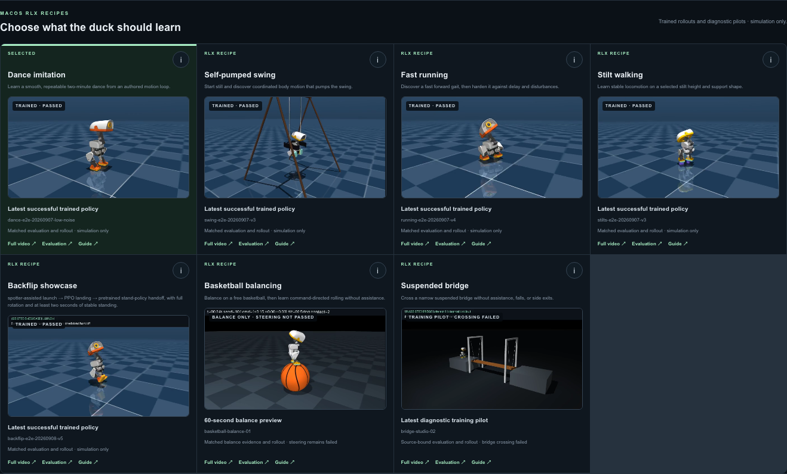

# Seven-case Duck Viewer verification

The web application exposes all seven scenarios. Application integration is
separate from learned-skill acceptance: a working player or training pipeline
does not prove that a policy has mastered its task.

| Case | Web preview and saved run | Skill evidence |
| --- | --- | --- |
| Dance | Working | Saved evaluation accepted |
| Swing | Working | Saved evaluation accepted |
| Running | Working | Saved evaluation accepted |
| Stilts | Working | Saved evaluation accepted |
| Backflip | Working | Assisted-launch / PPO-landing / standing-handoff showcase accepted; not an unassisted whole-flip policy or proof of PPO improvement |
| Basketball | Working | Sustained balance demonstrated; rolling and steering not accepted |
| Suspended bridge | Working diagnostic video | Full crossing not accepted |

## Recorded checks

- [Seven-case browser receipt](studio/verification.json): selection, guidance
  dialogs, saved-recipe loading, evaluation/artifact APIs, seven progressing
  live policies, basketball geometry, four bridge cables, reset, and mobile
  width checks. Evaluation verdicts are read from the saved runs, not new
  acceptance evaluations.
- [Video regression receipt](previews/verification.json): all seven videos
  decode and advance; desktop/mobile layouts, reduced-motion contact sheets,
  newer ineligible runs, and missing-evidence fallback are checked. Catalog
  substitutions are test fixtures; video playback uses real saved artifacts.
- [Live-render receipt](live/verification.json): all seven 3D duck components
  mount before capture; simulation frames advance, reset is observed, and
  WebGL remains active. The embedded camera shows a subset of the roster;
  use camera navigation to inspect individual scenes.
- [Studio workflow receipt](workflows/verification.json): `npm run e2e:studio`
  passes the four deeper Dance/Swing/Running/Stilts workflows and Backflip v5
  source-bound video checks, with no page errors. Training requests in this
  workflow test are intercepted; the separate two-case smoke runs are real.
- [Training smoke receipt](../bridge-showcase/evidence/api/smoke-verification.json):
  real, tiny basketball and bridge API training jobs complete and export ONNX.
  Smoke success is not skill acceptance.
- Frontend: `npm test` reports **161 passed**; `npm run lint` and
  `npm run build` pass. Build retains a non-fatal dynamic filesystem tracing
  warning in `lib/rlx-job.ts`.
- Focused Python contracts: **43 passed** across `test_studio_policies.py`,
  `test_balance_playback.py`, and `test_balance_adapter.py`.
- Both repository READMEs embed all seven GIFs. Each is a real 360 × 203,
  four-second, 24-frame excerpt. All fourteen relative image links resolve.



## Reproduction

Start Duck Viewer on port 63317 and the normal lab on port 8788 using the
workspace setup instructions. Use `rlx/.venv-microduck/bin/python` as
`MICRODUCK_STUDIO_PYTHON_DIRECT` for local RLX API jobs.

To test all seven live environments without changing the main lab's roster,
start another terminal at the repository root and run:

```bash
cd microduck_local
LAB_STATE_PATH=/tmp/duck-seven-verification.json MICRODUCK_ACTUATOR=bam \
  .venv/bin/duck-lab --port 8790 \
  ../rlx/runs/studio/dance/dance-e2e-20260907-low-noise/dance.onnx \
  ../rlx/runs/studio/swing/swing-e2e-20260907-v3/swing.onnx \
  ../rlx/runs/studio/running/running-e2e-20260907-v4/running.onnx \
  ../rlx/runs/studio/stilts/stilts-e2e-20260907-v3/stilts.onnx \
  ../rlx/runs/studio/backflip/backflip-e2e-20260908-v5/backflip.onnx \
  ../rlx/runs/studio/basketball/basketball-balance-01/policy.onnx \
  ../rlx/runs/studio/bridge/bridge-studio-02/bridge.onnx
```

Use a new state-file path if that temporary file already contains another
roster. The lab otherwise restores persisted state and ignores CLI policies.
These checks require the saved run artifacts and the existing MuJoCo/ONNX
runtime; a fresh clone without the artifacts cannot reproduce their results.

From the repository root:

```bash
EVIDENCE_DIR=docs/seven-cases-verification/studio \
  node scripts/verify-seven-cases.mjs
STUDIO_EVIDENCE_DIR="$PWD/docs/seven-cases-verification/previews" \
  node duck-viewer/scripts/verify-trained-previews.mjs
node scripts/verify-balance-studio-api.mjs --smoke-train
bash docs/seven-cases-verification/media/generate-gifs.sh
```

Browser verification requires Playwright. Set `PLAYWRIGHT_PACKAGE` to the
absolute path of a package.json whose dependencies include Playwright if it
is not installed in the default local tools location.

The GIF generator requires the saved source videos and the already installed
`ffmpeg`; it does not fabricate or interpolate successful robot behavior.
