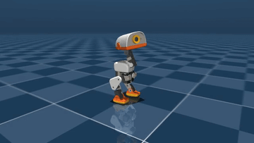
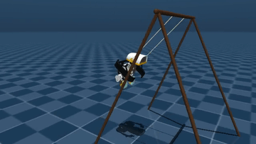
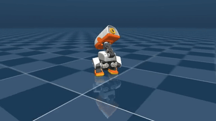
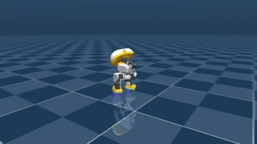
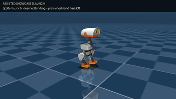
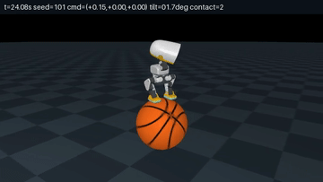
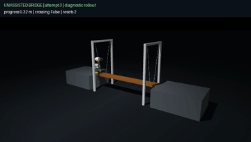
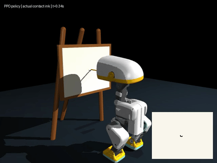
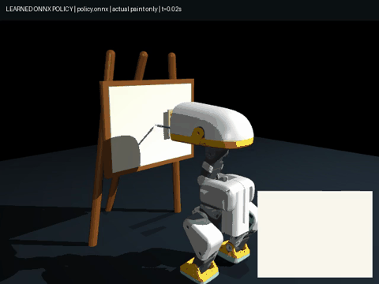

# duck-viewer

## Interface language

Use the **English / 中文** toggle in Studio or Arm Lab. English is the default,
independent of the browser language. The selection is saved locally as
`microduck.ui.language`, shared across pages and tabs, and restored on reload.
If browser storage is blocked, switching still works for the current page.
The toggle changes interface text, not training settings, case IDs, raw logs,
evidence receipts, file paths, or text embedded in existing videos and documents.
Video filters, selected recording, and playback position are retained when switching.

Language verification (browser checks require the viewer and arm simulator):

```bash
node --test lib/language.test.mjs
STUDIO_URL=http://127.0.0.1:63317 node scripts/verify-ui-language.mjs
```

Browser receipts and English/Chinese screenshots are saved under
`rlx/artifacts/viewer-language/` (override with `LANGUAGE_EVIDENCE_DIR`).
The browser check also verifies that switching live controls preserves the case,
seed, and manual actions without reconnecting or sending simulator commands.

## Arm classroom workspace

Open **Arm Lab** or **Arm videos** in Studio navigation, or go directly to
`/arm#videos`. The existing arm page now separates **Video library** (default)
from **Live simulator**; the original eight duck experiments are unchanged.

- The library discovers all MP4 files under `rlx/runs/arm`, including current
  evaluations, repaired regression replays, historical failures, and compilations.
- Byte-identical copies are grouped, with their source aliases retained. The
  inventory at integration contains 41 files / 35 unique videos; the UI reads
  actual files rather than hardcoding those counts.
- Filter by case, source provenance, outcome, recording type, or seed/batch text.
  Play, seek, download, step through the playlist, and inspect the source receipt.
- Recorded videos use `/api/arm/videos` and `/api/arm/media` directly from Next.js;
  the live Python service on port 8812 is not needed for playback. Media delivery
  supports byte ranges and HEAD; private files, traversal and symlink artifacts
  are denied.
- Live simulator preserves case reset, bounded manual actions, teacher stepping,
  live metrics and run records. It is simulation-only; hardware remains locked.
- Current-source, historical, unverified, failed and mixed evidence are labeled
  separately. A passed compilation or video is not a full experiment matrix,
  and authored IK/FSM + PPO residual is not end-to-end learned planning.

Verification (with the viewer and arm simulator running):

```bash
npm test
npm run lint
npm run build
STUDIO_URL=http://127.0.0.1:63317 node scripts/verify-arm-viewer.mjs
```

The browser check independently inventories MP4 bytes, plays and seeks every
unique video with the live API deliberately offline, tests filters and mobile
overflow, then resets and teacher-steps all six cases against the real simulator.
Evidence is written under `rlx/artifacts/arm-viewer-20260912/`. Override the output
with `ARM_VIEWER_EVIDENCE_DIR` or the existing Playwright location with
`PLAYWRIGHT_PACKAGE` when running on another workstation.

Next.js + Three.js (react-three-fiber) web viewer for Microduck policies — watch
many training runs walk side by side in the browser instead of the native MuJoCo
viewer. The pattern is lifted from jenga-stacker's web viewer (mesh geometry
extracted straight from the compiled MuJoCo model, no asset pipeline), upgraded
from recorded replays to live WebSocket streaming.

```
┌──────────────────────────┐  GET /scene (meshes + colors, once)  ┌────────────┐
│ duck-lab (Python)       │ ───────────────────────────────────▶ │ Next.js    │
│ microduck_local          │   WS /ws ~25 Hz body poses + stats   │ duck-viewer│
│ one CPU-MuJoCo env per   │ ◀─────────────────────────────────── │ r3f canvas │
│ policy, real-time 50 Hz  │   {"cmd": [vx,vy,wz]} / {"reset"}    │ + HUD      │
└──────────────────────────┘                                      └────────────┘
```

## Run it

```bash
# 1. the lab (from microduck_local/) — each arg is one duck
uv run duck-lab --checkpoints runs/first-gait ../microduck/policies/alpha_walking.onnx

# 2. the viewer
cd duck-viewer && npm run dev     # then open the printed localhost URL
```

`?lab=host:port` on the page URL points it at a different lab (a scratch
server on another port, a scratch lab on another port — the lab binds loopback, so same machine); default `127.0.0.1:8788`.

Duck sources: a run dir (`runs/my-run`, uses/exports `policy.onnx`), any
`.onnx` file (shipped alphas work), or `--checkpoints <run>` to line up one
duck per training checkpoint — watching a policy learn across 500k-step
snapshots is the point of this thing.

**Ducks are driven only by their RL policies** — no teleop. Walking policies
follow the server's auto demo script (their velocity-command input, the same
interface the real robot's gamepad uses); trick policies (`teach-*`, 🎓, 🤝)
get zero commands and just do their trick. The **keyboard flies the camera**,
Maya/Blender-style: drag to orbit, scroll/two-finger-vertical to zoom,
**two-finger horizontal swipe** to slide laterally (natural-scrolling
direction; browser back-swipe is suppressed over the scene, and panels keep
native scrolling), **A/D** slide, **W/S·↑↓** dolly, **←/→** orbit, **Q/E**
rise/fall, **Shift+R** reset view — all held keys move smoothly (velocity × dt).
The one non-camera key is **R**, which **restarts the sim** (`{"reset": true}`
to the lab): every duck's episode drops back to step zero at the same moment,
which is what makes a side-by-side comparison legible. The render view also
has a compact **Camera** navigator: press and hold its orbit, move,
raise/lower, and zoom controls; use home to reset only the view; use the
separate amber restart control to reset every simulation. It supports mouse,
touch, and keyboard focus and can be collapsed. **Clicking a duck**
(or its HUD row) **selects it** — amber floor ring + highlighted row — and
**Delete/Backspace removes it** (same `remove_duck` message as the row's ✕);
**Esc** or an empty-floor click deselects. Selection uses the same projected
screen-radius hit test as policy assignment, not raycasting. Selecting a duck
that runs one of our trained runs also **loads that run into the 🎓 teach
panel** (`POST /teach/load` — recipe card + sliders in finished state, so
"✨ fine-tune" continues from that exact brain); shipped Pollen policies are
skipped quietly, and nothing is loaded while a job is actively training. HUD shows per-duck
episode time, fall count, reward-rate EMA (dimmed for trick ducks — it scores
the walking recipe), a system-stats strip (cpu/mem/training steps-per-second),
and collapses to a pill via its — button. Its 🏷 button toggles the floating
duck name labels (persisted; the selection ring stays either way). Labels
stack below every overlay panel (panels sit at z-index 20, labels top out
at 10), so a crowded farm can't scribble text over the HUD or chip lists. (Manual drive commands still exist
at the protocol level — `LabClient.sendCmd` — for a future gamepad page;
the UI deliberately doesn't expose them.)

## The panels

- **🧠 policies** (top-right): every assignable brain — shipped Pollen
  policies, local runs, checkpoints. Drag a chip onto a duck (or click to arm,
  then click a duck) to hot-swap its brain mid-stride; drag it to empty floor
  — or just **double-click the chip** — to spawn a fresh duck running that
  policy; drop it (or armed-click) **on the 🎓 teach panel** to load that
  run's recipe there for refinement instead. **Refresh** rescans the Lab's
  training runs and checkpoints without browser caching; the newest saved
  `policy.onnx` or `live.onnx` appears for each run. Reassigning a policy loads
  updated bytes instead of a stale inference cache. Refreshing does not switch
  ducks automatically. The panel also refreshes when opened and when a Lab
  training run finishes, and retains its previous list if a scan fails.
  In Studio, the same button refreshes **Studio runs**, newest training/export
  first, across all scenarios. Exported Studio policy chips retain the same
  drag-to-duck, click-to-arm, and double-click-to-spawn interactions. Each runs
  in its saved scenario's nominal simulation, with per-duck geometry for swing
  and stilts; Backflip retains its explicit spotter launch and stand handoff.
  **Review / render** still opens evaluation and export controls. Checkpoint-only
  runs must export ONNX before dragging; invalid or stale metadata cannot silently
  fall back to a walking environment. No hardware deployment is performed.
  Hovering one of **our runs** reveals a ✕ that deletes that
  run's training data from disk — the exported policy, its checkpoints and
  its progress log; a curriculum chain deletes as one family, all stages at
  once. It always confirms first (naming the run dirs and the space it
  frees), and the lab refuses outright while that run's job is still
  training. Shipped Pollen policies have no ✕ — they aren't ours to delete.
- **🎓 teach the duck** (bottom-right): chat a trick ("stand on one leg"), see
  the reward recipe in plain English, watch the live score curve + per-term
  bars while the 🎓 trainee duck improves snapshot by snapshot. When a run
  ends, the recipe's **weight sliders unlock**: drag them and either
  "↻ retrain" (fresh) or "✨ fine-tune" (keep what it learned, adjust) —
  that's the reward-shaping loop with no Python involved.
- **🎬 animate** (bottom-center): keyframe editor for the robot — pose the
  translucent ghost duck (sliders, or drag body parts in the scene), key poses
  on the timeline, save the clip, ⚡ train a policy to track it. The **🎮 rig**
  section on top gives game-style macro controls over coupled joints — squat,
  lean, per-leg L/R swing (a stride, feet kept level), sway, stance, twist,
  toes, look — each a fixed coupling that keeps the
  feet flat (e.g. squat folds hip pitch + knee + ankle on both legs); the ⇕
  handle drags the selected rig control (squat when none is selected) and
  parks at that control's anchor on the duck — head for look, thigh for a
  swing — wearing the control's name. A
  🦴 joints / 🎮 rig toggle picks what clicking the duck edits: one servo, or
  the part's rig control (feet→toes, thigh→swing, shin→squat, trunk→lean,
  head→look, hip yaw→twist, hip roll→sway) — the whole coupling lights up and
  the drag is geared so the grabbed part tracks the cursor; selecting a rig
  slider highlights and arms that control the same way. Rig
  slider ranges are computed live from the MJCF servo limits: the slider ends
  exactly where the first servo runs out of travel, and the tooltip names it.
  Rig directions are mutually orthogonal in joint space, so controls never
  move each other's sliders, and asymmetric hand-tweaks survive a rig drag.
- **📷 shot** (top-center, always available): one click downloads a full-res
  PNG of the current view, named after the selected duck (or `duck-lab` for a
  crowd shot) — the selection ring is hidden for the capture render, and the
  whole render→read→download runs synchronously inside the click so Chrome
  never blocks it as an "automatic" download. The panel centers at the top
  but slides right of the duck-lab HUD when that panel is wide (long duck
  names) — the HUD publishes its right edge through the ui.ts store.
- **🎥 record** (always visible beside 📷 shot): with no duck selected, one
  click starts recording the current view. With a duck selected, it films
  that duck — the camera glides to a ¾ front shot (chosen from
  the duck's heading, then held with a slow cinematic drift; OrbitControls and
  camera keys pause for the take) and MediaRecorder captures the WebGL canvas.
  Footage is automatically clean: DOM labels/panels aren't part of the canvas,
  and the amber selection ring hides itself while filming. ■ stop uploads the
  take to the lab (`POST /captures`), whose bundled ffmpeg writes a
  full-resolution h264 **mp4** and a 480 px palette **gif** into
  `microduck_local/captures/`; the panel then offers ⬇ downloads of both.
  Recording continues until you click ■ stop; there is no one-minute timer.
  The shot and record/stop controls remain visible while recording and saving.
  Long takes use browser memory and remain subject to the lab upload-size limit.
  Frames are pushed per RENDERED frame
  (`captureStream(0)` + `requestFrame()` — automatic capture rides the
  compositor and records almost nothing in a throttled tab), so keep the tab
  visible while recording; a take where the scene never rendered is refused
  with a message instead of producing a 0.1 s "video".
- **helpers**: ＋ on the training row spawns a 🤝 helper duck — another
  viewer of the same live policy. Helpers do **not** add trainer workers
  (that *lowered* steps/s while the lab was open). ✕ removes it.

Panel states, chat history, and the camera persist in localStorage; the duck
roster itself persists server-side (`microduck_local/lab-state.json`) across
lab restarts.

## Studio RLX API checks

The eight cases under **Choose what the duck should learn** use run-owned saved
evidence, not bundled reference GIFs. Dance, Swing, Running, Stilts, and
Backflip select the newest trained checkpoint with a passing task evaluation and
matching video provenance. Basketball may additionally expose a clearly labeled
**BALANCE ONLY · STEERING NOT PASSED** preview after its recurrent ONNX survives
the full 60-second unassisted balance gate; that preview never passes the full
task. Bridge has a bounded 32,768-step transferred-walker training pilot and a
source-bound failed-crossing diagnostic video. Its video provenance is verified,
but the crossing remains non-passing until strict unassisted evaluation, render,
and visual review all complete. Failed or unassessed saved runs remain available
under **Review trained policies** for diagnostic review.
The displayed run name, Full video and Evaluation links identify the same run;
reduced-motion users see its contact sheet. Missing evidence never falls back to
an untrained animation. The catalog refreshes on page load and local job phase
changes. From the workspace root, `node scripts/verify-eight-cases.mjs` checks
the current eight-case catalog and live scenes. Historical seven-case receipts
remain in `docs/seven-cases-verification/`.

### Eight saved-render previews

The original seven tracked GIFs are four-second excerpts from run-owned render
videos. The drawing GIFs show recorded rollouts at 4× playback speed.
They are simulation evidence, not hardware certification.

| Dance | Swing | Running |
|---|---|---|
|  |  |  |

| Stilts | Backflip: assisted launch → PPO landing → stand handoff |
|---|---|
|  |  |

| Basketball: balance only, rolling unmastered | Bridge: failed crossing diagnostic |
|---|---|
|  |  |

| Drawing: learned-policy diagnostic | Contact-only teacher feasibility, NOT PPO |
|---|---|
|  |  |

The eighth case includes a real free-body pencil, two contact pads, an independent
fifteenth mouth actuator, easel, board, and canvas. Live graphite lines come only
from streamed physical contact records and disappear on reset. Its versioned
`microduck-drawing-v1` interface is **83 observations / 15 actions**, simulation
only; the previous seven keep their existing contracts. Teacher success does not
unlock learned-policy acceptance. See the [complete workflow](../docs/drawing-case/README.md)
and [measured results](../docs/drawing-case/RESULTS.md).

### Eighth-case upgrade: soft color brush

The same eighth card now has **Pencil / Brush** tools, not a ninth case.
Brush uses the separate `microduck-brush-v2` **93-observation / 15-action**
interface, a passive compliant hair-bundle approximation, and four physical
palette wells. Colored ink is streamed from actual brush contact, never the
reference drawing. The original failed pencil and teacher evidence remain separate.



See the [bilingual brush workflow](../docs/drawing-case/brush/README.md) and
[source-bound results](../docs/drawing-case/brush/RESULTS.md). BC imitation already
produces the skill; PPO updates are real but are not claimed to improve on BC.
The planner follows a fixed swimming-duck template; this is not learned vision,
arbitrary composition, autonomous pickup, or hardware validation.

**Backflip is not an unassisted whole-flip policy. Basketball demonstrates
balance only, not mastered rolling or steering. Bridge is a failed crossing
attempt retained for diagnosis, not a successful crossing.**

<details>
<summary>Saved-run and video provenance</summary>

- **Dance:** `dance/dance-e2e-20260907-low-noise/render/ep0.mp4`
- **Swing:** `swing/swing-e2e-20260907-v3/render/ep0.mp4`
- **Running:** `running/running-e2e-20260907-v4/render/ep0.mp4`
- **Stilts:** `stilts/stilts-e2e-20260907-v3/render/ep0.mp4`
- **Backflip:** `backflip/backflip-e2e-20260908-v5/render/ep0.mp4`
- **Basketball:** `basketball/basketball-balance-01/render/rollout.mp4`
- **Bridge:** `bridge/bridge-studio-02/render/ep0.mp4`

Paths are relative to `rlx/runs/studio/`. The tracked GIFs live in
`../docs/seven-cases-verification/media/`.

</details>

After Pipeline smoke completes, select **Default full**, then click **Start RLX**.
Selecting a profile prepares settings; it does not start training. If the current
run already exists, the preset selects an unused profile-suffixed name (for
example `dance-studio-full`, then `dance-studio-full-2`) and disables continuation,
preserving the Smoke checkpoint. **New run** prepares another fresh name without
changing your other settings. To deliberately resume, load the existing run and
enable **Continue current checkpoint** in Advanced settings; this control is
available for all eight scenarios. Launch errors appear beside Start RLX and take
precedence over an older completion message. The API still rejects accidental
checkpoint overwrites.

`node scripts/verify-smoke-to-full.mjs` runs browser regressions for profile
selection, fresh run names, pending/running feedback, and visible conflict errors.
Its launch requests are mocked; it never starts a million-step training run.

`npm test` runs isolated Node tests for RLX commands, run-owned telemetry and evaluation state, cancelled-process callbacks, and UI verdict projection. The tests use the installed TypeScript compiler and mocked subprocess/artifact I/O; they do not train policies or modify run artifacts. `npm run build` verifies the Next.js application.

Studio's Smoke profile evaluates only the pipeline (`--evaluation-mode pipeline`, four control steps). Full selects `--evaluation-mode skill`; Swing uses 1,200 control steps (24 seconds), Backflip uses 600 control steps (12 seconds), Basketball uses 3,000 control steps (60 seconds), and Bridge uses at least 1,000 control steps (20 seconds). The editable `swingMinSpanDeg` recipe field defaults to 150° symmetric total span, requiring at least 75° in each direction, complete episodes, valid geometry, and tensioned strings. Basketball routes train/eval/render through `ppo_microduck_balance.py`, carries recurrent ONNX state between ordinary steps, and resets it with the episode. Studio basketball training defaults to unassisted fine-tuning (`--hold 0`, curriculum disabled); the adapter's assistance ladder is an explicit CLI-only option. Current evaluation covers zero-command balance and 0.15 forward tracking, not lateral or yaw steering. Bridge Full uses 32,768 steps, 4 environments, 128 rollout steps, 4 minibatches, seed 7, initial std `0.03`, learning rate `1e-5`, gamma `0.99`, clip `0.1`, 2 epochs, zero entropy, max gradient norm `0.5`, no randomization, and frozen observation normalization. It adds `--bridge-curriculum` only for training; evaluation and rendering use the final narrow suspended bridge unassisted. Automatic bootstrap and continuation are actor warm-starts with a fresh critic and optimizer, not exact optimizer resume. Both recipes own fixed reward definitions, so their empty reward-control sections are intentional.

Backflip is always **spotter-assisted launch → PPO landing → pretrained
stand-policy handoff**. Fresh Full exactly transfers the `alpha_stand.onnx`
actor and observation normalizer into the landing student before PPO; smoke
skips teacher initialization and remains unfrozen. Full freezes observation
normalization and uses initial std `0.03`, learning rate `3e-6`, and 2 update
epochs over a nominal 400,000-step budget, normalized to 401,408 complete
rollout-batch steps. Before PPO, Python collects 16 pretrained-teacher landing
episodes of 600 steps (9,600 calibration steps), fixes the discounted-return
RMS, and runs 10 critic-only calibration epochs. The actor remains unchanged,
calibrated reward normalization is frozen for Backflip, and PPO starts with a
fresh optimizer. This prevents warm-start reward-scale shock; it does not by
itself establish positive PPO improvement. The same pretrained policy participates in the
fixed Python-owned `spotter-launch-landing-stand-v2` protocol and receives the
final handoff. Launch releases at the 5.3 rad threshold (measured
5.376–5.380 rad) with angular rate 3.5–6.5 rad/s; external lift and pitch stop
at release. Version 2 acceptance requires at least 5.8 rad of credited rotation before handoff,
followed by 10 consecutive stable PPO landing steps with no spotter, stand
override, or body support, and at least 2 seconds of stable standing. The stand
policy cannot finish credited rotation. Evaluation and render provenance bind
the current stand-policy hash and source ONNX metadata. `backflip.onnx` is the
learned landing stage only, not the complete or hardware-ready controller.
Backflip reward terms are observable, bounded, and active only during PPO
landing: upright pose and settling rewards plus joint-speed, action-rate, and
action-size penalties. They are zero during assisted launch and stand handoff.

The API saves the Python report, including its source hash, actual evaluation settings, pipeline and skill verdicts, alongside `evaluation_request` containing the submitted normalized recipe, evaluation mode, horizon, and Swing target. The UI displays the saved scope and target and uses evaluator verdicts; finite output or a pipeline pass never establishes Swing skill. Export requires a checkpoint and sends the export parser's required recipe plus checkpoint/output arguments, without environment flags. Switching runs clears in-memory evidence; evaluating or rendering the same run preserves its training history. Cancelled or superseded process callbacks cannot publish results into a newer job.

Dance imitation uses the same API sequence, with a 500-step Full evaluation and a 120-second render. A Dance report marked `skill_status: "not_assessed"` remains unaccepted even when its finite rollout passes; the evaluator must publish an explicit Dance skill verdict before the UI can treat it as learned choreography. The opt-in HTTP driver below launches real jobs, polls each operation, verifies the resulting API state, and can save one JSON evidence report. It refuses to launch anything unless `--execute` is present.

```bash
# Start Studio separately, then run only when the training/evidence owner is ready.
npm run e2e:rlx:dance -- \
  --execute \
  --base-url http://127.0.0.1:63317 \
  --recipe-json /tmp/dance-full-recipe.json \
  --report /tmp/dance-api-e2e-report.json

# Reuse an existing checkpoint and run only eval -> render -> export.
npm run e2e:rlx:dance -- --execute --skip-train --run dance-api-e2e
```

The recipe JSON is merged with `{ "experimentId": "dance" }`; explicit
`--run` and `--profile` arguments override the file. Supported API overrides
include `danceClip`, `maxEpisodeS`, `numSteps`, `numMinibatches`, `evalSteps`,
`renderSeconds`, `dancePoseSigma`, `initialStd`, `normalizeRewards`, and
`checkpointInterval`.
`danceClip` must name an existing file under the workspace `dance-clip/`
directory or `rlx/artifacts/`. `dancePoseSigma` is Dance-only and, when
provided, must be a finite number greater than zero. The last three controls
are train-only.

```json
{
  "runName": "dance-full-01",
  "profile": "full",
  "danceClip": "dance-clip/derived/dance.json",
  "totalTimesteps": 1000000,
  "numEnvs": 16,
  "numSteps": 64,
  "numMinibatches": 8,
  "maxEpisodeS": 12,
  "evalSteps": 1200,
  "renderSeconds": 120,
  "dancePoseSigma": 0.2,
  "initialStd": 0.3,
  "normalizeRewards": true,
  "checkpointInterval": 100000
}
```

## Reviewing trained Studio scenarios

The single-page Studio now discovers saved evaluations under `rlx/runs/studio/`.
Use **Review trained policies** or **Saved runs** to load a run and its saved
evaluation recipe. Typing a run name selects artifacts only; it does not restore
historical settings. Acceptance is scoped to the scenario and current evaluated
policy bytes, not to an example animation or an average reward.

- **Dance reference clip** lists validated workspace clips and extracted reference
  clips. In Full mode, selecting a clip sets one complete clip's episode,
  evaluation, and video horizons. Smoke remains a wiring test, not a skill test.
- **Full training lifecycle** restores all recorded PPO reward/loss samples from
  disk, including hash-identified ancestor runs. Continuations use cumulative
  step offsets but separate reward scales. Teacher initialization is labeled
  separately from PPO; absent samples are not invented. Download the full JSON
  for analysis. The separate live Duck Lab stream is still a bounded live view.
- **Evaluation gate** shows the worst/best per-episode physical measurements,
  exact criteria, each episode's result, source hash, and the saved MP4.
  Visual review requires a render receipt matching the evaluated source,
  reference, nominal rendering projection of its settings, and video/contact-sheet bytes. Legacy or
  stale videos remain playable but cannot satisfy the package gate; load the
  saved recipe and render again.
  Randomized evaluations keep their own verdict; their videos deliberately show
  the nominal environment, not every evaluation domain. Raw artifact endpoints
  remain local analysis tools, not an authorization or hardware-safety boundary.
- Fresh training cannot overwrite an existing checkpoint. Use a new run name or
  explicitly select continuation. Continuation timesteps are additional steps.
- Swing's verified policy uses BC/DAgger acquisition followed by PPO refinement.
  Backflip uses exact pretrained stand actor/normalizer transfer followed by PPO
  landing refinement.
  All displayed results are simulation evidence, not hardware certification or
  proof that arbitrary clips/settings will learn successfully.

Run the real-browser regression against the seven-case catalog:

```bash
npm run e2e:studio
```

`STUDIO_URL`, `STUDIO_EVIDENCE_DIR`, and `PLAYWRIGHT_PACKAGE` override the local
URL, output folder, and installed Playwright package location. No dependency is
downloaded. The browser test checks real saved policies, complete histories,
video playback, mobile overflow, stale selection, and form payloads; its two
intercepted submission tests deliberately do not launch training.

To regenerate source-bound videos for the newest accepted run in each scenario,
backing up existing videos and contact sheets first:

```bash
node scripts/refresh-studio-render-evidence.mjs --execute
```

See `../docs/studio-verification-20260908/REPORT.md` for fresh policy audits,
actual selected-clip API smoke testing, and verification limitations.

## Notes for future work

- The scene payload is ~20 MB raw (gzipped over the wire, one-time). If it ever
  matters: quantize verts or move to binary/Draco.
- Poses stream as JSON at 25 Hz (~16 bodies × 7 floats per duck) — binary
  framing is the next lever, far from needed at this scale.
- Rendering stays deliberately light: geoms merged per body (~16 draw calls per
  duck), no shadow maps, DOM labels. The first version (560 shadow-casting
  meshes + drei `Text` GPU glyph atlases) lost the WebGL context in the
  embedded browser — keep an eye on `THREE.WebGLRenderer: Context Lost` if you
  add GPU-heavy effects back.
- Duck colors are the MJCF material rgba streamed per geom, carried through the
  per-body merge as a vertex-color channel (so per-part color costs zero extra
  draw calls). A few materials the OnShape export got wrong vs the printed
  robot (eye ring, soft mouth, shoes) are overridden by name in `Duck.tsx`
  (`MATERIAL_FIX`); against a lab too old to stream colors the viewer falls
  back to one guessed color per body.
- The lab loop is single-threaded Python: 8 ducks × 50 Hz ≈ 5% of one core.
  Dozens of ducks are fine; hundreds would want the envs in a worker pool.
